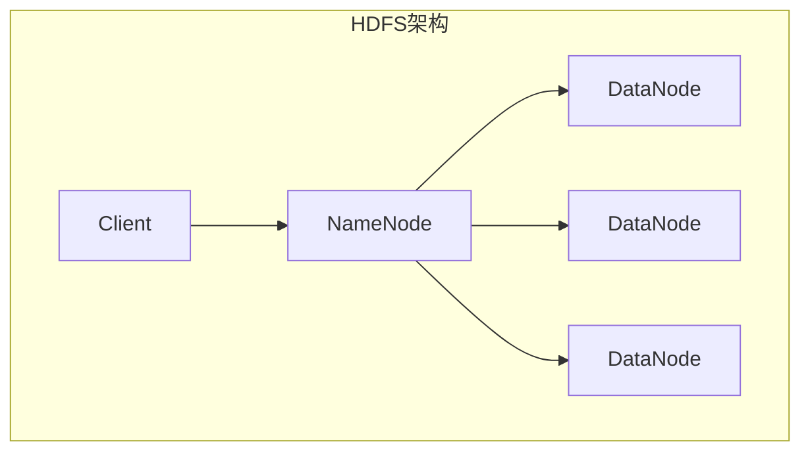
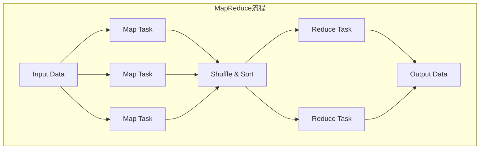
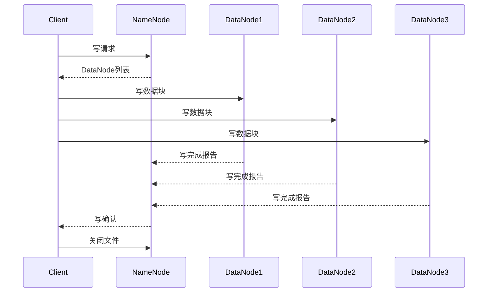
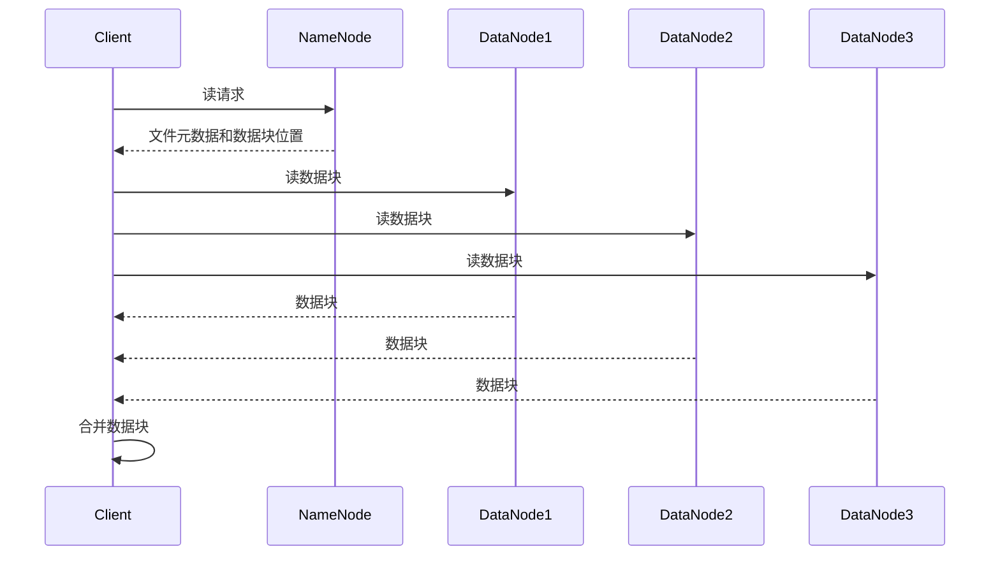
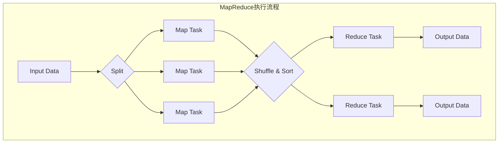

# 【AI大数据计算原理与代码实例讲解】Hadoop

## 1. 背景介绍

### 1.1 大数据时代的到来

在当今时代,数据已经成为了一种新的资源和战略资产。随着互联网、移动设备和物联网的快速发展,海量的结构化和非结构化数据不断产生。这些数据的规模、种类和复杂性远远超出了传统数据库系统的处理能力。为了有效地存储、管理和分析这些大规模数据,大数据技术应运而生。

### 1.2 大数据的特点

大数据通常被描述为具有4V特征:

- 体积(Volume):大数据集的规模通常达到TB、PB甚至EB级别。
- 多样性(Variety):数据来源多样,包括结构化数据(如关系数据库)和非结构化数据(如文本、图像、视频等)。
- 速度(Velocity):数据产生和处理的速度非常快,需要实时或近实时分析。
- 价值(Value):大数据中蕴含着巨大的潜在价值,可以为企业带来新的商业洞察和竞争优势。

### 1.3 大数据处理的挑战

传统的数据处理系统无法有效应对大数据带来的挑战,主要原因包括:

- 数据规模太大,超出了单机存储和计算能力。
- 数据种类多样,结构复杂,难以用统一的模式进行管理。
- 实时性要求高,需要快速响应和处理海量数据流。
- 数据价值需要深入挖掘,需要高性能的分析和建模能力。

## 2. 核心概念与联系

### 2.1 Hadoop概述

Hadoop是一个开源的分布式系统基础架构,由Apache软件基金会开发和维护。它是大数据处理的核心技术之一,能够可靠且高效地存储和处理海量数据。Hadoop设计灵感来自于Google的两篇论文:GFS(Google文件系统)和MapReduce。

Hadoop主要由以下两个核心组件组成:

1. **HDFS(Hadoop分布式文件系统)**:一个高度容错的分布式文件系统,用于存储大规模数据。
2. **MapReduce**:一个分布式数据处理模型和执行框架,用于并行处理大规模数据。

### 2.2 HDFS架构

HDFS的设计目标是能够在廉价的硬件集群上可靠地存储大规模数据。它具有以下特点:

- 高容错性:通过数据复制和故障转移机制实现高可用性。
- 适合批量数据处理:一次写入多次读取的模式。
- 流数据访问:数据一旦写入就不能被修改,只能追加新数据。
- 大文件存储:适合存储GB或TB级别的大文件。

HDFS采用主从架构,主要由以下两个组件组成:

1. **NameNode(名称节点)**:管理文件系统的命名空间和客户端对文件的访问。
2. **DataNode(数据节点)**:实际存储数据块并执行读写操作。



### 2.3 MapReduce编程模型

MapReduce是一种分布式数据处理模型,灵感来自于函数式编程的`Map`和`Reduce`操作。它将大规模数据处理任务分解为两个阶段:Map阶段和Reduce阶段。

1. **Map阶段**:输入数据被分割为多个数据块,并行执行Map任务对每个数据块进行处理,生成中间结果。
2. **Reduce阶段**:对Map阶段的输出结果进行合并和处理,生成最终结果。

MapReduce的优势在于自动并行化和容错处理,使程序员只需关注Map和Reduce函数的实现,而不用关心并行执行和容错机制的细节。



## 3. 核心算法原理具体操作步骤

### 3.1 HDFS写数据流程

1. 客户端向NameNode发送写请求,获取可用的DataNode列表。
2. 客户端将数据分块并写入DataNode,同时复制到其他DataNode。
3. DataNode在本地磁盘上创建数据块文件,并向NameNode报告写操作完成。
4. NameNode记录文件元数据和数据块位置信息。
5. 客户端等待所有DataNode复制完成,然后关闭文件。



### 3.2 HDFS读数据流程

1. 客户端向NameNode发送读请求,获取文件元数据和数据块位置信息。
2. 客户端从最近的DataNode读取数据块。
3. 如果数据块丢失或损坏,客户端从其他DataNode读取副本。
4. 客户端合并所有数据块,还原完整文件。



### 3.3 MapReduce执行流程

1. **输入数据分片**:输入数据被分割为多个数据块,每个数据块对应一个Map任务。
2. **Map阶段**:每个Map任务并行处理一个数据块,生成键值对序列作为中间结果。
3. **Shuffle阶段**:根据键值对的键,对Map输出进行分区和排序,将相同键的值归并到同一个Reduce任务中。
4. **Reduce阶段**:每个Reduce任务并行处理一个键及其对应的值集合,生成最终结果。
5. **输出结果**:将Reduce输出的结果写入HDFS或其他存储系统。



## 4. 数学模型和公式详细讲解举例说明

在大数据处理中,常常需要对海量数据进行统计和分析,涉及到一些数学模型和公式。以下是一些常见的数学模型和公式:

### 4.1 平均值和标准差

平均值和标准差是描述数据集中心趋势和离散程度的常用统计量。

对于一个数据集 $X = \{x_1, x_2, \ldots, x_n\}$,其平均值 $\mu$ 和标准差 $\sigma$ 的计算公式如下:

$$
\mu = \frac{1}{n}\sum_{i=1}^{n}x_i
$$

$$
\sigma = \sqrt{\frac{1}{n}\sum_{i=1}^{n}(x_i - \mu)^2}
$$

在MapReduce中,可以将平均值和标准差的计算分解为Map和Reduce阶段:

1. **Map阶段**:计算每个数据块的总和和平方和。
2. **Reduce阶段**:合并所有Map输出,计算整个数据集的平均值和标准差。

### 4.2 线性回归

线性回归是一种常用的监督学习算法,用于建立自变量和因变量之间的线性关系模型。

对于一个数据集 $D = \{(x_1, y_1), (x_2, y_2), \ldots, (x_n, y_n)\}$,线性回归模型可以表示为:

$$
y = \beta_0 + \beta_1x + \epsilon
$$

其中 $\beta_0$ 和 $\beta_1$ 分别是截距和斜率,可以通过最小二乘法估计:

$$
\hat{\beta}_1 = \frac{\sum_{i=1}^{n}(x_i - \bar{x})(y_i - \bar{y})}{\sum_{i=1}^{n}(x_i - \bar{x})^2}
$$

$$
\hat{\beta}_0 = \bar{y} - \hat{\beta}_1\bar{x}
$$

在MapReduce中,可以将线性回归的计算分解为多个MapReduce作业:

1. **第一个作业**:计算 $\sum x_i$, $\sum y_i$, $\sum x_i^2$, $\sum x_iy_i$。
2. **第二个作业**:使用上一步的结果计算 $\bar{x}$, $\bar{y}$, $\hat{\beta}_1$, $\hat{\beta}_0$。

### 4.3 PageRank

PageRank是一种用于评估网页重要性的算法,是Google搜索引擎的核心算法之一。它基于网页之间的链接结构,通过迭代计算每个网页的重要性分数。

对于一个包含 $N$ 个网页的网络,PageRank算法的迭代公式如下:

$$
PR(p_i) = \frac{1-d}{N} + d\sum_{p_j \in M(p_i)}\frac{PR(p_j)}{L(p_j)}
$$

其中:

- $PR(p_i)$ 表示网页 $p_i$ 的PageRank分数。
- $M(p_i)$ 表示链接到网页 $p_i$ 的所有网页集合。
- $L(p_j)$ 表示网页 $p_j$ 的出链接数量。
- $d$ 是一个阻尼系数,通常取值 0.85。

在MapReduce中,可以将PageRank算法的迭代计算分解为多个MapReduce作业,每个作业计算一次迭代的结果。

## 5. 项目实践:代码实例和详细解释说明

在本节中,我们将通过一个实际的MapReduce程序示例来深入理解Hadoop的使用方法。该示例实现了词频统计功能,即统计一个文本文件中每个单词出现的次数。

### 5.1 WordCount示例

WordCount是MapReduce编程中最经典的示例之一,它展示了如何使用MapReduce模型来并行处理大规模数据。

#### 5.1.1 Map函数

Map函数的输入是一个键值对,其中键是文件偏移量,值是文本行。Map函数的任务是将每一行文本拆分为单词,并为每个单词生成一个键值对,其中键是单词,值是1(表示出现一次)。

```java
public static class TokenizerMapper
    extends Mapper<Object, Text, Text, IntWritable>{

    private final static IntWritable one = new IntWritable(1);
    private Text word = new Text();

    public void map(Object key, Text value, Context context
                    ) throws IOException, InterruptedException {
        StringTokenizer itr = new StringTokenizer(value.toString());
        while (itr.hasMoreTokens()) {
            word.set(itr.nextToken());
            context.write(word, one);
        }
    }
}
```

#### 5.1.2 Reduce函数

Reduce函数的输入是Map输出的键值对,其中键是单词,值是一个迭代器,包含了该单词在所有Map任务中出现的次数。Reduce函数的任务是将这些值相加,得到该单词的总出现次数。

```java
public static class IntSumReducer
    extends Reducer<Text,IntWritable,Text,IntWritable> {
    private IntWritable result = new IntWrit