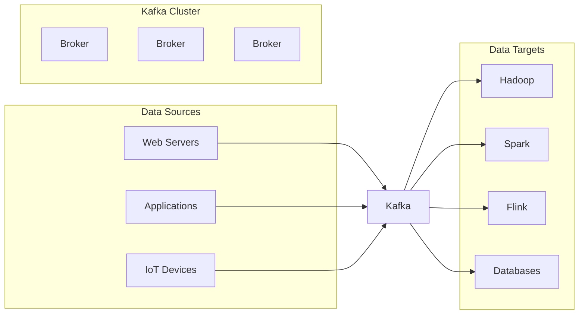
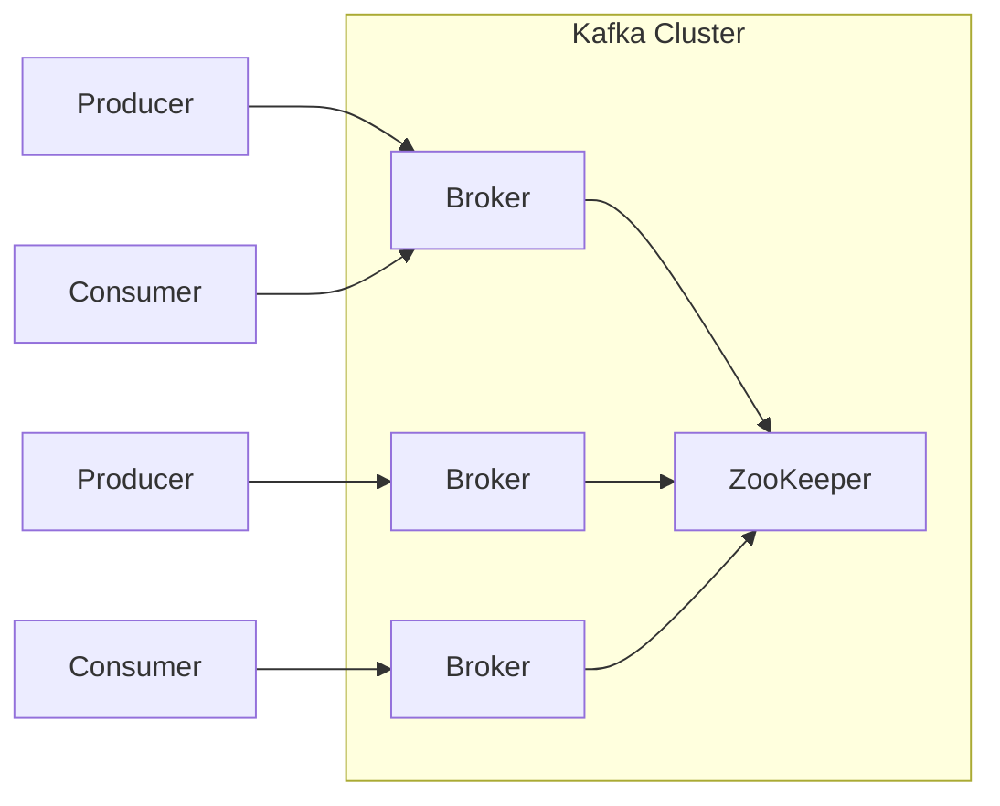

# 【AI大数据计算原理与代码实例讲解】Kafka

## 1.背景介绍

### 1.1 大数据时代的到来

在当今时代,随着互联网、移动设备和物联网的快速发展,海量的数据被不断产生。这些数据来源于各种渠道,如社交媒体、电子商务网站、物联网传感器等。传统的数据处理系统很难有效地处理如此庞大的数据量。因此,大数据技术应运而生,旨在解决存储、处理和分析大规模数据集的挑战。

### 1.2 实时数据处理的需求

在大数据环境中,许多应用程序需要实时处理数据,以便及时做出决策或响应。例如,金融交易系统需要实时检测欺诈行为,网络安全系统需要实时监控入侵尝试,物联网设备需要实时响应传感器数据。这种实时数据处理的需求推动了流式处理系统的发展。

### 1.3 Apache Kafka 的兴起

Apache Kafka 是一个分布式流式处理平台,最初由LinkedIn公司开发,后来捐赠给Apache软件基金会。它被设计用于构建实时数据管道和流应用程序。Kafka 具有高吞吐量、低延迟、可扩展性强、容错性高等优点,使其成为大数据生态系统中流行的消息传递系统。

## 2.核心概念与联系

### 2.1 Kafka 核心概念

#### 2.1.1 Topic 和 Partition

Kafka 将记录流组织到主题(Topic)中。每个主题可以进一步分区(Partition),以实现水平扩展和并行处理。每个分区是一个有序、不可变的记录序列,由一个单调递增的偏移量(Offset)标识。

#### 2.1.2 Producer 和 Consumer

Producer 是向 Kafka 主题发送记录的客户端,而 Consumer 是从 Kafka 主题读取记录的客户端。Producer 可以选择将记录发送到特定的分区或由 Kafka 自动平衡负载。Consumer 可以订阅一个或多个主题,并独立消费分配给它们的分区。

#### 2.1.3 Broker 和 Cluster

Kafka 集群由一个或多个服务器(Broker)组成。每个 Broker 负责存储分区的部分数据。Kafka 集群可以通过添加更多 Broker 来实现水平扩展,从而提高吞吐量和存储容量。

#### 2.1.4 Replication 和 Leader-Follower 模型

为了实现容错性,Kafka 使用了复制(Replication)机制。每个分区都有一个领导者(Leader)副本和多个追随者(Follower)副本。Leader 处理所有读写请求,而 Follower 从 Leader 复制数据,以便在 Leader 发生故障时接管领导角色。

### 2.2 Kafka 在大数据生态系统中的角色

Kafka 在大数据生态系统中扮演着关键角色,连接各种数据源和数据目标。它可以作为消息总线,将数据从各种来源(如Web服务器、应用程序、传感器等)传输到不同的目标系统(如Hadoop、Spark、Flink等)进行批处理或流处理。Kafka 还可以用作数据缓冲区,暂时存储数据,以防止下游系统过载。

## 3.核心算法原理具体操作步骤

### 3.1 Kafka 架构概览

Kafka 采用了分布式、分区、复制的架构设计,以实现高吞吐量、可扩展性和容错性。下图展示了 Kafka 的基本架构:

1. **Broker**: Kafka 集群由一个或多个 Broker 组成,每个 Broker 负责存储一部分分区数据。
2. **ZooKeeper**: Kafka 使用 ZooKeeper 来管理集群元数据,如 Broker 信息、主题配置、消费者状态等。
3. **Producer**: 生产者向 Kafka 集群发送记录,可以选择将记录发送到特定分区或由 Kafka 自动平衡负载。
4. **Consumer**: 消费者从 Kafka 集群读取记录,可以订阅一个或多个主题,并独立消费分配给它们的分区。

### 3.2 生产者(Producer)工作流程

1. **分区策略**: Producer 需要决定将记录发送到哪个分区。Kafka 提供了几种分区策略,如:
   - 轮询(Round-Robin)策略: 将记录平均分布到所有分区。
   - 键(Key)哈希策略: 根据记录的键(Key)计算哈希值,将具有相同键的记录发送到同一个分区。
   - 自定义分区策略: 用户可以实现自己的分区策略。

2. **序列化**: Producer 需要将记录序列化为字节数组,以便通过网络发送。Kafka 提供了多种序列化器(Serializer),如 StringSerializer、AvroSerializer 等。

3. **批处理**: Producer 可以将多个记录批量发送,以提高吞吐量。Kafka 使用异步发送和批处理机制来优化性能。

4. **备份**: Producer 可以选择将记录备份到其他 Broker,以提高可靠性。备份策略由复制因子(Replication Factor)决定。

5. **确认**: Producer 可以选择不同的确认模式,如:
   - 0 (无确认): 生产者不等待任何确认,这种模式提供最低的延迟但最低的可靠性保证。
   - 1 (Leader 确认): 生产者等待 Leader 副本确认,这种模式提供了较好的可靠性。
   - -1 或 all (全部确认): 生产者等待所有 Leader 和 Follower 副本确认,这种模式提供了最高的可靠性但延迟最高。

### 3.3 消费者(Consumer)工作流程

1. **订阅主题**: Consumer 需要订阅一个或多个主题,以便从中读取记录。

2. **消费者组**: Kafka 使用消费者组(Consumer Group)机制来实现负载均衡和容错。每个消费者组中的消费者独立消费不同的分区,而同一个分区只能被组内的一个消费者消费。

3. **分区分配**: Kafka 使用组协调器(Group Coordinator)来管理消费者组,并负责为每个消费者分配分区。当消费者加入或离开组时,分区会被重新分配。

4. **位移(Offset)提交**: 消费者需要定期将已消费的偏移量提交给 Kafka,以便在重启或故障后能够从上次提交的位置继续消费。Kafka 支持自动和手动提交偏移量。

5. **反序列化**: 消费者需要将从 Kafka 接收的字节数组反序列化为记录对象。Kafka 提供了多种反序列化器(Deserializer),如 StringDeserializer、AvroDeserializer 等。

6. **消费模式**: 消费者可以选择不同的消费模式,如:
   - 拉取模式(Pull): 消费者主动从 Kafka 拉取记录。
   -推送模式(Push): Kafka 主动将记录推送给消费者。

7. **重平衡**: 当消费者组中的消费者数量发生变化时,Kafka 会触发分区重平衡,以确保分区被均匀分配给所有消费者。

### 3.4 Kafka 容错机制

Kafka 采用了多种容错机制,以确保数据的可靠性和系统的高可用性:

1. **复制(Replication)**: Kafka 使用复制机制,每个分区都有一个 Leader 副本和多个 Follower 副本。当 Leader 副本发生故障时,其中一个 Follower 副本会被选举为新的 Leader。

2. **Leader 选举**: Kafka 使用 ZooKeeper 来管理 Leader 选举过程。当 Leader 副本发生故障时,ZooKeeper 会监测到这种情况,并协调选举新的 Leader 副本。

3. **重平衡**: 当 Broker 加入或离开集群时,Kafka 会触发分区重平衡,将分区迁移到其他 Broker,以确保数据的可用性和均衡负载。

4. **消费者组重平衡**: 当消费者组中的消费者数量发生变化时,Kafka 会触发分区重平衡,以确保分区被均匀分配给所有消费者。

5. **幂等性**: Kafka 支持幂等性,即对于相同的记录键(Key)和记录值(Value),只会在日志中保存一个副本,从而避免重复消费和数据重复。

6. **事务**: Kafka 支持事务,允许将多个记录作为一个原子单元进行生产或消费,确保数据的一致性。

## 4.数学模型和公式详细讲解举例说明

在 Kafka 中,一些关键概念和算法涉及到数学模型和公式。下面是一些重要的数学模型和公式,以及它们在 Kafka 中的应用:

### 4.1 分区分配算法

Kafka 使用一种基于"consistent hashing"的分区分配算法,将主题分区均匀分配给消费者。这种算法可以确保在消费者加入或离开时,只有少量分区需要被重新分配,从而减少了重平衡的开销。

假设有 $N$ 个分区和 $C$ 个消费者,分区分配算法的步骤如下:

1. 计算每个消费者的哈希值: $h_i = hash(consumer_i), i = 1, 2, ..., C$
2. 计算每个分区的哈希值: $p_j = hash(partition_j), j = 1, 2, ..., N$
3. 将所有哈希值排序,形成一个环形哈希空间: $[0, 2^{32})$
4. 将每个分区 $p_j$ 分配给在环形哈希空间上顺时针方向最近的消费者 $h_i$

这种算法可以保证在消费者加入或离开时,只有少量分区需要被重新分配。例如,如果一个新的消费者加入,只有那些位于新消费者和其顺时针方向上最近的现有消费者之间的分区需要被重新分配。

### 4.2 复制因子和副本分配

Kafka 使用复制机制来确保数据的可靠性和容错性。每个分区都有一个 Leader 副本和多个 Follower 副本,副本的数量由复制因子(Replication Factor)决定。

假设有 $N$ 个分区,复制因子为 $R$,集群中有 $B$ 个 Broker,副本分配算法的步骤如下:

1. 为每个分区选择一个 Broker 作为 Leader 副本的主机,使用以下公式计算 Leader 副本的 Broker ID:

$$broker\_id = partition\_id \bmod B$$

2. 为每个分区选择 $R-1$ 个 Broker 作为 Follower 副本的主机,使用以下公式计算 Follower 副本的 Broker ID:

$$broker\_id = (partition\_id + i + 1) \bmod B, i = 1, 2, ..., R-1$$

这种算法可以确保副本均匀分布在所有 Broker 上,从而实现负载均衡和容错性。如果一个 Broker 发生故障,其他 Broker 上的副本可以接管领导角色,从而确保数据的可用性。

### 4.3 消费者位移(Offset)管理

Kafka 使用位移(Offset)来跟踪每个消费者在每个分区中的消费进度。位移是一个单调递增的数字,表示消费者已经消费了该分区中的多少记录。

假设有 $N$ 个分区,每个分区有 $M$ 条记录,消费者组中有 $C$ 个消费者,位移管理算法的步骤如下:

1. 每个消费者维护一个长度为 $N$ 的