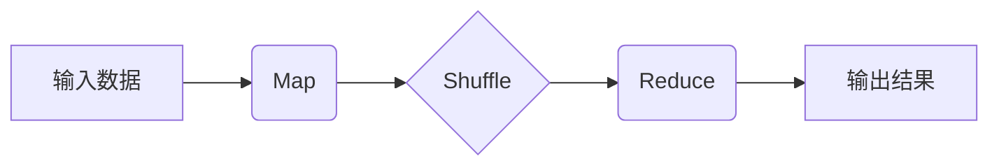
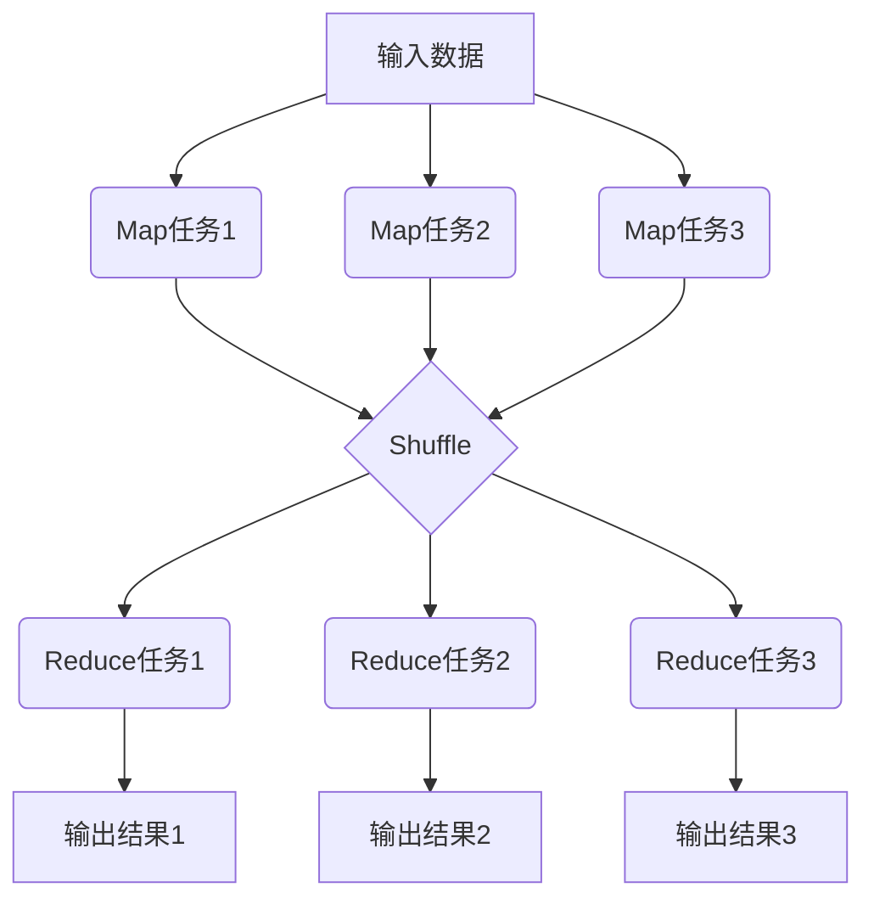
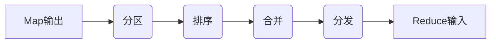

# 【AI大数据计算原理与代码实例讲解】MapReduce

## 1.背景介绍

### 1.1 大数据时代的到来

随着互联网、物联网和云计算的快速发展,海量的数据正以前所未有的规模和速度不断产生。这些数据来源于各种渠道,包括社交媒体、移动设备、物联网传感器等。这种大规模、高速、多样化的数据被称为"大数据"。传统的数据处理方式已经无法有效地处理如此庞大的数据量,因此迫切需要新的计算模型和框架来解决这一挑战。

### 1.2 大数据处理的挑战

大数据带来了以下几个主要挑战:

1. **数据量大**:大数据集的规模通常达到TB或PB级别,远远超出了传统数据处理系统的能力范围。
2. **数据种类多样**:大数据来自于各种异构数据源,包括结构化数据(如关系数据库)、半结构化数据(如XML文件)和非结构化数据(如文本、图像、视频等)。
3. **数据产生速度快**:大数据的产生速度非常快,需要实时或近实时地进行处理和分析。
4. **数据价值密度低**:大数据中有价值的数据往往占比很小,需要从海量数据中提取有价值的信息。

### 1.3 MapReduce的诞生

为了解决大数据处理的挑战,Google于2004年提出了MapReduce编程模型。MapReduce是一种分布式计算框架,它将大规模数据处理任务分解为两个阶段:Map(映射)和Reduce(归约)。这种编程模型非常适合处理大规模数据集,因为它可以将计算任务自动并行化,并在大量廉价的商用硬件上运行。

MapReduce的核心思想是将复杂的计算任务分解为多个简单的Map和Reduce任务,这些任务可以在大量计算节点上并行执行,从而提高计算效率。MapReduce框架会自动处理数据的分布、故障处理、任务调度等复杂问题,让开发人员专注于编写Map和Reduce函数。

## 2.核心概念与联系

### 2.1 MapReduce编程模型

MapReduce编程模型由两个主要函数组成:Map和Reduce。

**Map函数**的作用是对输入数据进行过滤和转换,生成中间结果(键值对)。Map函数会并行运行在多个计算节点上,每个Map任务处理输入数据的一部分。

**Reduce函数**的作用是对Map函数产生的中间结果进行聚合操作,生成最终结果。Reduce函数也会并行运行在多个计算节点上,每个Reduce任务处理中间结果的一部分。

MapReduce框架会自动将输入数据划分为多个数据块,并为每个数据块分配一个Map任务。Map任务的输出会经过一个Shuffle阶段,将相同键的值组合在一起,然后分发给对应的Reduce任务进行处理。最后,Reduce任务的输出就是最终结果。



### 2.2 MapReduce的执行流程

MapReduce的执行流程可以分为以下几个步骤:

1. **输入数据划分**:MapReduce框架将输入数据划分为多个数据块,每个数据块对应一个Map任务。
2. **Map阶段**:每个Map任务并行处理一个数据块,生成中间结果(键值对)。
3. **Shuffle阶段**:MapReduce框架对Map任务的输出进行洗牌,将相同键的值组合在一起,并分发给对应的Reduce任务。
4. **Reduce阶段**:每个Reduce任务并行处理一部分中间结果,对相同键的值进行聚合操作,生成最终结果。
5. **输出结果**:Reduce任务的输出就是最终结果,MapReduce框架将这些结果写入到指定的输出位置。



### 2.3 MapReduce的优势

MapReduce编程模型具有以下优势:

1. **高度并行化**:MapReduce可以将计算任务自动并行化,充分利用大量计算节点的计算能力。
2. **容错性强**:MapReduce框架可以自动处理计算节点的故障,确保计算任务的完成。
3. **可扩展性好**:MapReduce框架可以轻松地在更多计算节点上运行,以处理更大规模的数据。
4. **编程模型简单**:开发人员只需要关注Map和Reduce函数的编写,而不需要处理分布式计算的复杂细节。
5. **适用范围广**:MapReduce可以应用于各种大数据处理场景,如日志分析、网页索引、机器学习等。

## 3.核心算法原理具体操作步骤

### 3.1 Map阶段

Map阶段的主要任务是对输入数据进行过滤和转换,生成中间结果(键值对)。Map函数的输入是一对键值对,输出也是一个键值对列表。Map函数的伪代码如下:

```
Map(key, value):
    // 对输入数据进行处理
    list = []
    for x in value:
        // 执行Map操作
        list.append(map_function(x))
    
    // 生成中间结果(键值对列表)
    emit(key, list)
```

Map函数会并行运行在多个计算节点上,每个Map任务处理输入数据的一部分。Map任务的输出会经过一个Shuffle阶段,将相同键的值组合在一起,然后分发给对应的Reduce任务进行处理。

### 3.2 Shuffle阶段

Shuffle阶段的主要任务是对Map任务的输出进行洗牌,将相同键的值组合在一起,并分发给对应的Reduce任务。Shuffle阶段的具体步骤如下:

1. **分区(Partitioning)**:根据分区函数(Partitioner)将Map任务的输出划分为多个分区。
2. **排序(Sorting)**:对每个分区内的键值对进行排序,确保相同键的值相邻。
3. **合并(Combining)**:对相邻的键值对进行合并,减少数据传输量。
4. **分发(Shuffling)**:将每个分区的数据分发给对应的Reduce任务。



### 3.3 Reduce阶段

Reduce阶段的主要任务是对Shuffle阶段的输出进行聚合操作,生成最终结果。Reduce函数的输入是一个键及其对应的值列表,输出是一个键值对。Reduce函数的伪代码如下:

```
Reduce(key, values):
    // 对values进行聚合操作
    result = None
    for value in values:
        result = reduce_function(result, value)
    
    // 生成最终结果
    emit(key, result)
```

Reduce函数也会并行运行在多个计算节点上,每个Reduce任务处理中间结果的一部分。Reduce任务的输出就是最终结果,MapReduce框架将这些结果写入到指定的输出位置。

## 4.数学模型和公式详细讲解举例说明

在MapReduce中,常见的数学模型和公式包括:

### 4.1 向量空间模型(VSM)

向量空间模型(Vector Space Model, VSM)是一种常用的文本表示模型,它将文本表示为一个向量,每个维度对应一个特征(如词项)的权重。VSM常用于文本挖掘、信息检索等任务。

在MapReduce中,我们可以使用VSM来计算文档与查询之间的相似度。具体步骤如下:

1. **Map阶段**:对每个文档进行词项统计,生成(词项, 文档ID)键值对。
2. **Reduce阶段**:对每个词项,计算其在所有文档中的出现频率,生成(词项, 词频向量)键值对。

假设有$n$个文档$\{d_1, d_2, \dots, d_n\}$,词汇表为$\{t_1, t_2, \dots, t_m\}$,则文档$d_i$可以表示为一个$m$维向量$\vec{d_i} = (w_{i1}, w_{i2}, \dots, w_{im})$,其中$w_{ij}$表示词项$t_j$在文档$d_i$中的权重。

常用的词项权重计算方法是TF-IDF(Term Frequency-Inverse Document Frequency),公式如下:

$$w_{ij} = tf_{ij} \times \log\frac{N}{df_j}$$

其中:
- $tf_{ij}$表示词项$t_j$在文档$d_i$中出现的频率
- $df_j$表示包含词项$t_j$的文档数量
- $N$表示总文档数量

### 4.2 PageRank算法

PageRank算法是Google用于网页排名的核心算法之一,它通过计算网页的重要性来确定网页的排名。PageRank算法可以使用MapReduce进行并行计算。

PageRank算法的基本思想是:一个网页的重要性取决于链接到它的网页的重要性和数量。具体来说,如果一个重要网页链接到另一个网页,则后者的重要性也会提高。PageRank算法通过迭代计算每个网页的PR值,直到收敛。

设$N$为网页总数,$PR(p_i)$表示网页$p_i$的PR值,$L(p_j)$表示链接到网页$p_j$的网页集合,则PageRank算法可以表示为:

$$PR(p_i) = (1 - d) + d \sum_{p_j \in L(p_i)} \frac{PR(p_j)}{C(p_j)}$$

其中:
- $d$是一个阻尼系数,通常取值0.85
- $C(p_j)$表示网页$p_j$的出链接数量

在MapReduce中,我们可以将PageRank算法分解为Map和Reduce阶段:

1. **Map阶段**:对每个网页,计算其对其他网页的PR值贡献,生成(目标网页ID, 贡献值)键值对。
2. **Reduce阶段**:对每个网页,汇总所有其他网页对它的PR值贡献,计算新的PR值。

通过多轮迭代,PageRank算法可以收敛到一个稳定的PR值分布。

## 5.项目实践:代码实例和详细解释说明

### 5.1 WordCount示例

WordCount是MapReduce的经典示例,它统计给定文本文件中每个单词出现的次数。我们将使用Python编写Map和Reduce函数,并在Hadoop环境中运行。

**Map函数**:

```python
import sys

# Map函数
def map_function(key, value):
    # 将文本行拆分为单词
    words = value.split()
    
    # 生成(单词, 1)键值对
    for word in words:
        print(f"{word}\t1")

# 从标准输入读取数据
for line in sys.stdin:
    # 去除行尾的换行符
    line = line.strip()
    
    # 调用Map函数
    map_function(None, line)
```

Map函数将每一行文本拆分为单词,并为每个单词生成一个(单词, 1)键值对。

**Reduce函数**:

```python
import sys

# Reduce函数
def reduce_function(key, values):
    # 统计单词出现次数
    count = sum(map(int, values))
    
    # 输出(单词, 次数)键值对
    print(f"{key}\t{count}")

# 从标准输入读取数据
current_word = None
word_counts = []

for line in sys.stdin:
    # 去除行尾的换行符
    line = line.strip()
    
    # 解析输入数据
    word, count = line.split("\t", 1)
    
    # 如果是新的单词,输出上一个单词的统计结果
    if current_word != word:
        if current_word:
            reduce_function(current_word, word_counts)
        current_word = word
        word_counts = []
    
    # 累加当前单词的计数
    word_counts.append(count)

# 输出最后一个单词的统计结果
if current_word:
    reduce_function(current_word, word_counts)
```

Reduce函数将相同单词的计数值累加,并输出(