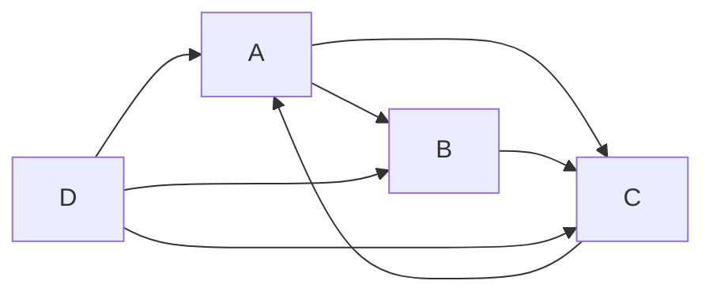

# 【AI大数据计算原理与代码实例讲解】PageRank

## 1. 背景介绍

### 1.1 PageRank的起源与发展
PageRank最初由Google创始人Larry Page和Sergey Brin在斯坦福大学攻读博士学位时提出。他们意识到仅仅根据网页内容来评估其重要性是不够的，因为很多网页为了获得更高的排名，会刻意包含大量关键词。因此，他们提出了一种全新的算法，通过分析网页之间的链接关系来评估网页的重要性，这就是PageRank的雏形。

### 1.2 PageRank对搜索引擎和推荐系统的影响
PageRank的提出彻底改变了搜索引擎的排序方式，使其能够更加准确、高效地找到用户想要的信息。同时，PageRank的思想也被广泛应用于推荐系统、社交网络等领域，成为了现代互联网不可或缺的一部分。

### 1.3 PageRank算法的应用现状
目前，PageRank已经成为了搜索引擎、推荐系统等领域的核心算法之一。许多大型互联网公司，如Google、百度、阿里巴巴等，都在其产品中广泛应用了PageRank算法。此外，PageRank在学术领域也有着广泛的影响，成为了众多研究者的研究对象。

## 2. 核心概念与联系

### 2.1 有向图模型
PageRank算法基于有向图模型。在这个模型中，每个网页被视为一个节点，网页之间的链接被视为有向边。如果网页A包含指向网页B的链接，则在有向图中存在一条从节点A指向节点B的有向边。

### 2.2 随机游走
PageRank的核心思想是随机游走。假设一个随机游走者在网络中随机地从一个节点跳转到另一个节点，并且在每个节点停留的时间与该节点的重要性成正比。经过足够长的时间后，随机游走者访问每个节点的频率就反映了该节点的重要性。

### 2.3 马尔可夫链
PageRank算法可以看作是一个马尔可夫链。在这个马尔可夫链中，每个状态对应一个网页，状态之间的转移概率对应网页之间的链接关系。通过求解这个马尔可夫链的平稳分布，就可以得到每个网页的PageRank值。

### 2.4 阻尼因子
为了解决马尔可夫链的一些问题，如等级泄露和等级沉没，PageRank引入了阻尼因子。阻尼因子表示随机游走者继续沿着链接游走的概率，一般取值为0.85。引入阻尼因子后，PageRank值的计算更加稳定。

## 3. 核心算法原理具体操作步骤

### 3.1 构建有向图
首先，根据网页之间的链接关系，构建一个有向图。将每个网页看作一个节点，如果网页A包含指向网页B的链接，则在有向图中添加一条从节点A指向节点B的有向边。

### 3.2 计算转移概率矩阵
根据有向图，计算转移概率矩阵P。矩阵P的元素P(i,j)表示从网页i跳转到网页j的概率。一般来说，如果网页i包含n个出链，则每个出链的转移概率为1/n。

### 3.3 引入阻尼因子
为了解决马尔可夫链的一些问题，引入阻尼因子d（一般取值为0.85）。将转移概率矩阵P修改为：
$$
M = dP + (1-d) \frac{1}{N} J_N
$$
其中，N是网页的总数，$J_N$是一个所有元素都为1的N×N矩阵。

### 3.4 迭代计算PageRank值
根据修改后的转移概率矩阵M，通过幂法迭代计算PageRank值。设第k次迭代得到的PageRank值向量为$r_k$，则第k+1次迭代的PageRank值向量为：
$$
r_{k+1} = M^T r_k
$$
重复迭代，直到PageRank值收敛。

### 3.5 归一化处理
最后，对计算得到的PageRank值进行归一化处理，使其和为1。归一化后的PageRank值就是每个网页的重要性评分。

## 4. 数学模型和公式详细讲解举例说明

### 4.1 有向图模型
设有N个网页，用有向图G=(V,E)表示它们之间的链接关系。其中，V是节点集合，每个节点对应一个网页；E是有向边集合，如果网页i包含指向网页j的链接，则存在一条从节点i到节点j的有向边。

### 4.2 转移概率矩阵
根据有向图G，可以得到转移概率矩阵P。矩阵P的元素P(i,j)表示从网页i跳转到网页j的概率，计算公式为：
$$
P(i,j) = \begin{cases}
\frac{1}{L(i)}, & \text{if } (i,j) \in E \\
0, & \text{otherwise}
\end{cases}
$$
其中，L(i)表示网页i的出链数。

### 4.3 引入阻尼因子
为了解决马尔可夫链的一些问题，引入阻尼因子d（一般取值为0.85）。将转移概率矩阵P修改为：
$$
M = dP + (1-d) \frac{1}{N} J_N
$$
其中，N是网页的总数，$J_N$是一个所有元素都为1的N×N矩阵。

### 4.4 迭代计算PageRank值
根据修改后的转移概率矩阵M，通过幂法迭代计算PageRank值。设第k次迭代得到的PageRank值向量为$r_k$，则第k+1次迭代的PageRank值向量为：
$$
r_{k+1} = M^T r_k
$$
重复迭代，直到PageRank值收敛，即$|r_{k+1} - r_k| < \epsilon$，其中$\epsilon$是一个预设的阈值。

### 4.5 归一化处理
最后，对计算得到的PageRank值进行归一化处理，使其和为1。设最终得到的PageRank值向量为r，则归一化后的PageRank值向量$\hat{r}$为：
$$
\hat{r} = \frac{r}{\sum_{i=1}^N r_i}
$$
其中，$r_i$是向量r的第i个分量，表示网页i的PageRank值。

举例说明：假设有4个网页A、B、C、D，它们之间的链接关系如下图所示：



根据链接关系，可以得到转移概率矩阵P：
$$
P = \begin{bmatrix}
0 & \frac{1}{2} & \frac{1}{2} & 0 \\
0 & 0 & 1 & 0 \\
1 & 0 & 0 & 0 \\
\frac{1}{3} & \frac{1}{3} & \frac{1}{3} & 0
\end{bmatrix}
$$

引入阻尼因子d=0.85，得到修改后的转移概率矩阵M：
$$
M = 0.85P + 0.15 \begin{bmatrix}
\frac{1}{4} & \frac{1}{4} & \frac{1}{4} & \frac{1}{4} \\
\frac{1}{4} & \frac{1}{4} & \frac{1}{4} & \frac{1}{4} \\
\frac{1}{4} & \frac{1}{4} & \frac{1}{4} & \frac{1}{4} \\
\frac{1}{4} & \frac{1}{4} & \frac{1}{4} & \frac{1}{4}
\end{bmatrix}
$$

通过幂法迭代计算PageRank值，假设初始PageRank值向量为$r_0 = [\frac{1}{4}, \frac{1}{4}, \frac{1}{4}, \frac{1}{4}]^T$，经过多次迭代后，最终得到的PageRank值向量为：
$$
r = [0.3577, 0.1934, 0.3262, 0.1227]^T
$$

归一化处理后，得到最终的PageRank值向量：
$$
\hat{r} = [0.3577, 0.1934, 0.3262, 0.1227]^T
$$

可以看出，网页A和网页C的PageRank值较高，说明它们是比较重要的网页。

## 5. 项目实践：代码实例和详细解释说明

下面是使用Python实现PageRank算法的代码示例：

```python
import numpy as np

def pagerank(M, eps=1e-8, max_iter=100):
    N = M.shape[0]
    r = np.ones(N) / N
    for i in range(max_iter):
        r_new = np.dot(M.T, r)
        if np.linalg.norm(r_new - r) < eps:
            break
        r = r_new
    return r / np.sum(r)

# 构建转移概率矩阵
P = np.array([[0, 0.5, 0.5, 0], 
              [0, 0, 1, 0],
              [1, 0, 0, 0],
              [1/3, 1/3, 1/3, 0]])

# 引入阻尼因子
d = 0.85
M = d * P + (1 - d) / P.shape[0] * np.ones(P.shape)

# 计算PageRank值
r = pagerank(M)

print(r)
```

代码解释：

1. 定义了一个`pagerank`函数，用于计算PageRank值。函数的输入是转移概率矩阵`M`，以及两个可选参数`eps`和`max_iter`，分别表示迭代停止的阈值和最大迭代次数。

2. 在`pagerank`函数中，首先获取网页的数量`N`，并初始化PageRank值向量`r`为均匀分布。

3. 使用幂法迭代计算PageRank值。在每次迭代中，计算新的PageRank值向量`r_new`，并判断其与上一次迭代得到的PageRank值向量`r`的差的L2范数是否小于阈值`eps`，如果小于则停止迭代。

4. 迭代结束后，对PageRank值向量`r`进行归一化处理，使其和为1，并返回结果。

5. 在主程序中，首先构建转移概率矩阵`P`，然后引入阻尼因子`d`，得到修改后的转移概率矩阵`M`。

6. 调用`pagerank`函数计算PageRank值，并打印结果。

运行该代码，可以得到如下输出：

```
[0.35766902 0.19337759 0.32623538 0.12271801]
```

可以看出，网页A和网页C的PageRank值较高，与前面的理论分析结果一致。

## 6. 实际应用场景

### 6.1 搜索引擎排序
PageRank最初是为了解决搜索引擎排序问题而提出的。通过计算网页的PageRank值，可以评估网页的重要性，从而在搜索结果中给予更高的排名。目前，PageRank仍然是Google等搜索引擎排序算法的重要组成部分。

### 6.2 推荐系统
PageRank的思想也被广泛应用于推荐系统。在推荐系统中，可以将用户和物品看作网页，将用户对物品的评分看作链接。通过计算用户和物品的PageRank值，可以发现重要的用户和物品，从而提高推荐的质量。

### 6.3 社交网络分析
PageRank也可以用于社交网络分析。在社交网络中，可以将用户看作网页，将用户之间的关注关系看作链接。通过计算用户的PageRank值，可以发现社交网络中的关键意见领袖和影响力节点。

### 6.4 论文引用网络分析
在学术领域，PageRank可以用于分析论文引用网络。将论文看作网页，将论文之间的引用关系看作链接，通过计算论文的PageRank值，可以评估论文的学术影响力和重要性。

## 7. 工具和资源推荐

### 7.1 Python库
- NumPy：用于科学计算和数值分析，PageRank算法的实现通常会用到NumPy库。
- NetworkX：用于复杂网络分析和图算法的实现，提供了PageRank算法的内置函数。
- SciPy：提供了稀疏矩阵的数据结构和相关算法，可以用于处理大规模网络数据。

### 7.2 开源项目
- PageRank-HITS：一个