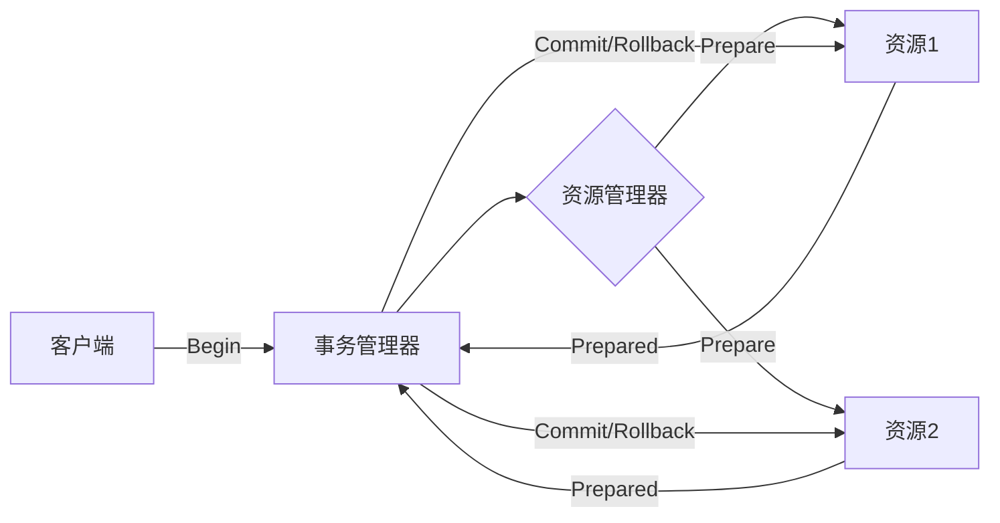

# 【AI大数据计算原理与代码实例讲解】事务

## 1. 背景介绍
### 1.1 大数据时代的到来
#### 1.1.1 数据爆炸式增长
#### 1.1.2 传统数据处理方式的局限性
#### 1.1.3 大数据技术的兴起

### 1.2 AI与大数据的结合
#### 1.2.1 AI对大数据的依赖
#### 1.2.2 大数据助力AI的发展
#### 1.2.3 AI+大数据的应用前景

## 2. 核心概念与联系
### 2.1 事务的定义与特性
#### 2.1.1 事务的定义
事务（Transaction）是指一组数据库操作，这些操作要么全部执行，要么全部不执行，是一个不可分割的工作单位。事务能够保证数据的一致性和完整性。

#### 2.1.2 事务的ACID特性
- 原子性（Atomicity）：事务中的所有操作要么全部完成，要么全部不完成。如果事务中的一部分操作失败，整个事务就会回滚到事务开始前的状态。
- 一致性（Consistency）：事务执行前后，数据库的完整性约束没有被破坏，事务执行的前后都是合法的数据状态。
- 隔离性（Isolation）：多个事务并发执行时，一个事务的执行不应影响其他事务的执行。
- 持久性（Durability）：一个事务一旦提交，它对数据库的改变就应该是永久性的。即使系统发生故障，这些改变也应该能够恢复。

### 2.2 大数据计算中的事务处理
#### 2.2.1 传统关系型数据库的事务处理
#### 2.2.2 NoSQL数据库的事务支持
#### 2.2.3 分布式事务的挑战与解决方案

### 2.3 AI中的事务处理
#### 2.3.1 机器学习中的原子性与一致性
#### 2.3.2 深度学习中的梯度更新与事务
#### 2.3.3 强化学习中的状态转移与事务

## 3. 核心算法原理具体操作步骤
### 3.1 两阶段提交（2PC）
#### 3.1.1 算法原理
#### 3.1.2 具体操作步骤
#### 3.1.3 优缺点分析

### 3.2 三阶段提交（3PC） 
#### 3.2.1 算法原理
#### 3.2.2 具体操作步骤 
#### 3.2.3 与2PC的比较

### 3.3 Paxos共识算法
#### 3.3.1 基本概念
#### 3.3.2 算法流程
#### 3.3.3 应用场景

### 3.4 Raft共识算法
#### 3.4.1 角色划分
#### 3.4.2 领导人选举
#### 3.4.3 日志复制

## 4. 数学模型和公式详细讲解举例说明
### 4.1 CAP定理
#### 4.1.1 定理内容
#### 4.1.2 数学证明
#### 4.1.3 现实意义

### 4.2 FLP不可能性定理
#### 4.2.1 定理内容
#### 4.2.2 数学证明
#### 4.2.3 对分布式系统的启示

### 4.3 Paxos的安全性证明
#### 4.3.1 数学模型的建立
#### 4.3.2 定理证明过程
#### 4.3.3 对算法正确性的保证

## 5. 项目实践：代码实例和详细解释说明
### 5.1 基于Java的分布式事务实现
#### 5.1.1 代码架构设计
#### 5.1.2 核心类和接口讲解
#### 5.1.3 完整代码示例

### 5.2 使用TensorFlow实现事务性更新
#### 5.2.1 模型设计
#### 5.2.2 事务性梯度更新代码
#### 5.2.3 运行结果分析

### 5.3 区块链中的事务处理
#### 5.3.1 区块链事务的特点
#### 5.3.2 智能合约中的事务实现
#### 5.3.3 以太坊交易代码解析

## 6. 实际应用场景
### 6.1 电商系统中的订单处理
#### 6.1.1 业务场景描述
#### 6.1.2 事务处理的必要性
#### 6.1.3 技术方案选型

### 6.2 金融交易系统的事务保障
#### 6.2.1 业务痛点分析
#### 6.2.2 多层次事务处理机制
#### 6.2.3 系统架构设计

### 6.3 物联网数据的原子性采集
#### 6.3.1 数据采集的挑战
#### 6.3.2 事务型数据采集方案
#### 6.3.3 方案优势与不足

## 7. 工具和资源推荐
### 7.1 开源分布式事务框架
#### 7.1.1 Seata
#### 7.1.2 ByteTCC
#### 7.1.3 Hmily

### 7.2 大数据事务处理组件
#### 7.2.1 Hadoop家族
#### 7.2.2 Spark
#### 7.2.3 Flink

### 7.3 其他学习资源
#### 7.3.1 论文
#### 7.3.2 书籍
#### 7.3.3 视频课程

## 8. 总结：未来发展趋势与挑战
### 8.1 AI与大数据事务处理的融合
### 8.2 事务处理在新场景下的创新
### 8.3 未来研究方向与挑战

## 9. 附录：常见问题与解答
### 9.1 分布式事务与本地事务的区别
### 9.2 柔性事务与刚性事务的对比
### 9.3 ACID与BASE的权衡
### 9.4 事务与并发控制的关系
### 9.5 事务的隔离级别如何选择

以上是两阶段提交（2PC）的基本流程图。事务管理器负责协调资源管理器的操作，资源管理器负责管理实际的资源，如数据库、消息队列等。整个事务的过程分为Prepare和Commit/Rollback两个阶段，保证了事务的原子性和一致性。

事务是大数据和AI领域中不可或缺的一部分。在大数据场景下，由于数据量巨大、分布式存储等特点，事务处理面临着诸多挑战，需要采用不同于传统关系型数据库的技术方案。而在AI领域，事务的概念也渗透到了模型训练、参数更新等环节，保证了模型的一致性和准确性。

两阶段提交（2PC）和三阶段提交（3PC）是经典的分布式事务处理算法。2PC引入了准备阶段，参与者在准备阶段投票，协调者根据投票结果决定提交或回滚。而3PC在此基础上增加了预提交阶段，进一步降低了协调者单点故障的风险。Paxos和Raft则是两种常见的分布式一致性算法，通过多数派投票的方式，在可能出现节点失效的情况下，仍能就某个提议达成一致。

在实际项目中，我们可以根据业务场景和技术栈的不同，选用合适的事务处理方案。例如，对于Java应用，可以使用Seata、ByteTCC等开源框架来实现分布式事务；对于大数据平台，Hadoop、Spark、Flink等组件都提供了事务支持；而在区块链领域，事务又有其独特的处理方式，需要考虑去中心化、防篡改等因素。

未来，随着AI与大数据的进一步融合，事务处理技术也将迎来新的发展机遇和挑战。如何在海量异构数据环境下实现高效、顺畅的事务处理，如何平衡系统的一致性、可用性和分区容忍性，将是值得学术界和工业界共同探索的方向。

作者：禅与计算机程序设计艺术 / Zen and the Art of Computer Programming