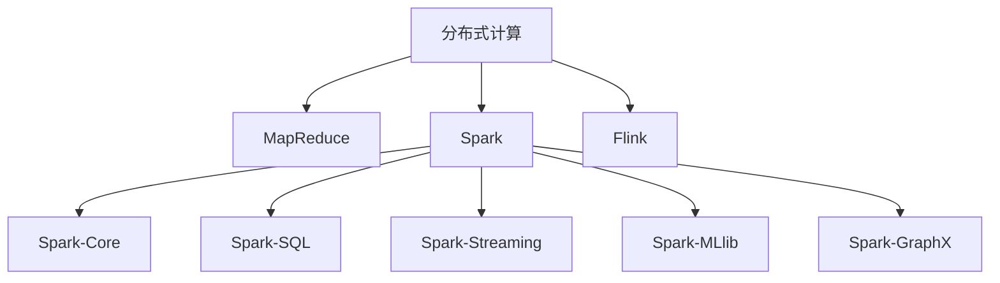

# 【AI大数据计算原理与代码实例讲解】大数据

## 1.背景介绍
### 1.1 大数据时代的来临
随着互联网、物联网、移动互联网等技术的飞速发展,数据呈现出爆炸式增长的趋势。据统计,全球数据量每两年翻一番,预计到2025年,全球数据总量将达到163ZB(1ZB=1024EB=1024PB)。面对如此海量的数据,传统的数据处理和分析方法已经难以应对,大数据技术应运而生。

### 1.2 大数据的定义与特征  
大数据(Big Data)是指无法在一定时间范围内用常规软件工具进行捕捉、管理和处理的数据集合,是需要新处理模式才能具有更强的决策力、洞察发现力和流程优化能力的海量、高增长率和多样化的信息资产。

大数据具有4V特征:
- Volume(大量):数据量巨大,从TB级别跃升到PB、EB、ZB级别
- Velocity(高速):数据生成和处理的速度极快,如实时流计算
- Variety(多样):数据类型繁多,包括结构化、半结构化、非结构化等各种类型
- Value(价值):大数据包含很多深度的价值,需要用新的分析方法挖掘

### 1.3 大数据的应用场景
大数据在各行各业都有广泛应用,典型的应用场景包括:
- 互联网推荐:电商、视频、新闻等个性化推荐
- 金融风控:银行贷款、保险反欺诈、股票量化交易等
- 智慧城市:城市交通、环保、安防等大数据应用
- 工业互联网:设备预测性维护、供应链优化等
- 医疗健康:辅助诊断、药物研发、健康管理等

## 2.核心概念与联系
### 2.1 大数据处理流程
大数据处理通常包括数据采集、存储、计算分析、可视化等环节,形成一个数据处理流水线:


### 2.2 分布式存储
海量数据需要分布式存储,常见的分布式存储系统有:
- HDFS:Hadoop分布式文件系统,适合存储大文件
- HBase:分布式列族数据库,适合存储结构化和半结构化数据
- MongoDB:分布式文档数据库,适合存储非结构化数据
- Cassandra:分布式宽列存储,适合存储时序数据

### 2.3 分布式计算
大数据计算需要将任务分发到多台机器并行计算,代表性的分布式计算框架有:
- MapReduce:基于Map和Reduce两个函数编程的分布式计算模型
- Spark:基于内存的分布式计算框架,提供了RDD弹性分布式数据集编程模型
- Flink:流式和批式一体的分布式计算引擎,支持有状态流计算

它们的关系如下:


### 2.4 机器学习
从大数据中挖掘知识需要借助机器学习算法,常用的机器学习库有:
- Scikit-learn:经典的机器学习算法库,包括分类、回归、聚类等
- TensorFlow:由谷歌开源的大规模机器学习框架
- PyTorch:由Facebook开源的动态建模深度学习框架
- XGBoost:基于决策树的梯度提升算法,在结构化数据建模中表现优异

## 3.核心算法原理具体操作步骤
### 3.1 MapReduce
MapReduce是一种分布式计算编程模型,基本原理是将大规模计算任务拆分成Map和Reduce两个阶段:
1. Map阶段:将数据按照<key,value>键值对形式进行分片,交给不同的Map任务并行处理,生成中间结果<key,value>
2. Reduce阶段:对Map的中间结果按照key进行归并,交给Reduce任务进一步汇总处理,输出最终结果<key,value>

以词频统计为例,MapReduce实现步骤如下:
1. 输入数据:大量的文本文件
2. Map:以行为单位,将每行数据按照空格切分成单词,输出<word,1>
3. Combine:对Map输出先做一次本地汇总,输出<word,sum>
4. Partition:对单词的key做hash,将相同单词分配到同一个Reduce
5. Reduce:对<word,sum>中的sum字段做sum聚合,输出<word,total_sum>
6. 输出数据:各个单词的<word,total_sum>

### 3.2 FP-Growth
FP-Growth是一种高效的频繁模式挖掘算法,通过构建FP-Tree数据结构来避免生成候选集,基本步骤如下:
1. 扫描数据集获得频繁1项集和支持度,过滤非频繁项
2. 构建FP-Tree
    - 创建只包含根节点的FP-Tree
    - 将每个事务按项的支持度降序插入FP-Tree
    - 如果事务的前缀路径已经存在,则增加路径计数;否则创建新的前缀路径
3. 对FP-Tree进行频繁模式挖掘
    - 从频繁1项集开始,生成以该项为后缀的条件模式基
    - 对条件模式基递归构建条件FP-Tree
    - 重复步骤直到FP-Tree为空,生成所有频繁模式

### 3.3 PageRank
PageRank是一种经典的网页排序算法,通过网页间的链接关系计算网页的重要性,基本原理如下:
1. 初始化每个网页的PR值为1/N,N为网页总数
2. 计算每个网页的新PR值:
$$ PR(p_i) = \frac{1-d}{N} + d \sum_{p_j \in M(p_i)} \frac{PR(p_j)}{L(p_j)} $$
其中,$p_i$为待计算的网页,$M(p_i)$为指向$p_i$的网页集合,$L(p_j)$为网页$p_j$的出链数,$d$为阻尼系数,一般取0.85
3. 重复步骤2直到PR值收敛,即前后两轮迭代的PR值差值小于给定阈值

## 4.数学模型和公式详细讲解举例说明
### 4.1 TF-IDF
TF-IDF(Term Frequency-Inverse Document Frequency)是一种常用的文本特征提取方法,用于评估一个词语对于一个文件集或一个语料库中的其中一份文件的重要程度。

TF(词频)表示词条在文档中出现的频率:
$$TF(t,d) = \frac{n_{t,d}}{\sum_k n_{k,d}}$$
其中$n_{t,d}$为词条t在文档d中出现的次数,$\sum_k n_{k,d}$为文档d中所有词条出现的次数之和。

IDF(逆文档频率)表示词条在整个文档集合中的区分度:
$$IDF(t,D) = \log \frac{|D|}{|\{d \in D:t \in d\}|}$$
其中$|D|$为文档集合D的文档总数,$|\{d \in D:t \in d\}|$为包含词条t的文档数。

TF-IDF是TF和IDF的乘积:
$$TFIDF(t,d,D) = TF(t,d) \times IDF(t,D)$$

举例说明,假设有两个文档:
- d1: This is a a sample
- d2: This is another another example example example

对于词条"example":
- 在d1中,$TF(example,d_1)=0$
- 在d2中,$TF(example,d_2)=\frac{3}{8}=0.375$
- 在整个文档集合中,$IDF(example,D)=\log \frac{2}{1} \approx 0.301$ 
- 因此,d1中$TFIDF(example,d_1,D)=0$,d2中$TFIDF(example,d_2,D) \approx 0.113$

可见,"example"虽然在d2中出现频率高,但在整个文档集合并不常见,因此具有较高的区分度。

### 4.2 协同过滤
协同过滤是常用的推荐算法之一,基本思想是利用用户或物品之间的相似性,为用户推荐可能感兴趣的物品。根据推荐对象的不同,可分为:
- 基于用户的协同过滤(User-based CF):利用用户之间的相似性,为用户推荐相似用户喜欢的物品
- 基于物品的协同过滤(Item-based CF):利用物品之间的相似性,为用户推荐与其喜欢的物品相似的物品

以基于用户的协同过滤为例,主要步骤如下:
1. 计算用户之间的相似度矩阵
设$N(u)$为用户$u$有过正反馈的物品集合,$r_{u,i}$为用户$u$对物品$i$的评分,用户$u$和$v$的相似度可以用余弦相似度计算:
$$sim(u,v) = \frac{\sum_{i \in N(u) \cap N(v)} r_{u,i} r_{v,i}}{\sqrt{\sum_{i \in N(u)} r_{u,i}^2} \sqrt{\sum_{i \in N(v)} r_{v,i}^2}}$$

2. 计算用户对物品的预测评分
设$S(u,K)$为与用户$u$最相似的K个用户集合,用户$u$对物品$i$的预测评分为:
$$\hat{r}_{u,i} = \frac{\sum_{v \in S(u,K)} sim(u,v) r_{v,i}}{\sum_{v \in S(u,K)} sim(u,v)}$$

3. 为用户推荐预测评分高的物品

举例说明,假设有用户-物品评分矩阵如下:

|   | i1 | i2 | i3 | i4 |
|---|---|---|---|---|
| u1 | 4 | ? | 3 | 5 |
| u2 | 3 | 4 | ? | 3 |  
| u3 | 1 | 2 | 3 | ? |

计算用户u1和u2的相似度:
$$sim(u_1,u_2) = \frac{4 \times 3 + 5 \times 3}{\sqrt{4^2+3^2+5^2} \sqrt{3^2+3^2}} \approx 0.975$$

假设K=1,计算u1对物品i2的预测评分:
$$\hat{r}_{u_1,i_2} = \frac{0.975 \times 4}{0.975} = 4$$

因此,可以将i2推荐给u1。

## 5.项目实践：代码实例和详细解释说明
下面以Python为例,给出一些大数据处理的代码实例。

### 5.1 MapReduce词频统计
使用mrjob库实现MapReduce词频统计:
```python
from mrjob.job import MRJob
import re

WORD_RE = re.compile(r"[\w']+")

class MRWordFreqCount(MRJob):
    
    def mapper(self, _, line):
        for word in WORD_RE.findall(line):
            yield word.lower(), 1
            
    def combiner(self, word, counts):
        yield word, sum(counts)
        
    def reducer(self, word, counts):
        yield word, sum(counts)
        
if __name__ == '__main__':
    MRWordFreqCount.run()
```
代码说明:
- 自定义MRWordFreqCount类,继承自MRJob
- mapper方法接收每一行输入,利用正则表达式提取单词,将<word,1>作为map输出
- combiner方法在map端对<word,counts>做本地聚合,减少shuffle数据量  
- reducer方法对<word,counts>做最终的全局聚合,输出<word,total_counts>
- 使用`python wc.py input.txt`运行该作业

### 5.2 Spark WordCount
使用PySpark实现WordCount:
```python
from pyspark import SparkContext

sc = SparkContext("local", "WordCount")

text = sc.textFile("input.txt")

counts = text.flatMap(lambda line: line.split()) \
             .map(lambda word: (word, 1)) \
             .reduceByKey(lambda a, b: a + b)

output = counts.collect()

for (word, count) in output:
    print("%s: %i" % (word, count))

sc.stop()
```
代码说明:  
- 创建SparkContext,设置master为local,app名为WordCount
- 读取输入文件input.txt,得到RDD
- 对RDD执行一系列Transformation:
    - flat