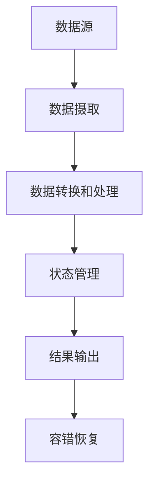

# 【AI大数据计算原理与代码实例讲解】流处理

## 1.背景介绍

### 1.1 大数据时代的到来

随着互联网、物联网、移动互联网等新兴技术的飞速发展,海量的数据正以前所未有的速度和规模不断产生。这些数据来自于各种渠道,如社交网络、电子商务网站、物联网传感器等,呈现出多样化、海量化和实时化等特点。传统的数据处理方式已经无法满足当前大数据场景下对数据处理的需求。

### 1.2 流式数据处理的需求

在大数据时代,我们不仅需要处理存储在数据中心的海量静态数据,还需要实时处理源源不断到来的动态数据流。这些数据流可能来自社交媒体上的实时消息、网络日志、传感器数据等多种渠道。对这些连续不断的数据流进行实时分析和处理,可以帮助企业及时发现潜在的商机,提高决策效率,并及时应对各种异常情况。

### 1.3 流式计算的兴起

为了满足对实时数据流处理的需求,流式计算(Stream Computing)应运而生。流式计算是一种新兴的大数据处理范式,它能够以高效、低延迟的方式对连续到来的数据流进行实时处理和分析。与传统的批量计算不同,流式计算着眼于对数据流的实时处理,能够在数据到达时立即对其进行处理,从而大大缩短了处理延迟。

## 2.核心概念与联系

### 2.1 流式数据(Stream Data)

流式数据指的是连续不断产生的数据流,通常由无限序列的数据记录组成。与有限的静态数据集不同,流式数据具有如下几个关键特征:

1. **无界性(Unbounded)**: 数据流是无限的,没有明确的开始和结束边界。
2. **连续性(Continuous)**: 数据流是连续不断产生的,数据记录之间存在时间相关性。
3. **实时性(Real-time)**: 需要在数据到达时立即对其进行处理,以满足低延迟的需求。

### 2.2 流式处理(Stream Processing)

流式处理是指对连续不断到来的数据流进行实时处理和分析的过程。与批量处理相比,流式处理具有以下特点:

1. **实时性(Real-time)**: 能够在数据到达时立即对其进行处理,满足低延迟的需求。
2. **持续性(Continuous)**: 处理过程是持续不断的,需要一直运行以处理不断到来的数据流。
3. **有状态(Stateful)**: 处理过程中需要维护中间状态,以支持基于时间窗口或会话窗口的聚合计算。

### 2.3 流式计算系统

流式计算系统是专门设计用于执行流式处理的软件系统,它们通常具有以下核心能力:

1. **实时数据摄取(Real-time Data Ingestion)**: 能够从各种数据源持续摄取实时数据流。
2. **数据转换和处理(Data Transformation and Processing)**: 提供丰富的操作符和API,支持对数据流进行各种转换和处理。
3. **容错和恢复(Fault Tolerance and Recovery)**: 具备容错和恢复能力,能够从故障中自动恢复,确保计算的持续性。
4. **可扩展性(Scalability)**: 能够根据数据流的吞吐量和计算需求进行弹性扩展。

一些流行的开源流式计算系统包括Apache Spark Streaming、Apache Flink、Apache Storm和Apache Kafka Streams等。

### 2.4 流式处理与批量处理的关系

虽然流式处理和批量处理在处理模式上存在差异,但它们并不是完全独立的,而是相互补充的。在实际应用中,我们通常会将流式处理和批量处理相结合,形成混合处理架构。

例如,我们可以使用流式处理系统对实时数据流进行初步处理,提取出关键信息并存储到持久化存储系统中。然后,使用批量处理系统对这些存储的数据进行深入的离线分析,得出更加精确和全面的分析结果。这种混合架构可以充分利用两种处理模式的优势,实现实时性和准确性的平衡。

## 3.核心算法原理具体操作步骤

流式处理系统通常采用基于事件驱动的架构,其核心算法原理包括以下几个关键步骤:

### 3.1 数据摄取(Data Ingestion)

流式处理系统需要从各种数据源(如消息队列、日志文件、传感器等)持续地摄取实时数据流。常见的数据摄取方式包括:

1. **消息队列(Message Queue)**: 利用消息队列系统(如Apache Kafka、RabbitMQ等)作为数据源,流式处理系统订阅相关主题以获取数据流。
2. **文件监听(File Monitoring)**: 监听指定目录下的日志文件或数据文件,实时读取新增的数据。
3. **网络流(Network Stream)**: 从网络套接字或其他网络协议中读取数据流。

### 3.2 数据转换和处理(Data Transformation and Processing)

流式处理系统通常提供丰富的操作符和API,支持对数据流进行各种转换和处理操作。常见的操作包括:

1. **过滤(Filter)**: 根据指定条件过滤出符合要求的数据记录。
2. **映射(Map)**: 对每个数据记录执行指定的转换操作,生成新的数据流。
3. **聚合(Aggregate)**: 基于时间窗口或会话窗口对数据流进行聚合计算,如求和、计数、平均值等。
4. **连接(Join)**: 将多个数据流进行关联,生成新的数据流。
5. **分区(Partition)**: 根据指定的键对数据流进行分区,以实现数据的并行处理。

这些操作可以组合使用,构建出复杂的数据处理管道。

### 3.3 状态管理(State Management)

由于流式处理需要维护中间状态以支持基于窗口的聚合计算,因此状态管理是流式处理系统的一个关键能力。常见的状态管理策略包括:

1. **内存状态(In-Memory State)**: 将状态存储在内存中,提供低延迟的状态访问,但容错性较差。
2. **持久化状态(Persistent State)**: 将状态持久化存储到外部存储系统(如分布式键值存储、文件系统等),提高容错性,但延迟较高。
3. **混合状态(Hybrid State)**: 结合内存状态和持久化状态的优点,将热数据存储在内存中,冷数据持久化存储。

### 3.4 结果输出(Result Output)

流式处理系统需要将处理后的结果输出到下游系统或存储系统中,以供进一步分析或应用程序使用。常见的输出方式包括:

1. **消息队列(Message Queue)**: 将结果输出到消息队列系统中,供其他系统订阅和消费。
2. **数据库(Database)**: 将结果存储到关系型数据库或NoSQL数据库中。
3. **文件系统(File System)**: 将结果输出到分布式文件系统或本地文件系统中。
4. **外部系统(External System)**: 通过REST API或其他协议将结果推送到外部系统中。

### 3.5 容错恢复(Fault Tolerance and Recovery)

由于流式处理系统需要持续运行,因此容错和恢复能力至关重要。常见的容错恢复策略包括:

1. **重播(Replay)**: 在发生故障时,从上次检查点或日志中重新读取数据,并重新执行处理过程。
2. **备份和恢复(Backup and Restore)**: 定期备份状态快照,在发生故障时从备份中恢复状态。
3. **主备切换(Active-Passive Failover)**: 维护一个或多个备用实例,在主实例发生故障时切换到备用实例。

## 4.数学模型和公式详细讲解举例说明

在流式处理中,常常需要对数据流进行聚合计算,如求和、计数、平均值等。这些聚合操作通常基于时间窗口或会话窗口来执行。下面我们将详细讲解基于时间窗口的聚合计算的数学模型和公式。

### 4.1 时间窗口(Time Window)

时间窗口是流式处理中一个重要的概念,它定义了一个时间范围,用于对该时间范围内的数据进行聚合计算。常见的时间窗口类型包括:

1. **滚动窗口(Tumbling Window)**: 窗口大小固定,窗口之间没有重叠。
2. **滑动窗口(Sliding Window)**: 窗口大小固定,但窗口之间存在重叠。
3. **会话窗口(Session Window)**: 窗口大小不固定,由数据流的活动模式决定。

我们以滚动窗口为例,介绍时间窗口的数学模型。假设窗口大小为 $w$,窗口起始时间为 $t_0$,那么第 $i$ 个窗口的时间范围为 $[t_0 + (i-1)w, t_0 + iw)$。

### 4.2 窗口聚合函数(Window Aggregate Function)

在流式处理中,我们通常需要对窗口内的数据执行聚合操作,如求和、计数、平均值等。假设我们有一个数据流 $\{x_1, x_2, \dots, x_n\}$,其中 $x_i$ 表示第 $i$ 个数据记录的值。我们定义一个窗口聚合函数 $f(W)$,用于对窗口 $W$ 内的数据进行聚合计算。

常见的窗口聚合函数包括:

1. **求和(Sum)**: $f(W) = \sum_{x_i \in W} x_i$
2. **计数(Count)**: $f(W) = \sum_{x_i \in W} 1$
3. **平均值(Average)**: $f(W) = \frac{1}{|W|} \sum_{x_i \in W} x_i$

其中 $|W|$ 表示窗口 $W$ 内数据记录的个数。

### 4.3 增量计算(Incremental Computation)

在流式处理中,为了提高计算效率,我们通常采用增量计算的方式,而不是每次都从头开始计算。对于窗口聚合函数 $f(W)$,我们可以利用前一个窗口的计算结果,以及新进入窗口的数据和离开窗口的数据,来计算当前窗口的结果。

假设前一个窗口的计算结果为 $f(W_{i-1})$,新进入当前窗口的数据为 $x_{in}$,离开当前窗口的数据为 $x_{out}$,那么当前窗口的计算结果可以表示为:

$$f(W_i) = f(f(W_{i-1}) - x_{out}, x_{in})$$

其中 $f(f(W_{i-1}) - x_{out}, x_{in})$ 是一个增量计算函数,用于根据前一个窗口的结果、新进入的数据和离开的数据,计算当前窗口的结果。

对于不同的聚合函数,增量计算函数的具体形式也不同。例如,对于求和函数,增量计算函数为:

$$f(f(W_{i-1}) - x_{out}, x_{in}) = f(W_{i-1}) - x_{out} + x_{in}$$

通过增量计算,我们可以避免重复计算,从而提高计算效率。

### 4.4 示例:滚动计数

现在,我们来看一个具体的示例,对一个数据流执行基于滚动窗口的计数操作。假设数据流为 $\{1, 2, 3, 4, 5, 6, 7, 8, 9, 10\}$,窗口大小为 $w=3$,窗口起始时间为 $t_0=0$。

我们定义一个滚动计数函数 $count(W)$,用于对窗口 $W$ 内的数据进行计数。根据前面的公式,我们有:

$$count(W) = \sum_{x_i \in W} 1$$

首先,我们计算第一个窗口 $W_1 = \{1, 2, 3\}$ 的计数结果:

$$count(W_1) = 1 + 1 + 1 = 3$$

接下来,