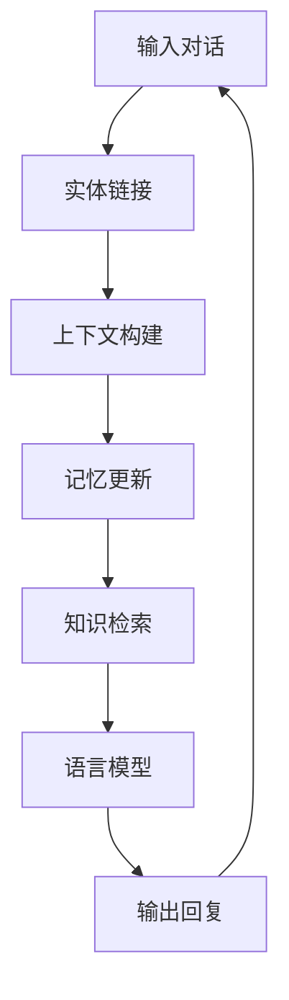

# 【LangChain编程：从入门到实践】ConversationKGMemory

## 1.背景介绍

在当今的人工智能时代，构建智能对话系统已成为一项重要的研究领域。传统的检索式问答系统虽然可以提供准确的答案,但缺乏上下文理解和持续对话能力。为了解决这一问题,研究人员提出了基于知识图谱(Knowledge Graph)的对话系统,旨在通过结构化的知识库来支持多轮交互式对话。

LangChain是一个强大的Python库,它将大型语言模型(LLM)与其他组件(如知识库、数据库等)相结合,从而构建智能应用程序。其中,ConversationKGMemory是LangChain中一个重要的组件,它利用知识图谱来增强对话系统的上下文理解和记忆能力,为构建高质量的对话系统提供了有力支持。

## 2.核心概念与联系

### 2.1 知识图谱(Knowledge Graph)

知识图谱是一种结构化的知识表示形式,它将实体(entities)、概念(concepts)和它们之间的关系(relations)以图形的方式组织起来。知识图谱不仅可以存储大量的事实知识,还能捕捉知识之间的语义关联,从而支持更加智能的推理和问答。

在对话系统中,知识图谱可以作为一种外部知识源,为对话提供背景信息和补充知识,从而提高对话的质量和连贯性。

### 2.2 ConversationKGMemory

ConversationKGMemory是LangChain中一个重要的内存组件,它将知识图谱与对话历史相结合,为对话系统提供上下文理解和记忆能力。它的核心思想是将对话历史中的实体和概念映射到知识图谱中,从而建立对话上下文与知识库之间的联系。

在对话过程中,ConversationKGMemory会持续更新对话状态,并根据当前对话上下文从知识图谱中检索相关信息,为语言模型提供补充知识。这种机制不仅可以增强对话系统的上下文理解能力,还能提高对话的连贯性和一致性。

## 3.核心算法原理具体操作步骤

ConversationKGMemory的核心算法原理包括以下几个关键步骤:

1. **实体链接(Entity Linking)**: 将对话历史中的文本映射到知识图谱中的实体。这通常涉及到命名实体识别(Named Entity Recognition)和实体消歧(Entity Disambiguation)等自然语言处理技术。

2. **上下文构建(Context Building)**: 根据已识别的实体,从知识图谱中检索相关的上下文信息,包括实体的属性、关系等。这些信息将作为对话系统的补充知识。

3. **记忆更新(Memory Update)**: 将新的对话历史和相关上下文信息合并到内存中,形成更新后的对话状态。这个过程需要合理地整合新旧信息,并根据需要进行信息压缩或遗忘。

4. **知识检索(Knowledge Retrieval)**: 在生成回复时,根据当前的对话状态从知识图谱中检索相关信息,为语言模型提供补充知识。

这些步骤通常是循环执行的,以持续更新对话状态并提供相关知识。下面是ConversationKGMemory的基本工作流程:



## 4.数学模型和公式详细讲解举例说明

在ConversationKGMemory中,常用的数学模型和公式包括:

1. **实体链接模型**

实体链接是将文本中的mentions(提及)映射到知识库中的实体的过程。常用的实体链接模型包括:

- 基于字符串匹配的模型:计算mention与实体名称之间的字符串相似度,选择最相似的实体。常用的字符串相似度度量包括编辑距离、Jaro-Winkler距离等。

- 基于概率模型的方型:通过计算 $P(e|m)$ 来选择最可能的实体 $e$ ,其中 $m$ 表示mention。这种模型通常利用了实体的先验概率 $P(e)$ 和生成mention的条件概率 $P(m|e)$ 。

2. **实体相关性模型**

为了确定与当前对话上下文相关的实体,需要计算实体之间的相关性。常用的实体相关性模型包括:

- 基于知识图谱结构的模型:利用实体之间在知识图谱中的路径长度、关系类型等信息来衡量相关性。

- 基于embedding的模型:将实体和mention映射到低维向量空间,通过计算向量之间的相似度(如余弦相似度)来衡量相关性。

3. **记忆更新模型**

记忆更新模型需要合理地整合新旧信息,并根据需要进行信息压缩或遗忘。常用的记忆更新模型包括:

- 基于注意力机制的模型:通过计算新旧信息之间的注意力权重,动态地调整信息的重要性。

- 基于规则的模型:根据预定义的规则(如时间衰减、信息冲突解决等)来更新记忆。

- 基于神经网络的模型:利用递归神经网络(RNN)或transformer等模型,自动学习记忆更新策略。

这些数学模型和公式为ConversationKGMemory提供了理论基础和技术支持,确保了对话系统能够有效地利用知识图谱,提高对话质量和连贯性。

## 5.项目实践:代码实例和详细解释说明

在这一部分,我们将通过一个具体的项目实践来演示如何使用LangChain中的ConversationKGMemory组件构建一个基于知识图谱的对话系统。

### 5.1 准备工作

首先,我们需要准备一个知识图谱作为外部知识源。在这个示例中,我们将使用一个关于计算机科学概念的简单知识图谱。

```python
from langchain.knowledge_utils import KnowledgeGraph

# 定义实体和关系
entities = [
    "Python",
    "Java",
    "C++",
    "Programming Language",
    "Object-Oriented Programming",
    "Functional Programming",
    "Algorithm",
    "Data Structure",
]

relations = [
    ("Python", "is a", "Programming Language"),
    ("Java", "is a", "Programming Language"),
    ("C++", "is a", "Programming Language"),
    ("Python", "supports", "Object-Oriented Programming"),
    ("Java", "supports", "Object-Oriented Programming"),
    ("C++", "supports", "Object-Oriented Programming"),
    ("Python", "supports", "Functional Programming"),
    ("Algorithm", "uses", "Data Structure"),
]

# 构建知识图谱
kg = KnowledgeGraph.from_triples(relations, entities)
```

### 5.2 初始化ConversationKGMemory

接下来,我们需要初始化ConversationKGMemory组件,并将其与知识图谱相关联。

```python
from langchain.memory import ConversationKGMemory

# 初始化ConversationKGMemory
memory = ConversationKGMemory(knowledge_graph=kg)
```

### 5.3 构建对话系统

现在,我们可以将ConversationKGMemory与语言模型相结合,构建一个基于知识图谱的对话系统。

```python
from langchain.llms import OpenAI
from langchain.chains import ConversationChain

# 初始化语言模型
llm = OpenAI(temperature=0)

# 构建对话链
conversation = ConversationChain(
    llm=llm,
    memory=memory,
    verbose=True
)
```

### 5.4 进行对话

最后,我们可以通过调用`conversation.predict()`方法与对话系统进行交互。

```python
# 第一轮对话
print(conversation.predict(input="Python是什么类型的编程语言?"))
```

输出:
```
人类: Python是什么类型的编程语言?

Python AI: Python是一种支持面向对象编程和函数式编程的编程语言。它是一种高级通用编程语言,具有简洁的语法和可读性强的代码,被广泛应用于Web开发、科学计算、数据分析、人工智能等多个领域。

人类: Python和Java有什么区别?

Python AI: Python和Java都是面向对象的编程语言,但它们有一些区别:

1. 语法: Python的语法更加简洁,代码通常比Java更加紧凑。Java的语法继承自C++,更加冗长和复杂。

2. 编译与解释: Python是解释型语言,代码在运行时被解释执行。Java是编译型语言,需要先将代码编译成字节码,然后由Java虚拟机执行。

3. 静态与动态类型: Java是静态类型语言,变量的类型在编译时就已确定。Python是动态类型语言,变量的类型在运行时确定。

4. 垃圾回收: Python采用自动垃圾回收机制,程序员不需要手动管理内存。Java也有自动垃圾回收,但机制不同。

5. 库和框架: Python和Java都有丰富的库和框架,但在某些领域可能有所侧重,如Python在数据科学和人工智能领域更受欢迎。

总的来说,Python和Java各有优缺点,适用于不同的场景和需求。Python更注重简洁性和生产力,而Java更注重性能和安全性。

人类: 那算法和数据结构之间有什么关系?

Python AI: 算法和数据结构之间存在密切的关系。数据结构用于组织和存储数据,而算法则定义了在这些数据结构上执行操作的步骤。

具体来说:

1. 算法依赖于数据结构。算法通常需要在特定的数据结构上操作,如在链表上实现插入、删除操作,或在树上实现搜索操作等。不同的数据结构适合不同的算法,选择合适的数据结构可以提高算法的效率。

2. 数据结构影响算法的复杂度。不同的数据结构具有不同的时间和空间复杂度,这将直接影响基于它们的算法的复杂度。例如,在链表上的操作通常比在数组上慢,因为需要遍历链表。

3. 算法可以在数据结构上执行各种操作。算法定义了如何在给定的数据结构上执行插入、删除、搜索、排序等操作的步骤。

4. 算法设计常常需要结合数据结构。在设计算法时,需要考虑使用何种数据结构来存储和组织数据,以达到最优的时间和空间复杂度。

总之,算法和数据结构是相辅相成的。合理选择和使用数据结构是设计高效算法的关键,而算法则赋予了数据结构实际的功能和意义。二者的结合是构建robust和高性能的软件系统的基础。

人类: 很好,我明白了。那在实际应用中,基于知识图谱的对话系统有哪些应用场景呢?

Python AI: 基于知识图谱的对话系统在许多实际应用场景中都有着广泛的应用前景,例如:

1. **智能助手**: 结合知识图谱,对话系统可以提供更加准确和上下文相关的回答,为用户提供更智能和人性化的服务体验。这种助手可应用于客户服务、个人助理等场景。

2. **问答系统**: 知识图谱为问答系统提供了结构化的知识库,能够支持更复杂的问题理解和推理,提高问答质量。这种系统可用于教育、医疗、法律等领域的专业知识问答。

3. **对话式推荐系统**: 基于用户的对话历史和知识图谱,系统可以更好地理解用户的需求和偏好,从而提供个性化的推荐,如电影、音乐、产品等推荐。

4. **智能导航系统**: 将地理位置、交通等信息构建为知识图谱,对话系统可以提供基于上下文的智能导航服务,如路线规划、景点介绍等。

5. **对话式数据探索**: 在数据分析领域,知识图谱可以表示数据集的元数据和语义信息,用户可以通过自然语言对话探索和查询数据。

6. **智能机器人**: 知识图谱赋予对话机器人更强的理解和推理能力,使其能够进行更自然、更富有意义的对话交互。

7. **智能问诊系统**: 在医疗保健领域,知识图谱可以存储医学知识,对话系统可以根据病人的症状提供初步诊断和建议。