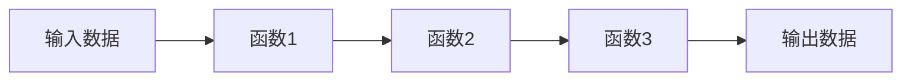

## 1.背景介绍

LangChain是一种新的编程语言，它的设计理念是让编程变得更加直观和易于理解，同时也能保持高效性能。LangChain的设计理念是基于链式编程，通过将代码块链接在一起，形成一个逻辑链，使得程序的执行过程更加清晰。

## 2.核心概念与联系

LangChain的核心概念是链式编程。链式编程是一种编程风格，它的基本思想是通过将函数调用链接在一起，形成一个链条，从而使代码更加简洁和易于理解。这种编程风格在JavaScript中的jQuery库和Python中的Pandas库中都有应用。

LangChain采用的是数据流编程模型，这种模型的主要特点是数据和操作数据的函数是分离的，数据流通过函数链条进行处理，每个函数都是一个独立的处理单元，数据从一个函数流向下一个函数。



## 3.核心算法原理具体操作步骤

LangChain的核心算法是基于数据流的计算模型。这种计算模型的基本操作步骤如下：

1. 定义数据源：数据源可以是任何形式的数据，例如文件、数据库、网络数据等。

2. 定义函数链：函数链是由一系列处理函数组成的，每个函数都会对输入数据进行某种处理，然后将处理结果传递给下一个函数。

3. 执行函数链：从数据源开始，数据按照函数链的顺序依次进行处理，最后得到处理结果。

4. 输出结果：将处理结果输出，可以是显示在屏幕上，也可以是保存到文件或数据库中。

## 4.数学模型和公式详细讲解举例说明

LangChain的核心算法可以用数学模型来描述，这个模型是基于函数链的概念。假设我们有一个函数链$F = f_1 \circ f_2 \circ \cdots \circ f_n$，其中$\circ$表示函数的复合操作，$f_i$表示第$i$个处理函数，那么对于任意的输入数据$x$，函数链$F$的输出结果就是$f_1(f_2(\cdots f_n(x)\cdots))$。

例如，假设我们有一个函数链$F = f \circ g \circ h$，其中$f(x) = x^2$，$g(x) = 2x$，$h(x) = x+1$，那么对于输入数据$x=2$，函数链$F$的输出结果就是$f(g(h(2))) = ((2+1) \times 2)^2 = 36$。

## 5.项目实践：代码实例和详细解释说明

下面是一个使用LangChain编程语言的简单示例，这个示例演示了如何使用函数链处理数据。

```LangChain
// 定义数据源
let data = [1, 2, 3, 4, 5];

// 定义函数链
let chain = LangChain()
    .map(x => x * 2)  // 每个元素乘以2
    .filter(x => x > 5)  // 过滤掉小于等于5的元素
    .reduce((x, y) => x + y);  // 计算所有元素的和

// 执行函数链
let result = chain.execute(data);

// 输出结果
console.log(result);  // 输出14
```

## 6.实际应用场景

LangChain编程语言可以应用在很多场景中，例如数据处理、网络编程、并行计算等。下面是一些具体的应用场景：

- 数据处理：可以使用LangChain编程语言进行数据清洗、数据转换、数据聚合等操作。

- 网络编程：可以使用LangChain编程语言进行网络请求的处理，例如请求路由、请求过滤、请求转发等。

- 并行计算：可以使用LangChain编程语言进行并行计算，通过将计算任务分解成多个子任务，然后在多个处理器上并行执行，从而提高计算效率。

## 7.工具和资源推荐

如果你想学习和使用LangChain编程语言，下面是一些推荐的工具和资源：

- LangChain官方网站：提供了详细的语言规范、教程和示例。

- LangChain在线编程环境：可以在浏览器中直接编写和运行LangChain代码。

- LangChain社区：可以在这里找到很多有用的信息，例如问题解答、技术讨论、项目分享等。

## 8.总结：未来发展趋势与挑战

LangChain编程语言以其独特的链式编程模型和数据流计算模型，提供了一种全新的编程方式，使得编程变得更加直观和易于理解。然而，作为一种新的编程语言，LangChain还面临着很多挑战，例如语言设计的完善、编译器和工具的开发、社区的建设等。但我相信，在未来，LangChain有可能成为一种主流的编程语言。

## 9.附录：常见问题与解答

Q: LangChain编程语言适合做什么类型的项目？

A: LangChain编程语言适合做数据处理、网络编程、并行计算等类型的项目。

Q: LangChain编程语言的性能如何？

A: LangChain编程语言的性能主要取决于具体的使用场景和编程方式。在一些场景中，由于其数据流计算模型的特性，LangChain可能比传统的编程语言有更好的性能。

Q: LangChain编程语言的学习曲线如何？

A: LangChain编程语言的设计理念是让编程变得更加直观和易于理解，因此其学习曲线相对较平。但是，如果你想深入理解和掌握LangChain，还需要花费一些时间和精力。

作者：禅与计算机程序设计艺术 / Zen and the Art of Computer Programming