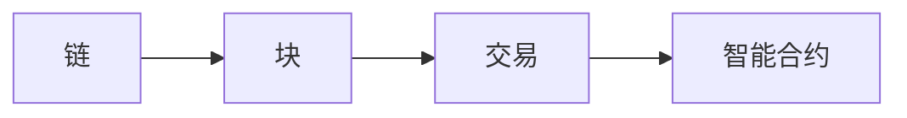

## 1.背景介绍

在当今的科技时代，区块链技术的出现引发了一场全新的技术革命。作为这场革命中的一员，LangChain编程语言在区块链应用开发中发挥了重要的作用。LangChain不仅为开发者提供了一种高效、安全的编程方式，也为区块链的发展打开了新的可能性。本文将详细介绍LangChain的基本概念、核心算法、数学模型以及具体的应用场景，希望能为大家的学习和研究提供一些帮助。

## 2.核心概念与联系

LangChain是一种专为区块链应用开发设计的编程语言。它的核心概念主要包括链、块、交易和智能合约四个部分。

- 链：链是LangChain的基础结构，由一系列的块按照特定的顺序链接而成。
- 块：块是链的基本组成部分，包含了一系列的交易信息。
- 交易：交易是区块链中的基本操作单位，包括转账、调用智能合约等操作。
- 智能合约：智能合约是一种在区块链上运行的自动执行程序，用于处理复杂的交易逻辑。



## 3.核心算法原理具体操作步骤

LangChain的核心算法主要包括共识算法和智能合约的执行算法。

### 3.1 共识算法

共识算法是LangChain中非常重要的一部分，它保证了所有节点对链的状态达成一致。LangChain采用了PoS（Proof of Stake）共识算法，具体的操作步骤如下：

1. 所有的节点根据自己持有的币的数量和时间，计算出自己的权重。
2. 当需要产生新的块时，所有的节点根据自己的权重进行投票，选择出一个节点来产生新的块。
3. 被选出的节点产生新的块，并将新的块广播给其他的节点。
4. 其他的节点收到新的块后，验证新的块的有效性，如果有效则将新的块添加到自己的链上。

### 3.2 智能合约的执行算法

智能合约的执行算法是LangChain的另一个重要部分，它保证了智能合约能够正确、安全地执行。具体的操作步骤如下：

1. 当一个交易调用一个智能合约时，首先会检查交易的有效性，包括签名的正确性、余额的充足等。
2. 如果交易有效，那么就开始执行智能合约。智能合约的执行是在一个虚拟机中进行的，这个虚拟机提供了一套完整的指令集，用于实现各种复杂的逻辑。
3. 在智能合约执行过程中，会对链的状态进行修改。这些修改是在一个临时的状态中进行的，只有当智能合约执行完成后，这些修改才会被应用到链的状态上。
4. 如果智能合约执行过程中出现了错误，那么所有的状态修改都会被回滚，保证了链的状态的一致性。

## 4.数学模型和公式详细讲解举例说明

### 4.1 PoS共识算法的数学模型

在PoS共识算法中，节点的权重是一个非常重要的概念。节点的权重决定了节点产生新块的概率。节点的权重计算公式如下：

$$
W = C \times T
$$

其中，$W$是节点的权重，$C$是节点持有的币的数量，$T$是节点持有币的时间。

例如，如果一个节点持有100个币，持有时间为10天，那么这个节点的权重就是1000。

### 4.2 智能合约的执行效率

智能合约的执行效率是评价一个区块链系统性能的重要指标。智能合约的执行效率可以用以下公式来表示：

$$
E = \frac{N}{T}
$$

其中，$E$是智能合约的执行效率，$N$是智能合约执行的指令数量，$T$是智能合约执行的时间。

例如，如果一个智能合约执行了1000条指令，执行时间为1秒，那么这个智能合约的执行效率就是1000。

## 5.项目实践：代码实例和详细解释说明

下面我们来看一个简单的LangChain编程的例子。这个例子中，我们将创建一个简单的智能合约，这个智能合约能够实现币的转账功能。

```langchain
contract Transfer {
    function transfer(address from, address to, uint amount) {
        require(balanceOf[from] >= amount);
        balanceOf[from] -= amount;
        balanceOf[to] += amount;
    }
}
```

这个智能合约中，`transfer`函数是转账的主要逻辑。函数接受三个参数，分别是转账的发送方地址`from`，接收方地址`to`，转账的数量`amount`。在函数内部，首先检查发送方的余额是否足够，如果足够，那么就从发送方的余额中扣除转账的数量，然后加到接收方的余额中。

## 6.实际应用场景

LangChain编程语言可以用于开发各种区块链应用，包括但不限于以下几种场景：

1. 数字货币：可以用LangChain编程语言创建自己的数字货币，实现货币的发行、转账等功能。
2. 供应链管理：可以用LangChain编程语言创建供应链管理系统，实现商品的追踪、交易等功能。
3. 身份认证：可以用LangChain编程语言创建身份认证系统，实现身份的验证、授权等功能。

## 7.工具和资源推荐

以下是一些学习和使用LangChain编程语言的推荐工具和资源：

1. LangChain官方文档：提供了详细的语言规范和使用指南。
2. LangChain开发工具：提供了语法高亮、代码提示等功能，可以提高开发效率。
3. LangChain社区：可以在社区中找到很多优秀的教程和案例，也可以向社区提问，得到其他开发者的帮助。

## 8.总结：未来发展趋势与挑战

LangChain编程语言作为一种专门为区块链应用开发设计的语言，有着广阔的应用前景。随着区块链技术的发展，我们相信LangChain将会有更多的应用场景和更大的发展空间。

然而，LangChain也面临着一些挑战。例如，如何提高智能合约的执行效率，如何保证智能合约的安全性等。这些问题需要我们在未来的研究中去解决。

## 9.附录：常见问题与解答

Q：LangChain编程语言的学习难度如何？

A：LangChain编程语言的设计目标是简洁、易学。如果你有其他编程语言的经验，那么学习LangChain应该不会太困难。

Q：LangChain编程语言可以用于开发哪些类型的区块链应用？

A：LangChain编程语言可以用于开发各种类型的区块链应用，包括数字货币、供应链管理、身份认证等。

Q：LangChain编程语言的执行效率如何？

A：LangChain编程语言的执行效率取决于很多因素，包括智能合约的复杂度、区块链的规模等。我们正在不断地优化LangChain的执行效率，以满足各种应用的需求。

作者：禅与计算机程序设计艺术 / Zen and the Art of Computer Programming