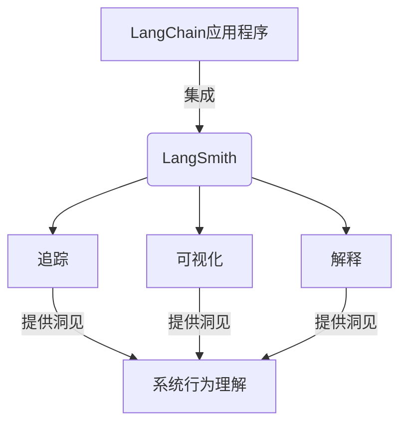

# 【LangChain编程：从入门到实践】使用LangSmith进行观测

## 1. 背景介绍

### 1.1 人工智能的崛起

近年来,人工智能(AI)技术的飞速发展正在改变着我们的生活和工作方式。从语音助手到自动驾驶汽车,AI系统无处不在,为我们提供了前所未有的便利和效率。然而,随着AI系统变得越来越复杂,理解和控制它们的行为也变得越来越具有挑战性。

### 1.2 LangChain:构建AI应用的新范式

在这种背景下,LangChain应运而生。作为一个强大的AI开发框架,LangChain旨在简化AI应用程序的构建过程,使开发人员能够更轻松地集成各种语言模型、知识库和其他AI组件。通过将这些组件链接在一起,LangChain为构建智能对话系统、问答系统、自动化工作流等提供了一种全新的范式。

### 1.3 LangSmith:LangChain的可观测性扩展

尽管LangChain提供了强大的功能,但在实际应用中,我们往往需要更深入地了解AI系统的内部运作,以便进行调试、优化和解释。这就是LangSmith发挥作用的地方。作为LangChain的一个扩展,LangSmith引入了可观测性的概念,允许开发人员跟踪和可视化AI系统的执行过程,从而获得对系统行为的深入洞见。

## 2. 核心概念与联系

### 2.1 可观测性(Observability)

可观测性是指能够深入了解系统内部状态和行为的能力。在传统的软件系统中,日志记录和指标收集是实现可观测性的常用方法。然而,对于AI系统来说,由于它们的复杂性和不确定性,实现可观测性需要更加先进的技术和工具。

### 2.2 LangSmith的可观测性方法

LangSmith采用了多种技术来实现AI系统的可观测性,包括:

1. **追踪(Tracing)**: 记录AI系统执行过程中的关键事件和状态变化,以便后续分析和调试。
2. **可视化(Visualization)**: 将追踪数据转换为直观的图形表示,如时间线、流程图等,以便更好地理解系统行为。
3. **解释(Interpretation)**: 通过解释技术(如注意力可视化、特征属性等),揭示AI模型的决策过程和推理逻辑。

### 2.3 LangSmith与LangChain的集成

LangSmith与LangChain紧密集成,可以无缝地插入到LangChain应用程序中。开发人员可以在构建LangChain代理或链时,简单地启用LangSmith的可观测性功能,从而获得对系统行为的深入洞见。



## 3. 核心算法原理具体操作步骤

### 3.1 追踪AI系统执行过程

LangSmith的追踪功能基于事件驱动的架构,它记录AI系统执行过程中的关键事件,如模型调用、数据传输等。这些事件被序列化并存储在追踪存储中,以供后续分析和可视化。

追踪过程的具体步骤如下:

1. **定义追踪点(Tracepoints)**: 开发人员需要在代码中标记出需要追踪的关键点,例如模型调用、数据传输等。
2. **发送追踪事件**: 当执行到追踪点时,LangSmith会自动发送一个追踪事件,包含相关的元数据(如时间戳、事件类型等)。
3. **序列化和存储**: 追踪事件被序列化并存储在追踪存储中,例如内存、文件或数据库。
4. **查询和分析**: 开发人员可以使用LangSmith提供的API查询和分析存储的追踪数据,以了解系统行为。

### 3.2 可视化追踪数据

为了更好地理解AI系统的行为,LangSmith提供了多种可视化工具,将追踪数据转换为直观的图形表示。常用的可视化方式包括:

1. **时间线视图**: 将事件按时间顺序排列,展示系统执行过程中的关键时间点和事件序列。
2. **流程图视图**: 使用流程图展示AI系统的执行流程,包括模型调用、数据传输等步骤。
3. **注意力可视化**: 对于基于注意力机制的模型,可视化注意力权重分布,揭示模型的决策过程。

可视化过程的具体步骤如下:

1. **提取相关数据**: 从追踪存储中提取与可视化目标相关的事件和元数据。
2. **数据转换**: 将提取的数据转换为可视化工具所需的格式,例如JSON或CSV。
3. **渲染可视化**: 使用LangSmith提供的可视化工具,根据转换后的数据渲染出相应的图形表示。
4. **交互式探索**: 开发人员可以与可视化结果进行交互式探索,例如缩放、过滤、高亮等操作,以获得更深入的洞见。

### 3.3 解释AI模型决策

除了可视化执行过程,LangSmith还提供了解释AI模型决策的功能。这有助于开发人员更好地理解模型的推理逻辑,并检测潜在的偏差或错误。

LangSmith采用了多种解释技术,包括:

1. **特征属性(Feature Attribution)**: 通过计算每个输入特征对模型输出的贡献,揭示模型关注的关键特征。
2. **对比解释(Contrastive Explanation)**: 比较两个相似输入的模型输出,并解释导致输出差异的关键因素。
3. **规则提取(Rule Extraction)**: 从模型中提取等效的规则或决策树,以更易于理解的形式表示模型的决策逻辑。

解释过程的具体步骤如下:

1. **准备输入数据**: 准备需要解释的输入数据,以及相关的模型输出或决策。
2. **选择解释技术**: 根据具体需求和模型类型,选择适当的解释技术,如特征属性、对比解释或规则提取。
3. **应用解释算法**: 使用LangSmith提供的解释算法,对模型进行解释。
4. **可视化解释结果**: 将解释结果转换为直观的可视化表示,如热力图、决策树等,以便更好地理解模型的决策过程。

## 4. 数学模型和公式详细讲解举例说明

在解释AI模型决策时,LangSmith采用了多种数学模型和算法。以下是一些常用的数学模型和公式,以及它们在LangSmith中的应用:

### 4.1 特征属性: 积分梯度法(Integrated Gradients)

积分梯度法是一种计算特征属性的常用技术,它通过沿直线路径积分梯度来估计每个输入特征对模型输出的贡献。对于一个输入 $x$ 和基线输入 $x'$,特征 $i$ 的属性值 $\text{IG}_i(x)$ 可以计算如下:

$$\text{IG}_i(x) = (x_i - x'_i) \times \int_{\alpha=0}^{1} \frac{\partial F(x' + \alpha \times (x - x'))}{\partial x_i} d\alpha$$

其中 $F$ 是模型函数,积分近似计算通常使用累加和或者平滑梯度。

在LangSmith中,积分梯度法可以用于解释基于梯度的模型,如神经网络和transformer模型。它能够揭示每个输入特征对模型输出的贡献程度,从而帮助开发人员理解模型的决策过程。

### 4.2 对比解释: 对比归一化投影(Contrastive Normalized Projection)

对比归一化投影是一种对比解释技术,它通过比较两个相似输入的模型输出,并找出导致输出差异的关键特征。

对于两个输入 $x_1$ 和 $x_2$,以及它们对应的模型输出 $y_1$ 和 $y_2$,对比归一化投影的目标是找到一个向量 $c$,使得 $c^T(x_1 - x_2)$ 最大化,同时满足以下约束条件:

$$\begin{align}
&\|c\|_2 = 1 \\
&c^T(x_1 - x_2) \leq \|y_1 - y_2\|_2
\end{align}$$

通过求解这个优化问题,我们可以得到一个向量 $c$,它表示导致输出差异的关键特征方向。

在LangSmith中,对比归一化投影可以用于解释任何类型的模型,包括黑盒模型。它能够揭示两个相似输入之间的关键差异,从而帮助开发人员理解模型的决策逻辑。

### 4.3 规则提取: 决策树学习

决策树是一种常用的机器学习模型,它通过构建一个树状结构来表示决策过程。决策树的优点是易于解释和可视化,因此它也被广泛用于从复杂模型中提取等效的规则或决策逻辑。

决策树学习算法通常采用自顶向下的递归分裂策略,在每个节点选择一个特征及其阈值,将数据集划分为两个子集。常用的特征选择标准包括信息增益、基尼系数等。

在LangSmith中,决策树学习可以用于从任何类型的模型中提取等效的决策规则。这些规则通常比原始模型更易于理解,有助于开发人员检测潜在的偏差或错误,并提高模型的可解释性。

## 5. 项目实践:代码实例和详细解释说明

为了更好地理解LangSmith的使用方式,我们将通过一个实际项目来演示如何在LangChain应用程序中集成LangSmith的可观测性功能。

### 5.1 项目概述

在本项目中,我们将构建一个简单的问答系统,它可以根据给定的上下文文本回答相关问题。我们将使用LangChain框架来构建这个系统,并集成LangSmith来追踪和可视化系统的执行过程。

### 5.2 安装依赖项

首先,我们需要安装必要的Python依赖项:

```bash
pip install langchain langsmith openai
```

### 5.3 定义追踪点

在开始编写代码之前,我们需要确定需要追踪的关键点。在这个项目中,我们将追踪以下事件:

1. 问题输入
2. 上下文文本加载
3. 模型调用
4. 模型输出

为了定义追踪点,我们需要导入`langsmith`模块,并使用`@langsmith.tracepoint`装饰器标记相关函数。

```python
import langchain
import langsmith

@langsmith.tracepoint
def load_context(context_file):
    with open(context_file, 'r') as f:
        context = f.read()
    return context

@langsmith.tracepoint
def answer_question(question, context, model):
    qa = langchain.chains.question_answering.load_qa_chain(model, chain_type="stuff")
    result = qa.run(question, context)
    return result
```

### 5.4 构建问答系统

接下来,我们将使用LangChain构建问答系统的核心逻辑。我们将使用OpenAI的文本完成模型作为问答模型。

```python
import os
from langchain.llms import OpenAI

# 加载OpenAI API密钥
os.environ["OPENAI_API_KEY"] = "your_openai_api_key"

# 初始化OpenAI模型
model = OpenAI(temperature=0)

# 加载上下文文本
context = load_context("context.txt")

# 回答问题
question = "What is the capital of France?"
answer = answer_question(question, context, model)
print(f"Answer: {answer}")
```

### 5.5 集成LangSmith

现在,我们将集成LangSmith来追踪和可视化系统的执行过程。我们需要创建一个`Tracker`实例,并将其传递给`langsmith.track`上下文管理器。

```python
import langsmith

# 创建追踪器
tracker = langsmith.Tracker()

# 启用追踪
with langsmith.track(tracker):
    # 执行问答系统
    context = load_context("context.txt")
    question = "What is the capital of France?"
    answer = answer_question(question, context, model)
    print(f"Answer: {answer}")

# 可视化追踪数据
tracker.visualize