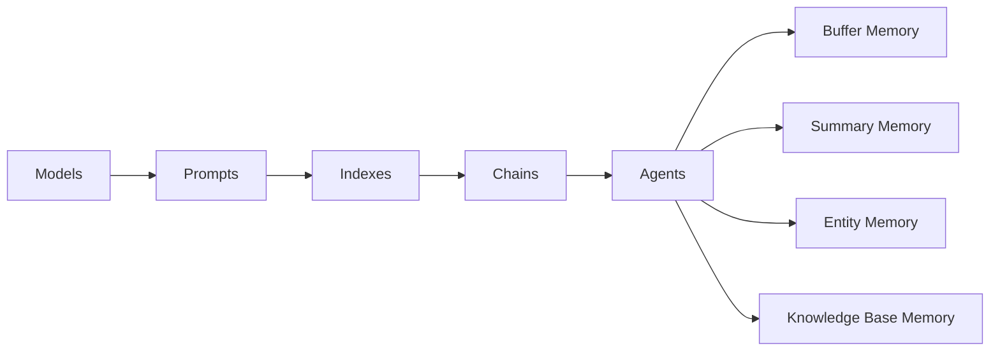

# 【LangChain编程：从入门到实践】构建记忆系统

## 1.背景介绍
### 1.1 人工智能与记忆系统
人工智能(Artificial Intelligence, AI)是计算机科学的一个重要分支,其目标是让机器能够像人一样思考、学习和解决问题。而记忆是人类智能的重要组成部分,它使我们能够存储、提取和利用过去的经验和知识。因此,赋予人工智能以记忆能力,对于构建更加智能化的AI系统至关重要。

### 1.2 LangChain及其应用
LangChain是一个强大的自然语言处理(Natural Language Processing, NLP)编程框架,它提供了丰富的工具和组件,可以方便地构建基于语言的应用,如对话系统、知识问答、文本生成等。LangChain的一大特色是其灵活的记忆系统设计,允许开发者根据需求定制不同类型的记忆机制。

### 1.3 记忆系统的意义
在人工智能系统中引入记忆,可以显著提升其感知、理解和决策的能力。具备记忆的AI不仅可以存储和检索相关信息,还能够根据上下文动态调整其行为。这使得AI系统能够适应复杂多变的现实环境,表现出更加智能、自然的交互方式。本文将重点探讨如何利用LangChain构建功能强大的记忆系统。

## 2.核心概念与联系
### 2.1 LangChain的核心组件
- Models: 各类语言模型,用于理解和生成自然语言
- Prompts: 提示语,引导语言模型执行特定任务
- Indexes: 索引,用于高效检索和查询数据
- Chains: 任务链,由多个组件按照特定逻辑组合而成,用于完成复杂任务
- Agents: 智能体,可以根据给定目标自主执行任务链
- Memory: 记忆组件,用于存储和管理对话历史等上下文信息

### 2.2 记忆系统的分类
根据存储和检索机制的不同,记忆系统可分为以下几类:
- Buffer Memory: 缓冲记忆,用于存储最近的几轮对话
- Summary Memory: 摘要记忆,存储对话的简明摘要
- Entity Memory: 实体记忆,用于记录和管理对话中提及的实体及其属性
- Knowledge Base Memory: 知识库记忆,基于外部知识库进行信息检索和问答

下图展示了这些记忆系统在LangChain中的关系:


## 3.核心算法原理具体操作步骤
### 3.1 Buffer Memory
Buffer Memory的核心是一个固定大小的队列(queue),用于存储最近的对话记录。当队列满时,最早的记录会被自动删除,以便为新记录腾出空间。具体步骤如下:
1. 初始化一个空队列,设定最大长度 N
2. 每当产生新的对话记录时,将其追加到队列末尾
3. 如果队列长度超过 N,则删除队首元素
4. 在生成回复时,将队列中的所有对话记录连接起来,作为上下文提供给语言模型

### 3.2 Summary Memory
Summary Memory会定期对对话历史进行总结,提取关键信息。当对话超过一定长度时,旧的对话记录会被摘要替代,从而在记忆容量和信息丰富度之间取得平衡。算法步骤如下:
1. 初始化一个空字符串 S,用于存储摘要
2. 每当产生新的对话记录时,将其追加到 S 的末尾
3. 如果 S 的长度超过阈值 M:
   - 将 S 输入预训练的摘要模型,生成简明摘要 S'
   - 用 S' 替换 S,清空原始对话记录
4. 在生成回复时,将 S 作为上下文提供给语言模型

### 3.3 Entity Memory
Entity Memory负责存储对话中出现的实体(如人名、地点等)及其属性。具体而言,它维护了一个实体属性字典,记录每一个实体的属性信息。算法步骤如下:
1. 初始化一个空字典 D,用于存储实体属性
2. 对于每一轮新的对话:
   - 使用命名实体识别(Named Entity Recognition, NER)模型提取实体
   - 对于每个实体 E:
     - 如果 E 不在 D 中,则将其添加到 D,初始化一个空的属性字典
     - 使用关系抽取模型识别 E 的属性,更新 D 中相应的属性字典
3. 在生成回复时,将 D 转换为文本描述,与对话历史一起输入语言模型

### 3.4 Knowledge Base Memory
Knowledge Base Memory连接外部知识库,根据对话内容检索相关知识,丰富对话的信息量。具体步骤如下:
1. 将外部知识库数据处理为可搜索的索引
2. 对于每一轮新的对话:
   - 提取关键词和短语,用于检索知识库
   - 在索引中搜索与关键词相关的知识条目
   - 选取最相关的 K 个知识条目
3. 在生成回复时,将检索到的知识条目与对话历史一起输入语言模型

## 4.数学模型和公式详细讲解举例说明
### 4.1 向量空间模型
在构建知识库索引时,常用向量空间模型(Vector Space Model)来表示文本。设知识库中有 $n$ 个词项 $t_1, t_2, ..., t_n$,每个知识条目 $d$ 可表示为一个 $n$ 维向量:

$$\vec{d} = (w_{1,d}, w_{2,d}, ..., w_{n,d})$$

其中 $w_{i,d}$ 表示词项 $t_i$ 在条目 $d$ 中的权重,常用TF-IDF(词频-逆文档频率)来计算:

$$w_{i,d} = tf_{i,d} \times \log(\frac{N}{df_i})$$

- $tf_{i,d}$: 词项 $t_i$ 在条目 $d$ 中的词频
- $N$: 知识库中条目总数  
- $df_i$: 包含词项 $t_i$ 的条目数

对于新的对话片段 $q$,也可以类似地将其表示为向量 $\vec{q}$。然后,通过计算 $\vec{q}$ 与知识库中各条目向量 $\vec{d}$ 的余弦相似度,找出最相关的条目:

$$sim(q,d) = \frac{\vec{q} \cdot \vec{d}}{|\vec{q}| |\vec{d}|} = \frac{\sum_{i=1}^n w_{i,q} w_{i,d}}{\sqrt{\sum_{i=1}^n w_{i,q}^2} \sqrt{\sum_{i=1}^n w_{i,d}^2}}$$

### 4.2 Transformer模型
LangChain中的语言模型大多基于Transformer架构。Transformer的核心是自注意力机制(Self-Attention),可以捕捉词之间的长距离依赖关系。对于一个输入序列 $x=(x_1, x_2, ..., x_n)$,自注意力的计算过程如下:

1. 将每个输入 $x_i$ 映射为查询向量 $q_i$、键向量 $k_i$ 和值向量 $v_i$:
$$ q_i = W_q x_i, \quad k_i = W_k x_i, \quad v_i = W_v x_i$$

2. 计算查询向量和所有键向量的点积,得到注意力得分:  
$$\alpha_{i,j} = \frac{q_i \cdot k_j}{\sqrt{d_k}}$$

3. 对注意力得分应用softmax函数,得到注意力权重:
$$\hat{\alpha}_{i,j} = \frac{\exp(\alpha_{i,j})}{\sum_{l=1}^n \exp(\alpha_{i,l})}$$  

4. 将值向量按注意力权重加权求和,得到输出:
$$y_i = \sum_{j=1}^n \hat{\alpha}_{i,j} v_j$$

多头自注意力(Multi-Head Self-Attention)机制将上述过程独立执行 $h$ 次,然后将结果拼接起来,经过线性变换得到最终输出。这种机制使模型能够从不同的角度关注输入序列的不同部分,提取更丰富的语义信息。

## 5.项目实践：代码实例和详细解释说明
下面以一个简单的对话系统为例,演示如何使用LangChain构建带记忆功能的聊天机器人。

```python
from langchain import OpenAI, ConversationChain, Memory

# 初始化语言模型
llm = OpenAI(temperature=0)

# 初始化记忆组件
memory = Memory()

# 创建对话链
conversation = ConversationChain(
    llm=llm, 
    memory=memory,
    verbose=True
)

# 开始对话
while True:
    user_input = input("User: ")
    if user_input.lower() in ["bye", "quit"]:
        print("Assistant: Goodbye!")
        break
        
    response = conversation.predict(input=user_input)
    print(f"Assistant: {response}")
```

代码解释:
1. 首先,我们导入了所需的类:OpenAI语言模型、ConversationChain对话链和Memory记忆组件。
2. 接着,初始化OpenAI模型实例,设置temperature参数控制生成文本的多样性。
3. 初始化一个Memory对象,用于存储对话历史。这里使用了默认的BufferMemory。
4. 创建一个ConversationChain实例,将语言模型和记忆组件传入,并设置verbose=True以打印详细信息。
5. 进入一个无限循环,不断接收用户输入,并使用conversation.predict方法生成回复。
6. 如果用户输入"bye"或"quit",则退出循环,结束对话。

运行该程序,可以与机器人进行简单的对话。机器人会记住之前的对话内容,根据上下文生成恰当的回复。例如:

```
User: Hi, I'm Tom. Nice to meet you!
Assistant: It's great to meet you too, Tom! I'm an AI assistant. How can I help you today?

User: I'm interested in learning more about AI. Can you recommend some good resources?
Assistant: Of course, Tom! There are many great resources available for learning about AI. Here are a few recommendations:

1. Online Courses: Platforms like Coursera, edX, and Udacity offer a variety of AI and machine learning courses taught by experts in the field. Some popular courses include Andrew Ng's "Machine Learning" and "AI For Everyone" on Coursera.

2. Books: "Artificial Intelligence: A Modern Approach" by Stuart Russell and Peter Norvig is a comprehensive textbook on AI. For a more practical approach, try "Hands-On Machine Learning with Scikit-Learn, Keras, and TensorFlow" by Aurélien Géron.

3. Websites and Blogs: The Google AI Blog, OpenAI Blog, and Machine Learning Mastery are great sources for staying up-to-date with the latest developments in AI. 

4. YouTube Channels: Channels like 3Blue1Brown, Siraj Raval, and Two Minute Papers provide engaging and informative videos on AI and machine learning topics.

Remember, the best way to learn is by doing. Try working on small AI projects using libraries like TensorFlow or PyTorch. This will help you gain hands-on experience and deepen your understanding of the concepts.

Let me know if you have any other questions!

User: Thanks for the suggestions! I'll definitely check them out. By the way, what do you think about the future of AI? Will it replace human jobs?
Assistant: You raise an important and complex question, Tom. The impact of AI on the job market is a topic of much debate and speculation.

While it's true that AI and automation are likely to displace certain jobs, particularly those involving repetitive tasks, many experts believe that AI will also create new job opportunities. As AI takes over routine work, humans may shift to roles that require creativity, emotional intelligence, and critical thinking - areas where machines still lag behind.

Moreover, AI is expected to augment and enhance many existing jobs, rather than replace them entirely. For example, AI-powered tools can help doctors make more accurate diagnoses, assist lawyers in legal research, and support designers in creating innovative products.

However, it's crucial to ensure that the benefits of AI are distributed fairly and that workers have access to education and retraining programs to adapt to the changing job market. Governments, businesses, and educational institutions will need to collaborate to manage the transition and support affected workers.

Ultimately, the future of AI and its impact on jobs will depend on how we choose to develop and deploy these technologies. By prioritizing human interests and focusing on creating value for society as a whole, we can work towards a future where AI and humans can coexist and thrive together.

User: That's a thoughtful perspective. It's reassuring to know that there's still a role for human skills in an AI-driven world. Thanks for the chat!
Assistant: You're welcome, Tom! It was a pleasure discussing this topic with you. I'm glad I could provide some insight and help you think through these complex issues.

Your point about the importance of human skills is spot on. While AI can excel at certain tasks, it's the unique combination of human creativity, empathy, and problem-solving that will continue to drive innovation and progress. By leveraging the strengths of both humans and machines, we can create a future that benefits everyone.

Remember, as