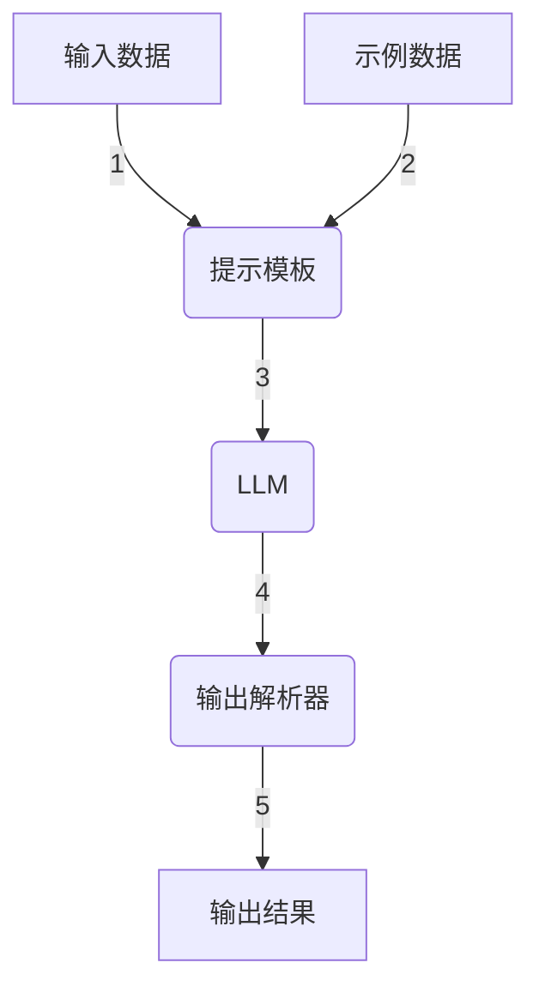

# 【LangChain编程：从入门到实践】模型I/O模块

## 1. 背景介绍

在当今的人工智能领域中,LangChain是一个强大而灵活的框架,旨在帮助开发人员构建基于大型语言模型(LLM)的应用程序。随着人工智能技术的不断进步,LLM正在成为各种任务的关键组成部分,从自然语言处理到决策支持系统。然而,与这些模型进行交互并不是一件简单的任务,因为它们需要特定的输入格式和数据处理方式。这就是LangChain发挥作用的地方,它提供了一种标准化的方式来与LLM进行交互,简化了模型输入/输出(I/O)的处理过程。

LangChain的模型I/O模块是整个框架的核心组成部分,它负责管理与LLM的交互,包括输入数据的预处理、模型推理和输出结果的后处理。通过使用这个模块,开发人员可以轻松地集成各种LLM,并根据特定的应用需求定制输入和输出的处理逻辑。

## 2. 核心概念与联系

在深入探讨LangChain模型I/O模块之前,让我们先了解一些核心概念:

1. **Prompt(提示)**: 这是提供给LLM的初始输入,用于指导模型生成所需的输出。提示可以是纯文本、结构化数据或者两者的组合。

2. **Prompt Template(提示模板)**: 一种用于构建动态提示的模板,它可以将变量或上下文信息插入到提示中。这使得提示能够根据特定的输入数据进行定制。

3. **Output Parser(输出解析器)**: 一种用于处理LLM输出的工具,它可以将原始输出转换为所需的格式或数据结构。

4. **Example Selector(示例选择器)**: 一种用于选择与当前输入相关的示例的工具,这些示例可以被添加到提示中,以帮助LLM更好地理解任务。

这些概念相互关联,共同构成了LangChain模型I/O模块的核心功能。提示模板用于生成提示,示例选择器可以选择相关示例以增强提示,而输出解析器则负责处理LLM的输出。下面是一个简单的Mermaid流程图,说明了这些概念之间的关系:



## 3. 核心算法原理具体操作步骤

LangChain模型I/O模块的核心算法原理可以概括为以下几个步骤:

1. **提示构建**: 根据输入数据和提示模板,构建用于LLM的提示。在这个过程中,可以利用示例选择器选择相关的示例,并将它们添加到提示中。

2. **LLM推理**: 将构建好的提示输入到LLM中,并获取模型的输出。

3. **输出解析**: 使用输出解析器处理LLM的原始输出,将其转换为所需的格式或数据结构。

4. **结果返回**: 返回解析后的输出结果。

下面是一个使用Python伪代码描述的具体操作步骤:

```python
# 1. 提示构建
prompt_template = PromptTemplate(...)  # 创建提示模板
example_selector = ExampleSelector(...)  # 创建示例选择器
examples = example_selector.select_examples(input_data)  # 选择相关示例
prompt = prompt_template.format_prompt(input_data, examples)  # 构建提示

# 2. LLM推理
llm = LLM(...)  # 创建LLM实例
output = llm(prompt)  # 获取LLM输出

# 3. 输出解析
output_parser = OutputParser(...)  # 创建输出解析器
parsed_output = output_parser.parse(output)  # 解析LLM输出

# 4. 结果返回
return parsed_output
```

通过这些步骤,LangChain模型I/O模块实现了与LLM的无缝交互,同时提供了灵活的定制选项,使开发人员能够根据特定需求调整输入和输出的处理逻辑。

## 4. 数学模型和公式详细讲解举例说明

在LangChain模型I/O模块中,并没有直接涉及复杂的数学模型或公式。然而,在某些情况下,我们可能需要使用一些简单的数学概念来量化和优化提示构建和输出解析的过程。

例如,在选择示例时,我们可以使用**相似度度量**来衡量示例与当前输入之间的相关性。一种常见的相似度度量是**余弦相似度**,它计算两个向量之间的夹角余弦值。对于两个向量$\vec{a}$和$\vec{b}$,它们的余弦相似度可以表示为:

$$\text{CosineSimilarity}(\vec{a}, \vec{b}) = \frac{\vec{a} \cdot \vec{b}}{\|\vec{a}\| \|\vec{b}\|}$$

其中$\vec{a} \cdot \vec{b}$表示两个向量的点积,而$\|\vec{a}\|$和$\|\vec{b}\|$分别表示向量$\vec{a}$和$\vec{b}$的范数(通常是$L_2$范数)。余弦相似度的值范围在$[-1, 1]$之间,值越接近1,表示两个向量越相似。

在输出解析过程中,我们可能需要使用**正则表达式**来从LLM的原始输出中提取所需的信息。正则表达式是一种用于描述字符串模式的强大工具,它可以帮助我们匹配、搜索和操作文本。例如,假设我们希望从一个句子中提取所有的数字,我们可以使用以下正则表达式:

```
\d+
```

这个正则表达式将匹配一个或多个连续的数字字符。我们可以将它与Python的`re`模块一起使用,如下所示:

```python
import re

sentence = "There are 42 apples and 17 oranges."
numbers = re.findall(r'\d+', sentence)
print(numbers)  # 输出: ['42', '17']
```

通过这些示例,我们可以看到,虽然LangChain模型I/O模块本身没有直接涉及复杂的数学模型,但在某些特定场景下,利用一些简单的数学概念和工具可以帮助我们优化提示构建和输出解析的过程。

## 5. 项目实践: 代码实例和详细解释说明

为了更好地理解LangChain模型I/O模块的实际应用,让我们通过一个简单的示例来演示如何使用这个模块与LLM进行交互。在这个示例中,我们将构建一个简单的问答系统,它可以根据用户的问题从给定的上下文中提取相关的答案。

首先,我们需要导入必要的模块和类:

```python
from langchain import PromptTemplate, LLMChain
from langchain.llms import OpenAI
```

接下来,我们定义上下文和示例:

```python
context = """
地球是太阳系中离太阳最近的行星,也是太阳系中直径、质量和密度最大的类地行星。地球是已知的唯一有生命存在的行星。地球大气层主要由氮气和氧气组成,并包含少量的其他气体,如二氧化碳和水蒸气。地球表面约71%被水覆盖,其余29%是陆地。地球的生命圈主要集中在地表或地表以下几公里的范围内。
"""

examples = [
    {"question": "地球是太阳系中离太阳最近的行星吗?", "answer": "是的,地球是太阳系中离太阳最近的行星。"},
    {"question": "地球大气层主要由什么气体组成?", "answer": "地球大气层主要由氮气和氧气组成,并包含少量的其他气体,如二氧化碳和水蒸气。"},
    {"question": "地球表面有多少被水覆盖?", "answer": "地球表面约71%被水覆盖。"},
    {"question": "地球的生命圈主要集中在哪里?", "answer": "地球的生命圈主要集中在地表或地表以下几公里的范围内。"}
]
```

然后,我们创建提示模板:

```python
prompt_template = """
上下文: {context}

问题: {question}

答案:
"""

prompt = PromptTemplate(template=prompt_template, input_variables=["context", "question"])
```

接下来,我们实例化LLM并创建LLMChain:

```python
llm = OpenAI(temperature=0)
chain = LLMChain(llm=llm, prompt=prompt, verbose=True)
```

现在,我们可以使用这个链来获取问题的答案:

```python
question = "地球是太阳系中直径最大的行星吗?"
result = chain.run(context=context, question=question)
print(result)
```

上面的代码将输出:

```
> Entering new LLMChain chain...
Prompt: 上下文: 地球是太阳系中离太阳最近的行星,也是太阳系中直径、质量和密度最大的类地行星。地球是已知的唯一有生命存在的行星。地球大气层主要由氮气和氧气组成,并包含少量的其他气体,如二氧化碳和水蒸气。地球表面约71%被水覆盖,其余29%是陆地。地球的生命圈主要集中在地表或地表以下几公里的范围内。

问题: 地球是太阳系中直径最大的行星吗?

答案: 是的,根据上下文,地球是太阳系中直径、质量和密度最大的类地行星。
```

在这个示例中,我们首先定义了上下文和一些示例问答对。然后,我们创建了一个提示模板,它将上下文和问题插入到提示中。接下来,我们实例化了OpenAI的LLM,并使用提示模板和LLM创建了一个LLMChain。最后,我们通过调用`chain.run()`方法,传入上下文和问题,获取了LLM生成的答案。

这个简单的示例展示了如何使用LangChain模型I/O模块与LLM进行交互。在实际应用中,您可以根据需求定制提示模板、示例选择器和输出解析器,以满足特定的需求。

## 6. 实际应用场景

LangChain模型I/O模块的应用场景非常广泛,涵盖了各种基于LLM的任务和应用程序。以下是一些常见的应用场景:

1. **问答系统**: 如前面的示例所示,LangChain可以用于构建问答系统,从给定的上下文中提取相关的答案。这种系统可以应用于客户服务、知识库查询等领域。

2. **文本摘要**: 利用LLM的自然语言生成能力,LangChain可以用于生成文本的摘要或总结。这对于信息过载的环境非常有用,例如新闻摘要、文献综述等。

3. **内容生成**: LangChain可以用于生成各种形式的内容,如文章、故事、代码等。这对于内容创作、自动化写作等应用程序非常有用。

4. **决策支持系统**: LangChain可以与LLM结合,为决策过程提供建议和见解。这种系统可以应用于商业智能、风险管理等领域。

5. **语言翻译**: LangChain可以用于构建机器翻译系统,将一种语言的文本翻译成另一种语言。

6. **情感分析**: 通过分析文本的情感倾向,LangChain可以用于构建情感分析系统,应用于社交媒体监控、客户反馈分析等领域。

7. **个性化推荐**: LangChain可以与LLM结合,根据用户的偏好和行为生成个性化的推荐,应用于电子商务、娱乐等领域。

这些只是LangChain模型I/O模块应用场景的一小部分。随着人工智能技术的不断发展,基于LLM的应用程序将会变得越来越普遍,而LangChain将成为构建这些应用程序的重要工具之一。

## 7. 工具和资源推荐

在使用LangChain模型I/O模块时,有一些工具和资源可以为您提供帮助和支持:

1. **LangChain官方文档**: LangChain的官方文档(https://python.langchain.com/en/latest/index.html)提供了详细的API参考、教程和示例,是学习和使用这个框架的重要资源。

2. **LangChain示例库**: LangChain官方