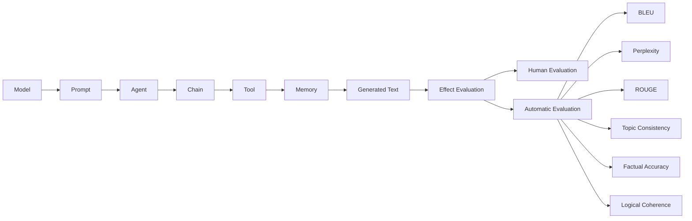

# 【LangChain编程：从入门到实践】模型效果评估

## 1.背景介绍
### 1.1 LangChain的兴起
近年来，随着人工智能技术的飞速发展，自然语言处理(NLP)领域取得了长足进步。而在NLP领域中，大语言模型(LLM)无疑是最耀眼的明星。LLM通过海量语料的预训练，具备了强大的语言理解和生成能力，为NLP应用开启了新的篇章。

而在LLM的应用开发中，LangChain作为一个灵活的框架脱颖而出。LangChain致力于简化LLM应用开发流程，让开发者能够专注于应用逻辑本身，而不必过多关注底层模型细节。它提供了丰富的接口和组件，可以帮助开发者快速构建问答系统、文本摘要、对话机器人等多种NLP应用。

### 1.2 模型效果评估的重要性
LLM在赋能NLP应用的同时，也给模型效果评估带来了新的挑战。传统的评估指标如准确率、F1值等，已经无法全面衡量LLM生成文本的质量。我们需要从多个维度，综合考察模型生成内容的连贯性、信息量、可读性等特征。

只有建立科学的评估体系，LangChain应用才能不断迭代优化，为用户提供更好的体验。客观公正的效果评估，也是推动LangChain社区良性发展的重要保障。

## 2.核心概念与联系
### 2.1 LangChain的核心概念
- Model：语言模型，LangChain的核心组件，负责自然语言的理解和生成。
- Prompt：输入提示，引导模型进行特定任务的文本。
- Agent：智能代理，根据Prompt进行任务规划和执行。
- Chain：任务链，由多个组件顺序组合，完成复杂任务。
- Tool：工具，供Agent调用以获取所需信息或能力。
- Memory：记忆，存储对话历史，供模型参考以保持上下文连贯。

### 2.2 效果评估的核心概念 
- 人工评估：专家根据经验主观判断生成文本的质量。
- 自动评估：通过算法客观度量生成文本的各项指标。
- 参考答案：人工撰写的高质量文本，作为评估的金标准。
- BLEU：机器翻译常用指标，度量生成文本与参考答案的n-gram重合度。
- Perplexity：语言模型常用指标，度量生成文本的流畅性和可读性。
- ROUGE：文本摘要常用指标，度量生成摘要与参考摘要的重合度。
- 主题一致性：生成文本的主题是否与输入提示一致。
- 事实准确性：生成文本的事实性陈述是否准确无误。
- 逻辑自洽性：生成文本在逻辑上是否自洽，没有矛盾冲突。

### 2.3 LangChain与效果评估的联系

如上图所示，LangChain的各个组件协同工作，生成目标文本。而生成文本的质量好坏，则需要通过人工或自动的效果评估来度量。评估结果反过来又可以指导LangChain的优化改进。可以说，LangChain与效果评估是相辅相成、密不可分的。

## 3.核心算法原理具体操作步骤
本节我们以BLEU和ROUGE为例，详细讲解自动评估的核心算法原理和操作步骤。

### 3.1 BLEU算法原理
BLEU（Bilingual Evaluation Understudy）是一种用于评估机器翻译质量的指标，但也可用于评估文本生成任务。它的基本思想是：生成文本与参考答案的n-gram重合度越高，质量就越好。

具体来说，BLEU首先统计生成文本中各阶n-gram（通常取n=1,2,3,4）的精确率，即生成文本中的n-gram有多少出现在参考答案中。然后取各阶n-gram精确率的加权几何平均，再乘以一个惩罚因子BP（Brevity Penalty），得到最终的BLEU分数。

BP的作用是惩罚过短的生成文本。如果生成文本长度为c，参考答案长度为r，则：

$$
BP=
\begin{cases}
1 & \text{if }c>r \\
e^{(1-r/c)} & \text{if }c\leq r
\end{cases}
$$

最终的BLEU分数为：

$$
\text{BLEU}=\text{BP}\cdot \exp\left(\sum_{n=1}^N w_n \log p_n\right)
$$

其中，$N$为考虑的最高n-gram阶数（通常取4），$w_n$为各阶n-gram的权重（通常取$1/N$），$p_n$为n-gram的精确率。

### 3.2 BLEU算法操作步骤
1. 对生成文本和参考答案进行预处理（分词、小写化等）。
2. 统计生成文本各阶n-gram的计数。
3. 统计生成文本各阶n-gram在参考答案中的计数，取最小值。
4. 计算各阶n-gram的精确率$p_n$。
5. 计算生成文本长度c和参考答案长度r，得到BP。
6. 计算加权几何平均，乘以BP，得到BLEU分数。

Python代码实现如下：

```python
import numpy as np
from collections import Counter

def bleu(candidate, references, n=4):
    candidate = candidate.split()
    references = [ref.split() for ref in references]
    
    p_n = []
    for i in range(1, n+1):
        candidate_ngrams = Counter(ngrams(candidate, i))
        references_ngrams = Counter(ngrams(references[0], i))
        for ref in references[1:]:
            references_ngrams |= Counter(ngrams(ref, i))
        
        overlap = sum(min(count, references_ngrams[ngram]) for ngram, count in candidate_ngrams.items())
        total = sum(candidate_ngrams.values())
        p_i = overlap / total
        p_n.append(p_i)
        
    p_n = np.array(p_n)
    p_n = np.where(p_n > 0, p_n, 1e-8)  # 避免log(0)
    
    c = len(candidate)
    r = np.mean([len(ref) for ref in references])
    bp = 1 if c > r else np.exp(1 - r/c)
    
    return bp * np.exp(np.mean(np.log(p_n)))

def ngrams(sequence, n):
    return (tuple(sequence[i:i+n]) for i in range(len(sequence)-n+1))
```

### 3.3 ROUGE算法原理
ROUGE（Recall-Oriented Understudy for Gisting Evaluation）是一种用于评估文本摘要质量的指标，但也可用于评估文本生成任务。与BLEU关注精确率不同，ROUGE关注召回率，即参考答案中的n-gram有多少被生成文本覆盖到。

ROUGE有多个变体，常用的有：

- ROUGE-N：统计生成文本和参考答案之间n-gram的重叠，通常取n=1,2。
- ROUGE-L：统计生成文本和参考答案之间最长公共子序列（LCS）的长度。
- ROUGE-S：统计生成文本和参考答案之间跳跃bigram的重叠。

以ROUGE-N为例，其计算公式为：

$$
\text{ROUGE-N}=\frac{\sum_{S\in\{RefSummaries\}}\sum_{\text{gram}_n\in S}\text{Count}_{\text{match}}(\text{gram}_n)}{\sum_{S\in\{RefSummaries\}}\sum_{\text{gram}_n\in S}\text{Count}(\text{gram}_n)}
$$

其中，$\text{Count}_{\text{match}}(\text{gram}_n)$表示生成摘要中n-gram被参考摘要覆盖的次数，$\text{Count}(\text{gram}_n)$表示参考摘要中n-gram的总次数。

### 3.4 ROUGE算法操作步骤
以ROUGE-1和ROUGE-2为例：

1. 对生成摘要和参考摘要进行预处理（分词、小写化等）。
2. 统计参考摘要中unigram和bigram的计数。
3. 统计生成摘要中unigram和bigram被参考摘要覆盖的计数。
4. 分别计算ROUGE-1和ROUGE-2得分。

Python代码实现如下：

```python
from collections import Counter

def rouge_n(candidate, references, n=2):
    candidate = candidate.split()
    references = [ref.split() for ref in references]
    
    scores = []
    for ref in references:
        ref_ngrams = Counter(ngrams(ref, n))
        candidate_ngrams = Counter(ngrams(candidate, n))
        
        overlap = sum(min(count, ref_ngrams[ngram]) for ngram, count in candidate_ngrams.items())
        total = sum(ref_ngrams.values())
        
        if overlap == 0:
            scores.append(0)
        else:
            scores.append(overlap / total)
        
    return max(scores)

def ngrams(sequence, n):
    return (tuple(sequence[i:i+n]) for i in range(len(sequence)-n+1))
```

## 4.数学模型和公式详细讲解举例说明
本节我们通过一个实际的例子，来详细讲解BLEU和ROUGE的数学模型和计算过程。

假设我们有以下生成摘要和参考摘要：

- 生成摘要：The cat sat on the mat.
- 参考摘要1：The cat is sitting on the mat.
- 参考摘要2：There is a cat on the mat.

### 4.1 BLEU计算过程
1. 预处理后得到：
   - 生成摘要：the cat sat on the mat
   - 参考摘要1：the cat is sitting on the mat
   - 参考摘要2：there is a cat on the mat

2. 统计生成摘要各阶n-gram的计数：
   - unigram：{the: 2, cat: 1, sat: 1, on: 1, mat: 1}
   - bigram：{the cat: 1, cat sat: 1, sat on: 1, on the: 1, the mat: 1}
   - trigram：{the cat sat: 1, cat sat on: 1, sat on the: 1, on the mat: 1}
   - 4-gram：{the cat sat on: 1, cat sat on the: 1, sat on the mat: 1}

3. 统计生成摘要各阶n-gram在参考摘要中的计数，取最小值：
   - unigram：{the: 2, cat: 1, sat: 0, on: 1, mat: 1}
   - bigram：{the cat: 1, cat sat: 0, sat on: 0, on the: 1, the mat: 1}
   - trigram：{the cat sat: 0, cat sat on: 0, sat on the: 0, on the mat: 1}
   - 4-gram：{the cat sat on: 0, cat sat on the: 0, sat on the mat: 0}

4. 计算各阶n-gram的精确率：
   - p1 = (2+1+0+1+1) / (2+1+1+1+1) = 0.833
   - p2 = (1+0+0+1+1) / (1+1+1+1+1) = 0.600
   - p3 = (0+0+0+1) / (1+1+1+1) = 0.250
   - p4 = (0+0+0) / (1+1+1) = 0.000

5. 计算BP：
   - c = 6, r = (7+6)/2 = 6.5
   - BP = exp(1-6.5/6) = 0.920

6. 计算BLEU得分：
   - BLEU = 0.920 * exp((0.833+0.600+0.250+0.000)/4) = 0.495

### 4.2 ROUGE计算过程
1. 预处理同上。

2. 统计参考摘要中unigram和bigram的计数：
   - 参考摘要1：
     - unigram: {the: 2, cat: 1, is: 1, sitting: 1, on: 1, mat: 1}
     - bigram: {the cat: 1, cat is: 1, is sitting: 1, sitting on: 1, on the: 1, the mat: 1}
   - 参考摘要2：
     - unigram: {there: 1, is: 1, a: 1, cat: 1, on: 1, the: 1, mat: 1}
     - bigram: {there is: 1, is a: 1, a cat: 1, cat on: 1, on the: 1, the mat: 1}

3. 统计生成摘要中unigram和bigram被参考摘要覆盖的计数：
   - 参考摘