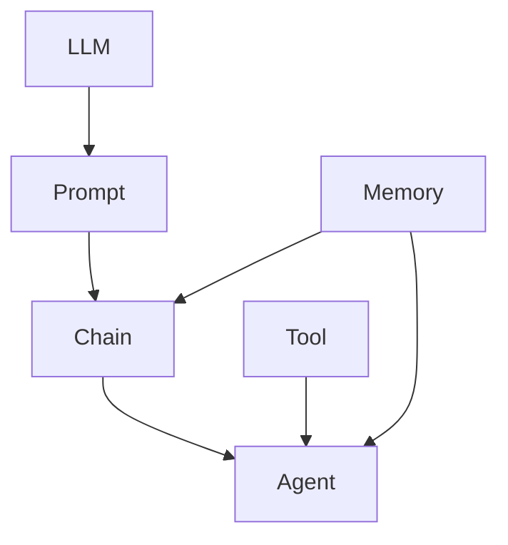

# 【LangChain编程：从入门到实践】社区贡献

## 1. 背景介绍
### 1.1 LangChain的兴起
近年来,随着人工智能技术的飞速发展,大语言模型(Large Language Models, LLMs)在自然语言处理领域取得了突破性进展。而如何更好地利用和应用大语言模型,成为了业界关注的热点。LangChain应运而生,它是一个专门为应用大语言模型而设计的编程框架,旨在降低开发难度,提高开发效率,使得开发者能够更加轻松地构建基于LLM的应用程序。

### 1.2 LangChain的特点
LangChain有以下几个主要特点:

1. 提供了一套统一的接口和抽象,屏蔽了不同LLM之间的差异,使得开发者可以专注于应用逻辑的开发。
2. 内置了丰富的即用模块和工具,如提示模板(PromptTemplate)、记忆(Memory)、索引(Indexes)等,大大简化了应用开发流程。  
3. 支持灵活的组合与扩展,可以方便地将不同模块组合成复杂的应用,并且可以轻松添加自定义组件。
4. 拥有活跃的社区和完善的文档,开发者可以获得广泛的支持和帮助。

### 1.3 LangChain的应用场景
LangChain可以应用于多种场景,包括但不限于:

- 智能客服/聊天机器人
- 知识库问答
- 文本摘要生成
- 数据分析与报告生成
- 代码智能辅助

总之,LangChain为利用LLM进行应用开发提供了一套完整的解决方案,使得更多开发者能够参与到这一领域中来。

## 2. 核心概念与联系
要理解LangChain的工作原理,需要了解其几个核心概念:

### 2.1 LLM
LLM(Large Language Model)是指经过海量语料训练的大规模语言模型,如GPT系列、BERT等。它们能够理解和生成接近人类水平的自然语言。LangChain通过封装不同LLM的接口,使得我们可以方便地调用它们的能力。

### 2.2 Prompt
Prompt是指我们提供给LLM的输入文本,它包含了任务指令和上下文信息。通过精心设计Prompt,我们可以引导LLM生成我们期望的结果。LangChain提供了PromptTemplate等工具来帮助我们更好地管理和优化Prompt。

### 2.3 Chain
Chain是指将多个组件按特定逻辑连接形成的任务流程。例如一个Chain可以依次执行文档加载、Prompt生成、LLM推理等步骤,最终输出我们需要的结果。LangChain提供了丰富的Chain实现,也允许我们灵活组合和自定义Chain。

### 2.4 Agent
Agent是一种特殊的Chain,它可以根据Prompt动态决定执行哪些行动(Action),例如数据库查询、API调用、工具使用等,然后将结果继续输入LLM推理,直到完成整个任务。Agent赋予了LangChain更强的自主性和执行力。

### 2.5 Memory
Memory模块用于在会话过程中存储和管理上下文信息,使得LLM能够根据之前的对话内容来生成更加合理的响应。LangChain提供了多种Memory实现,可以满足不同的需求。

### 2.6 Tool
Tool是指为LLM提供其他能力的外部工具或接口,例如搜索引擎、计算器、数据库等。通过将Tool集成到Chain或Agent中,我们可以构建更加强大的应用。

下面是这些核心概念之间关系的示意图:



从图中可以看出,LLM通过Prompt连接到Chain,进而可以扩展到Agent;Tool为Agent提供额外能力;Memory贯穿Chain和Agent的执行过程。

理解了这些核心概念,我们就可以更好地应用LangChain进行开发了。

## 3. 核心算法原理与具体操作步骤
LangChain的核心是将LLM与其他组件进行连接与组合,形成完整的任务流程。这里我们以一个常见的场景:利用LLM生成文本摘要为例,来说明其中的主要步骤和算法原理。

### 3.1 加载文档
首先我们需要将待摘要的文本加载进来,LangChain提供了多种数据加载器(DataLoader),支持从文件、网页、数据库等来源读取文本。

```python
from langchain.document_loaders import TextLoader
loader = TextLoader('input.txt')
```

### 3.2 文本分割
由于LLM对单次输入文本的长度有限制(如2048个token),因此我们需要将长文档分割成多个片段。LangChain提供了TextSplitter工具:

```python
from langchain.text_splitter import CharacterTextSplitter
text_splitter = CharacterTextSplitter(chunk_size=1000, chunk_overlap=0)
texts = text_splitter.split_documents(loader.load())
```

### 3.3 Embedding生成
为了能够对文本片段进行语义检索,我们需要将它们转换为向量表示,这个过程称为Embedding。LangChain封装了OpenAI和Hugging Face等Embedding服务。

```python
from langchain.embeddings import OpenAIEmbeddings
embeddings = OpenAIEmbeddings()
```

### 3.4 向量存储
将Embedding结果存储起来,方便后续根据相似度进行检索。LangChain支持多种向量存储,如FAISS、Chroma等。

```python
from langchain.vectorstores import Chroma
docsearch = Chroma.from_documents(texts, embeddings)
```

### 3.5 相似度检索
根据用户输入的查询(Query),从向量存储中检索出最相关的文本片段。

```python
query = "What's the key point of this article?"
docs = docsearch.similarity_search(query)
```

### 3.6 生成Prompt
将查询和检索结果组合成Prompt,传递给LLM生成摘要。Prompt内容一般包括任务指令、相关上下文、期望格式等。

```python
from langchain.prompts import PromptTemplate

template = """
Based on the following context, please generate a concise summary to answer the question.

Context:
{context}

Question: {question}

Summary:
"""

prompt = PromptTemplate(template=template, input_variables=["context", "question"])

context = "\n".join([doc.page_content for doc in docs])
final_prompt = prompt.format(context=context, question=query)
```

### 3.7 调用LLM生成结果
将Prompt传给LLM,得到生成的摘要结果。

```python
from langchain.llms import OpenAI
llm = OpenAI(temperature=0.7)
result = llm(final_prompt)
print(result)
```

以上就是利用LangChain生成文本摘要的主要步骤,通过组合数据加载、文本分割、Embedding、向量存储、检索、Prompt生成等组件,我们构建了一个完整的摘要生成流程。

当然,LangChain还提供了更高层的Chain和Agent组件,可以更方便地实现复杂的应用逻辑。但理解底层原理,可以帮助我们更好地应对定制化需求。

## 4. 数学模型和公式详细讲解举例说明
在LangChain中,涉及到的主要数学模型是向量空间模型和相似度计算。

### 4.1 向量空间模型
向量空间模型(Vector Space Model)是一种将文本表示为向量的方法。通过Embedding技术,可以将每个文本片段映射到一个高维向量空间中的一个点,从而将文本的语义信息编码到向量中。

假设我们有一组文本片段$\{d_1,d_2,...,d_n\}$,通过Embedding得到它们的向量表示$\{v_1,v_2,...,v_n\}$,其中每个向量$v_i$都是一个$m$维的实数向量:

$$v_i = (w_{i1}, w_{i2}, ..., w_{im})$$

其中$w_{ij}$表示文本片段$d_i$在第$j$个语义维度上的权重。

### 4.2 余弦相似度
在向量空间中,我们常用余弦相似度(Cosine Similarity)来衡量两个向量之间的相似程度。余弦相似度计算两个向量夹角的余弦值,取值范围为$[-1,1]$,值越大表示越相似。

给定两个$m$维向量$v_i$和$v_j$,它们的余弦相似度定义为:

$$\cos(v_i,v_j) = \frac{v_i \cdot v_j}{||v_i|| \times ||v_j||}$$

其中$v_i \cdot v_j$表示向量点积:

$$v_i \cdot v_j = \sum_{k=1}^m w_{ik} w_{jk}$$

$||v_i||$表示向量的$L_2$范数:

$$||v_i|| = \sqrt{\sum_{k=1}^m w_{ik}^2}$$

### 4.3 举例说明
假设我们有三个文本片段,通过Embedding得到它们的向量表示:

$$v_1 = (0.2, 0.5, 0.3)$$
$$v_2 = (0.1, 0.4, 0.7)$$
$$v_3 = (0.3, 0.5, 0.2)$$

现在我们要计算$v_1$和$v_2$、$v_1$和$v_3$的余弦相似度。

对于$v_1$和$v_2$:

$$v_1 \cdot v_2 = 0.2 \times 0.1 + 0.5 \times 0.4 + 0.3 \times 0.7 = 0.43$$
$$||v_1|| = \sqrt{0.2^2 + 0.5^2 + 0.3^2} = 0.616$$
$$||v_2|| = \sqrt{0.1^2 + 0.4^2 + 0.7^2} = 0.806$$
$$\cos(v_1,v_2) = \frac{0.43}{0.616 \times 0.806} = 0.865$$

对于$v_1$和$v_3$:

$$v_1 \cdot v_3 = 0.2 \times 0.3 + 0.5 \times 0.5 + 0.3 \times 0.2 = 0.37$$
$$||v_3|| = \sqrt{0.3^2 + 0.5^2 + 0.2^2} = 0.616$$
$$\cos(v_1,v_3) = \frac{0.37}{0.616 \times 0.616} = 0.974$$

可以看出,$v_1$和$v_3$的余弦相似度更高,说明它们在语义上更接近。

在LangChain中,我们利用向量空间模型将文本片段表示为向量,然后通过余弦相似度来进行相关性检索,找出与查询最相似的片段,作为生成摘要的上下文。这种方法能够有效捕捉文本的语义信息,提高摘要的质量。

## 5. 项目实践：代码实例和详细解释说明
下面我们通过一个完整的代码示例,来演示如何使用LangChain实现一个简单的文本摘要生成应用。

```python
from langchain.document_loaders import TextLoader
from langchain.text_splitter import CharacterTextSplitter
from langchain.embeddings import OpenAIEmbeddings
from langchain.vectorstores import Chroma
from langchain.prompts import PromptTemplate
from langchain.llms import OpenAI
from langchain.chains import RetrievalQA

# 加载文本
loader = TextLoader("input.txt")
documents = loader.load()

# 文本分割
text_splitter = CharacterTextSplitter(chunk_size=1000, chunk_overlap=0)
texts = text_splitter.split_documents(documents)

# Embedding
embeddings = OpenAIEmbeddings()

# 向量存储
docsearch = Chroma.from_documents(texts, embeddings)

# Prompt模板
template = """
Based on the following context, please generate a concise summary to answer the question.

Context:
{context}

Question: {question}

Summary:
"""
prompt = PromptTemplate(template=template, input_variables=["context", "question"])

# LLM
llm = OpenAI(temperature=0.7)

# 检索QA链
qa = RetrievalQA.from_chain_type(
    llm=llm,
    chain_type="stuff",
    retriever=docsearch.as_retriever(),
    return_source_documents=True,
    chain_type_kwargs={"prompt": prompt},
)

# 生成摘要
query = "What's the key point of this article?"
result = qa({"query": query})

print(result["result"])
print(result["source_documents"])
```

代码解释:

1. 首先,我们使用`TextLoader`从文件中加载文本,得到一个`Document`列表。

2. 然后,使用`CharacterTextSplitter`将长文档分割成多个片段