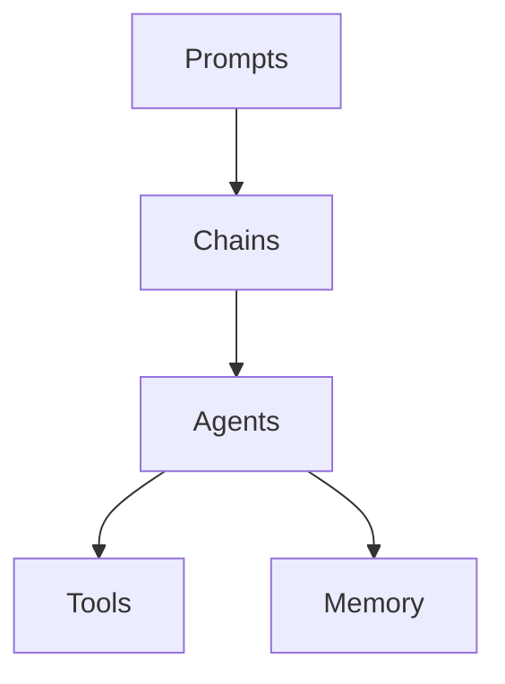

# 【LangChain编程：从入门到实践】管理工具安装

## 1.背景介绍
### 1.1 LangChain概述
LangChain是一个用于开发由语言模型驱动的应用程序的开源框架。它可以帮助开发人员将语言模型与外部数据源和计算工具相结合,从而创建更强大、更智能的应用程序。LangChain提供了一组模块化组件,可以灵活组合以支持广泛的用例。

### 1.2 LangChain的优势
- 模块化设计:LangChain采用模块化设计,各个组件可以灵活组合,满足不同的需求。
- 多语言模型支持:支持多种主流的语言模型,如OpenAI GPT、Google PaLM等。  
- 丰富的数据连接器:内置了与各种数据源(如文件、数据库、API等)的连接器,方便数据集成。
- 强大的计算能力:通过与外部计算工具的集成,可以增强语言模型的计算能力。
- 活跃的社区支持:LangChain拥有活跃的开发者社区,持续贡献新功能和改进。

### 1.3 应用场景
LangChain可用于构建各种由语言模型驱动的应用,例如:
- 智能对话系统
- 知识库问答
- 数据分析与总结
- 文本生成与改写
- 代码生成与分析

## 2.核心概念与联系
### 2.1 Prompts(提示)
Prompt是指输入给语言模型的文本序列,用于指导模型生成所需的输出。设计优质的Prompt对于获得高质量的输出至关重要。LangChain提供了一系列工具来管理和优化Prompts。

### 2.2 Chains(链)
Chain将多个组件(如模型、Prompts、解析器等)组合在一起,形成一个完整的处理流程。通过组合不同的组件,可以构建出适合特定任务的Chain。LangChain提供了丰富的Chain模板,同时也支持自定义Chain。

### 2.3 Agents(代理)
Agent是一种特殊的Chain,它可以基于用户的输入,自主决定执行哪些操作,并动态调用相关的工具来完成任务。这使得Agent具备一定的自主性和决策能力。LangChain提供了多种Agent的实现。

### 2.4 Tools(工具)
Tool是指可以被Agent调用的外部工具或系统,例如搜索引擎、计算器、数据库等。通过与这些工具的交互,Agent可以获取额外的信息和计算能力,从而完成更复杂的任务。

### 2.5 Memory(记忆)
Memory组件用于在多轮对话中存储和访问上下文信息。它可以帮助语言模型根据先前的对话内容生成更连贯、更相关的响应。LangChain提供了多种Memory实现,如Buffer Memory、Entity Memory等。

下面是这些核心概念之间的关系图:



## 3.核心算法原理具体操作步骤
### 3.1 Prompt模板构建
1. 定义模板参数
2. 编写模板字符串,使用占位符表示参数
3. 创建PromptTemplate对象,传入模板字符串和参数
4. 调用PromptTemplate的format方法,传入实际参数值,生成最终的Prompt

### 3.2 Chain的构建与执行
1. 选择合适的Chain类型,如LLMChain、SequentialChain等
2. 初始化Chain所需的组件,如语言模型、Prompt等
3. 创建Chain对象,传入初始化的组件
4. 调用Chain的run或apply方法,传入输入,获取输出结果

### 3.3 Agent的构建与执行
1. 定义Agent可用的工具(Tool),指定名称、描述和调用函数
2. 选择合适的Agent类型,如ZeroShotAgent、ReActAgent等
3. 初始化Agent所需的组件,如语言模型、工具等
4. 创建Agent对象,传入初始化的组件
5. 调用Agent的run方法,传入用户输入,获取Agent的执行结果

### 3.4 Memory的使用
1. 选择合适的Memory类型,如ConversationBufferMemory、ConversationEntityMemory等
2. 创建Memory对象,配置相关参数
3. 将Memory对象传递给Chain或Agent
4. 在Chain或Agent的执行过程中,通过Memory对象存储和访问对话上下文

## 4.数学模型和公式详细讲解举例说明
### 4.1 语言模型的数学原理
语言模型的目标是估计一个句子或文本序列的概率分布。给定一个文本序列 $x=(x_1,\ldots,x_n)$,语言模型试图估计条件概率 $P(x_t|x_1,\ldots,x_{t-1})$,即在给定前 $t-1$ 个词的情况下,第 $t$ 个词出现的概率。

一个常用的语言模型是基于Transformer架构的GPT(Generative Pre-trained Transformer)模型。GPT使用自注意力机制和前馈神经网络来学习文本序列的表示。

对于一个长度为 $n$ 的文本序列 $x$,GPT模型的前向传播过程可以表示为:

$$
\begin{aligned}
h_0 &= E(x) \\
h_l &= \text{Transformer}(h_{l-1}), \quad l=1,\ldots,L \\
P(x) &= \text{Softmax}(W_o h_L + b_o)
\end{aligned}
$$

其中,$E$是词嵌入矩阵,$\text{Transformer}$表示Transformer的一个编码器层,$L$是编码器层的数量,$W_o$和$b_o$是输出层的权重和偏置。

在训练过程中,GPT模型通过最小化负对数似然损失函数来学习模型参数:

$$
\mathcal{L}(\theta) = -\sum_{i=1}^{n} \log P(x_i|x_1,\ldots,x_{i-1};\theta)
$$

其中,$\theta$表示模型的所有参数。

### 4.2 示例:使用GPT模型生成文本
假设我们有一个预训练的GPT模型,我们可以使用它来生成文本。给定一个初始的文本序列作为Prompt,我们可以让模型基于这个Prompt生成后续的文本。

1. 将Prompt编码为模型的输入表示:$x=(x_1,\ldots,x_m)$
2. 通过GPT模型计算Prompt的输出表示:$h_L=\text{GPT}(x)$
3. 使用输出表示计算下一个词的概率分布:$P(x_{m+1}|x_1,\ldots,x_m)=\text{Softmax}(W_o h_L + b_o)$
4. 根据概率分布采样或选择最可能的词作为生成的下一个词:$\hat{x}_{m+1}=\arg\max_{x} P(x|x_1,\ldots,x_m)$
5. 将生成的词添加到Prompt中,重复步骤2-4,直到达到所需的文本长度或遇到停止条件。

通过这个过程,我们可以使用GPT模型根据给定的Prompt生成连贯且相关的文本。

## 5.项目实践：代码实例和详细解释说明
下面是一个使用LangChain构建简单问答系统的示例代码:

```python
from langchain.llms import OpenAI
from langchain.prompts import PromptTemplate
from langchain.chains import LLMChain

# 设置OpenAI API密钥
openai_api_key = "YOUR_API_KEY"

# 创建OpenAI语言模型实例
llm = OpenAI(openai_api_key=openai_api_key)

# 定义Prompt模板
template = """
请根据以下背景信息回答问题:

{background}

问题: {question}
"""

# 创建PromptTemplate对象
prompt = PromptTemplate(
    input_variables=["background", "question"],
    template=template,
)

# 创建LLMChain对象
chain = LLMChain(llm=llm, prompt=prompt)

# 设置背景信息和问题
background = "Python是一种广泛使用的高级编程语言,它强调代码可读性,语法简洁。Python支持多种编程范式,包括结构化、面向对象和函数式编程。它拥有庞大而全面的标准库,使得Python适用于各种应用场景。"
question = "Python有哪些主要特点?"

# 运行Chain,获取答案
answer = chain.run(background=background, question=question)

print(answer)
```

代码解释:

1. 首先,我们导入所需的LangChain组件,包括OpenAI语言模型、PromptTemplate和LLMChain。

2. 我们设置OpenAI API密钥,并创建一个OpenAI语言模型实例。

3. 然后,我们定义一个Prompt模板,其中包含两个输入变量:background和question。模板描述了如何将背景信息和问题组合成完整的Prompt。

4. 接下来,我们创建一个PromptTemplate对象,传入输入变量和模板字符串。

5. 我们创建一个LLMChain对象,将语言模型和Prompt模板作为参数传递。

6. 我们设置具体的背景信息和问题,然后调用Chain的run方法,传入背景信息和问题作为参数。

7. 最后,我们打印出Chain返回的答案。

通过这个示例,我们展示了如何使用LangChain的组件(如PromptTemplate和LLMChain)来构建一个简单的问答系统。我们可以根据需要修改Prompt模板、背景信息和问题,以获取不同的答案。

## 6.实际应用场景
LangChain可以应用于各种实际场景,下面是几个具体的例子:

### 6.1 智能客服系统
利用LangChain构建一个智能客服系统,根据客户的问题自动生成相关的回答。这可以通过以下步骤实现:
1. 准备一个包含常见问题和答案的知识库。
2. 使用LangChain的文档加载器和文本分割器将知识库转换为可供语言模型处理的格式。
3. 创建一个自定义的Prompt模板,将客户的问题与知识库中的相关信息结合起来。
4. 使用LangChain的语言模型和Chain组件,根据Prompt生成回答。
5. 将生成的回答返回给客户。

### 6.2 文本摘要生成
利用LangChain自动生成文本摘要,帮助用户快速了解文章的主要内容。这可以通过以下步骤实现:
1. 使用LangChain的文档加载器读取目标文章。
2. 创建一个自定义的Prompt模板,指示语言模型生成文章的摘要。
3. 使用LangChain的语言模型和Chain组件,根据Prompt生成摘要。
4. 将生成的摘要返回给用户。

### 6.3 代码生成与分析
利用LangChain生成和分析代码,帮助开发人员提高效率。这可以通过以下步骤实现:
1. 准备一个包含常见编程任务和对应代码的知识库。
2. 使用LangChain的文档加载器和文本分割器将知识库转换为可供语言模型处理的格式。
3. 创建一个自定义的Prompt模板,将用户的编程需求与知识库中的相关信息结合起来。
4. 使用LangChain的语言模型和Chain组件,根据Prompt生成代码。
5. 对生成的代码进行分析和优化,提供改进建议。
6. 将生成的代码和分析结果返回给用户。

## 7.工具和资源推荐
以下是一些有助于学习和使用LangChain的工具和资源:

1. LangChain官方文档:https://docs.langchain.com/
   - 官方文档提供了全面的API参考、教程和示例,是学习LangChain的最佳起点。

2. LangChain GitHub仓库:https://github.com/hwchase17/langchain
   - GitHub仓库包含LangChain的源代码、示例项目和贡献指南,可以帮助你更深入地了解LangChain的实现细节。

3. LangChain社区论坛:https://community.langchain.com/
   - 社区论坛是与其他LangChain用户交流、提问和分享经验的好地方。

4. LangChain博客:https://blog.langchain.dev/
   - 官方博客提供了有关LangChain的最新消息、教程和案例研究。

5. OpenAI API文档:https://beta.openai.com/docs/
   - 由于LangChain经常与OpenAI的语言模型一起使用,因此熟悉OpenAI API也很有帮助。

6.