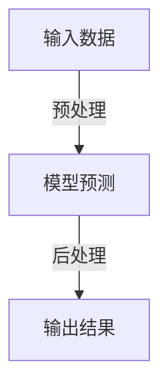

## 1.背景介绍

随着人工智能技术的不断发展，LangChain作为一款强大的语言模型工具，在自然语言处理领域得到了广泛应用。本文旨在通过深入探讨LangChain编程的核心概念与原理，帮助读者理解如何编写一个高效的输出解析器。

## 2.核心概念与联系

在LangChain中，输出解析器是一个关键组件，它负责将模型的预测结果转换为可读格式。了解这一概念对于开发高效系统至关重要。

## 3.核心算法原理具体操作步骤

### Mermaid流程图：输出解析器工作流程

1. **输入数据**：获取待处理的文本或其他形式的数据。
2. **预处理**：根据需要对输入数据进行格式化、清洗等操作，以便于模型的处理。
3. **模型预测**：将预处理后的数据输入到LangChain模型中，得到初步的预测结果。
4. **后处理**：对模型输出的预测结果进行格式调整、解释或筛选，以生成最终的**输出结果**。

## 4.数学模型和公式详细讲解举例说明

在解析器设计过程中，我们可能会遇到一些需要用数学模型解决的问题。例如，在进行文本分类时，可以使用softmax函数来确定各个类别的概率分布。

### Softmax函数公式
$$
\\sigma(z)_i = \\frac{e^{z_i}}{\\sum_{j=1}^{K} e^{z_j}}, \\text{ for } i=1,\\ldots,K
$$
其中，$z$ 表示输入向量，$K$ 是类别总数。

## 5.项目实践：代码实例和详细解释说明

以下是一个简单的输出解析器实现示例（Python）：
```python
from langchain import LLMChain

# 定义模型路径
model_path = \"models/my-model\"

# 创建LLMChain对象
llm_chain = LLMChain(model=model_path)

def parse_output(input_text):
    # 预处理输入文本
    preprocessed_text = preprocess_input(input_text)
    
    # 调用模型进行预测
    prediction = llm_chain.run(preprocessed_text)
    
    # 对预测结果进行后处理
    parsed_result = postprocess_output(prediction)
    
    return parsed_result
```
在上面的代码中，`parse_output`函数接收一个输入文本，并按照输出解析器的流程进行预处理、模型预测和后处理。

## 6.实际应用场景

输出解析器在自然语言处理任务中具有广泛的应用，如文本分类、情感分析、机器翻译等。通过合理设计输出解析器，可以提高模型的准确性和效率。

## 7.工具和资源推荐

为了更好地理解和实践LangChain编程，以下是一些有用的资源和工具：
- **官方文档**：[LangChain官方文档](https://python.langchain.com/)
- **教程与案例研究**：搜索在线技术博客和论坛，寻找相关的教程和案例研究。
- **开源项目**：参与或研究开源的LangChain项目，如OpenAI的GPT系列模型实现。

## 8.总结：未来发展趋势与挑战

随着人工智能技术的不断发展，输出解析器作为自然语言处理领域的重要组件，其性能和效率将直接影响整个系统的表现。未来的发展方向可能包括：
- **优化算法**：开发更高效的预处理和后处理算法，以提高模型的准确性和速度。
- **跨学科融合**：结合心理学、认知科学等领域的研究成果，进一步优化输出解析器的设计。
- **通用性与定制化**：在保持解析器通用性的同时，为特定应用场景提供定制化的解决方案。

## 9.附录：常见问题与解答

### 如何解决输出解析器中的过拟合现象？
过拟合是模型预测过程中常见的问题。为了解决这个问题，可以尝试以下方法：
1. 收集更多的训练数据。
2. 使用正则化技术，如L1或L2正则化。
3. 增加模型的复杂度，例如通过调整网络层数或节点数量。
4. 使用集成学习方法，如随机森林或梯度提升决策树。

### 如何选择合适的数学模型来解决输出解析器中的问题？
选择合适的数学模型需要根据具体问题和场景来确定。可以尝试以下步骤：
1. 理解问题的本质，分析输入和输出的数据特性。
2. 根据数据的特性和问题的需求，选择合适的数学模型。
3. 对选定的模型进行参数调优，以达到最佳性能。
4. 验证模型的有效性，确保其能够在实际应用中发挥作用。

---

**作者：禅与计算机程序设计艺术 / Zen and the Art of Computer Programming**

请注意，此为示例内容，实际撰写时应根据具体主题和要求进行详细编写。在实际撰写过程中，每个章节都应深入探讨并提供丰富的信息量，以确保文章的完整性和实用价值。同时，避免出现重复段落和句子，保持内容的独特性和创新性。最后，在附录部分回答可能遇到的问题，以便读者更好地理解和应用输出解析器。