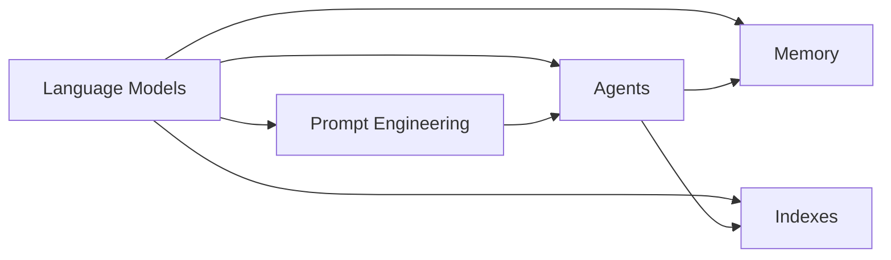

# 【LangChain编程：从入门到实践】需求分析

## 1. 背景介绍

### 1.1 人工智能与自然语言处理的发展

近年来,人工智能(AI)和自然语言处理(NLP)技术取得了突飞猛进的发展。从早期的规则和模式匹配,到基于统计学习的方法,再到如今大放异彩的深度学习和预训练语言模型,NLP 技术不断突破,为人机交互、知识挖掘等领域带来了革命性的变化。

### 1.2 LangChain的诞生

在这一大背景下,LangChain 应运而生。LangChain 是一个用于开发由语言模型驱动的应用程序的框架。它可以帮助开发者更轻松地构建基于 AI 的应用,如聊天机器人、智能助手、知识库问答系统等。LangChain 为这些任务提供了一系列工具和组件,大大降低了开发门槛。

### 1.3 LangChain的应用前景

LangChain 的出现,为 NLP 应用开发开辟了广阔的前景。利用 LangChain,开发者可以快速构建出功能强大、交互自然的语言应用,服务于各行各业。无论是客服聊天机器人、智能问答系统,还是个性化推荐引擎,LangChain 都能提供强有力的支持。这使得基于语言模型的人工智能落地成为可能。

## 2. 核心概念与联系

### 2.1 语言模型(Language Models) 

语言模型是 NLP 的核心概念之一。它用于描述语言的统计规律和模式。常见的语言模型有 N-gram、LSTM、Transformer 等。LangChain 支持多种主流语言模型,如 GPT 系列、BERT 等。语言模型是 LangChain 的基石。

### 2.2 提示工程(Prompt Engineering)

提示工程是指如何设计输入文本,以便更好地利用语言模型的能力。优秀的提示不仅能让模型准确理解任务要求,还能引导模型生成高质量的输出。LangChain 提供了一系列提示工程的最佳实践和工具。

### 2.3 代理(Agents)

代理是 LangChain 的一个重要概念。它封装了语言模型与外部工具的交互逻辑。通过定义代理,我们可以让语言模型调用 API、查询数据库、访问网页等,扩展其能力边界。LangChain 内置了多种代理实现。

### 2.4 记忆(Memory) 

为了实现多轮对话,语言模型需要一定的"记忆"能力。LangChain 提供了多种记忆机制,可以存储对话历史,供语言模型参考,生成更自然、连贯的回复。常见的记忆类型有对话记忆、实体记忆等。

### 2.5 索引(Indexes)

索引让语言模型能够高效地从大规模文本语料中检索信息。LangChain 集成了主流的向量数据库,如 Faiss、Pinecone 等,可以对文本进行向量化存储和相似度搜索,辅助问答和知识库构建。

### 2.6 概念之间的联系

下图展示了 LangChain 的核心概念之间的关系:



语言模型是 LangChain 的核心,其他概念都是为了更好地利用和扩展语言模型的能力。提示工程指导语言模型完成任务;代理赋予语言模型调用外部工具的能力;记忆机制增强语言模型处理多轮对话的能力;索引帮助语言模型从海量知识中检索信息。这些概念相互配合,构成了 LangChain 的核心架构。

## 3. 核心算法原理与具体操作步骤

### 3.1 语言模型微调

LangChain 支持对预训练语言模型进行微调,以适应特定任务。微调的基本步骤如下:

1. 准备微调数据集,包括输入文本和期望的输出。
2. 选择合适的预训练模型作为基础模型。
3. 定义微调的目标函数和优化策略。常用的目标函数有语言建模损失、序列分类损失等。
4. 运行微调流程,用数据集训练模型若干个 epoch。
5. 评估微调后的模型性能,进行必要的调优。
6. 将微调后的模型用于下游任务。

### 3.2 提示模板构建

优质的提示模板是实现复杂应用的关键。构建提示模板的步骤如下:

1. 明确任务目标和输入输出格式。
2. 设计提示的整体结构,包括指令、上下文、任务描述等部分。
3. 选择合适的关键词和句式,引导模型进行理解和生成。
4. 在样例数据上测试提示效果,分析模型输出。
5. 迭代优化提示,尝试不同的表述方式,以获得最佳效果。
6. 将提示模板集成到应用流程中。

### 3.3 向量化检索

LangChain 常用向量化检索来实现基于相似度的语义搜索。其步骤如下:

1. 选择合适的文本向量化算法,如 word2vec、BERT 等。
2. 对大规模语料进行向量化,将每个文本映射为定长向量。
3. 将向量导入向量数据库,建立索引。
4. 对查询文本进行向量化,在向量数据库中进行相似度搜索。
5. 取回相似度最高的若干个文本,作为候选结果。
6. 对候选结果进行排序、过滤,输出最终结果。

### 3.4 多轮对话管理 

要实现自然的多轮对话,需要合理管理对话状态和上下文信息。LangChain 的多轮对话管理算法如下:

1. 定义对话状态表示,通常包括用户输入、对话历史、任务目标等。
2. 初始化对话状态,开始新的对话。
3. 获取用户输入,更新对话状态。
4. 根据当前对话状态,结合语言模型生成回复。
5. 将生成的回复加入对话历史,更新对话状态。
6. 重复步骤 3-5,直到对话结束。
7. 输出完整的对话记录。

## 4. 数学模型与公式详解

### 4.1 Transformer 模型

Transformer 是现代 NLP 的主流模型架构。其核心是自注意力机制和前馈神经网络。

给定输入序列 $\mathbf{x}=(x_1,\dots,x_n)$,Transformer 的自注意力机制可表示为:

$$
\begin{aligned}
\mathbf{Q} &= \mathbf{X} \mathbf{W}^Q \\
\mathbf{K} &= \mathbf{X} \mathbf{W}^K \\
\mathbf{V} &= \mathbf{X} \mathbf{W}^V \\
\mathbf{A} &= \text{softmax}(\frac{\mathbf{Q}\mathbf{K}^T}{\sqrt{d_k}}) \\
\text{Attention}(\mathbf{Q},\mathbf{K},\mathbf{V}) &= \mathbf{A} \mathbf{V}
\end{aligned}
$$

其中 $\mathbf{Q}$、$\mathbf{K}$、$\mathbf{V}$ 分别为查询、键、值矩阵,$\mathbf{W}^Q$、$\mathbf{W}^K$、$\mathbf{W}^V$ 为学习的权重矩阵。

Transformer 的前馈网络可表示为:

$$
\text{FFN}(\mathbf{x}) = \max(0, \mathbf{x} \mathbf{W}_1 + \mathbf{b}_1) \mathbf{W}_2 + \mathbf{b}_2
$$

其中 $\mathbf{W}_1$、$\mathbf{W}_2$、$\mathbf{b}_1$、$\mathbf{b}_2$ 为前馈网络的参数。

### 4.2 文本向量化

将文本映射为定长向量是实现语义检索的基础。常用的文本向量化方法包括:

1. word2vec:通过词嵌入表示单词,再对单词向量取平均得到文本向量。
2. BERT:使用预训练的 BERT 模型对文本编码,取 [CLS] 位置的隐层状态作为文本向量。

以 BERT 为例,其文本向量化过程可表示为:

$$
\mathbf{v} = \text{BERT}(\mathbf{x})_{[\text{CLS}]}
$$

其中 $\mathbf{x}$ 为输入文本的 token 序列,$\text{BERT}(\cdot)$ 表示 BERT 编码器。

### 4.3 语言模型评估 

语言模型的常用评估指标有复杂度(perplexity)和 BLEU 分数。

复杂度用于衡量语言模型在测试集上的预测能力,定义为:

$$
\text{PPL} = \exp(-\frac{1}{N}\sum_{i=1}^N \log p(x_i|x_{<i}))
$$

其中 $N$ 为测试集样本数,$p(x_i|x_{<i})$ 为语言模型对第 $i$ 个单词的条件概率预测。

BLEU 用于评估生成文本的质量,通过计算生成文本与参考文本的 n-gram 重叠来给出分数:

$$
\text{BLEU} = \text{BP} \cdot \exp(\sum_{n=1}^N w_n \log p_n)
$$

其中 $\text{BP}$ 为惩罚因子,$w_n$ 为 n-gram 的权重,$p_n$ 为 n-gram 的精度。

## 5. 项目实践:代码实例与详解

下面通过一个简单的问答系统展示 LangChain 的基本用法。该系统基于文本语料构建知识库,用户可以输入问题,系统返回相关的答案。

```python
from langchain.llms import OpenAI
from langchain.chains import RetrievalQA
from langchain.document_loaders import TextLoader
from langchain.indexes import VectorstoreIndexCreator

# 加载文本语料
loader = TextLoader('data.txt')
documents = loader.load()

# 构建向量索引
index = VectorstoreIndexCreator().from_loaders([loader])

# 初始化问答系统
qa = RetrievalQA.from_chain_type(
    llm=OpenAI(), 
    chain_type="stuff", 
    retriever=index.vectorstore.as_retriever()
)

# 运行问答
query = "What is the capital of France?"
result = qa.run(query)
print(result)
```

代码解读:

1. 首先加载文本语料,将其转换为 Document 对象。
2. 调用 VectorstoreIndexCreator 在文本语料上构建向量索引。
3. 初始化问答系统,指定使用的语言模型(如 OpenAI)、问答链类型(如 "stuff")以及检索器(基于构建的索引)。
4. 调用 qa.run() 传入用户问题,获取相关答案。

以上代码展示了 LangChain 的基本流程:加载数据、构建索引、初始化问答系统、运行问答。LangChain 封装了大量的组件和工具,使得构建 NLP 应用变得简洁高效。

## 6. 实际应用场景

LangChain 可用于构建多种 NLP 应用,如:

### 6.1 智能客服

利用 LangChain,可以打造基于语言理解和生成的智能客服系统。系统能够理解用户咨询,自动给出相关回答,大大减轻人工客服压力,提升用户体验。

### 6.2 知识库问答

LangChain 可以帮助企业盘活内部知识库。通过对文档进行向量化索引,用户可以用自然语言检索相关知识,快速获取所需信息。

### 6.3 智能写作助手

LangChain 可以作为写作助手,为用户提供写作素材、写作思路,甚至可以自动生成文章初稿。这能显著提升内容生产效率。

### 6.4 个性化推荐

利用 LangChain 对用户行为、偏好的理解,可以构建个性化推荐系统。系统能分析用户特征,实时推荐用户感兴趣的内容和服务。

## 7. 工具与资源推荐

### 7.1 LangChain 官方文档

LangChain 提供了详尽的官方文档,包括快速入门、核心概念、API 参考等。文档是学习和使用 Lang