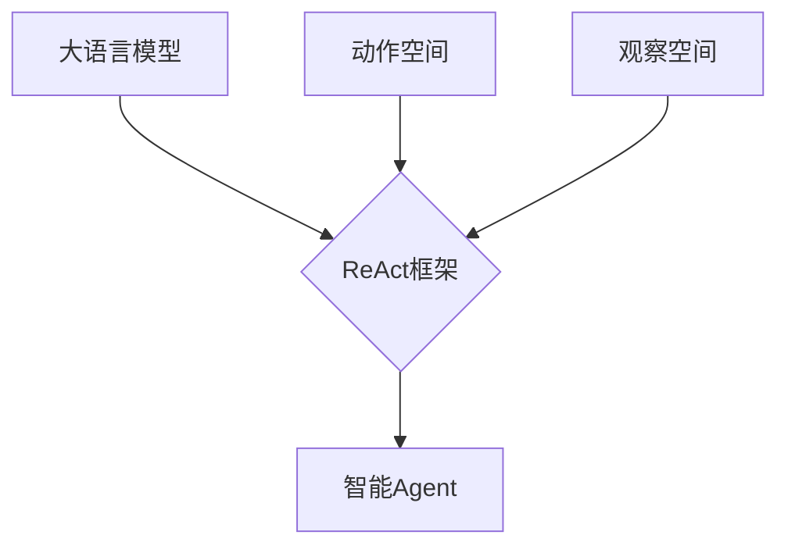

# 【大模型应用开发 动手做AI Agent】Agent的推理引擎：ReAct框架

## 1. 背景介绍

### 1.1 大语言模型的发展历程

#### 1.1.1 早期的语言模型
#### 1.1.2 Transformer的出现
#### 1.1.3 预训练语言模型的崛起

### 1.2 大模型在AI领域的应用

#### 1.2.1 自然语言处理
#### 1.2.2 问答系统
#### 1.2.3 智能对话

### 1.3 大模型推理的局限性

#### 1.3.1 缺乏推理能力
#### 1.3.2 难以适应复杂任务
#### 1.3.3 可解释性不足

## 2. 核心概念与联系

### 2.1 ReAct框架概述

#### 2.1.1 ReAct的定义
#### 2.1.2 ReAct的特点
#### 2.1.3 ReAct的优势

### 2.2 ReAct与传统推理方法的区别

#### 2.2.1 基于规则的推理
#### 2.2.2 基于知识图谱的推理  
#### 2.2.3 ReAct的创新之处

### 2.3 ReAct的关键组件

#### 2.3.1 大语言模型
#### 2.3.2 动作空间
#### 2.3.3 观察空间

## 3. 核心算法原理具体操作步骤

### 3.1 ReAct的工作流程

#### 3.1.1 接收输入
#### 3.1.2 生成思考链
#### 3.1.3 执行动作并观察

### 3.2 思考链的生成算法

#### 3.2.1 基于Prompt的思考链生成
#### 3.2.2 思考链的优化策略 
#### 3.2.3 思考链的终止条件

### 3.3 动作执行与观察更新

#### 3.3.1 动作的选择与执行
#### 3.3.2 观察信息的更新
#### 3.3.3 状态转移与决策

## 4. 数学模型和公式详细讲解举例说明

### 4.1 ReAct的数学表示

#### 4.1.1 状态空间与动作空间
#### 4.1.2 转移函数与奖励函数
#### 4.1.3 最优策略的求解

### 4.2 思考链生成的概率模型

#### 4.2.1 语言模型的概率分布
#### 4.2.2 思考链生成的概率计算
#### 4.2.3 思考链选择的策略

### 4.3 数学模型在ReAct中的应用

#### 4.3.1 蒙特卡洛树搜索
#### 4.3.2 强化学习算法
#### 4.3.3 贝叶斯优化

## 5. 项目实践：代码实例和详细解释说明

### 5.1 ReAct的代码实现

#### 5.1.1 核心类与函数
#### 5.1.2 输入处理与思考链生成
#### 5.1.3 动作执行与观察更新

### 5.2 使用ReAct构建智能Agent

#### 5.2.1 定义状态空间与动作空间
#### 5.2.2 设计奖励函数与终止条件
#### 5.2.3 训练与测试Agent

### 5.3 ReAct项目的扩展与优化

#### 5.3.1 引入外部知识库
#### 5.3.2 优化思考链生成策略
#### 5.3.3 提高动作执行效率

## 6. 实际应用场景

### 6.1 智能客服系统

#### 6.1.1 客户问题的理解与分类
#### 6.1.2 生成个性化回复
#### 6.1.3 多轮对话的管理

### 6.2 智能教育助手

#### 6.2.1 学习资料的推荐
#### 6.2.2 答疑解惑与互动
#### 6.2.3 学习进度的跟踪与反馈

### 6.3 智能医疗诊断

#### 6.3.1 病情描述的理解
#### 6.3.2 生成诊断报告
#### 6.3.3 提供治疗建议

## 7. 工具和资源推荐

### 7.1 开源的ReAct实现

#### 7.1.1 Hugging Face的ReAct
#### 7.1.2 OpenAI的ReAct
#### 7.1.3 DeepMind的ReAct

### 7.2 相关的数据集与基准测试

#### 7.2.1 SQuAD问答数据集
#### 7.2.2 MultiWOZ对话数据集
#### 7.2.3 GLUE基准测试

### 7.3 学习ReAct的资源

#### 7.3.1 ReAct论文与博客
#### 7.3.2 在线课程与教程
#### 7.3.3 开发者社区与论坛

## 8. 总结：未来发展趋势与挑战

### 8.1 ReAct的优势与局限

#### 8.1.1 强大的推理能力
#### 8.1.2 灵活的任务适应性
#### 8.1.3 可解释性有待提高

### 8.2 ReAct的未来发展方向

#### 8.2.1 与知识图谱的结合
#### 8.2.2 引入因果推理能力
#### 8.2.3 实现多模态推理

### 8.3 ReAct面临的挑战

#### 8.3.1 计算效率的提升
#### 8.3.2 数据隐私与安全
#### 8.3.3 伦理与道德考量

## 9. 附录：常见问题与解答

### 9.1 ReAct与传统推理方法的区别是什么？

ReAct利用大语言模型生成思考链,通过不断执行动作并观察反馈来进行推理,相比传统的基于规则或知识图谱的推理方法更加灵活,能够适应复杂多变的任务场景。

### 9.2 ReAct的思考链是如何生成的？

ReAct利用基于Prompt的方法,根据当前的状态和目标,生成一系列的思考步骤,形成思考链。同时会采用一些优化策略来提高思考链的质量,例如beam search、强化学习等。

### 9.3 ReAct能否结合外部知识进行推理？

可以。ReAct可以将外部知识库嵌入到观察空间中,在生成思考链和执行动作时利用这些知识来辅助推理。这可以极大地提升ReAct处理复杂任务的能力。

### 9.4 如何评估ReAct推理的性能？ 

可以利用一些标准的基准测试数据集,如SQuAD、GLUE等,测试ReAct在问答、文本分类等任务上的表现。同时也可以设计一些特定领域的任务来评估ReAct的实际应用效果。

### 9.5 ReAct在实际应用中需要注意哪些问题？

需要关注ReAct推理的计算效率问题,尤其是在处理大规模数据时。此外,还需要考虑数据隐私与安全问题,以及算法可能带来的伦理风险。在实际应用中,需要根据具体场景进行适当的调整和优化。

作者：禅与计算机程序设计艺术 / Zen and the Art of Computer Programming