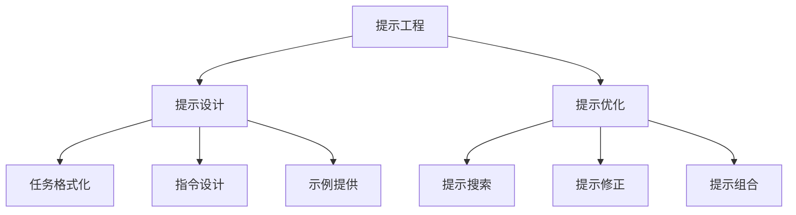
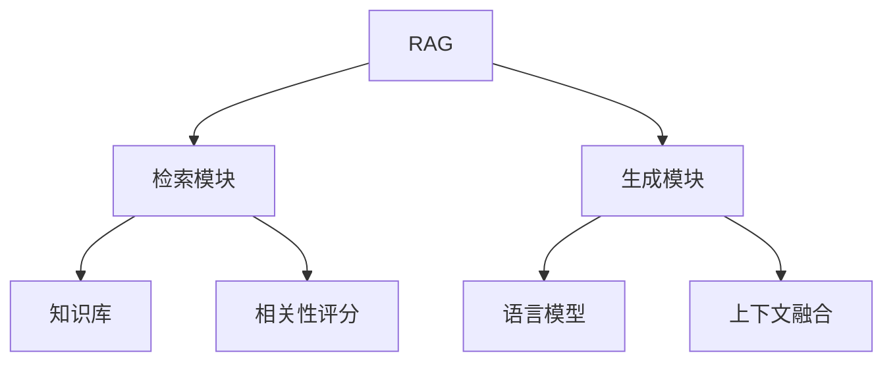
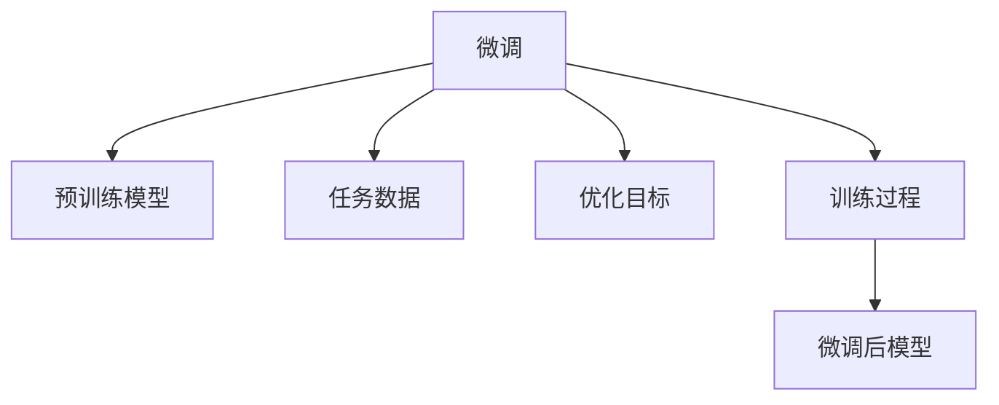

# 【大模型应用开发 动手做AI Agent】提示工程、RAG与微调

## 1. 背景介绍

### 1.1 人工智能的发展历程

人工智能(AI)是一个旨在模拟人类智能行为的广泛领域,包括学习、推理、感知、规划和创造力等方面。自20世纪50年代诞生以来,AI已经取得了长足的进步,从早期的专家系统和机器学习算法,到近年来的深度学习和大规模预训练语言模型的兴起。

### 1.2 大规模语言模型的兴起

近年来,benefitting from 大规模计算能力、海量训练数据和创新的深度学习算法,大规模预训练语言模型(如GPT-3、PaLM、ChatGPT等)取得了突破性进展,展现出令人惊叹的自然语言理解和生成能力。这些模型通过在大量无标注文本数据上进行预训练,学习到了丰富的语言知识和上下文理解能力。

### 1.3 AI Agent的概念

AI Agent指的是一种具备某种智能的软件实体,能够感知环境、处理信息、做出决策并采取行动。在自然语言处理(NLP)领域,AI Agent通常指能够与人类进行自然语言交互、完成特定任务的智能系统。随着大规模语言模型的兴起,开发高质量的AI Agent应用程序成为了一个热门话题。

## 2. 核心概念与联系

### 2.1 提示工程(Prompt Engineering)

提示工程是一种通过精心设计输入给大型语言模型的提示(Prompt),来指导模型产生所需输出的技术。它包括以下核心概念:

1. **提示设计**:将任务表述为一种特定的格式,使模型能够理解并生成所需的输出。
   - **任务格式化**:将任务描述转化为模型可以理解的格式,如问题回答、文本续写等。
   - **指令设计**:为模型提供清晰的指令,指导其生成所需的输出形式。
   - **示例提供**:提供一些示例输入-输出对,帮助模型理解任务要求。

2. **提示优化**:通过各种技术来改进提示的质量,从而获得更好的模型输出。
   - **提示搜索**:在提示空间中搜索最优的提示。
   - **提示修正**:根据模型输出,对提示进行微调和修正。
   - **提示组合**:将多个提示组合在一起,形成更复杂的提示。

提示工程的核心思想是利用大型语言模型已经学习到的知识,通过精心设计的提示来引导模型生成所需的输出,而不需要对模型进行大量的微调或重新训练。

### 2.2 RAG(Retrieval Augmented Generation)

RAG是一种将检索和生成相结合的框架,旨在增强语言模型的知识获取和推理能力。它包括以下核心组件:

1. **检索模块**:从外部知识库(如维基百科)中检索与当前任务相关的文档片段。
   - **知识库**:存储海量的文本数据,作为检索的来源。
   - **相关性评分**:根据查询和文档之间的相似性,对文档进行评分和排序。

2. **生成模块**:基于检索到的相关文档和当前上下文,生成最终的输出。
   - **语言模型**:一个预训练的大型语言模型,用于生成自然语言输出。
   - **上下文融合**:将检索到的文档与当前上下文信息融合,作为语言模型的输入。

RAG的关键在于将检索到的外部知识与语言模型的生成能力相结合,从而增强模型的知识覆盖面和推理能力,产生更准确、更丰富的输出。

### 2.3 微调(Fine-tuning)

微调是一种在大型预训练语言模型的基础上,利用特定任务数据进行进一步训练的技术。它包括以下核心步骤:

1. **预训练模型**:一个经过大规模无监督预训练的语言模型,作为微调的起点。
2. **任务数据**:与特定任务相关的标注数据集,用于指导模型学习任务相关的知识和技能。
3. **优化目标**:根据任务的特点设计合适的损失函数和评估指标,作为模型优化的目标。
4. **训练过程**:在任务数据上对预训练模型进行有监督的微调训练,使其适应特定任务。
5. **微调后模型**:经过微调后的模型,在特定任务上表现出更好的性能。

微调的优势在于可以在保留预训练模型已学习到的通用知识的同时,通过少量的任务相关数据快速适应特定任务,从而获得更好的性能表现。

## 3. 核心算法原理具体操作步骤

### 3.1 提示工程算法步骤

1. **任务分析**:首先需要对目标任务进行分析,确定任务的性质(如文本生成、问答等)和要求。

2. **提示设计**:根据任务的性质,设计合适的提示格式。
   - 对于文本生成任务,可以采用"Few-shot"的方式,提供一些示例输入-输出对。
   - 对于问答任务,可以将问题和上下文信息组合成一个提示。

3. **提示优化**:通过一些技术来优化提示的质量。
   - 提示搜索:在提示空间中搜索最优的提示,可以使用启发式搜索或基于强化学习的方法。
   - 提示修正:根据模型输出,对提示进行修正,使其更加清晰和准确。
   - 提示组合:将多个提示组合在一起,形成更复杂的提示,以捕获更多的信息。

4. **模型推理**:将优化后的提示输入到预训练语言模型中,获取模型的输出。

5. **输出后处理**:根据需要对模型输出进行后处理,如过滤、重新排序等。

6. **评估和迭代**:评估模型输出的质量,并根据评估结果对提示进行进一步的优化和迭代。

### 3.2 RAG算法步骤

1. **查询表示**:将自然语言查询转换为向量表示,以便进行相似性计算。

2. **文档检索**:在知识库中检索与查询相关的文档片段。
   - 基于向量相似性进行最近邻搜索,获取与查询最相关的文档。
   - 可以使用各种索引技术(如FAISS、ElasticSearch等)来加速检索过程。

3. **上下文融合**:将检索到的相关文档与当前上下文信息(如查询、对话历史等)融合在一起,形成语言模型的输入。

4. **语言模型生成**:将融合后的上下文输入到预训练的语言模型中,生成最终的输出。

5. **输出后处理**:根据需要对模型输出进行后处理,如去重、摘要等。

6. **评估和迭代**:评估模型输出的质量,并根据评估结果对检索策略、上下文融合方式等进行优化和迭代。

### 3.3 微调算法步骤

1. **数据准备**:准备与目标任务相关的标注数据集,包括输入和期望输出。

2. **数据预处理**:对数据进行必要的预处理,如分词、标记化、填充等。

3. **设置优化目标**:根据任务的特点设计合适的损失函数和评估指标,作为模型优化的目标。

4. **模型初始化**:选择一个合适的预训练语言模型作为微调的起点,并对模型进行初始化。

5. **模型训练**:在任务数据上对预训练模型进行有监督的微调训练。
   - 可以采用常见的优化算法,如Adam、AdaGrad等。
   - 可以使用一些训练技巧,如学习率调度、梯度裁剪等,以提高训练效率和稳定性。

6. **模型评估**:在验证集上评估微调后模型的性能,并根据评估结果调整超参数或训练策略。

7. **模型部署**:将训练好的模型部署到生产环境中,用于实际应用。

8. **持续优化**:持续收集新的任务数据,并定期对模型进行微调,以提高模型的性能和泛化能力。

## 4. 数学模型和公式详细讲解举例说明

### 4.1 提示工程中的相关性评分

在提示工程中,我们常常需要评估不同提示对于目标任务的相关性,以便选择最优的提示。一种常用的相关性评分方法是基于语义相似度。

假设我们有一个目标任务 $T$,以及一组候选提示 $P = \{p_1, p_2, \ldots, p_n\}$。我们可以将任务 $T$ 和每个提示 $p_i$ 表示为向量 $\vec{t}$ 和 $\vec{p_i}$,然后计算它们之间的余弦相似度作为相关性分数:

$$\text{score}(p_i, T) = \frac{\vec{p_i} \cdot \vec{t}}{||\vec{p_i}|| \cdot ||\vec{t}||}$$

其中 $\vec{p_i} \cdot \vec{t}$ 表示向量点积,而 $||\vec{p_i}||$ 和 $||\vec{t}||$ 分别表示向量的范数(L2范数)。

相关性分数的取值范围在 $[-1, 1]$ 之间,分数越高表示提示与任务越相关。我们可以选择得分最高的提示作为最终的提示。

### 4.2 RAG中的相关性评分

在RAG框架中,相关性评分用于从知识库中检索与当前查询相关的文档片段。一种常见的方法是基于向量空间模型(VSM)进行评分。

假设我们有一个查询 $q$,以及一个知识库中的文档 $d$,它们分别被表示为向量 $\vec{q}$ 和 $\vec{d}$。我们可以计算它们之间的余弦相似度作为相关性分数:

$$\text{score}(q, d) = \frac{\vec{q} \cdot \vec{d}}{||\vec{q}|| \cdot ||\vec{d}||}$$

相关性分数越高,表示文档 $d$ 与查询 $q$ 越相关。我们可以根据这个分数对知识库中的所有文档进行排序,并选择得分最高的前 $k$ 个文档作为检索结果。

在实际应用中,我们还可以引入一些额外的特征,如文档长度、时间戳等,并将它们与向量相似度结合,以获得更准确的相关性评分。

### 4.3 微调中的交叉熵损失函数

在微调过程中,我们通常会使用交叉熵损失函数作为优化目标。假设我们有一个序列标注任务,目标是预测每个输入token对应的标签。

设输入序列为 $X = (x_1, x_2, \ldots, x_n)$,期望输出序列为 $Y = (y_1, y_2, \ldots, y_n)$,其中 $x_i$ 和 $y_i$ 分别表示第 $i$ 个token和对应的标签。模型预测的输出概率为 $\hat{Y} = (\hat{y}_1, \hat{y}_2, \ldots, \hat{y}_n)$,其中 $\hat{y}_i$ 是一个概率分布,表示第 $i$ 个token属于每个可能标签的概率。

则交叉熵损失函数可以表示为:

$$\mathcal{L}(Y, \hat{Y}) = -\sum_{i=1}^{n} \log \hat{y}_{i, y_i}$$

其中 $\hat{y}_{i, y_i}$ 表