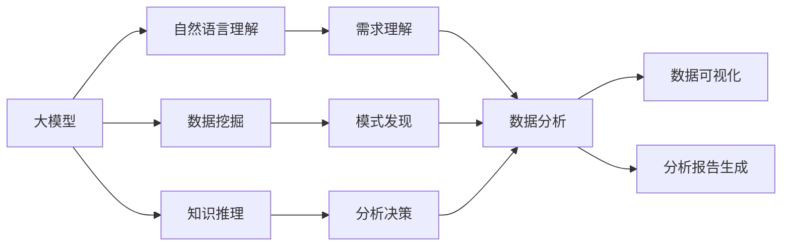

# 【大模型应用开发 动手做AI Agent】自主创建数据分析图表

## 1. 背景介绍
### 1.1 大模型在数据分析中的应用前景
近年来,随着人工智能技术的快速发展,大模型(Large Language Models)在各个领域都展现出了巨大的应用潜力。特别是在数据分析领域,大模型能够通过对海量数据的学习和理解,自主地完成数据挖掘、数据可视化等任务,极大地提升了数据分析的效率和质量。利用大模型构建智能化的数据分析 AI Agent,将成为未来数据分析领域的重要发展方向。

### 1.2 自主创建数据分析图表的重要意义
数据可视化是数据分析过程中不可或缺的一环。通过生动形象的图表,能够直观地展现数据中蕴含的规律和趋势,帮助人们更好地理解数据背后的价值。传统的数据可视化通常需要数据分析师手工绘制图表,不仅耗时耗力,而且对分析人员的专业技能要求较高。而利用大模型自主创建数据分析图表,则可以大幅简化可视化流程,降低使用门槛,让更多非专业人士也能轻松完成数据可视化,从而推动数据分析在各行各业的普及应用。

## 2. 核心概念与联系
### 2.1 大模型(Large Language Models)
大模型是基于海量文本数据训练的超大规模语言模型,通过学习文本数据中词与词之间的关联规律,可以对自然语言进行深度理解和生成。当前主流的大模型如 GPT-3、BERT、ERNIE 等,都拥有数百亿甚至上千亿的参数量,展现出了接近甚至超越人类的自然语言处理能力。

### 2.2 数据分析(Data Analysis)
数据分析是指采用适当的统计分析方法对收集到的数据进行分析,提取有价值的信息,发现数据中隐藏的规律和趋势,从而为决策提供依据的过程。数据分析通常包括数据收集、数据处理、数据挖掘、数据可视化等多个步骤。

### 2.3 数据可视化(Data Visualization) 
数据可视化是数据分析的重要组成部分,旨在借助图形化手段直观形象地展示数据中的信息,揭示数据中的规律和趋势。常见的数据可视化图表包括折线图、柱状图、饼图、散点图、热力图等。好的可视化可以讲述引人入胜的数据故事,帮助人们快速准确地把握数据的精髓。

### 2.4 AI Agent
Agent 是人工智能领域的一个重要概念,指能够感知环境并采取行动以实现特定目标的自主实体。将大模型与 Agent 结合,可以创建出具备数据分析能力的 AI Agent,它能够通过自然语言理解用户需求,并根据需求自主完成数据处理、分析、可视化等任务,大大提升数据分析的自动化水平。

### 2.5 大模型与数据分析的关系

如上图所示,大模型可以利用其强大的自然语言理解、数据挖掘、知识推理等能力,赋能数据分析的各个环节。通过对用户需求的准确理解,挖掘数据中有价值的模式,并基于领域知识做出合理推断,大模型驱动的 AI Agent 可以自主完成从数据到洞见的转化,输出美观实用的可视化图表和专业的分析报告。

## 3. 核心算法原理具体操作步骤
### 3.1 基于大模型的数据分析流程
1. 自然语言理解:利用大模型对用户输入的数据分析需求进行语义理解,提取关键信息如分析目标、数据来源、图表类型等。
2. 数据处理:根据需求对指定数据源进行 ETL 处理,完成数据清洗、转换、集成等数据预处理任务。  
3. 数据挖掘:应用大模型的数据挖掘能力,对处理后的数据进行探索性分析,发现数据中的有价值模式,如异常检测、关联分析、聚类分析等。
4. 分析决策:结合大模型的知识推理能力和领域知识库,对挖掘出的数据模式进行分析解释,得出有指导意义的分析结论。
5. 数据可视化:根据需求和分析结果,利用大模型的知识生成能力,自动设计和生成恰当的可视化图表。
6. 报告生成:利用大模型的自然语言生成能力,撰写数据分析报告,对分析结果进行阐释说明,提炼关键洞见。

### 3.2 prompt 设计与任务规划
为实现端到端的自动化数据分析,需要对大模型进行有效的 prompt 设计,引导模型进行任务规划和执行。一个典型的 prompt 设计如下:

```
数据分析任务:根据以下需求,使用 sales.csv 数据集完成销售数据分析并生成可视化图表:
1. 分析各产品类别的销售额占比,使用饼图展示  
2. 分析各地区的销售额变化趋势,使用折线图展示
3. 找出销售额 top5 的产品,使用柱状图展示
4. 总结销售数据的关键特征和趋势,并撰写分析报告

第一步:数据理解与处理
```

通过这样的 prompt,模型可以对数据分析任务形成清晰的理解,并根据任务要求,自主拆解和规划具体的执行步骤:
1. 读取和分析 sales.csv 数据集的字段含义、数据类型、数据质量等
2. 对数据进行清洗、转换、聚合等预处理,为分析任务做好准备
3. 针对需求1,计算各产品类别销售额,并绘制饼图
4. 针对需求2,按地区和时间维度聚合销售数据,绘制折线图展示趋势
5. 针对需求3,对产品维度销售额进行排序,选出 top5 并绘制柱状图
6. 针对需求4,对前面的分析结果进行总结提炼,输出一份完整的分析报告

通过这种 prompt 驱动的任务规划,大模型可以将复杂的数据分析任务分解为一系列可执行的原子操作,并有序地加以完成。

### 3.3 数据处理与特征工程
数据处理与特征工程是数据分析的基础,直接影响后续分析的质量。利用大模型对数据字段的语义理解能力,可以实现智能化的数据处理流程:
1. 数据类型推断:根据数据字段的语义信息,自动判断其数据类型,如数值型、类别型、时间型等
2. 数据质量分析:通过分析数据的完整性、唯一性、有效性等特征,发现数据中的质量问题,如缺失值、异常值等
3. 数据清洗转换:根据质量分析结果,自动对缺失值进行填充或删除,对异常值进行修正或过滤,并进行数据格式转换
4. 数据集成:根据分析需求,对来自多个数据源的数据进行连接、合并、聚合等集成操作 
5. 特征构建:利用大模型的特征工程能力,根据分析任务自动构建、筛选有效的特征,如时间特征、交叉特征等

下面是一个利用 pandas 进行数据处理的示例代码:

```python
import pandas as pd

# 读取数据
df = pd.read_csv('sales.csv')

# 数据类型推断与转换
df['date'] = pd.to_datetime(df['date'])
df['price'] = df['price'].astype(float) 

# 缺失值处理
df.fillna(0, inplace=True)

# 异常值处理
df = df[df['price'] > 0]  

# 数据聚合
df_agg = df.groupby(['category', 'region']).agg({'sales': 'sum', 'profit': 'mean'})

# 特征构建
df['year'] = df['date'].dt.year
df['month'] = df['date'].dt.month
```

通过这些数据处理步骤,可以将原始数据转化为适合分析的结构化形式,为后续的数据挖掘和可视化奠定基础。而借助大模型的数据理解和生成能力,这些处理过程都可以实现自动化,大大提升开发效率。

### 3.4 数据挖掘与知识发现
利用大模型强大的数据挖掘能力,可以从数据中自动发现有价值的模式和规律,挖掘出隐藏的知识。常见的数据挖掘任务包括:
1. 关联分析:发现数据项之间的关联规则,如"啤酒和尿布"
2. 异常检测:发现数据中的异常点或异常模式,如欺诈交易
3. 聚类分析:把相似的数据点划分到同一簇中,发现数据的内在分组
4. 预测分析:建立预测模型,根据历史数据预测未来趋势,如销量预测

以异常检测为例,传统的异常检测算法如孤立森林、LOF 等,需要人工设计特征并调参,而基于大模型的异常检测可以实现端到端的自动化:

```python
import numpy as np
from sklearn.ensemble import IsolationForest

# 读取数据
data = pd.read_csv('data.csv')

# 异常检测
model = IsolationForest(n_estimators=100, contamination=0.1)
anomalies = model.fit_predict(data)

# 可视化
normal_data = data[anomalies == 1]
anomaly_data = data[anomalies == -1]

plt.scatter(normal_data[:, 0], normal_data[:, 1], c='blue', label='Normal')
plt.scatter(anomaly_data[:, 0], anomaly_data[:, 1], c='red', label='Anomaly')
plt.legend()
plt.show()
```

上面的代码展示了一个简单的异常检测流程,但仍然需要人工参与特征选择和参数设置。而基于大模型的异常检测,可以直接输入任务描述如"请对 data.csv 数据进行异常检测,并对检测出的异常点进行可视化展示",大模型即可自动完成特征工程、算法选择、参数调优、可视化等全流程操作,大大降低了数据挖掘的技术门槛。

### 3.5 数据可视化与报告生成
数据可视化是数据分析中最直观的呈现方式,而自动化的可视化能力是智能数据分析不可或缺的一环。传统的数据可视化通常需要使用 matplotlib、seaborn 等库手工编写代码,而基于大模型的可视化可以实现全自动化。

以绘制一个多系列折线图为例:

```python
import matplotlib.pyplot as plt

# 读取数据
data = pd.read_csv('time_series.csv')

# 可视化
fig, ax = plt.subplots(figsize=(10, 6))
for col in data.columns[1:]:
    ax.plot(data['date'], data[col], label=col)
ax.legend()
ax.set_xlabel('Date') 
ax.set_ylabel('Value')
ax.set_title('Time Series Plot')
plt.show()
```

上面的代码可以绘制出一个基本的时间序列折线图,但仍然需要人工编写,对于复杂的可视化需求,代码量会进一步增加。而利用大模型,我们可以直接用自然语言描述可视化需求:

"请根据 time_series.csv 数据,绘制一个包含多个指标的时间序列折线图,并添加图例、坐标轴标签和标题,图表大小为 10x6 英寸。"

大模型可以直接根据这样的描述,自动生成完整的 Python 绘图代码,并执行绘制出高质量的可视化图表,完全不需要人工参与。

类似地,大模型还可以根据数据分析结果,自动生成专业的分析报告。用户只需要提供一个简单的报告提纲,如:

"请根据之前的销售数据分析结果,生成一份分析报告,内容包括:
1. 数据背景介绍
2. 各产品类别的销售额占比分析
3. 各地区销售额的变化趋势分析
4. 销