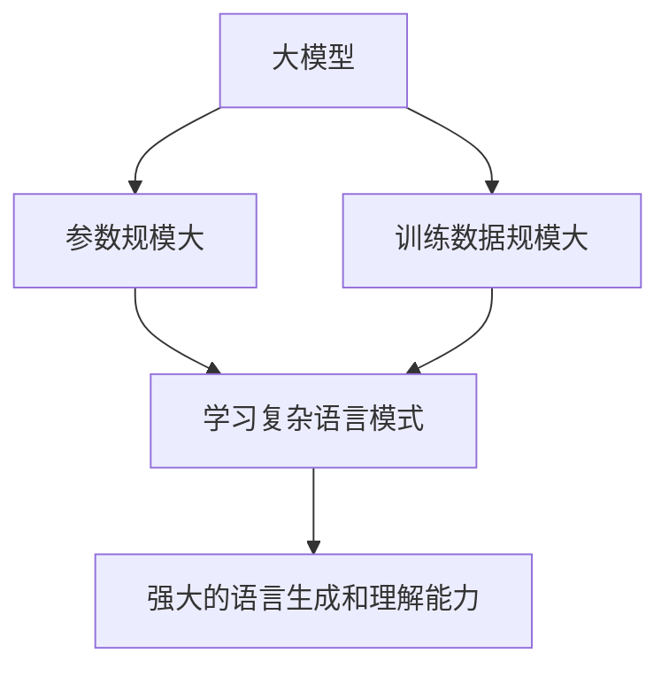
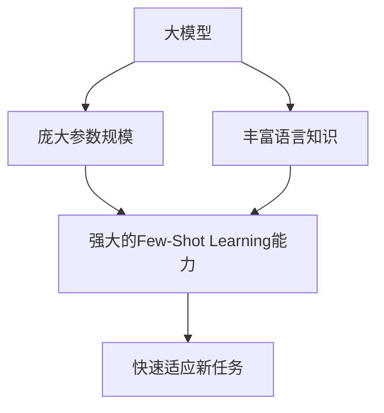
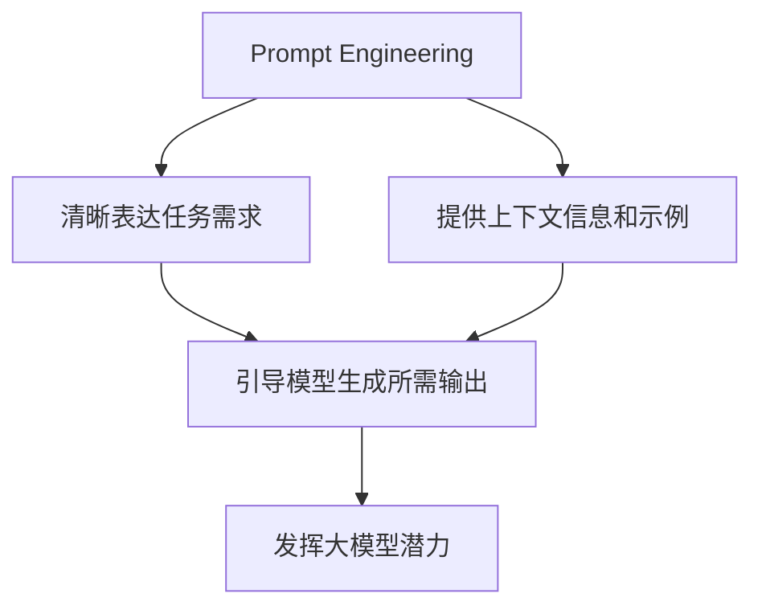
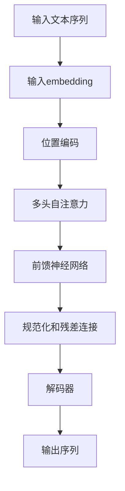
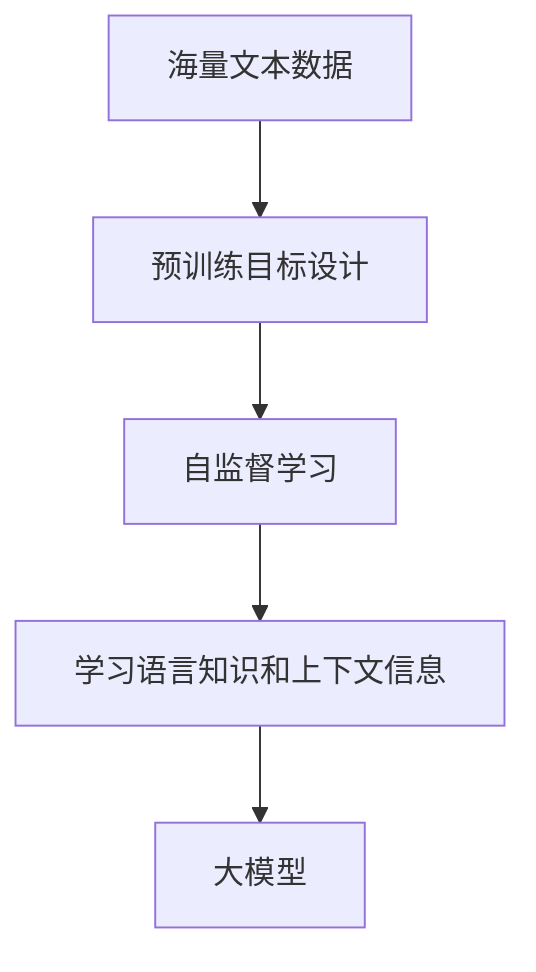
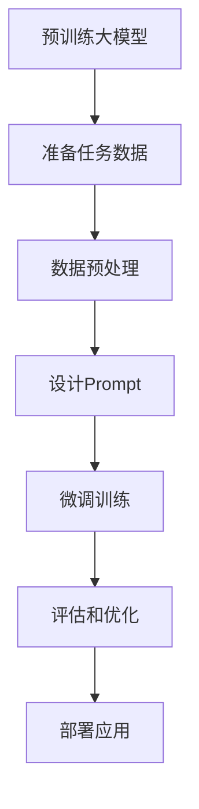

# 【大模型应用开发 动手做AI Agent】说说OpenAI这家公司

## 1. 背景介绍

### 1.1 人工智能的崛起

人工智能(AI)已经成为当今科技领域最炙手可热的话题之一。随着算力的不断提升和数据的快速积累,AI技术正在以前所未有的速度发展,并被广泛应用于各个领域,从计算机视觉、自然语言处理到机器人技术等,AI正在重塑着我们的生活和工作方式。

在这股AI浪潮中,一家名为OpenAI的公司脱颖而出,成为了领军者之一。OpenAI是一家非营利性人工智能研究公司,由著名企业家埃隆·马斯克(Elon Musk)和其他知名科技人士于2015年共同创立。该公司的使命是确保人工智能的发展符合人类的利益,并促进AI技术的民主化和开放性。

### 1.2 OpenAI的发展历程

自成立以来,OpenAI一直致力于推动人工智能的前沿研究和应用。他们的工作涵盖了机器学习、深度学习、强化学习、自然语言处理、计算机视觉等多个领域。

OpenAI的一个重要里程碑是2018年推出的语言模型GPT(Generative Pre-trained Transformer),这是一种基于transformer架构的大型语言模型,能够生成逼真、连贯的自然语言文本。GPT的出现为自然语言处理领域带来了革命性的进步。

2020年,OpenAI又推出了GPT-3,这是一个拥有1750亿个参数的庞大语言模型,在自然语言生成、理解和任务完成方面表现出了令人惊叹的能力。GPT-3的出现进一步推动了大模型在自然语言处理领域的应用。

除了语言模型,OpenAI还在其他领域取得了重要进展,如机器人技术、强化学习等。他们开发的机器人手臂Dactyl展现了出色的操作能力,而他们在强化学习领域的研究成果也备受瞩目。

## 2. 核心概念与联系

### 2.1 大模型(Large Language Model)

大模型是指拥有数十亿甚至上千亿参数的庞大神经网络模型,通常用于自然语言处理任务。这些模型通过在海量文本数据上进行预训练,学习到丰富的语言知识和上下文信息,从而能够生成高质量的自然语言文本,或者在下游任务中表现出优异的能力。

大模型的核心思想是利用规模效应(Scale Effect)来提升模型的性能。通过增加模型的参数数量和训练数据规模,模型能够学习到更丰富、更复杂的语言模式,从而在生成和理解自然语言方面表现出卓越的能力。

OpenAI的GPT-3就是一个典型的大模型范例,它拥有1750亿个参数,在训练过程中吸收了数十亿个网页和书籍文本,展现出了惊人的语言生成和理解能力。

### 2.2 Few-Shot Learning

Few-Shot Learning是一种机器学习范式,旨在使模型能够通过少量示例就学会新的任务或概念。在自然语言处理领域,Few-Shot Learning允许语言模型通过少量的任务示例,就能够快速适应新的下游任务,如文本分类、问答系统、文本摘要等。

大模型由于其庞大的参数规模和丰富的语言知识,天生就具备了强大的Few-Shot Learning能力。通过提供少量的任务示例,大模型就能够捕捉到任务的语义和模式,从而快速适应新任务。

OpenAI的GPT-3就展现出了出色的Few-Shot Learning能力。只需提供少量的示例,GPT-3就能够生成高质量的文本、回答问题、进行文本分类等,这为大模型在实际应用中带来了巨大的便利性。

### 2.3 Prompt Engineering

Prompt Engineering是指设计和优化提示(Prompt)的技术,旨在指导大模型生成所需的输出。在与大模型交互时,用户需要提供一个合适的Prompt,作为模型生成输出的起点和指引。

Prompt的设计对于发挥大模型的潜力至关重要。一个优秀的Prompt不仅能够清晰地表达任务需求,还能够为模型提供足够的上下文信息和示例,从而引导模型生成符合预期的输出。

OpenAI在Prompt Engineering方面也做出了重要贡献。他们开发了一种名为"构思链"(Constitutional Chain)的Prompt设计技术,通过将复杂任务分解为一系列简单的子任务,并为每个子任务设计相应的Prompt,从而指导模型完成整个复杂任务。这种技术大大提高了大模型在复杂任务上的表现。

## 3. 核心算法原理具体操作步骤

### 3.1 Transformer架构

Transformer是一种革命性的神经网络架构,被广泛应用于自然语言处理任务中。它是大模型的核心架构,如GPT、BERT等都是基于Transformer架构构建的。

Transformer的核心思想是通过自注意力(Self-Attention)机制来捕捉输入序列中的长程依赖关系,从而更好地理解和生成自然语言。与传统的循环神经网络(RNN)相比,Transformer架构具有更好的并行计算能力,能够更有效地利用GPU和TPU等硬件加速器,从而提高训练和推理的效率。

Transformer的具体操作步骤如下:

1. **输入embedding**:将输入文本序列转换为向量表示。
2. **位置编码**:为每个输入向量添加位置信息,以保留序列的顺序信息。
3. **多头自注意力**:计算每个输入向量与其他输入向量的注意力权重,捕捉长程依赖关系。
4. **前馈神经网络**:对注意力输出进行非线性变换,提取更高级的特征表示。
5. **规范化和残差连接**:使用层归一化和残差连接来提高训练稳定性和收敛速度。
6. **解码器(用于生成任务)**:对于生成任务,解码器会根据编码器的输出,逐步生成目标序列。

通过上述步骤,Transformer能够高效地建模输入序列,并生成高质量的输出序列。

### 3.2 大模型预训练

大模型的强大能力来自于在海量数据上进行预训练。预训练是一种自监督学习方式,通过设计合适的预训练目标,让模型学习到丰富的语言知识和上下文信息。

常见的预训练目标包括:

1. **掩码语言模型(Masked Language Modeling, MLM)**:在输入序列中随机掩码部分单词,让模型根据上下文预测被掩码的单词。
2. **下一句预测(Next Sentence Prediction, NSP)**:给定两个句子,让模型预测它们是否连续出现。
3. **因果语言模型(Causal Language Modeling, CLM)**:根据前面的文本,预测下一个单词或序列。

预训练过程通常需要消耗大量的计算资源和时间。OpenAI在训练GPT-3时,就使用了数十万个GPU核心,耗时数周时间。但是,通过预训练,大模型能够学习到丰富的语言知识,为后续的微调和应用奠定基础。

### 3.3 微调和应用

虽然经过预训练,大模型已经具备了强大的语言能力,但是要将其应用于特定的下游任务,还需要进行微调(Fine-tuning)。微调是在预训练模型的基础上,使用少量的任务相关数据进行进一步训练,以使模型适应特定任务的需求。

微调过程通常包括以下步骤:

1. **准备任务数据**:收集和准备与目标任务相关的数据集。
2. **数据预处理**:对数据进行清洗、标注和格式化处理。
3. **设计Prompt**:根据任务需求,设计合适的Prompt,作为模型输入的起点。
4. **微调训练**:使用任务数据和Prompt,对预训练模型进行微调,调整模型参数以适应目标任务。
5. **评估和优化**:在验证集上评估模型性能,并根据需要进行超参数调整和Prompt优化。
6. **部署应用**:将微调后的模型部署到实际应用中,为用户提供服务。

通过微调,大模型能够快速适应各种下游任务,如文本分类、问答系统、文本摘要、机器翻译等,展现出强大的实用价值。

## 4. 数学模型和公式详细讲解举例说明

### 4.1 Transformer的自注意力机制

自注意力(Self-Attention)是Transformer架构的核心机制,它允许模型捕捉输入序列中任意两个位置之间的依赖关系,从而更好地理解和生成自然语言。

给定一个长度为$n$的输入序列$X = (x_1, x_2, \dots, x_n)$,自注意力机制的计算过程如下:

1. 将输入序列$X$投影到查询(Query)、键(Key)和值(Value)空间,得到$Q$、$K$和$V$:

$$Q = XW^Q, K = XW^K, V = XW^V$$

其中$W^Q$、$W^K$和$W^V$是可学习的权重矩阵。

2. 计算查询$Q$和键$K$的点积,得到注意力分数矩阵$A$:

$$A = \text{softmax}\left(\frac{QK^T}{\sqrt{d_k}}\right)$$

其中$d_k$是缩放因子,用于防止内积过大导致梯度消失或爆炸。

3. 将注意力分数$A$与值$V$相乘,得到加权和表示$Z$:

$$Z = AV$$

$Z$就是自注意力机制的输出,它捕捉了输入序列中任意两个位置之间的依赖关系。

4. 多头自注意力(Multi-Head Attention)是将多个注意力头的输出进行拼接,以捕捉不同的依赖关系模式:

$$\text{MultiHead}(Q, K, V) = \text{Concat}(head_1, \dots, head_h)W^O$$

其中$head_i = \text{Attention}(QW_i^Q, KW_i^K, VW_i^V)$,而$W_i^Q$、$W_i^K$、$W_i^V$和$W^O$都是可学习的权重矩阵。

通过自注意力机制,Transformer能够有效地捕捉输入序列中的长程依赖关系,从而更好地理解和生成自然语言。

### 4.2 大模型的Scale Effect

大模型的强大能力来自于规模效应(Scale Effect),即模型规模(参数数量和训练数据规模)越大,性能越好。这种现象在自然语言处理领域尤为明显。

假设一个语言模型的损失函数为$\mathcal{L}(\theta)$,其中$\theta$是模型参数。根据经验风险最小化原理,我们希望找