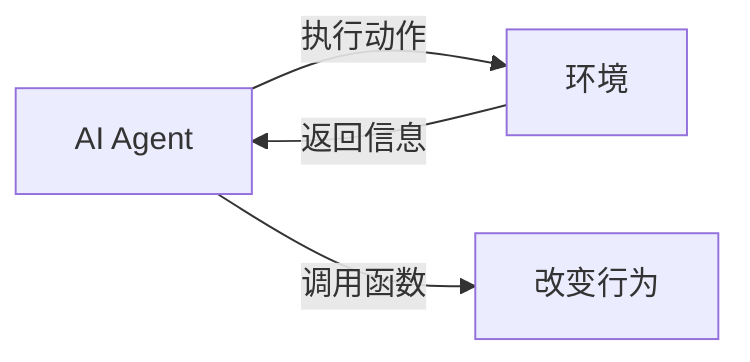

## 1.背景介绍

在当今这个数据驱动的时代，人工智能（AI）已经成为了我们生活的一部分。AI的应用已经渗透到了各行各业，从自动驾驶车辆，到智能家居，再到医疗诊断，其影响力无处不在。然而，要想构建一个功能强大的AI系统，单靠算法和数据是远远不够的。我们需要一种能够将算法和数据有效结合起来的工具，这就是AI Agent。AI Agent是一种能够感知环境，进行决策，并执行动作的系统。本文将围绕大模型应用开发，动手做AI Agent为主题，详细介绍如何通过助手的返回信息调用函数。

## 2.核心概念与联系

首先，我们需要明确几个核心概念：

- AI Agent：AI Agent是一种能够感知环境，进行决策，并执行动作的系统。它通过与环境的交互，不断地学习和进化，以达到预定的目标。

- 助手的返回信息：助手的返回信息是AI Agent执行动作后，环境对该动作的反馈。这些信息通常被用来调整AI Agent的行为，以便更好地适应环境。

- 调用函数：调用函数是指在程序中执行特定的代码块。这些函数可以是预定义的，也可以是用户自定义的。

这三个概念之间的关系可以用下面的Mermaid流程图来表示：



## 3.核心算法原理具体操作步骤

构建AI Agent的过程可以分为以下几个步骤：

1. **定义环境**：环境是AI Agent的工作场所。我们需要根据实际问题来定义环境的状态和动作。

2. **定义AI Agent**：AI Agent需要能够感知环境，进行决策，并执行动作。这通常需要定义一个或多个神经网络模型。

3. **训练AI Agent**：通过大量的环境交互，AI Agent可以学习如何根据环境状态选择最优的动作。这个过程通常需要大量的计算资源。

4. **通过助手的返回信息调用函数**：AI Agent执行动作后，环境会返回一些信息。我们可以使用这些信息来调用函数，从而改变AI Agent的行为。

## 4.数学模型和公式详细讲解举例说明

在AI Agent的训练过程中，我们通常会使用一种叫做强化学习的方法。强化学习的目标是找到一个策略，使得AI Agent在长期内获得的奖励最大。这可以用下面的公式来表示：

$$
\pi^* = \arg\max_\pi E_{p^\pi}\left[\sum_{t=0}^\infty \gamma^t r_t\right]
$$

其中，$\pi$是策略，$E_{p^\pi}$是在策略$\pi$下的期望，$\gamma$是折扣因子，$r_t$是在时间$t$获得的奖励。

## 5.项目实践：代码实例和详细解释说明

下面，我们将通过一个简单的例子来说明如何构建AI Agent，并通过助手的返回信息调用函数。

首先，我们需要定义环境和AI Agent。这里，我们使用OpenAI的Gym库来定义环境，使用TensorFlow的Keras库来定义AI Agent。

```python
import gym
import tensorflow as tf

# 定义环境
env = gym.make('CartPole-v1')

# 定义AI Agent
model = tf.keras.models.Sequential([
    tf.keras.layers.Dense(24, input_dim=4, activation='relu'),
    tf.keras.layers.Dense(24, activation='relu'),
    tf.keras.layers.Dense(2, activation='linear')
])
model.compile(loss='mse', optimizer=tf.keras.optimizers.Adam())
```

接下来，我们可以开始训练AI Agent。在每一步，AI Agent都会根据环境状态选择一个动作，然后执行这个动作，并获得环境的反馈。这个反馈包括新的环境状态，奖励，以及游戏是否结束。然后，AI Agent会根据这些信息来调整自己的行为。

```python
for i_episode in range(500):
    state = env.reset()
    for t in range(500):
        action = model.predict(state.reshape(1, -1)).argmax()
        next_state, reward, done, _ = env.step(action)
        if done:
            reward = -200
        model.fit(state.reshape(1, -1), tf.keras.utils.to_categorical(action, num_classes=2), epochs=1, verbose=0)
        state = next_state
        if done:
            break
```

## 6.实际应用场景

AI Agent可以应用于许多场景，例如：

- 游戏：AI Agent可以学习如何玩游戏，并达到超越人类的水平。例如，DeepMind的AlphaGo就是一个著名的例子。

- 自动驾驶：AI Agent可以学习如何驾驶汽车，从而实现自动驾驶。

- 机器人：AI Agent可以控制机器人执行各种任务，例如搬运，打扫，或者手术。

## 7.工具和资源推荐

如果你想深入学习AI Agent的构建，我推荐以下几个工具和资源：

- OpenAI Gym：这是一个用于开发和比较强化学习算法的工具库。它提供了许多预定义的环境，你可以在这些环境上训练你的AI Agent。

- TensorFlow：这是一个开源的机器学习框架。它提供了许多高级的API，可以帮助你快速构建和训练神经网络模型。

- DeepMind的强化学习课程：这是一个由DeepMind提供的在线课程，它详细介绍了强化学习的基本概念和算法。

## 8.总结：未来发展趋势与挑战

AI Agent的发展前景十分广阔，但也面临着一些挑战。例如，如何在有限的计算资源下训练复杂的AI Agent，如何保证AI Agent的行为符合人类的价值观，以及如何解决AI Agent的安全问题等。尽管如此，我坚信，随着技术的进步，我们一定能够克服这些挑战，构建出更加智能和有用的AI Agent。

## 9.附录：常见问题与解答

1. **Q: AI Agent是如何学习的？**

   A: AI Agent是通过与环境的交互来学习的。在每一步，AI Agent都会根据当前的环境状态选择一个动作，然后执行这个动作，并获得环境的反馈。这个反馈包括新的环境状态，奖励，以及游戏是否结束。然后，AI Agent会根据这些信息来调整自己的行为。

2. **Q: 如何选择合适的环境和模型？**

   A: 选择环境和模型需要根据实际问题来决定。一般来说，环境应该能够反映出问题的本质，模型则应该能够从环境状态中提取出有用的信息，以便做出正确的决策。

3. **Q: 如何评估AI Agent的性能？**

   A: 评估AI Agent的性能通常需要在测试环境中运行AI Agent，然后观察它的行为。我们可以根据AI Agent在测试环境中的表现来评估其性能。

作者：禅与计算机程序设计艺术 / Zen and the Art of Computer Programming