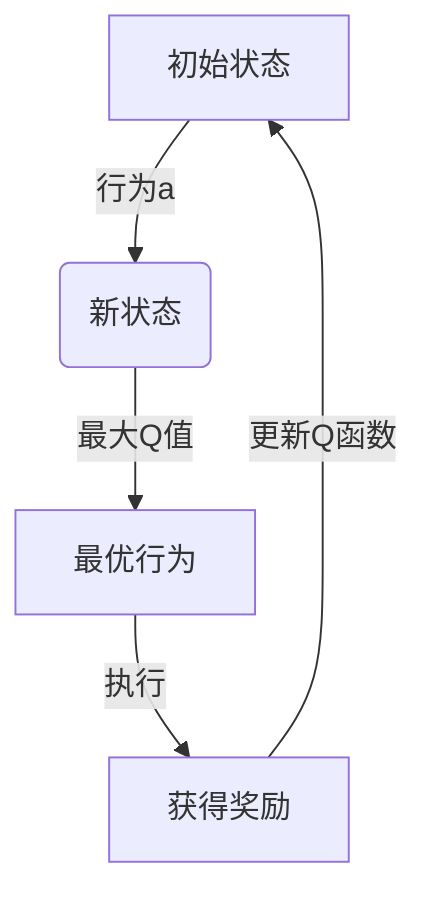

# 一切皆是映射：AI Q-learning在新冠病毒防控中的应用

## 1. 背景介绍

### 1.1 新冠肺炎疫情的挑战

2019年底,一种名为SARS-CoV-2的新型冠状病毒在中国武汉爆发,迅速蔓延至全球,造成了前所未有的公共卫生危机。新冠肺炎的高传染性、潜伏期长和症状多样等特点,给疫情防控带来了巨大挑战。传统的疫情防控措施如封城、居家隔离等,虽然在一定程度上控制了病毒传播,但也给人民生活和经济发展带来了沉重负担。

### 1.2 人工智能在疫情防控中的作用

在这场人类与病毒的拉锯战中,人工智能(AI)技术发挥了重要作用。AI系统可以快速分析大量数据,预测疫情走势,优化资源配置,为科学决策提供依据。其中,强化学习(Reinforcement Learning)是AI领域的一个重要分支,被广泛应用于决策优化、控制系统等领域。Q-learning作为强化学习的经典算法之一,展现出了在疫情防控中的巨大潜力。

## 2. 核心概念与联系

### 2.1 Q-learning算法概述

Q-learning是一种基于价值迭代的强化学习算法,它试图学习一个行为策略,使得在给定的马尔可夫决策过程(Markov Decision Process, MDP)中,能够最大化预期的累积奖励。

Q-learning算法的核心思想是,通过不断探索和利用,学习一个Q函数,该函数能够估计在当前状态下采取某个行为,之后能获得的最大预期奖励。具体来说,Q函数定义为:

$$Q(s,a) = r(s,a) + \gamma \max_{a'} Q(s',a')$$

其中,$s$表示当前状态,$a$表示在当前状态采取的行为,$r(s,a)$表示立即获得的奖励,$s'$表示由状态$s$和行为$a$转移到的下一个状态,$\gamma$是折现因子,用于权衡当前奖励和未来奖励的重要性。

通过不断更新Q函数,Q-learning算法最终会收敛到一个最优策略,使得在任何给定状态下,选择相应的最优行为,都能获得最大的预期累积奖励。



### 2.2 马尔可夫决策过程(MDP)

马尔可夫决策过程是Q-learning算法所建立的数学模型,用于描述一个完全可观测的、随机的决策序列。MDP通常由以下几个要素组成:

- 状态集合S: 描述系统可能处于的所有状态
- 行为集合A: 描述在每个状态下可以采取的行为
- 转移概率P(s'|s,a): 在状态s下采取行为a,转移到状态s'的概率
- 奖励函数R(s,a): 在状态s下采取行为a所获得的即时奖励

在疫情防控的场景中,我们可以将城市的疫情状况视为MDP中的状态,各种防控措施视为行为,疫情指标的变化视为奖励,从而构建出一个适用于Q-learning算法的MDP模型。

### 2.3 探索与利用的权衡

在Q-learning算法中,探索(Exploration)和利用(Exploitation)是一对重要的权衡概念。探索是指在当前状态下,选择一个新的、未知的行为,以获取更多信息;而利用是指选择当前已知的最优行为,以获得最大的即时奖励。

过度探索会导致算法收敛缓慢,而过度利用则可能陷入次优解。因此,Q-learning算法需要在探索和利用之间寻求一个合理的平衡,以实现最优策略的快速收敛。常见的探索策略包括$\epsilon$-greedy策略、软max策略等。

在疫情防控中,探索新的防控措施有助于发现更有效的策略,但也可能带来一定风险;而过度依赖已知的防控措施,则可能无法适应疫情的动态变化。因此,在Q-learning算法的应用中,需要根据具体情况,权衡探索和利用的比例。

## 3. 核心算法原理具体操作步骤

Q-learning算法的核心步骤如下:

1. 初始化Q函数,通常将所有Q值初始化为0或一个较小的常数。
2. 对于每个episode(即一个完整的决策序列):
    a) 初始化起始状态s
    b) 对于每个时间步骤t:
        i) 根据当前的探索策略(如$\epsilon$-greedy),选择一个行为a
        ii) 执行行为a,观察到下一个状态s'和即时奖励r
        iii) 根据下式更新Q(s,a):
        
        $$Q(s,a) \leftarrow Q(s,a) + \alpha [r + \gamma \max_{a'} Q(s',a') - Q(s,a)]$$
        
        其中$\alpha$是学习率,用于控制Q值的更新幅度。
        iv) 将s'作为新的当前状态
    c) 直到episode结束
3. 重复步骤2,直到Q函数收敛

在实际操作中,我们通常会维护一个查找表(如字典或矩阵)来存储Q值。对于连续状态和行为空间,我们可以使用函数逼近器(如神经网络)来拟合Q函数。

以下是一个简单的Python代码示例,实现了基于Q-learning的简单机器人导航:

```python
import numpy as np

# 定义网格世界
world = np.array([
    [0, 0, 0, 1],
    [0, None, 0, -1],
    [0, 0, 0, 0]
])

# 定义行为
actions = ['up', 'down', 'left', 'right']

# 初始化Q表
Q = np.zeros((world.shape + (4,)))

# 超参数
alpha = 0.1
gamma = 0.9
epsilon = 0.1

# 训练
for episode in range(1000):
    # 初始化起始状态
    row, col = 2, 0
    while world[row, col] != 1:
        # 选择行为
        if np.random.random() < epsilon:
            action = np.random.randint(4)
        else:
            action = np.argmax(Q[row, col])
        
        # 执行行为
        new_row, new_col = row, col
        if actions[action] == 'up' and row > 0 and world[row-1, col] != None:
            new_row -= 1
        elif actions[action] == 'down' and row < world.shape[0]-1 and world[row+1, col] != None:
            new_row += 1
        elif actions[action] == 'left' and col > 0 and world[row, col-1] != None:
            new_col -= 1
        elif actions[action] == 'right' and col < world.shape[1]-1 and world[row, col+1] != None:
            new_col += 1
        
        # 获取奖励
        reward = world[new_row, new_col]
        
        # 更新Q值
        Q[row, col, action] += alpha * (reward + gamma * np.max(Q[new_row, new_col]) - Q[row, col, action])
        
        # 更新状态
        row, col = new_row, new_col
        
    print(f'Episode {episode+1}, Reward: {reward}')
```

在这个示例中,我们定义了一个简单的网格世界,机器人的目标是从起点(2,0)导航到终点(0,3)。通过不断探索和利用,Q-learning算法逐步学习到了一个最优策略,使机器人能够安全到达终点。

## 4. 数学模型和公式详细讲解举例说明

### 4.1 马尔可夫决策过程(MDP)

马尔可夫决策过程是Q-learning算法所建立的数学模型,用于描述一个完全可观测的、随机的决策序列。MDP通常由以下几个要素组成:

- 状态集合S: 描述系统可能处于的所有状态,通常用$\mathcal{S}$表示。
- 行为集合A: 描述在每个状态下可以采取的行为,通常用$\mathcal{A}$表示。
- 转移概率$P(s'|s,a)$: 在状态$s\in\mathcal{S}$下采取行为$a\in\mathcal{A}$,转移到状态$s'\in\mathcal{S}$的概率。
- 奖励函数$R(s,a)$: 在状态$s\in\mathcal{S}$下采取行为$a\in\mathcal{A}$所获得的即时奖励。

在疫情防控的场景中,我们可以将城市的疫情状况视为MDP中的状态集合$\mathcal{S}$,各种防控措施视为行为集合$\mathcal{A}$,疫情指标的变化视为奖励函数$R(s,a)$,从而构建出一个适用于Q-learning算法的MDP模型。

例如,我们可以将一个城市的疫情状况简化为三个状态:$\mathcal{S} = \{低风险, 中风险, 高风险\}$,可采取的防控措施包括:$\mathcal{A} = \{居家隔离, 封闭管理, 核酸检测\}$。如果在高风险状态下采取封闭管理措施,疫情指标下降,则获得正奖励;反之,如果在低风险状态下采取过于严格的措施,则可能获得负奖励。

通过构建这样的MDP模型,Q-learning算法可以学习到一个最优策略,在每个疫情状态下选择合适的防控措施,从而最大限度地控制疫情,同时降低防控措施带来的负面影响。

### 4.2 Q函数和Bellman方程

Q函数是Q-learning算法的核心,它定义为在当前状态$s\in\mathcal{S}$下采取行为$a\in\mathcal{A}$,之后能获得的最大预期累积奖励。数学表达式为:

$$Q^*(s,a) = \mathbb{E}_\pi \left[ \sum_{k=0}^\infty \gamma^k r_{t+k+1} | s_t=s, a_t=a \right]$$

其中,$\pi$表示策略,$r_t$表示在时间步$t$获得的即时奖励,$\gamma\in[0,1]$是折现因子,用于权衡当前奖励和未来奖励的重要性。

Q函数满足Bellman方程:

$$Q^*(s,a) = \mathbb{E}_{s' \sim P(\cdot|s,a)} \left[ r(s,a) + \gamma \max_{a'} Q^*(s',a') \right]$$

这个方程揭示了Q函数的递推关系:在当前状态$s$下采取行为$a$,能获得的最大预期累积奖励,等于立即获得的奖励$r(s,a)$,加上从下一个状态$s'$出发,采取最优行为所能获得的最大预期累积奖励的折现值。

Q-learning算法就是通过不断更新Q函数,使其收敛到满足Bellman方程的最优Q函数$Q^*$,从而得到最优策略$\pi^*$。

例如,在疫情防控场景中,如果当前城市处于高风险状态,采取封闭管理措施,疫情指标有所下降(获得正奖励),且下一个状态为中风险状态,那么Q函数的更新公式为:

$$Q(高风险, 封闭管理) \leftarrow r(高风险, 封闭管理) + \gamma \max_a Q(中风险, a)$$

通过不断更新,Q函数最终会收敛到最优值,指导我们在每个状态下采取最佳的防控措施。

### 4.3 Q-learning算法更新规则

Q-learning算法的核心更新规则为:

$$Q(s,a) \leftarrow Q(s,a) + \alpha \left[ r + \gamma \max_{a'} Q(s',a') - Q(s,a) \right]$$

其中,$\alpha$是学习率,用于控制Q值的更新幅度。这个更新规则基于时序差分(Temporal Difference, TD)学习,通过不断缩小Q函数与其目标值之间的差异,逐步逼近最优Q函数$Q^*$。

更新规则的直观解释如下:

1. $r + \gamma \max_{a'} Q(s',a')$是Q函数的目标值,表示在当前状态$s$下采取行为$a$,获得即时奖励$r$,并从下一个状态$s'$出发,采取最优行为所能获得的最