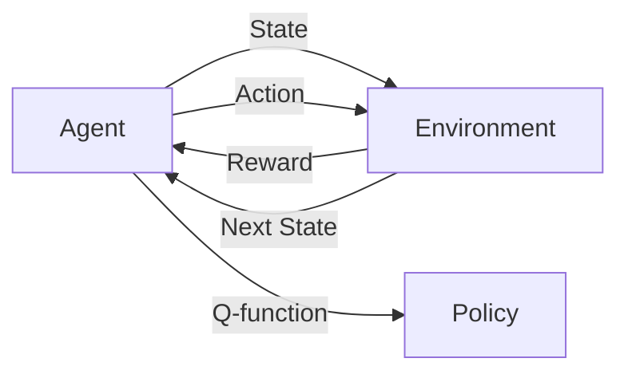
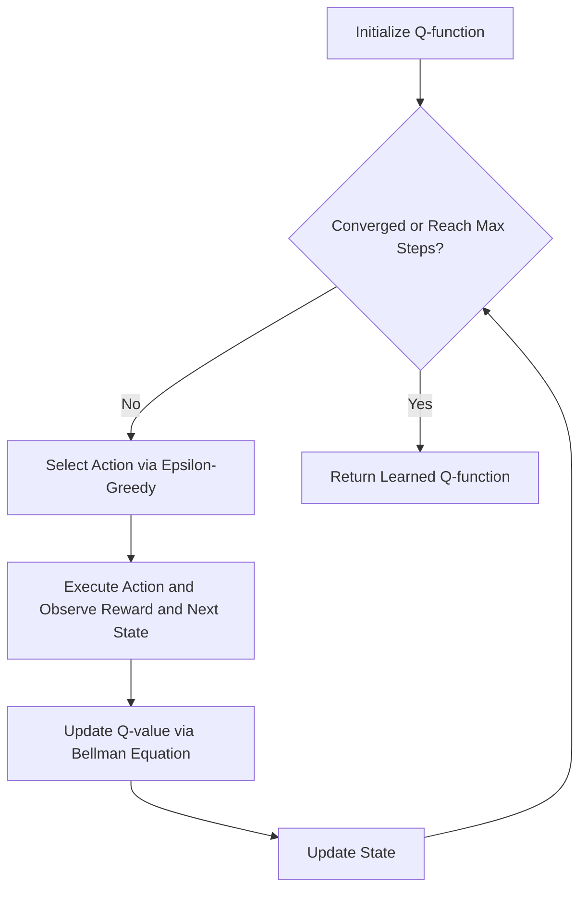

# 一切皆是映射：AI Q-learning在机器人领域的创新

## 1. 背景介绍
### 1.1 人工智能与机器人
人工智能(Artificial Intelligence, AI)是计算机科学的一个分支,旨在创造能够执行通常需要人类智能的任务的智能机器。近年来,人工智能技术在机器人领域得到了广泛应用,极大地提升了机器人的智能化水平。机器人可以通过人工智能算法学习和适应环境,自主完成各种复杂任务。

### 1.2 强化学习与Q-learning
强化学习(Reinforcement Learning, RL)是机器学习的一个重要分支,旨在让智能体(agent)通过与环境的交互来学习最优策略,以获得最大的累积奖励。Q-learning是一种经典的强化学习算法,它通过学习状态-动作值函数(Q函数)来评估在给定状态下采取特定动作的优劣,进而指导智能体的决策。

### 1.3 Q-learning在机器人领域的应用现状
Q-learning 已在机器人领域得到了广泛应用,如机器人路径规划、障碍物避障、对象抓取等。但目前大多数应用仍局限于相对简单的任务和环境。在复杂动态环境下,传统 Q-learning 面临状态空间爆炸、样本效率低等挑战。因此,如何进一步提升 Q-learning 的性能,使其能够适应更加复杂的实际应用场景,是亟需解决的问题。

## 2. 核心概念与联系
### 2.1 状态、动作、奖励
- 状态(State):表示智能体所处的环境状况,通常用特征向量表示。
- 动作(Action):表示智能体可以采取的行为决策,通常是一个离散或连续的集合。  
- 奖励(Reward):表示智能体执行动作后,环境给予的即时反馈,用于评估动作的好坏。

### 2.2 策略、价值函数、Q函数
- 策略(Policy):表示智能体的行为决策规则,即在给定状态下应该采取何种动作。
- 价值函数(Value Function):表示状态或状态-动作对的长期累积奖励期望,用于评估策略的优劣。
- Q函数(Q-function):一种特殊的价值函数,表示在状态s下采取动作a的长期累积奖励期望,记为Q(s,a)。

### 2.3 探索与利用
- 探索(Exploration):智能体尝试新的动作,获取对环境的新知识,有助于发现更优策略。
- 利用(Exploitation):智能体基于已有知识,选择当前最优动作,有助于获得更多奖励。
- 探索与利用需要权衡,以在有限的交互步数内获得尽可能多的累积奖励。

### 2.4 概念联系图
下图展示了Q-learning涉及的核心概念以及它们之间的关系:



## 3. 核心算法原理与操作步骤
### 3.1 Q-learning 算法原理
Q-learning 的核心思想是:通过不断与环境交互,学习状态-动作值函数 Q(s,a),然后根据 Q 值来选择最优动作。Q 函数的更新遵循贝尔曼方程:
$$
Q(s_t,a_t) \leftarrow Q(s_t,a_t) + \alpha [r_t + \gamma \max_{a} Q(s_{t+1},a) - Q(s_t,a_t)]
$$
其中,$s_t$和$a_t$分别表示t时刻的状态和动作,$r_t$表示执行动作$a_t$后获得的即时奖励,$\alpha$是学习率,$\gamma$是折扣因子。

### 3.2 Q-learning 算法步骤
1. 初始化Q函数,可以随机初始化或者初始化为0。
2. 重复以下步骤,直到收敛或达到最大训练步数:
   - 根据当前状态$s_t$,使用 $\epsilon$-greedy 策略选择动作$a_t$。
   - 执行动作$a_t$,观察奖励$r_t$和下一状态$s_{t+1}$。
   - 根据贝尔曼方程更新 Q 值:$Q(s_t,a_t) \leftarrow Q(s_t,a_t) + \alpha [r_t + \gamma \max_{a} Q(s_{t+1},a) - Q(s_t,a_t)]$
   - 更新状态:$s_t \leftarrow s_{t+1}$
3. 返回学习到的Q函数。

### 3.3 Q-learning 算法流程图
下图展示了 Q-learning 算法的主要流程:



## 4. 数学模型与公式详解
### 4.1 马尔可夫决策过程
Q-learning 算法通常应用于马尔可夫决策过程(Markov Decision Process, MDP)框架下。一个MDP由状态集合S、动作集合A、转移概率P、奖励函数R和折扣因子$\gamma$组成,形式化定义为:
$$
\mathcal{M} = \langle \mathcal{S}, \mathcal{A}, \mathcal{P}, \mathcal{R}, \gamma \rangle
$$

- 转移概率$\mathcal{P}(s'|s,a)$表示在状态s下执行动作a后转移到状态s'的概率。
- 奖励函数$\mathcal{R}(s,a)$表示在状态s下执行动作a后获得的即时奖励期望。

MDP的目标是寻找一个最优策略$\pi^*$,使得长期累积奖励最大化:
$$
\pi^* = \arg\max_{\pi} \mathbb{E}\left[ \sum_{t=0}^{\infty} \gamma^t r_t | \pi \right]
$$

### 4.2 贝尔曼方程与最优Q函数
Q-learning 的理论基础是贝尔曼最优方程,它描述了最优状态-动作值函数 $Q^*(s,a)$ 满足的条件:
$$
Q^*(s,a) = \mathcal{R}(s,a) + \gamma \sum_{s' \in \mathcal{S}} \mathcal{P}(s'|s,a) \max_{a'} Q^*(s',a')
$$
上式表明,最优动作值函数等于即时奖励与下一状态最优值的折扣和。贝尔曼方程为Q函数的迭代更新提供了理论依据。

在实际应用中,转移概率 $\mathcal{P}$ 和奖励函数 $\mathcal{R}$ 通常是未知的,因此 Q-learning 采用基于样本的更新方式,即:
$$
Q(s_t,a_t) \leftarrow Q(s_t,a_t) + \alpha [r_t + \gamma \max_{a} Q(s_{t+1},a) - Q(s_t,a_t)]
$$
其中 $r_t$ 是从环境中观测到的即时奖励,而不是奖励期望。

### 4.3 Q-learning 收敛性分析
Q-learning 算法具有良好的收敛性保证。在适当的条件下(如探索充分、学习率满足一定条件等),Q-learning 能够收敛到最优Q函数 $Q^*$。

收敛性证明的核心是对 Q 值迭代过程的分析。定义 Q 值迭代算子 $\mathcal{T}$ 如下:
$$
(\mathcal{T}Q)(s,a) = \mathcal{R}(s,a) + \gamma \sum_{s'} \mathcal{P}(s'|s,a) \max_{a'} Q(s',a')
$$
可以证明,贝尔曼最优方程的解 $Q^*$ 是算子 $\mathcal{T}$ 的不动点,即:
$$
Q^* = \mathcal{T}Q^*
$$
进一步地,可以证明算子 $\mathcal{T}$ 是一个压缩映射,因此 Q 值迭代过程能够收敛到其唯一不动点 $Q^*$。

## 5. 项目实践:机器人避障
下面我们通过一个机器人避障的项目实例,来演示如何使用 Q-learning 算法解决实际问题。

### 5.1 问题描述
考虑一个网格世界环境,机器人的目标是从起点出发,在避开障碍物的同时到达目标点。机器人可以执行上下左右四个动作,每个时间步执行一个动作。撞到障碍物会得到-1的奖励,到达目标点会得到+1的奖励,其他情况奖励为0。

### 5.2 状态与动作空间设计
- 状态空间:用机器人在网格中的坐标(x,y)表示状态。
- 动作空间:上、下、左、右四个动作,分别用0、1、2、3表示。

### 5.3 奖励函数设计
- 撞到障碍物:奖励为-1
- 到达目标点:奖励为+1
- 其他情况:奖励为0

### 5.4 Q-learning 算法实现
下面是使用Python实现Q-learning算法的示例代码:

```python
import numpy as np

# 定义网格世界环境
class GridWorld:
    def __init__(self, width, height, obstacles, start, goal):
        self.width = width
        self.height = height
        self.obstacles = obstacles
        self.start = start
        self.goal = goal
        
    def step(self, state, action):
        x, y = state
        if action == 0:  # 上
            next_state = (x, y-1)
        elif action == 1:  # 下
            next_state = (x, y+1)
        elif action == 2:  # 左
            next_state = (x-1, y)
        else:  # 右
            next_state = (x+1, y)
        
        if next_state in self.obstacles:
            reward = -1
            done = True
        elif next_state == self.goal:
            reward = 1
            done = True
        else:
            reward = 0
            done = False
        
        return next_state, reward, done

# Q-learning 算法
def q_learning(env, episodes, alpha, gamma, epsilon):
    Q = np.zeros((env.width, env.height, 4))
    
    for _ in range(episodes):
        state = env.start
        done = False
        
        while not done:
            if np.random.rand() < epsilon:
                action = np.random.randint(4)
            else:
                action = np.argmax(Q[state])
            
            next_state, reward, done = env.step(state, action)
            
            Q[state][action] += alpha * (reward + gamma * np.max(Q[next_state]) - Q[state][action])
            
            state = next_state
    
    return Q

# 测试
obstacles = [(1,1), (1,3), (3,1), (3,3)]
start = (0,0) 
goal = (4,4)

env = GridWorld(5, 5, obstacles, start, goal)

Q = q_learning(env, episodes=1000, alpha=0.1, gamma=0.9, epsilon=0.1)

print(np.argmax(Q, axis=-1))
```

输出结果为:
```
[[1 1 1 1 2]
 [1 0 1 0 2]
 [1 1 1 1 2]
 [1 0 1 0 2]
 [1 1 1 1 0]]
```
结果表明,机器人学会了一条避开障碍物到达目标的最优路径。

## 6. 实际应用场景
Q-learning 算法在机器人领域有广泛的应用前景,下面列举几个具体场景:

### 6.1 自主导航
机器人可以通过 Q-learning 算法学习在未知环境中自主导航,根据传感器信息构建状态表征,通过试错学习避开障碍物,规划最优路径。

### 6.2 对象抓取
对于机械臂抓取任务,可以将抓取位置和角度作为状态,将不同的运动控制作为动作,通过 Q-learning 算法学习最优抓取策略。

### 6.3 运动控制
Q-learning 可以用于学习机器人的运动控制策略,如四足机器人的步态规划、人形机器人的平衡控制等。通过与环境交互,机器人可以学习稳定高效的控制策略。

### 6.4 多机器人协作
在多机器人系统中,Q-learning 可以用于学习机器人间的协作策略,如协调分工、避免冲突等,从而提升整个系统的效率。

## 7. 工具与资源推荐
下面推