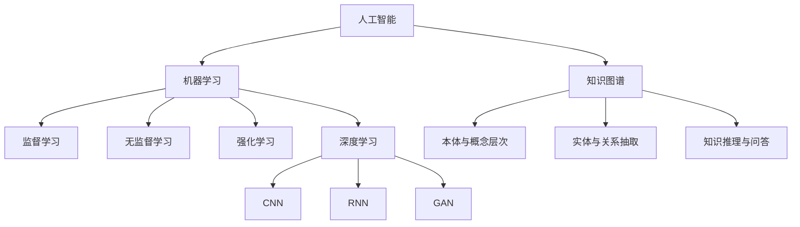

# 一切皆是映射：AI在航空航天中的驱动力

## 1. 背景介绍

人工智能(Artificial Intelligence, AI)技术的飞速发展正在深刻影响和重塑着各行各业,航空航天领域也不例外。AI正逐步渗透到航空航天的各个环节,从飞行器设计、制造、测试,到飞行控制、导航、通信等方方面面,AI正成为航空航天领域的重要驱动力。

### 1.1 AI在航空航天中的应用现状

#### 1.1.1 飞行器设计与制造

- 基于AI的设计优化
- 智能制造与质量检测

#### 1.1.2 飞行控制与导航  

- 自主飞行控制系统
- 智能导航与路径规划

#### 1.1.3 通信与数据处理

- 智能通信与网络优化 
- 海量数据的实时处理与分析

### 1.2 AI赋能航空航天的意义

#### 1.2.1 提升安全性与可靠性

#### 1.2.2 提高效率与性能 

#### 1.2.3 降低成本与资源消耗

## 2. 核心概念与联系

要理解AI如何赋能航空航天,需要先了解一些核心概念:

### 2.1 机器学习

机器学习是实现AI的关键技术之一。通过学习大量数据,机器可以自主建立模型,用于对新数据进行预测和决策。

#### 2.1.1 监督学习

#### 2.1.2 无监督学习  

#### 2.1.3 强化学习

### 2.2 深度学习

深度学习是机器学习的一个重要分支,利用多层神经网络,可以自动学习数据的层次化特征表示。

#### 2.2.1 卷积神经网络(CNN)

#### 2.2.2 循环神经网络(RNN)

#### 2.2.3 生成对抗网络(GAN)

### 2.3 知识图谱 

知识图谱以结构化的方式表示概念、实体及其关联,便于机器理解和推理。

#### 2.3.1 本体与概念层次

#### 2.3.2 实体与关系抽取

#### 2.3.3 知识推理与问答

下图展示了这些AI核心概念之间的联系:



## 3. 核心算法原理具体操作步骤

接下来,我们详细介绍几个在航空航天领域应用的AI核心算法。

### 3.1 基于强化学习的飞行控制算法

#### 3.1.1 MDP建模

将飞行控制问题建模为马尔可夫决策过程(MDP)。

- 状态空间的定义
- 动作空间的定义 
- 状态转移概率
- 奖励函数设计

#### 3.1.2 值函数与策略迭代

- 值函数的贝尔曼方程
- 策略评估与策略提升
- 探索与利用的平衡

#### 3.1.3 DQN算法

利用深度神经网络逼近动作-值函数。

- 经验回放
- 目标网络 
- Double DQN

### 3.2 基于CNN的视觉导航算法

#### 3.2.1 数据采集与预处理

- 搭建仿真环境采集图像数据
- 图像增强与标注  

#### 3.2.2 CNN模型设计

- 特征提取网络:ResNet等
- 回归或分类输出层

#### 3.2.3 模型训练与测试

- 数据集划分
- 损失函数与评价指标
- 超参数调优

### 3.3 基于知识图谱的故障诊断算法

#### 3.3.1 构建航空器系统知识图谱

- 本体构建:系统、部件、故障、原因等
- 实体关系抽取:故障-原因、故障-征兆等

#### 3.3.2 基于知识图谱的推理

- 基于规则的推理
- 基于表示学习的推理

#### 3.3.3 故障原因定位与排除

- 知识图谱与专家系统结合
- 推荐可能的解决方案

## 4. 数学模型和公式详细讲解举例说明

为了更好地理解上述算法,下面我们对其中的一些关键数学模型进行详细讲解。

### 4.1 马尔可夫决策过程(MDP)

MDP可以用一个五元组 $<S,A,P,R,\gamma>$ 来表示:

- $S$ 是有限的状态集合
- $A$ 是有限的动作集合
- $P$ 是状态转移概率矩阵,$P(s'|s,a)$ 表示在状态 $s$ 下执行动作 $a$ 后转移到状态 $s'$ 的概率
- $R$ 是奖励函数,$R(s,a)$ 表示在状态 $s$ 下执行动作 $a$ 后获得的即时奖励
- $\gamma \in [0,1]$ 是折扣因子,表示未来奖励的重要程度

在MDP中,智能体的目标是寻找一个最优策略 $\pi^*$,使得期望累积奖励最大化:

$$\pi^* = \arg\max_{\pi} \mathbb{E}\left[\sum_{t=0}^{\infty} \gamma^t R(s_t,a_t) | \pi \right]$$

其中 $s_t,a_t$ 分别表示 $t$ 时刻的状态和动作。

### 4.2 值函数与贝尔曼方程

为了求解最优策略,我们引入值函数的概念。状态值函数 $V^{\pi}(s)$ 表示从状态 $s$ 开始,遵循策略 $\pi$ 的期望累积奖励:

$$V^{\pi}(s) = \mathbb{E}\left[\sum_{t=0}^{\infty} \gamma^t R(s_t,a_t) | s_0=s, \pi \right]$$

类似地,动作值函数 $Q^{\pi}(s,a)$ 表示在状态 $s$ 下执行动作 $a$,然后遵循策略 $\pi$ 的期望累积奖励:

$$Q^{\pi}(s,a) = \mathbb{E}\left[\sum_{t=0}^{\infty} \gamma^t R(s_t,a_t) | s_0=s, a_0=a, \pi \right]$$

值函数满足贝尔曼方程:

$$V^{\pi}(s) = \sum_{a} \pi(a|s) \left[ R(s,a) + \gamma \sum_{s'} P(s'|s,a) V^{\pi}(s') \right]$$

$$Q^{\pi}(s,a) = R(s,a) + \gamma \sum_{s'} P(s'|s,a) \sum_{a'} \pi(a'|s') Q^{\pi}(s',a')$$

最优值函数 $V^*(s)$ 和 $Q^*(s,a)$ 满足贝尔曼最优方程:

$$V^*(s) = \max_{a} \left[ R(s,a) + \gamma \sum_{s'} P(s'|s,a) V^*(s') \right]$$

$$Q^*(s,a) = R(s,a) + \gamma \sum_{s'} P(s'|s,a) \max_{a'} Q^*(s',a')$$

### 4.3 DQN算法

传统的Q学习在状态和动作空间很大时难以收敛,DQN算法利用深度神经网络 $Q(s,a;\theta)$ 来逼近 $Q^*(s,a)$,其中 $\theta$ 为网络参数。

DQN的损失函数定义为:

$$L(\theta) = \mathbb{E}_{(s,a,r,s')\sim D} \left[ \left( r + \gamma \max_{a'} Q(s',a';\theta^-) - Q(s,a;\theta) \right)^2 \right]$$

其中 $D$ 为经验回放缓冲区, $\theta^-$ 为目标网络参数,用于计算TD目标。

DQN算法的具体步骤如下:

1. 随机初始化Q网络参数 $\theta$,目标网络参数 $\theta^- = \theta$
2. 初始化经验回放缓冲区 $D$
3. for episode = 1 to M do
4. &nbsp;&nbsp;&nbsp;&nbsp;初始化初始状态 $s_0$
5. &nbsp;&nbsp;&nbsp;&nbsp;for t = 1 to T do
6. &nbsp;&nbsp;&nbsp;&nbsp;&nbsp;&nbsp;&nbsp;&nbsp;根据 $\epsilon$-贪婪策略选择动作 $a_t$
7. &nbsp;&nbsp;&nbsp;&nbsp;&nbsp;&nbsp;&nbsp;&nbsp;执行动作 $a_t$,观察奖励 $r_t$ 和下一状态 $s_{t+1}$
8. &nbsp;&nbsp;&nbsp;&nbsp;&nbsp;&nbsp;&nbsp;&nbsp;将转移 $(s_t,a_t,r_t,s_{t+1})$ 存入 $D$ 
9. &nbsp;&nbsp;&nbsp;&nbsp;&nbsp;&nbsp;&nbsp;&nbsp;从 $D$ 中采样一个批次的转移
10. &nbsp;&nbsp;&nbsp;&nbsp;&nbsp;&nbsp;&nbsp;&nbsp;计算TD目标 $y_i = r_i + \gamma \max_{a'} Q(s_i',a';\theta^-)$
11. &nbsp;&nbsp;&nbsp;&nbsp;&nbsp;&nbsp;&nbsp;&nbsp;最小化损失 $L(\theta) = \frac{1}{N} \sum_i (y_i - Q(s_i,a_i;\theta))^2$
12. &nbsp;&nbsp;&nbsp;&nbsp;&nbsp;&nbsp;&nbsp;&nbsp;每 $C$ 步同步目标网络参数 $\theta^- = \theta$
13. &nbsp;&nbsp;&nbsp;&nbsp;end for
14. end for

## 5. 项目实践：代码实例和详细解释说明

下面我们通过一个简单的例子来演示如何用PyTorch实现DQN算法。

### 5.1 问题描述

我们考虑经典的CartPole问题,一根杆子通过一个关节连接在一个小车上,杆子初始处于垂直平衡状态。要求通过左右移动小车,使得杆子尽可能长时间地保持平衡状态。

状态空间为4维向量: $[x, \dot{x}, \theta, \dot{\theta}]$,分别表示小车位置、速度、杆子角度、角速度。动作空间为2维:向左或向右推动小车。每个时间步的奖励为1,如果杆子倾斜角度超过15度或者小车移动距离超过2.4,则回合结束。

### 5.2 代码实现

首先定义Q网络:

```python
import torch
import torch.nn as nn
import torch.nn.functional as F

class QNet(nn.Module):
    def __init__(self, state_dim, action_dim):
        super(QNet, self).__init__()
        self.fc1 = nn.Linear(state_dim, 64)
        self.fc2 = nn.Linear(64, 64)
        self.fc3 = nn.Linear(64, action_dim)
        
    def forward(self, x):
        x = F.relu(self.fc1(x))
        x = F.relu(self.fc2(x))
        return self.fc3(x)
```

然后定义DQN智能体:

```python
import random
from collections import deque

class DQNAgent:
    def __init__(self, state_dim, action_dim, lr, gamma, epsilon, buffer_size, batch_size):
        self.state_dim = state_dim
        self.action_dim = action_dim
        self.lr = lr
        self.gamma = gamma
        self.epsilon = epsilon
        self.buffer_size = buffer_size
        self.batch_size = batch_size
        
        self.Q = QNet(state_dim, action_dim)
        self.Q_target = QNet(state_dim, action_dim)
        self.Q_target.load_state_dict(self.Q.state_dict())
        
        self.optimizer = torch.optim.Adam(self.Q.parameters(), lr=lr)
        self.buffer = deque(maxlen=buffer_size)
        
    def act(self, state):
        if random.random() < self.epsilon:
            return random.randint(0, self.action_dim - 1)
        else:
            state = torch.tensor(state, dtype=torch.float32).unsqueeze(0)
            q_values = self.Q(state)
            return q_values.argmax().item()
        
    def learn(self):
        if len(self.buffer) < self.batch_size:
            return
        
        batch = random.sample(self.buffer, self.batch_size)
        states, actions, rewards, next_states, dones = zip(*batch)
        
        states = torch.tensor(states, dtype=torch.float32)
        actions = torch.tensor(actions, dtype=torch.long).unsqueeze(1)
        rewards = torch.tensor(rewards, dtype=torch.float32).unsqueeze(1)
        next_states = torch.tensor(next_states, dtype=torch.float32)
        dones = torch.tensor(dones, dtype=torch.float