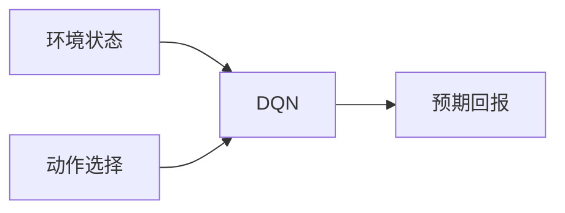

## 1.背景介绍

在我们的日常生活中，自动化系统无处不在，从自动售货机到先进的制造线，自动化技术正在改变我们的生活方式。然而，自动化系统的设计和实施是一项复杂的任务，需要深入理解系统的工作原理和各种可能的场景。在这个背景下，深度强化学习（Deep Reinforcement Learning，DRL）及其一种重要的实现方式——深度Q网络（Deep Q Network，DQN）的出现为工业自动化带来了新的机遇和挑战。

## 2.核心概念与联系

深度强化学习是一种结合了深度学习和强化学习的方法。深度学习是一种使用神经网络模型进行学习的方法，而强化学习是一种通过与环境的交互进行学习的方法。DQN则是将这两种方法结合起来，使用深度学习模型来估计强化学习中的Q函数。

Q函数是强化学习中的一个核心概念，它表示在某个状态下采取某个动作所能获得的预期回报。DQN的目标就是通过学习找到最优的Q函数，从而找到最优的策略。

在工业自动化的场景中，我们可以将自动化系统的状态、动作和奖励映射到强化学习的框架中，通过DQN来找到最优的控制策略。



## 3.核心算法原理具体操作步骤

DQN的核心算法原理可以分为以下几个步骤：

1. 初始化Q网络和目标Q网络。
2. 根据当前状态选择动作，这里使用了一种称为ϵ-greedy的策略，即以ϵ的概率随机选择动作，以1-ϵ的概率选择当前Q网络认为最优的动作。
3. 执行动作，观察环境的反馈（新的状态和奖励）。
4. 将观察到的转移（状态、动作、奖励、新状态）存储到经验回放缓冲区中。
5. 从经验回放缓冲区中随机抽取一批转移，计算目标Q值，并用这些目标Q值更新Q网络。
6. 每隔一段时间，用Q网络的参数更新目标Q网络。

## 4.数学模型和公式详细讲解举例说明

在DQN中，我们使用神经网络来估计Q函数，即$Q(s,a;θ)$，其中$s$是状态，$a$是动作，$θ$是神经网络的参数。我们的目标是找到最优的参数$θ^*$，使得Q函数最接近真实的Q函数。

我们使用贝尔曼方程来计算目标Q值：

$$
y = r + γ \max_{a'} Q(s',a';θ^-)
$$

其中$r$是奖励，$γ$是折扣因子，$s'$是新的状态，$a'$是新的动作，$θ^-$是目标Q网络的参数。

我们使用均方误差作为损失函数，来更新Q网络的参数：

$$
L(θ) = E_{(s,a,r,s')∼U(D)}[(y - Q(s,a;θ))^2]
$$

其中$U(D)$表示从经验回放缓冲区$D$中随机抽取的转移。

## 5.项目实践：代码实例和详细解释说明

在实际的项目中，我们可以使用Python的强化学习库，如OpenAI的gym和baselines库，来实现DQN算法。以下是一个简单的示例：

```python
import gym
from baselines import deepq

def main():
    env = gym.make("CartPole-v0")
    model = deepq.models.mlp([64])
    act = deepq.learn(
        env,
        q_func=model,
        lr=1e-3,
        max_timesteps=100000,
        buffer_size=50000,
        exploration_fraction=0.1,
        exploration_final_eps=0.02,
        print_freq=10
    )
    act.save("cartpole_model.pkl")
    env.close()

if __name__ == '__main__':
    main()
```

## 6.实际应用场景

DQN在工业自动化中的应用非常广泛，例如在制造业中，可以用DQN来优化生产线的调度；在物流领域，可以用DQN来优化货物的配送路径；在能源领域，可以用DQN来优化电网的运行策略。

## 7.工具和资源推荐

推荐使用Python的强化学习库，如OpenAI的gym和baselines库，以及Google的TensorFlow库，来实现DQN算法。这些库提供了丰富的环境和算法，可以帮助我们快速地实现和测试DQN算法。

## 8.总结：未来发展趋势与挑战

随着深度学习和强化学习技术的发展，DQN在工业自动化中的应用将会越来越广泛。然而，DQN也面临着一些挑战，例如如何处理连续的状态和动作空间，如何处理部分可观测的环境，如何提高学习的稳定性和效率等。这些都是我们在未来需要进一步研究和解决的问题。

## 9.附录：常见问题与解答

Q: DQN的训练需要多长时间？
A: 这取决于许多因素，如环境的复杂性，网络的大小，训练的步数等。在一些简单的环境中，可能只需要几分钟就可以训练出一个合理的策略。但在一些复杂的环境中，可能需要几天甚至几周的时间。

Q: DQN可以处理连续的动作空间吗？
A: 传统的DQN只能处理离散的动作空间。但有一些变种的DQN，如深度确定性策略梯度（Deep Deterministic Policy Gradient，DDPG）和软性行动者-评论家（Soft Actor-Critic，SAC）可以处理连续的动作空间。

作者：禅与计算机程序设计艺术 / Zen and the Art of Computer Programming