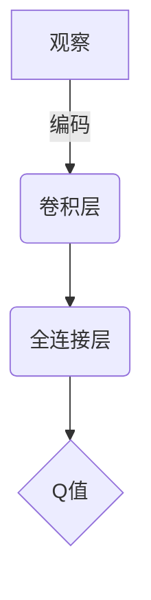
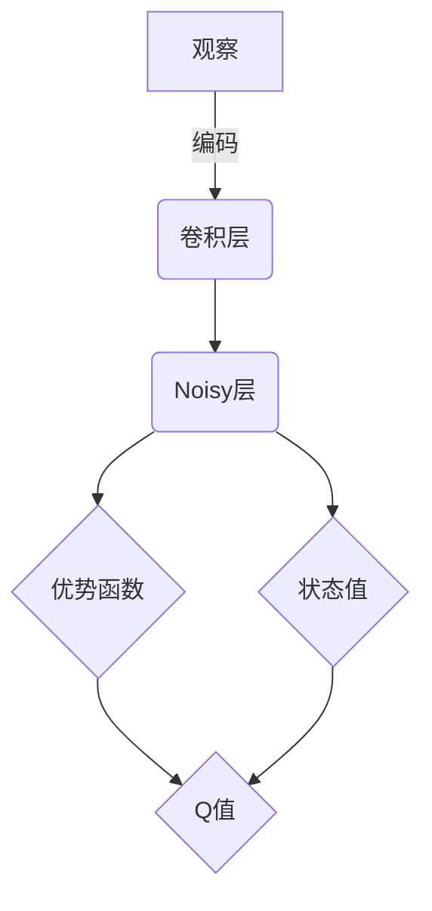
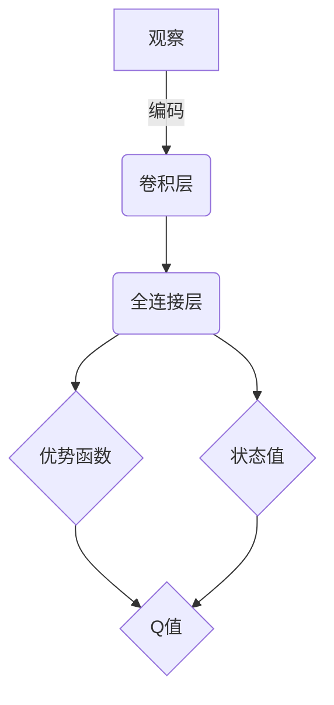

# 一切皆是映射：从DQN到Rainbow：全面指南与实践小结

## 1.背景介绍

### 1.1 强化学习与价值函数

强化学习是机器学习的一个重要分支,它关注智能体与环境之间的交互过程。在这个过程中,智能体通过观察当前状态,采取行动来影响环境,并根据环境的反馈(奖励或惩罚)来调整自身的策略,最终达到最大化期望累计奖励的目标。

价值函数是强化学习中的一个核心概念,它用于估计在某个状态下采取某个行为序列所能获得的期望累计奖励。通过学习价值函数,智能体可以找到最优策略,从而解决复杂的决策问题。

### 1.2 深度强化学习与深度Q网络(DQN)

传统的强化学习算法在处理高维观察空间和动作空间时往往会遇到维数灾难的问题。深度强化学习(Deep Reinforcement Learning)的出现为解决这一问题提供了新的思路,它将深度神经网络引入强化学习,用于近似价值函数或策略函数。

深度Q网络(Deep Q-Network, DQN)是深度强化学习中的一个里程碑式算法,它使用深度神经网络来近似Q函数(状态-行为价值函数),从而解决了高维观察空间和离散动作空间下的强化学习问题。DQN的提出极大推动了深度强化学习在实践中的应用,如Atari游戏、机器人控制等领域。

### 1.3 从DQN到Rainbow

虽然DQN取得了巨大的成功,但它仍然存在一些缺陷和局限性,如过估计问题、样本相关性等。为了解决这些问题,研究人员提出了一系列改进算法,如Double DQN、Prioritized Experience Replay、Dueling Network等。Rainbow算法将这些改进集成在一起,成为了DQN系列算法的集大成者。

Rainbow算法不仅在性能上有所提升,而且在理论上也更加完备。它结合了多种增强技术,如双Q学习、优先级经验回放、多步Bootstrap目标更新、噪声网络等,从而显著提高了强化学习算法的稳定性和鲁棒性。

## 2.核心概念与联系

### 2.1 Q-Learning与Q函数

Q-Learning是一种基于价值函数的强化学习算法,它旨在学习Q函数,即在给定状态下采取某个行为所能获得的期望累计奖励。Q函数的定义如下:

$$Q(s,a) = \mathbb{E}_\pi\left[\sum_{t=0}^\infty \gamma^t r_{t+1} | s_0=s, a_0=a, \pi\right]$$

其中,$s$表示当前状态,$a$表示采取的行动,$r_t$表示第$t$个时间步的即时奖励,$\gamma$是折现因子,用于平衡未来奖励的重要性。$\pi$表示策略,即在每个状态下选择行动的概率分布。

通过学习Q函数,我们可以找到最优策略$\pi^*$,使得在任何状态下采取该策略所获得的期望累计奖励最大化。

### 2.2 深度Q网络(DQN)

深度Q网络(DQN)使用深度神经网络来近似Q函数,其网络结构如下所示:

在DQN中,观察(如游戏画面)首先通过卷积层进行编码,提取出有用的特征。然后,这些特征被输入到全连接层,最终输出每个动作对应的Q值。通过最大化Q值,我们可以选择在当前状态下的最优行动。

DQN的训练过程采用了经验回放(Experience Replay)和目标网络(Target Network)等技术,以提高训练的稳定性和效率。

### 2.3 增强技术

为了进一步提高DQN的性能,研究人员提出了多种增强技术,如:

1. **Double DQN**: 解决Q值过估计问题。
2. **Prioritized Experience Replay**: 优先回放重要的转换,提高数据利用率。
3. **Dueling Network**: 将Q值分解为状态值和优势函数,加速训练。
4. **多步Bootstrap目标更新**: 使用多步累计奖励作为目标,提高收敛速度。
5. **噪声网络(Noisy Net)**: 通过注入噪声探索,提高探索效率。

这些增强技术针对DQN存在的不同问题,从不同角度对算法进行了改进和优化。

### 2.4 Rainbow算法

Rainbow算法将上述增强技术集成在一起,形成了一个更加强大和通用的深度强化学习框架。它的网络结构如下所示:

Rainbow算法的核心思想是:

1. 使用优先级经验回放提高数据利用率。
2. 采用双Q估计和多步Bootstrap目标更新,减少Q值过估计。
3. 引入Dueling Network架构,分解Q值为状态值和优势函数。
4. 使用Noisy Net进行高效探索。

通过这些技术的有机结合,Rainbow算法在许多任务上都展现出了卓越的性能,成为深度强化学习领域的一个重要里程碑。

## 3.核心算法原理具体操作步骤

### 3.1 DQN算法流程

深度Q网络(DQN)算法的核心流程如下:

1. 初始化深度神经网络$Q(s,a;\theta)$和目标网络$Q'(s,a;\theta')$,其中$\theta$和$\theta'$分别表示两个网络的参数。
2. 初始化经验回放池$D$。
3. 对于每个时间步:
    a. 根据$\epsilon$-贪婪策略选择动作$a_t$:以概率$\epsilon$随机选择动作,或选择$\arg\max_a Q(s_t,a;\theta)$。
    b. 执行动作$a_t$,观察到新状态$s_{t+1}$和奖励$r_t$。
    c. 将转换$(s_t,a_t,r_t,s_{t+1})$存入经验回放池$D$。
    d. 从$D$中随机采样一个小批量数据$(s_j,a_j,r_j,s_{j+1})$。
    e. 计算目标Q值:$y_j = r_j + \gamma \max_{a'} Q'(s_{j+1},a';\theta')$。
    f. 优化损失函数:$L(\theta) = \mathbb{E}_{(s,a,r,s')\sim D}\left[(y - Q(s,a;\theta))^2\right]$。
    g. 每隔一定步数,将$\theta'$更新为$\theta$。
4. 重复步骤3,直至收敛。

在DQN算法中,引入了经验回放池和目标网络等技术,以提高训练的稳定性和效率。经验回放池用于存储过去的转换,从中随机采样小批量数据进行训练,打破了数据之间的相关性。目标网络则用于计算目标Q值,减少了目标值的不稳定性。

### 3.2 Double DQN算法流程

Double DQN算法是对DQN算法的一个改进,它解决了DQN存在的Q值过估计问题。Double DQN的核心思想是将选择动作和评估Q值的过程分开,使用不同的网络进行这两个操作。具体算法流程如下:

1. 初始化两个深度神经网络$Q(s,a;\theta)$和$Q'(s,a;\theta')$,分别用于选择动作和评估Q值。
2. 初始化经验回放池$D$。
3. 对于每个时间步:
    a. 根据$\epsilon$-贪婪策略选择动作$a_t = \arg\max_a Q(s_t,a;\theta)$。
    b. 执行动作$a_t$,观察到新状态$s_{t+1}$和奖励$r_t$。
    c. 将转换$(s_t,a_t,r_t,s_{t+1})$存入经验回放池$D$。
    d. 从$D$中随机采样一个小批量数据$(s_j,a_j,r_j,s_{j+1})$。
    e. 计算目标Q值:$y_j = r_j + \gamma Q'(s_{j+1},\arg\max_a Q(s_{j+1},a;\theta);\theta')$。
    f. 优化损失函数:$L(\theta) = \mathbb{E}_{(s,a,r,s')\sim D}\left[(y - Q(s,a;\theta))^2\right]$。
    g. 每隔一定步数,将$\theta'$更新为$\theta$。
4. 重复步骤3,直至收敛。

在Double DQN中,选择动作时使用$Q(s,a;\theta)$网络,而计算目标Q值时则使用$Q'(s,a;\theta')$网络。这种分离机制可以有效减少Q值的过估计,从而提高算法的性能。

### 3.3 Prioritized Experience Replay

Prioritized Experience Replay是一种改进的经验回放策略,它根据转换的重要性对经验进行优先级采样。具体操作步骤如下:

1. 初始化一个优先级经验回放池$D$,并为每个转换$(s_t,a_t,r_t,s_{t+1})$分配初始优先级$p_t=1$。
2. 对于每个时间步:
    a. 根据$\epsilon$-贪婪策略选择动作$a_t$。
    b. 执行动作$a_t$,观察到新状态$s_{t+1}$和奖励$r_t$。
    c. 将转换$(s_t,a_t,r_t,s_{t+1})$存入优先级经验回放池$D$。
    d. 从$D$中根据优先级$p_i$采样一个小批量数据$(s_j,a_j,r_j,s_{j+1})$。
    e. 计算目标Q值$y_j$,并更新网络参数$\theta$。
    f. 计算TD误差$\delta_j = |y_j - Q(s_j,a_j;\theta)|$。
    g. 更新转换$(s_j,a_j,r_j,s_{j+1})$的优先级$p_j = |\delta_j| + \epsilon$,其中$\epsilon$是一个小常数,用于避免优先级为0。
3. 重复步骤2,直至收敛。

在Prioritized Experience Replay中,我们根据TD误差来衡量每个转换的重要性。TD误差越大,表示该转换对于学习Q函数越重要,因此在采样时应该赋予更高的优先级。这种策略可以提高数据的利用率,加快算法的收敛速度。

### 3.4 Dueling Network

Dueling Network是一种改进的网络架构,它将Q值分解为状态值函数$V(s)$和优势函数$A(s,a)$的和,即:

$$Q(s,a) = V(s) + A(s,a)$$

其中,状态值函数$V(s)$表示在状态$s$下采取任何行动所能获得的期望累计奖励,而优势函数$A(s,a)$则表示采取行动$a$相对于平均水平的优势或劣势。

Dueling Network的网络结构如下所示:

在训练过程中,我们首先计算出优势函数$A(s,a)$和状态值函数$V(s)$,然后将它们相加得到Q值$Q(s,a)$。这种分解方式可以提高网络的表达能力,加速训练过程。

### 3.5 多步Bootstrap目标更新

在传统的DQN算法中,我们使用单步Bootstrap目标更新,即:

$$y_t = r_t + \gamma \max_{a'} Q(s_{t+1},a';\theta')$$

这种更新方式存在一个问题,即它只考虑了下一个时间步的奖励,而忽略了之后的累计奖励。为了解决这个问题,我们可以采用多步Bootstrap目标更新,将目标值定义为:

$$y_t = r_t + \gamma r_{t+1} + \gamma^2 r_{t+2} + \cdots + \gamma^{n-1} r_{t+n-1} + \gamma^n \max_{a'} Q(s_{t+n},a';\theta')$$

其中,$n$表示Bootstrap步数。这种更新方式可以更好