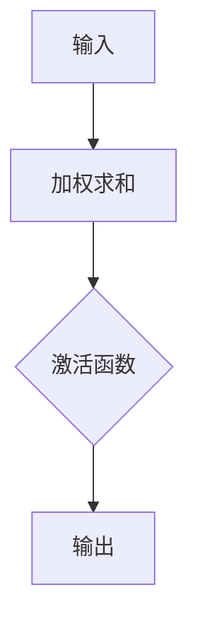
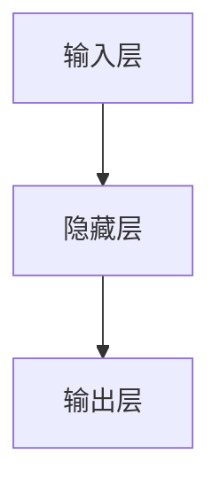
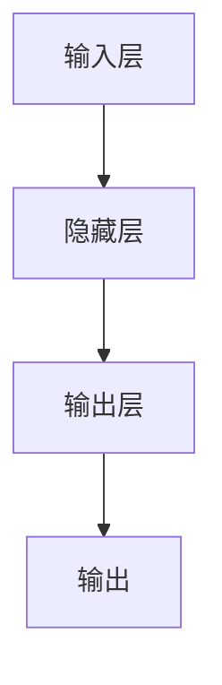
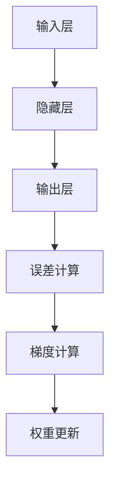

# 一切皆是映射：从生物神经到人工神经网络的演变

## 1. 背景介绍

### 1.1 生物神经网络的奥秘

人类大脑是一个复杂而神奇的结构,由约1000亿个神经元组成。这些神经元通过大约1万亿个连接相互作用,形成了一个庞大的网络。这个网络不仅赋予我们思考、学习和记忆的能力,还控制着我们的行为和情感。

神经元是大脑的基本计算单元,它接收来自其他神经元的电信号,并根据这些信号的强度和模式产生自己的输出信号。神经元之间通过突触连接,这些连接的强度可以动态调整,从而实现了学习和记忆的过程。

### 1.2 人工神经网络的崛起

受到生物神经网络的启发,人工神经网络(Artificial Neural Networks, ANNs)应运而生。人工神经网络是一种基于大脑结构和功能的计算模型,旨在模拟人类神经系统的工作原理。

最早的人工神经网络可以追溯到20世纪40年代,当时的研究主要集中在简单的感知器(Perceptron)模型上。随着计算机硬件的发展和算法的改进,人工神经网络的能力不断提高,在图像识别、自然语言处理、推荐系统等领域取得了令人瞩目的成就。

## 2. 核心概念与联系

### 2.1 神经元:生物与人工的映射

生物神经元和人工神经元在结构和功能上有着惊人的相似之处。两者都是通过接收输入信号,进行加权求和,并根据激活函数产生输出信号。

生物神经元的输入是来自其他神经元的电脉冲,而人工神经元的输入则是数字信号。两者都有一个阈值,只有当加权求和的结果超过该阈值时,神经元才会被激活并产生输出信号。



### 2.2 网络结构:层次与连接

生物神经网络和人工神经网络都具有层次结构。生物神经网络由感觉神经元、中间神经元和运动神经元组成,而人工神经网络则由输入层、隐藏层和输出层组成。

两种网络中,神经元之间通过连接进行信息传递。生物神经网络中的连接是通过突触实现的,而人工神经网络中的连接则是通过权重矩阵表示的。



### 2.3 学习与记忆:权重调整

生物神经网络和人工神经网络都具有学习和记忆的能力,这是通过调整连接强度(生物神经网络中的突触强度,人工神经网络中的权重)实现的。

在生物神经网络中,突触强度的变化是通过长期增强(LTP)和长期抑制(LTD)等机制实现的。而在人工神经网络中,权重的调整则是通过反向传播算法和其他优化算法实现的。

## 3. 核心算法原理具体操作步骤

### 3.1 前向传播

前向传播是人工神经网络的基本运算过程,它模拟了生物神经网络中信号从感觉神经元传递到运动神经元的过程。具体步骤如下:

1. 输入层接收输入数据。
2. 隐藏层神经元根据输入层数据和权重矩阵进行加权求和,并通过激活函数计算输出。
3. 输出层神经元根据隐藏层输出和权重矩阵进行加权求和,并通过激活函数计算最终输出。



### 3.2 反向传播

反向传播是人工神经网络的核心学习算法,它模拟了生物神经网络中突触强度调整的过程。具体步骤如下:

1. 计算输出层神经元的误差(实际输出与期望输出的差异)。
2. 根据误差计算输出层神经元的梯度,并更新权重矩阵。
3. 计算隐藏层神经元的误差,并根据误差计算梯度,更新权重矩阵。
4. 重复步骤2和3,直到整个网络收敛。



## 4. 数学模型和公式详细讲解举例说明

### 4.1 神经元数学模型

神经元的数学模型可以表示为:

$$
y = f\left(\sum_{i=1}^{n}w_ix_i + b\right)
$$

其中:
- $x_i$是第$i$个输入
- $w_i$是第$i$个输入的权重
- $b$是偏置项
- $f$是激活函数

常用的激活函数包括:

- sigmoid函数: $f(x) = \frac{1}{1 + e^{-x}}$
- ReLU函数: $f(x) = \max(0, x)$
- tanh函数: $f(x) = \frac{e^x - e^{-x}}{e^x + e^{-x}}$

### 4.2 反向传播算法

反向传播算法的核心是计算误差对权重的梯度,并根据梯度更新权重。

对于输出层神经元$j$,误差为:

$$
\delta_j = (y_j - t_j)f'(z_j)
$$

其中:
- $y_j$是实际输出
- $t_j$是期望输出
- $f'(z_j)$是激活函数的导数

对于隐藏层神经元$j$,误差为:

$$
\delta_j = f'(z_j)\sum_{k}\delta_kw_{jk}
$$

权重更新公式为:

$$
w_{ij}^{(t+1)} = w_{ij}^{(t)} - \eta\delta_jx_i
$$

其中$\eta$是学习率。

### 4.3 示例:手写数字识别

让我们以手写数字识别为例,说明神经网络的工作原理。

假设我们有一个28x28像素的手写数字图像作为输入,输入层有784个神经元。我们设置一个隐藏层,包含100个神经元。输出层有10个神经元,对应0-9这10个数字。

在前向传播过程中,输入层将像素值传递给隐藏层,隐藏层根据权重矩阵和激活函数计算输出,再传递给输出层。输出层的10个神经元对应着识别结果的概率分布。

在反向传播过程中,我们计算输出层神经元的误差,根据误差计算梯度,并更新输出层到隐藏层的权重矩阵。然后,我们计算隐藏层神经元的误差,根据误差计算梯度,并更新输入层到隐藏层的权重矩阵。

通过多次迭代,神经网络可以逐步学习到正确的权重,从而提高手写数字识别的准确率。

## 5. 项目实践:代码实例和详细解释说明

以下是使用Python和TensorFlow构建一个简单的手写数字识别神经网络的代码示例:

```python
import tensorflow as tf
from tensorflow.examples.tutorials.mnist import input_data

# 加载MNIST数据集
mnist = input_data.read_data_sets("MNIST_data/", one_hot=True)

# 定义占位符
x = tf.placeholder(tf.float32, [None, 784])
y_ = tf.placeholder(tf.float32, [None, 10])

# 定义权重和偏置
W1 = tf.Variable(tf.random_normal([784, 100]))
b1 = tf.Variable(tf.zeros([100]))
W2 = tf.Variable(tf.random_normal([100, 10]))
b2 = tf.Variable(tf.zeros([10]))

# 定义模型
h1 = tf.nn.relu(tf.matmul(x, W1) + b1)
y = tf.nn.softmax(tf.matmul(h1, W2) + b2)

# 定义损失函数和优化器
cross_entropy = tf.reduce_mean(-tf.reduce_sum(y_ * tf.log(y), reduction_indices=[1]))
train_step = tf.train.GradientDescentOptimizer(0.5).minimize(cross_entropy)

# 初始化变量
init = tf.global_variables_initializer()

# 开始训练
with tf.Session() as sess:
    sess.run(init)
    for i in range(1000):
        batch_xs, batch_ys = mnist.train.next_batch(100)
        sess.run(train_step, feed_dict={x: batch_xs, y_: batch_ys})

    # 评估模型
    correct_prediction = tf.equal(tf.argmax(y, 1), tf.argmax(y_, 1))
    accuracy = tf.reduce_mean(tf.cast(correct_prediction, tf.float32))
    print("Accuracy:", sess.run(accuracy, feed_dict={x: mnist.test.images, y_: mnist.test.labels}))
```

代码解释:

1. 首先,我们加载MNIST手写数字数据集。
2. 定义输入占位符`x`和输出占位符`y_`。
3. 定义权重矩阵`W1`、`W2`和偏置向量`b1`、`b2`。
4. 定义神经网络模型,包括隐藏层和输出层。隐藏层使用ReLU激活函数,输出层使用softmax激活函数。
5. 定义交叉熵损失函数和梯度下降优化器。
6. 初始化变量。
7. 开始训练,每次喂入一个小批量的数据,执行反向传播算法更新权重。
8. 评估模型在测试集上的准确率。

通过这个简单的示例,我们可以看到如何使用TensorFlow构建一个基本的神经网络模型,并对其进行训练和评估。在实际应用中,我们可以根据需求调整网络结构、优化算法和超参数,以获得更好的性能。

## 6. 实际应用场景

人工神经网络在各个领域都有广泛的应用,下面是一些典型的应用场景:

### 6.1 计算机视觉

神经网络在图像识别、目标检测、语义分割等计算机视觉任务中表现出色。例如,卷积神经网络(CNN)可以有效地提取图像的空间特征,从而实现准确的图像分类和目标检测。

### 6.2 自然语言处理

神经网络在文本分类、机器翻译、语音识别等自然语言处理任务中发挥着重要作用。例如,循环神经网络(RNN)和长短期记忆网络(LSTM)可以有效地处理序列数据,因此在机器翻译和语音识别中表现出色。

### 6.3 推荐系统

神经网络在个性化推荐系统中也有广泛应用。例如,基于矩阵分解的协同过滤算法可以通过神经网络实现,从而提高推荐的准确性和多样性。

### 6.4 金融预测

神经网络在金融领域也有应用,例如股票价格预测、信用风险评估等。神经网络可以从大量的历史数据中学习到复杂的模式,从而做出准确的预测。

### 6.5 医疗诊断

神经网络在医疗领域也有广泛应用,例如医学影像分析、疾病诊断等。深度学习模型可以从大量的医学数据中学习到有价值的特征,从而提高诊断的准确性。

## 7. 工具和资源推荐

### 7.1 深度学习框架

- TensorFlow: Google开源的端到端深度学习框架,支持多种语言,可以在多种设备上运行。
- PyTorch: Facebook开源的深度学习框架,具有动态计算图和良好的Python集成。
- Keras:高级神经网络API,可以在TensorFlow或Theano之上运行。

### 7.2 数据集

- MNIST: 手写数字识别数据集,常用于入门和基准测试。
- ImageNet: 大型图像数据集,包含数百万张图像和数千个类别。
- Penn Treebank: 自然语言处理数据集,用于语言模型和机器翻译任务。

### 7.3 在线课程

- Coursera深度学习专项课程: Andrew Ng教授的经典深度学习课程。
- fast.ai课程: Jeremy Howard教授的实用深度学习课程,侧重于代码实践。
- MIT深度学习课程: MIT开放式在线课程,涵盖深度学习理论和实践。

### 7.4 书