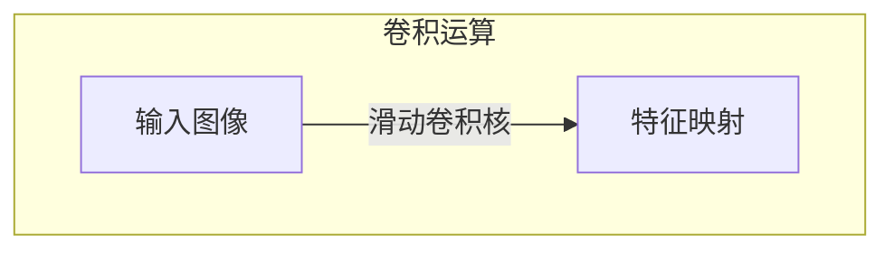
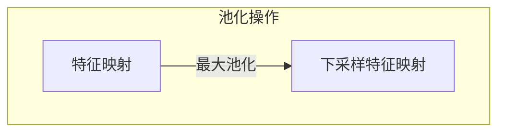
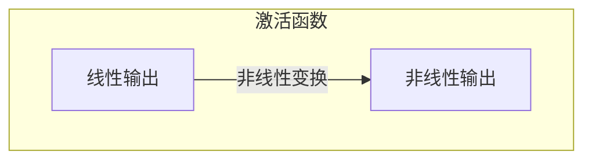
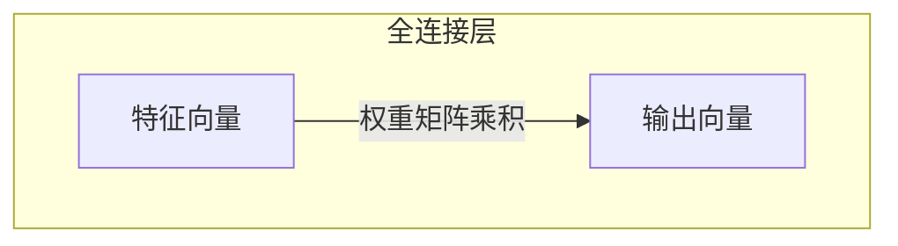

# 一切皆是映射：卷积神经网络(CNN)解密

## 1.背景介绍

### 1.1 神经网络的兴起

在过去的几十年里,人工智能领域取得了长足的进步,尤其是在深度学习和神经网络方面。神经网络的概念最早可以追溯到20世纪40年代,当时的神经网络模型非常简单,只能处理一些基本的线性问题。随着算力的不断提高和大数据时代的到来,神经网络开始exhibiting其强大的能力,在计算机视觉、自然语言处理、语音识别等领域取得了突破性的进展。

### 1.2 卷积神经网络的崛起

在神经网络的多种变体中,卷积神经网络(Convolutional Neural Network, CNN)脱颖而出,成为处理图像和视觉数据的利器。CNN灵感来自于生物学中视觉皮层的结构,通过局部感受野、权值共享和池化操作等机制,能够高效地提取图像的特征,并对其进行分类和识别。自2012年AlexNet在ImageNet大赛上的出色表现之后,CNN在计算机视觉领域掀起了一场深度学习革命。

## 2.核心概念与联系

### 2.1 卷积运算

卷积运算是CNN的核心操作,它模拟了生物视觉系统中感受野的工作原理。卷积运算将一个小的权重滤波器(kernel)在输入图像上滑动,对每个局部区域进行加权求和,生成一个新的特征映射(feature map)。这种局部连接和权值共享的机制,使CNN能够有效地捕捉图像的局部模式和特征。



### 2.2 池化操作

池化操作通常在卷积层之后进行,目的是降低特征映射的分辨率,从而减少计算量和参数数量。最常见的池化方式是最大池化(max pooling),它在一个局部区域内选取最大值作为该区域的代表值。池化操作不仅能够降低计算复杂度,还能提高模型的空间不变性,使其对平移、旋转等变换更加稳健。



### 2.3 激活函数

激活函数在神经网络中扮演着非常重要的角色,它引入了非线性,使得神经网络能够拟合更加复杂的函数。在CNN中,常用的激活函数包括ReLU(整流线性单元)、Leaky ReLU、Sigmoid等。ReLU函数由于其简单性和生物学上的合理性,成为CNN中最常用的激活函数之一。



### 2.4 全连接层

在CNN的最后几层通常是全连接层(fully connected layer),它将前面卷积层和池化层提取的高级特征进行整合,并输出最终的分类或回归结果。全连接层的工作原理类似于传统的人工神经网络,每个神经元与上一层的所有神经元相连。



## 3.核心算法原理具体操作步骤

### 3.1 卷积层

卷积层是CNN的核心部分,它通过卷积运算从输入数据中提取特征。具体步骤如下:

1. 初始化卷积核权重,通常使用小的随机值。
2. 将卷积核在输入数据(如图像)上滑动,对每个局部区域进行加权求和运算,生成一个新的特征映射。
3. 对特征映射进行激活函数变换,引入非线性。
4. 可选地进行池化操作,降低特征映射的分辨率。
5. 重复上述步骤,堆叠多个卷积层,提取不同层次的特征。

### 3.2 池化层

池化层通常跟在卷积层之后,目的是降低特征映射的分辨率,减少计算量和参数数量。最常见的池化方式是最大池化,具体步骤如下:

1. 将输入特征映射划分为多个不重叠的小区域。
2. 在每个小区域内,选取最大值作为该区域的代表值。
3. 将所有小区域的代表值组合成一个新的下采样特征映射。

### 3.3 全连接层

全连接层位于CNN的最后几层,它将前面卷积层和池化层提取的高级特征进行整合,并输出最终的分类或回归结果。具体步骤如下:

1. 将前面层的特征映射展平为一维向量。
2. 将展平后的向量与全连接层的权重矩阵相乘,得到新的特征向量。
3. 对新的特征向量进行激活函数变换,引入非线性。
4. 可选地堆叠多个全连接层,进一步整合特征。
5. 最后一层全连接层的输出即为CNN的最终输出,如分类概率或回归值。

## 4.数学模型和公式详细讲解举例说明

### 4.1 卷积运算

卷积运算是CNN的核心操作,它可以用数学公式表示为:

$$
(I * K)(i, j) = \sum_{m} \sum_{n} I(i+m, j+n) K(m, n)
$$

其中:
- $I$表示输入数据(如图像)
- $K$表示卷积核(kernel)
- $i, j$表示输出特征映射的坐标
- $m, n$表示卷积核的坐标

举例说明:

假设我们有一个$3 \times 3$的输入图像$I$和一个$2 \times 2$的卷积核$K$,则卷积运算的过程如下:

$$
I = \begin{bmatrix}
1 & 2 & 3\\
4 & 5 & 6\\
7 & 8 & 9
\end{bmatrix}, \quad
K = \begin{bmatrix}
1 & 0\\
0 & 1
\end{bmatrix}
$$

计算输出特征映射的第一个元素:

$$
(I * K)(0, 0) = 1 \cdot 1 + 2 \cdot 0 + 4 \cdot 0 + 5 \cdot 1 = 6
$$

依此类推,可以计算出整个输出特征映射。

### 4.2 池化运算

池化运算通常采用最大池化或平均池化的方式,用于降低特征映射的分辨率。最大池化的数学表达式如下:

$$
\text{pool}(X)_{i, j} = \max_{(m, n) \in R_{i, j}} X_{m, n}
$$

其中:
- $X$表示输入特征映射
- $R_{i, j}$表示以$(i, j)$为中心的池化区域
- $\text{pool}(X)_{i, j}$表示输出特征映射在$(i, j)$位置的值

举例说明:

假设我们有一个$4 \times 4$的输入特征映射$X$,使用$2 \times 2$的最大池化,步长为2,则池化运算的过程如下:

$$
X = \begin{bmatrix}
1 & 3 & 2 & 4\\
5 & 6 & 7 & 8\\
9 & 7 & 5 & 6\\
3 & 2 & 1 & 4
\end{bmatrix}
$$

第一个池化区域为$\begin{bmatrix}1 & 3\\5 & 6\end{bmatrix}$,最大值为6,因此输出特征映射的第一个元素为6。依此类推,可以计算出整个输出特征映射:

$$
\text{pool}(X) = \begin{bmatrix}
6 & 8\\
9 & 7
\end{bmatrix}
$$

### 4.3 全连接层

全连接层的数学模型类似于传统的人工神经网络,可以表示为:

$$
y = f(W^T x + b)
$$

其中:
- $x$表示输入特征向量
- $W$表示权重矩阵
- $b$表示偏置向量
- $f$表示激活函数,如ReLU或Sigmoid

举例说明:

假设我们有一个全连接层,输入特征向量$x$的维度为4,输出维度为3,权重矩阵$W$和偏置向量$b$如下:

$$
x = \begin{bmatrix}
0.5\\
1.2\\
-0.3\\
0.7
\end{bmatrix}, \quad
W = \begin{bmatrix}
0.1 & 0.2 & -0.1\\
-0.3 & 0.4 & 0.2\\
0.5 & -0.1 & 0.3\\
0.2 & 0.1 & -0.4
\end{bmatrix}, \quad
b = \begin{bmatrix}
0.1\\
-0.2\\
0.3
\end{bmatrix}
$$

则全连接层的输出$y$为:

$$
y = f(W^T x + b) = f\left(\begin{bmatrix}
0.34\\
0.26\\
0.09
\end{bmatrix}\right)
$$

如果激活函数$f$为ReLU,则输出$y$为:

$$
y = \begin{bmatrix}
0.34\\
0.26\\
0.09
\end{bmatrix}
$$

## 5.项目实践：代码实例和详细解释说明

为了更好地理解CNN的工作原理,我们将使用Python和PyTorch框架实现一个简单的CNN模型,并在MNIST手写数字识别任务上进行训练和测试。

### 5.1 导入必要的库

```python
import torch
import torch.nn as nn
import torch.nn.functional as F
import torchvision
import torchvision.transforms as transforms
```

### 5.2 定义CNN模型

```python
class CNN(nn.Module):
    def __init__(self):
        super(CNN, self).__init__()
        self.conv1 = nn.Conv2d(1, 16, 3, padding=1)
        self.conv2 = nn.Conv2d(16, 32, 3, padding=1)
        self.pool = nn.MaxPool2d(2, 2)
        self.fc1 = nn.Linear(32 * 7 * 7, 120)
        self.fc2 = nn.Linear(120, 84)
        self.fc3 = nn.Linear(84, 10)

    def forward(self, x):
        x = self.pool(F.relu(self.conv1(x)))
        x = self.pool(F.relu(self.conv2(x)))
        x = x.view(-1, 32 * 7 * 7)
        x = F.relu(self.fc1(x))
        x = F.relu(self.fc2(x))
        x = self.fc3(x)
        return x
```

这个CNN模型包含以下几个主要部分:

1. 两个卷积层(`conv1`和`conv2`)
2. 两个最大池化层(`pool`)
3. 三个全连接层(`fc1`、`fc2`和`fc3`)

在`forward`函数中,输入数据首先经过两个卷积层和两个池化层,提取特征。然后将特征映射展平,输入到三个全连接层中,最终输出一个10维的向量,表示10个数字类别的概率分布。

### 5.3 加载数据集

```python
transform = transforms.Compose([transforms.ToTensor(), transforms.Normalize((0.5,), (0.5,))])
trainset = torchvision.datasets.MNIST(root='./data', train=True, download=True, transform=transform)
trainloader = torch.utils.data.DataLoader(trainset, batch_size=64, shuffle=True)
testset = torchvision.datasets.MNIST(root='./data', train=False, download=True, transform=transform)
testloader = torch.utils.data.DataLoader(testset, batch_size=64, shuffle=False)
```

我们使用PyTorch内置的MNIST数据集,并对数据进行了一些预处理,包括转换为张量(Tensor)和归一化。

### 5.4 训练模型

```python
model = CNN()
criterion = nn.CrossEntropyLoss()
optimizer = torch.optim.SGD(model.parameters(), lr=0.01)

for epoch in range(10):
    running_loss = 0.0
    for i, data in enumerate(trainloader, 0):
        inputs, labels = data
        optimizer.zero_grad()
        outputs = model(inputs)
        loss = criterion(outputs, labels)
        loss.backward()
        optimizer.step()
        running_loss += loss.item()
        if i % 100 == 99:
            print('[%d, %5d] loss: %.3f' % (epoch + 1, i + 1, running_loss / 100))
            running_loss = 0.0
```

我们定义了一个简单的训练循环,在每个epoch中,将训练数据输入到CNN模型中,计算损失函数(交叉熵损失),反向传播更新模型参数。每100个batch,我们打印当前的