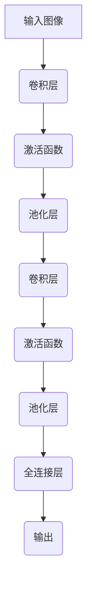

# 一切皆是映射：卷积神经网络(CNN)解密

## 1.背景介绍

### 1.1 神经网络的兴起

人工神经网络是一种由人工智能领域中受生物神经网络启发而产生的计算模型。在过去几十年里,神经网络在语音识别、图像识别、自然语言处理等领域取得了巨大的成功。这种成功主要归功于深度学习的兴起,尤其是卷积神经网络(Convolutional Neural Networks, CNN)的应用。

### 1.2 CNN在计算机视觉中的地位

在计算机视觉领域,CNN已成为图像分类、目标检测、语义分割等任务的主导模型。2012年,AlexNet在ImageNet大赛中获胜,将CNN推上了舞台中央。从那时起,CNN在计算机视觉任务中不断刷新纪录,成为了事实上的标准。

## 2.核心概念与联系  

### 2.1 卷积神经网络的基本结构

卷积神经网络主要由卷积层(Convolutional Layer)、池化层(Pooling Layer)和全连接层(Fully Connected Layer)组成。



### 2.2 卷积层

卷积层是CNN的核心部分,它通过卷积操作提取输入数据的特征。卷积操作可以看作是一种特殊的线性操作,它在输入数据上滑动一个小窗口,对窗口内的数据进行加权求和,得到输出特征映射。

### 2.3 池化层

池化层通常在卷积层之后,它对卷积层的输出进行下采样,减小数据的空间维度,从而降低计算量和内存占用。常见的池化操作有最大池化(Max Pooling)和平均池化(Average Pooling)。

### 2.4 全连接层

全连接层位于CNN的最后几层,它将前面层的特征映射展开成一维向量,然后与权重矩阵相乘,输出分类或回归结果。全连接层实现了从特征到目标的映射。

## 3.核心算法原理具体操作步骤

### 3.1 卷积操作

卷积操作是CNN的核心,它通过滑动卷积核在输入数据上提取局部特征。具体步骤如下:

1. 初始化卷积核权重,通常使用随机初始化或预训练权重。
2. 在输入数据(如图像)上滑动卷积核,对每个位置的局部区域进行加权求和运算。
3. 将求和结果存储在输出特征映射的相应位置。
4. 对输入数据的所有局部区域重复步骤2和3,得到完整的输出特征映射。

卷积操作可以用如下公式表示:

$$
O(i,j)=\sum_{m}\sum_{n}I(i+m,j+n)K(m,n)
$$

其中,$O(i,j)$是输出特征映射的元素,$I(i,j)$是输入数据,$K(i,j)$是卷积核权重。

### 3.2 池化操作

池化操作通过下采样输入数据,减小特征映射的空间维度,从而降低计算量和内存占用。常见的池化操作有最大池化和平均池化。

最大池化的步骤如下:

1. 在输入特征映射上滑动一个窗口(如2x2)。
2. 在窗口内取最大值,作为输出特征映射的元素。
3. 对输入特征映射的所有窗口重复步骤1和2,得到完整的输出特征映射。

平均池化的步骤类似,只是取窗口内元素的平均值而不是最大值。

### 3.3 全连接层操作

全连接层将前面层的特征映射展开成一维向量,然后与权重矩阵相乘,得到分类或回归的输出。具体步骤如下:

1. 将输入特征映射展开成一维向量$x$。
2. 对向量$x$与权重矩阵$W$相乘,得到$y=Wx+b$。
3. 将$y$输入激活函数(如Softmax),得到最终输出$\hat{y}$。

## 4.数学模型和公式详细讲解举例说明

### 4.1 卷积操作的数学模型

卷积操作可以用如下公式表示:

$$
O(i,j)=\sum_{m}\sum_{n}I(i+m,j+n)K(m,n)
$$

其中:

- $O(i,j)$是输出特征映射的元素
- $I(i,j)$是输入数据(如图像)
- $K(m,n)$是卷积核权重

举例说明:

假设输入是一个3x3的图像,卷积核大小为2x2,步长为1。则卷积操作可以计算如下:

```
输入图像:
1 2 3
4 5 6
7 8 9

卷积核权重:
1 1
1 1

输出特征映射:
1*1 + 2*1 + 4*1 + 5*1 = 12    2*1 + 3*1 + 5*1 + 6*1 = 16
4*1 + 5*1 + 7*1 + 8*1 = 24    5*1 + 6*1 + 8*1 + 9*1 = 28
```

可见,卷积操作实现了输入数据到输出特征映射的映射,并且保留了输入的局部空间结构。

### 4.2 池化操作的数学模型  

最大池化操作可以用如下公式表示:

$$
O(i,j)=\max\limits_{(m,n)\in R_{ij}}I(i+m,j+n)
$$

其中:

- $O(i,j)$是输出特征映射的元素
- $I(i,j)$是输入特征映射
- $R_{ij}$是以$(i,j)$为中心的池化窗口区域

平均池化操作可以用如下公式表示:

$$
O(i,j)=\frac{1}{|R_{ij}|}\sum\limits_{(m,n)\in R_{ij}}I(i+m,j+n)
$$

其中,$|R_{ij}|$是池化窗口的大小。

举例说明:

假设输入特征映射为4x4,池化窗口大小为2x2,步长为2。则最大池化操作可以计算如下:

```
输入特征映射:
1 3 5 7
2 4 6 8
9 6 3 5
7 8 1 2

最大池化输出:
4 8 
9 5
```

可见,池化操作实现了特征映射的下采样,减小了空间维度。

## 5.项目实践:代码实例和详细解释说明

以下是使用PyTorch实现一个简单的卷积神经网络的代码示例,用于对MNIST手写数字数据集进行分类。

```python
import torch
import torch.nn as nn
import torchvision
import torchvision.transforms as transforms

# 定义卷积神经网络
class ConvNet(nn.Module):
    def __init__(self):
        super(ConvNet, self).__init__()
        self.layer1 = nn.Sequential(
            nn.Conv2d(1, 32, kernel_size=3, stride=1, padding=1),
            nn.ReLU(),
            nn.MaxPool2d(kernel_size=2, stride=2))
        self.layer2 = nn.Sequential(
            nn.Conv2d(32, 64, kernel_size=3, stride=1, padding=1),
            nn.ReLU(),
            nn.MaxPool2d(kernel_size=2, stride=2))
        self.fc = nn.Linear(7*7*64, 10)
        
    def forward(self, x):
        out = self.layer1(x)
        out = self.layer2(out)
        out = out.reshape(out.size(0), -1)
        out = self.fc(out)
        return out

# 加载MNIST数据集
train_dataset = torchvision.datasets.MNIST(root='./data', 
                                           train=True, 
                                           transform=transforms.ToTensor(),
                                           download=True)

test_dataset = torchvision.datasets.MNIST(root='./data',
                                          train=False, 
                                          transform=transforms.ToTensor())

# 定义数据加载器
train_loader = torch.utils.data.DataLoader(dataset=train_dataset,
                                           batch_size=100, 
                                           shuffle=True)

test_loader = torch.utils.data.DataLoader(dataset=test_dataset,
                                          batch_size=100,
                                          shuffle=False)

# 实例化模型
model = ConvNet()

# 定义损失函数和优化器
criterion = nn.CrossEntropyLoss()
optimizer = torch.optim.Adam(model.parameters(), lr=0.001)

# 训练模型
n_epochs = 5
for epoch in range(n_epochs):
    for i, (images, labels) in enumerate(train_loader):
        outputs = model(images)
        loss = criterion(outputs, labels)
        
        optimizer.zero_grad()
        loss.backward()
        optimizer.step()
        
        if (i+1) % 100 == 0:
            print(f'Epoch: {epoch+1}/{n_epochs}, Step: {i+1}/{len(train_loader)}, Loss: {loss.item():.4f}')

# 测试模型
with torch.no_grad():
    correct = 0
    total = 0
    for images, labels in test_loader:
        outputs = model(images)
        _, predicted = torch.max(outputs.data, 1)
        total += labels.size(0)
        correct += (predicted == labels).sum().item()
    
    print(f'Accuracy on test set: {100 * correct / total}%')
```

代码解释:

1. 定义了一个包含两个卷积层和一个全连接层的卷积神经网络模型`ConvNet`。
2. 加载MNIST手写数字数据集,并对数据进行预处理(转换为张量)。
3. 定义数据加载器,用于在训练和测试时批量加载数据。
4. 实例化模型,定义损失函数(交叉熵损失)和优化器(Adam优化器)。
5. 进行5个epoch的训练,每100步打印一次损失值。
6. 在测试集上评估模型的准确率。

通过这个示例,你可以了解到如何使用PyTorch构建一个简单的卷积神经网络,并在MNIST数据集上进行训练和测试。

## 6.实际应用场景

卷积神经网络在计算机视觉领域有着广泛的应用,包括但不限于以下场景:

### 6.1 图像分类

图像分类是CNN最早也是最典型的应用场景。在ImageNet等大型图像数据集上,CNN已经展现出超越人类的分类能力。图像分类在许多领域都有应用,如医疗影像诊断、无人驾驶、工业缺陷检测等。

### 6.2 目标检测

目标检测旨在从图像中找出感兴趣目标的位置和类别。CNN在这一任务中发挥着关键作用,如R-CNN、Faster R-CNN、YOLO等经典模型都是基于CNN的。目标检测在安防监控、自动驾驶、机器人视觉等领域有重要应用。

### 6.3 语义分割

语义分割是将图像中的每个像素点进行分类的任务,常用于医疗影像分析、无人驾驶等领域。CNN在捕获图像的空间和语义信息方面有着独特的优势,因此在语义分割任务中表现出色。

### 6.4 视频分析

视频可以看作是一系列图像帧的序列,CNN可以对每一帧进行特征提取,并结合时序信息进行视频分类、行为识别等任务。视频分析在监控、娱乐、自动驾驶等领域有广泛应用前景。

### 6.5 计算机艺术

近年来,CNN也被应用于计算机艺术创作领域,如风格迁移、图像生成等。通过训练CNN模型,可以学习图像的风格特征,并将这些特征迁移到新的图像上,创造出具有独特风格的艺术作品。

## 7.工具和资源推荐

在CNN的学习和应用过程中,有许多优秀的工具和资源可以为你提供帮助:

### 7.1 深度学习框架

- **PyTorch**: 由Facebook人工智能研究院开发的深度学习框架,具有Python风格的编程接口,使用动态计算图,支持GPU加速。
- **TensorFlow**: 由Google开发的端到端开源机器学习框架,支持多种语言,提供了丰富的工具和库。
- **Keras**: 基于TensorFlow或Theano的高级神经网络API,简化了模型构建过程。

### 7.2 预训练模型

- **PyTorch模型库**: PyTorch官方提供了一系列预训练的模型,如AlexNet、VGGNet、ResNet等,可以直接加载使用。
- **T