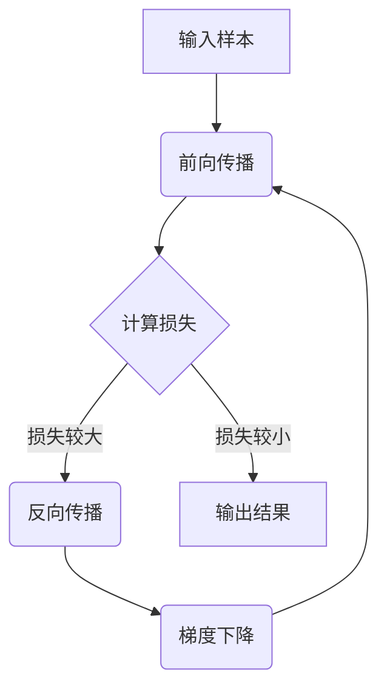

# 一切皆是映射：反向传播算法的数学原理

## 1. 背景介绍
### 1.1 人工智能与深度学习
人工智能(Artificial Intelligence, AI)是计算机科学领域的一个重要分支,旨在研究如何让计算机模拟人类的智能行为。深度学习(Deep Learning)作为人工智能的一个子领域,近年来取得了令人瞩目的成就,在计算机视觉、自然语言处理、语音识别等领域不断刷新着最高性能记录。
### 1.2 神经网络与反向传播算法
深度学习的核心模型是人工神经网络(Artificial Neural Network),其灵感来源于生物学中神经元的工作原理。通过构建多层的神经网络,并使用大量的数据进行训练,神经网络能够自动学习到数据中蕴含的复杂模式和规律。而训练神经网络最常用、最有效的算法,就是反向传播算法(Backpropagation)。
### 1.3 反向传播算法的重要性
反向传播算法自1986年由David Rumelhart等人提出以来,一直是训练神经网络的核心算法。它不仅使得训练深层网络成为可能,更是深度学习能够取得巨大成功的关键所在。可以说,没有反向传播算法就没有现代深度学习。因此,深入理解反向传播算法的数学原理,对于学习和应用深度学习至关重要。

## 2. 核心概念与联系
### 2.1 数学基础
#### 2.1.1 微积分
反向传播算法用到了微积分中的导数和链式法则。导数描述了函数值的变化率,是优化神经网络的关键。
#### 2.1.2 线性代数 
神经网络的前向传播和反向传播过程都涉及大量的矩阵运算,需要用到线性代数的知识。
### 2.2 神经网络的组成
#### 2.2.1 神经元
神经元是神经网络的基本单元,类似于感知机,接收一组输入,经过加权求和和激活函数处理后输出结果。
#### 2.2.2 网络结构
神经元按层组织形成网络结构,包括输入层、隐藏层和输出层。相邻层之间的神经元通过权重矩阵进行全连接。
### 2.3 前向传播与损失函数
前向传播是指将输入数据通过神经网络计算输出的过程。网络的输出与期望输出之间的差距用损失函数来衡量,常见的有均方误差、交叉熵等。
### 2.4 参数优化与梯度下降
神经网络通过调整权重参数来最小化损失函数,这个过程称为参数优化。最常用的优化算法是梯度下降,沿着损失函数梯度的反方向更新参数。
### 2.5 反向传播算法
反向传播算法是一种高效计算损失函数梯度的方法,它利用链式法则,按照从输出层到输入层的顺序递归计算每个参数的梯度,从而指导参数的更新。

## 3. 核心算法原理具体操作步骤
### 3.1 前向传播
#### 3.1.1 输入与输出
对于一个输入样本$\mathbf{x}$,神经网络的目标是计算输出$\mathbf{\hat{y}}$。
#### 3.1.2 隐藏层计算
输入经过隐藏层的加权求和和激活函数变换,得到隐藏层的输出。设第$l$层的加权求和为$\mathbf{z}^{(l)}$,激活函数为$f^{(l)}$,则该层输出为:
$$
\mathbf{a}^{(l)} = f^{(l)}(\mathbf{z}^{(l)})
$$
#### 3.1.3 输出层计算
隐藏层的输出经过输出层的变换,得到网络的最终输出$\mathbf{\hat{y}}$。
### 3.2 损失函数计算
将网络输出$\mathbf{\hat{y}}$与期望输出$\mathbf{y}$代入损失函数,计算出当前的损失值$J$。以均方误差为例:
$$
J = \frac{1}{2}\lVert \mathbf{\hat{y}} - \mathbf{y} \rVert^2
$$
### 3.3 反向传播
#### 3.3.1 输出层梯度
根据链式法则,计算输出层神经元的梯度$\delta^{(L)}$:
$$
\delta^{(L)} = \nabla_{\mathbf{a}^{(L)}}J \odot f'^{(L)}(\mathbf{z}^{(L)}) 
$$
其中$\nabla_{\mathbf{a}^{(L)}}J$是损失函数对输出层激活值的梯度,$\odot$表示Hadamard乘积。
#### 3.3.2 隐藏层梯度
递归计算隐藏层神经元的梯度$\delta^{(l)}$:
$$
\delta^{(l)} = ((\mathbf{W}^{(l)})^T\delta^{(l+1)})\odot f'^{(l)}(\mathbf{z}^{(l)})
$$
其中$\mathbf{W}^{(l)}$是第$l$层到第$l+1$层的权重矩阵。
#### 3.3.3 权重梯度
利用各层神经元的梯度,计算权重矩阵的梯度:
$$
\nabla_{\mathbf{W}^{(l)}}J = \delta^{(l+1)}(\mathbf{a}^{(l)})^T
$$
### 3.4 参数更新
#### 3.4.1 学习率
学习率$\eta$控制每次参数更新的步长,需要适当选择。
#### 3.4.2 梯度下降
根据梯度下降规则,更新每层权重矩阵:
$$
\mathbf{W}^{(l)} := \mathbf{W}^{(l)} - \eta\nabla_{\mathbf{W}^{(l)}}J
$$
### 3.5 算法流程图


## 4. 数学模型和公式详细讲解举例说明
### 4.1 前向传播
考虑一个简单的三层全连接神经网络,其中输入层有$n_0$个神经元,隐藏层有$n_1$个神经元,输出层有$n_2$个神经元。对于输入$\mathbf{x} \in \mathbb{R}^{n_0}$,隐藏层的加权求和为:
$$
\mathbf{z}^{(1)} = \mathbf{W}^{(1)}\mathbf{x} + \mathbf{b}^{(1)}
$$
其中$\mathbf{W}^{(1)} \in \mathbb{R}^{n_1 \times n_0}$是隐藏层的权重矩阵,$\mathbf{b}^{(1)} \in \mathbb{R}^{n_1}$是隐藏层的偏置向量。经过激活函数$f^{(1)}$作用后,隐藏层的输出为:
$$
\mathbf{a}^{(1)} = f^{(1)}(\mathbf{z}^{(1)})
$$
类似地,输出层的计算为:
$$
\begin{aligned}
\mathbf{z}^{(2)} &= \mathbf{W}^{(2)}\mathbf{a}^{(1)} + \mathbf{b}^{(2)} \\
\mathbf{\hat{y}} &= f^{(2)}(\mathbf{z}^{(2)})
\end{aligned}
$$
其中$\mathbf{W}^{(2)} \in \mathbb{R}^{n_2 \times n_1}$,$\mathbf{b}^{(2)} \in \mathbb{R}^{n_2}$,$f^{(2)}$分别是输出层的权重矩阵、偏置向量和激活函数。
### 4.2 反向传播
假设损失函数为均方误差:
$$
J = \frac{1}{2}\lVert \mathbf{\hat{y}} - \mathbf{y} \rVert^2
$$
其中$\mathbf{y} \in \mathbb{R}^{n_2}$是期望输出。根据链式法则,输出层神经元的梯度为:
$$
\delta^{(2)} = (\mathbf{\hat{y}} - \mathbf{y}) \odot f'^{(2)}(\mathbf{z}^{(2)})
$$
隐藏层神经元的梯度为:
$$
\delta^{(1)} = ((\mathbf{W}^{(2)})^T\delta^{(2)})\odot f'^{(1)}(\mathbf{z}^{(1)})
$$
最后,权重矩阵的梯度为:
$$
\begin{aligned}
\nabla_{\mathbf{W}^{(2)}}J &= \delta^{(2)}(\mathbf{a}^{(1)})^T \\
\nabla_{\mathbf{W}^{(1)}}J &= \delta^{(1)}\mathbf{x}^T
\end{aligned}
$$
偏置向量的梯度就是对应层的神经元梯度:
$$
\begin{aligned}
\nabla_{\mathbf{b}^{(2)}}J &= \delta^{(2)} \\
\nabla_{\mathbf{b}^{(1)}}J &= \delta^{(1)}
\end{aligned}
$$
得到梯度后,按照梯度下降规则更新权重和偏置:
$$
\begin{aligned}
\mathbf{W}^{(2)} &:= \mathbf{W}^{(2)} - \eta\nabla_{\mathbf{W}^{(2)}}J \\
\mathbf{b}^{(2)} &:= \mathbf{b}^{(2)} - \eta\nabla_{\mathbf{b}^{(2)}}J \\
\mathbf{W}^{(1)} &:= \mathbf{W}^{(1)} - \eta\nabla_{\mathbf{W}^{(1)}}J \\
\mathbf{b}^{(1)} &:= \mathbf{b}^{(1)} - \eta\nabla_{\mathbf{b}^{(1)}}J
\end{aligned}
$$
其中$\eta$是学习率。

## 5. 项目实践：代码实例和详细解释说明
下面用Python实现一个简单的三层全连接神经网络,并用反向传播算法进行训练:

```python
import numpy as np

def sigmoid(x):
    return 1 / (1 + np.exp(-x))

def sigmoid_derivative(x):
    return x * (1 - x)

class NeuralNetwork:
    def __init__(self, input_size, hidden_size, output_size):
        self.W1 = np.random.randn(hidden_size, input_size)
        self.b1 = np.zeros((hidden_size, 1))
        self.W2 = np.random.randn(output_size, hidden_size)
        self.b2 = np.zeros((output_size, 1))

    def forward(self, X):
        self.z1 = np.dot(self.W1, X) + self.b1
        self.a1 = sigmoid(self.z1)
        self.z2 = np.dot(self.W2, self.a1) + self.b2
        self.y_hat = sigmoid(self.z2)
        return self.y_hat

    def backward(self, X, y, learning_rate):
        m = y.shape[1]
        
        # 输出层梯度
        delta2 = (self.y_hat - y) * sigmoid_derivative(self.y_hat)
        dW2 = np.dot(delta2, self.a1.T) / m
        db2 = np.sum(delta2, axis=1, keepdims=True) / m
        
        # 隐藏层梯度
        delta1 = np.dot(self.W2.T, delta2) * sigmoid_derivative(self.a1)
        dW1 = np.dot(delta1, X.T) / m
        db1 = np.sum(delta1, axis=1, keepdims=True) / m
        
        # 更新权重和偏置
        self.W2 -= learning_rate * dW2
        self.b2 -= learning_rate * db2
        self.W1 -= learning_rate * dW1
        self.b1 -= learning_rate * db1

    def train(self, X, y, iterations, learning_rate):
        for i in range(iterations):
            self.forward(X)
            self.backward(X, y, learning_rate)

# 训练样本
X = np.array([[0, 0, 1], [0, 1, 1], [1, 0, 1], [1, 1, 1]])
y = np.array([[0], [1], [1], [0]])

# 创建网络并训练
nn = NeuralNetwork(3, 4, 1)
nn.train(X.T, y.T, 10000, 0.1)

# 测试
print(nn.forward(np.array([[1, 1, 0]]).T))
```

代码解释:
- `sigmoid`函数实现了Sigmoid激活函数,`sigmoid_derivative`计算其导数