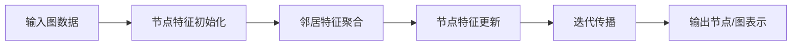
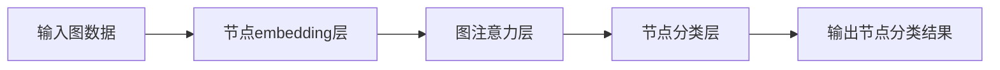

# 一切皆是映射：图神经网络(GNN)的兴起与展望

## 1. 背景介绍

### 1.1 数据的多样性与复杂性

在当今的数据时代,我们面临着海量的、多样化的、复杂的数据。这些数据不仅包括传统的结构化数据(如表格、数据库等),还包括非结构化数据(如文本、图像、视频等)。其中,一类重要的数据类型是关系数据,它以图的形式表示实体之间的关联关系。

关系数据无处不在,例如:

- 社交网络中的好友关系
- 知识图谱中的实体关联
- 分子结构中的原子键连接
- 交通网络中的路径连接
- 计算机网络中的主机互联

### 1.2 传统机器学习方法的局限性

传统的机器学习算法(如逻辑回归、决策树等)主要针对的是欧几里得数据(如向量、矩阵),而对于非欧几里得数据(如图数据)的处理能力较弱。图数据具有以下特点:

- 无固定的欧几里得结构
- 节点顺序无关
- 同构性质(同构图应当具有相同的表示)

为了将图数据输入到机器学习模型中,需要进行特征工程,将图数据转换为向量形式。但这种方式存在以下缺陷:

- 信息损失(无法完整保留图的拓扑结构信息)
- 高维稀疏(导致计算效率低下)
- 缺乏普适性(特征工程需要人工设计,难以泛化)

### 1.3 图神经网络(GNN)的兴起

为了更好地处理图结构数据,近年来兴起了一种新型的深度学习模型:图神经网络(Graph Neural Network, GNN)。图神经网络直接在图数据上进行建模,能够有效地捕获和利用图的拓扑结构信息,从而在许多领域展现出优异的性能,如:

- 节点分类/回归(如社交网络中的用户画像)
- 链接预测(如知识图谱补全)
- 图分类/回归(如分子活性预测)
- 聚类(如社区发现)
- 图生成(如分子设计)

图神经网络的核心思想是通过信息传递的方式,在图的节点之间传递特征信息,使每个节点的表示不仅包含自身的特征,还包含相邻节点的特征信息。通过迭代地进行信息传递和特征更新,最终可以得到图级别或节点级别的表示,用于下游的机器学习任务。

## 2. 核心概念与联系

### 2.1 图的表示

在介绍图神经网络之前,我们先来了解一下图数据的表示形式。一个图 $\mathcal{G}$ 可以表示为 $\mathcal{G} = (\mathcal{V}, \mathcal{E})$,其中:

- $\mathcal{V}$ 表示节点集合,包含 $N$ 个节点 $\mathcal{V} = \{v_1, v_2, \dots, v_N\}$
- $\mathcal{E}$ 表示边集合,包含 $M$ 条边 $\mathcal{E} = \{e_1, e_2, \dots, e_M\}$,每条边 $e_{ij}$ 连接节点 $v_i$ 和 $v_j$

对于有属性的图,每个节点 $v_i$ 还可以携带一个节点属性向量 $\mathbf{x}_i$,每条边 $e_{ij}$ 也可以携带一个边属性向量 $\mathbf{e}_{ij}$。

### 2.2 图神经网络的工作流程

图神经网络的基本工作流程如下所示:

1. **输入图数据**:输入一个图 $\mathcal{G} = (\mathcal{V}, \mathcal{E})$,其中每个节点 $v_i$ 可以携带一个初始的节点属性向量 $\mathbf{x}_i$。
2. **节点特征初始化**:将节点属性向量 $\mathbf{x}_i$ 作为节点 $v_i$ 的初始特征表示 $\mathbf{h}_i^{(0)}$。
3. **邻居特征聚合**:对于每个节点 $v_i$,从其邻居节点收集特征信息,并将这些信息聚合为一个邻居特征向量 $\mathbf{m}_i^{(k)}$。
4. **节点特征更新**:将当前节点的特征表示 $\mathbf{h}_i^{(k)}$ 和邻居特征向量 $\mathbf{m}_i^{(k)}$ 结合,通过一个更新函数 $\phi$ 计算出新的节点特征表示 $\mathbf{h}_i^{(k+1)}$。
5. **迭代传播**:重复执行步骤3和步骤4,将特征信息在图上进行多次迭代传播,直到达到预设的迭代次数 $K$ 或满足其他停止条件。
6. **输出节点/图表示**:根据任务需求,输出最终的节点级别表示 $\mathbf{h}_i^{(K)}$ 或图级别表示 $\mathcal{R}(\mathbf{h}_1^{(K)}, \mathbf{h}_2^{(K)}, \dots, \mathbf{h}_N^{(K)})$,其中 $\mathcal{R}$ 是一个读出函数,用于从所有节点的表示中读出图级别的表示。

通过上述过程,图神经网络能够有效地捕获和利用图数据的拓扑结构信息,为下游的机器学习任务提供更加准确和丰富的特征表示。

## 3. 核心算法原理具体操作步骤

### 3.1 邻居特征聚合

邻居特征聚合是图神经网络的核心步骤,它决定了如何从邻居节点收集特征信息。常见的邻居特征聚合方式包括:

1. **平均聚合(Mean Aggregator)**:对所有邻居节点的特征向量取平均,作为邻居特征向量。

   $$\mathbf{m}_i^{(k)} = \frac{1}{|\mathcal{N}(i)|} \sum_{j \in \mathcal{N}(i)} \mathbf{h}_j^{(k)}$$

   其中 $\mathcal{N}(i)$ 表示节点 $v_i$ 的邻居节点集合。

2. **最大池化聚合(Max Pooling Aggregator)**:取所有邻居节点特征向量的最大值,作为邻居特征向量。

   $$\mathbf{m}_i^{(k)} = \max_{j \in \mathcal{N}(i)} \mathbf{h}_j^{(k)}$$

3. **注意力聚合(Attention Aggregator)**:通过注意力机制为每个邻居节点分配不同的权重,然后对加权求和得到邻居特征向量。

   $$\mathbf{m}_i^{(k)} = \sum_{j \in \mathcal{N}(i)} \alpha_{ij} \mathbf{h}_j^{(k)}$$

   其中 $\alpha_{ij}$ 是通过注意力机制计算得到的权重,反映了节点 $v_j$ 对节点 $v_i$ 的重要程度。

除了上述基本形式,还有许多变体和改进版本,如门控注意力机制、边属性注意力机制等,用于捕获更加复杂的邻居依赖关系。

### 3.2 节点特征更新

在获得邻居特征向量 $\mathbf{m}_i^{(k)}$ 后,需要将其与当前节点的特征表示 $\mathbf{h}_i^{(k)}$ 结合,计算出新的节点特征表示 $\mathbf{h}_i^{(k+1)}$。常见的更新函数包括:

1. **递归神经网络更新(RecGNN)**:

   $$\mathbf{h}_i^{(k+1)} = \sigma\left(\mathbf{W}^{(k)} \cdot \text{CONCAT}\left(\mathbf{h}_i^{(k)}, \mathbf{m}_i^{(k)}\right) + \mathbf{b}^{(k)}\right)$$

   其中 $\sigma$ 是非线性激活函数(如 ReLU),CONCAT 表示向量拼接操作,$\mathbf{W}^{(k)}$ 和 $\mathbf{b}^{(k)}$ 是可学习的参数。

2. **门控递归单元更新(GRU)**:借鉴递归神经网络中的门控递归单元(Gated Recurrent Unit),通过重置门和更新门控制信息的流动。

   $$\begin{aligned}
   \mathbf{r}_i^{(k)} &= \sigma\left(\mathbf{W}_r^{(k)} \cdot \text{CONCAT}\left(\mathbf{h}_i^{(k)}, \mathbf{m}_i^{(k)}\right) + \mathbf{b}_r^{(k)}\right) \\
   \mathbf{z}_i^{(k)} &= \sigma\left(\mathbf{W}_z^{(k)} \cdot \text{CONCAT}\left(\mathbf{h}_i^{(k)}, \mathbf{m}_i^{(k)}\right) + \mathbf{b}_z^{(k)}\right) \\
   \mathbf{n}_i^{(k)} &= \tanh\left(\mathbf{W}_n^{(k)} \cdot \text{CONCAT}\left(\mathbf{r}_i^{(k)} \odot \mathbf{h}_i^{(k)}, \mathbf{m}_i^{(k)}\right) + \mathbf{b}_n^{(k)}\right) \\
   \mathbf{h}_i^{(k+1)} &= \left(1 - \mathbf{z}_i^{(k)}\right) \odot \mathbf{n}_i^{(k)} + \mathbf{z}_i^{(k)} \odot \mathbf{h}_i^{(k)}
   \end{aligned}$$

   其中 $\odot$ 表示元素wise乘积操作,各个参数 $\mathbf{W}$ 和 $\mathbf{b}$ 是可学习的。

除了上述两种常见形式,还有其他更新函数,如卷积更新、注意力更新等。通过设计不同的更新函数,可以捕获不同类型的邻居依赖关系,提高模型的表达能力。

## 4. 数学模型和公式详细讲解举例说明

在上一节中,我们介绍了图神经网络的核心算法步骤。现在,我们将通过一个具体的例子,详细讲解图神经网络的数学模型和公式。

### 4.1 问题描述

假设我们有一个社交网络,每个用户都有一些基本属性(如年龄、性别等),我们的目标是对用户进行分类(如预测用户的职业)。这可以看作是一个节点分类任务。

### 4.2 图神经网络模型

为了解决这个问题,我们可以构建一个图神经网络模型。该模型的架构如下所示:

1. **输入图数据**:输入一个无向图 $\mathcal{G} = (\mathcal{V}, \mathcal{E})$,表示社交网络中的用户关系。每个节点 $v_i$ 携带一个初始的节点属性向量 $\mathbf{x}_i$,表示该用户的基本属性。
2. **节点embedding层**:将每个节点的属性向量 $\mathbf{x}_i$ 通过一个全连接层映射为初始的节点嵌入向量 $\mathbf{h}_i^{(0)}$。

   $$\mathbf{h}_i^{(0)} = \sigma\left(\mathbf{W}_\text{emb} \cdot \mathbf{x}_i + \mathbf{b}_\text{emb}\right)$$

   其中 $\mathbf{W}_\text{emb}$ 和 $\mathbf{b}_\text{emb}$ 是可学习的参数,$ \sigma $ 是非线性激活函数(如 ReLU)。

3. **图注意力层**:对节点嵌入向量进行 $K$ 次迭代更新,每次迭代包括邻居特征聚合和节点特征更新两个步骤。我们采用注意力机制进行邻居特征聚合:

   $$\begin{aligned}
   \alpha_{ij}^{(k)} &= \frac{\exp\left