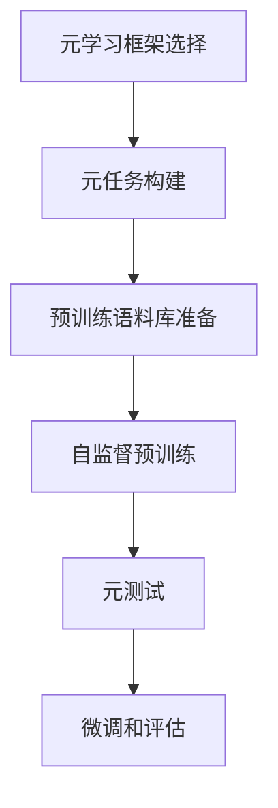

# 一切皆是映射：基于元学习的自然语言处理模型预训练

## 1. 背景介绍

### 1.1 自然语言处理的挑战

自然语言处理(NLP)是人工智能领域中最具挑战性的任务之一。人类语言的复杂性、多样性和不确定性使得构建能够准确理解和生成自然语言的系统成为一项艰巨的任务。传统的机器学习方法通常需要大量的人工标注数据,并且往往只能解决特定的NLP任务,缺乏泛化能力。

### 1.2 预训练语言模型的兴起

近年来,预训练语言模型(Pre-trained Language Models, PLMs)的出现为NLP领域带来了革命性的进展。这些模型通过在大规模无标注语料库上进行自监督预训练,学习到了丰富的语言知识和上下文表示,从而能够在下游NLP任务上取得出色的表现。著名的预训练模型包括BERT、GPT、XLNet等。

### 1.3 元学习在NLP中的应用

尽管预训练语言模型取得了巨大成功,但它们仍然存在一些局限性,如缺乏快速适应新任务和领域的能力、对长期依赖和推理能力较弱等。为了解决这些问题,研究人员开始探索将元学习(Meta-Learning)技术引入NLP领域。元学习旨在学习一种通用的学习策略,使模型能够快速适应新任务,提高泛化能力和推理能力。

## 2. 核心概念与联系

### 2.1 元学习的核心思想

元学习的核心思想是"学习如何学习"(Learning to Learn)。传统的机器学习算法专注于从数据中直接学习任务相关的知识,而元学习则是在更高的层次上,学习一种通用的学习策略或机制,使模型能够快速适应新的任务和环境。

### 2.2 元学习在NLP中的应用场景

在NLP领域,元学习可以应用于以下几个方面:

1. **Few-Shot学习**: 使模型能够基于少量示例快速学习新任务,避免从头开始训练。
2. **领域适应**: 帮助模型适应新的领域或数据分布,提高泛化能力。
3. **持续学习**: 使模型能够不断地从新数据中学习,而不会遗忘之前学习的知识。
4. **多任务学习**: 提高模型在多个相关任务上的性能,利用任务之间的相关性。
5. **推理增强**: 提高模型的推理和reasoning能力,更好地处理复杂的语言现象。

### 2.3 元学习与预训练语言模型的结合

将元学习与预训练语言模型相结合,可以充分利用两者的优势。预训练语言模型为模型提供了丰富的语言知识和上下文表示,而元学习则赋予了模型快速适应新任务的能力。这种结合可以使模型在保持泛化性的同时,也具备了高效的适应性和推理能力。

## 3. 核心算法原理具体操作步骤

基于元学习的自然语言处理模型预训练通常包括以下几个核心步骤:



### 3.1 元学习框架选择

首先需要选择合适的元学习框架,常见的框架包括:

1. **基于模型的元学习**(Model-Agnostic Meta-Learning, MAML)
2. **基于优化的元学习**(Optimization-Based Meta-Learning)
3. **基于指标的元学习**(Metric-Based Meta-Learning)
4. **基于记忆的元学习**(Memory-Based Meta-Learning)

不同的框架具有不同的优缺点,需要根据具体的应用场景和需求进行选择。

### 3.2 元任务构建

接下来需要构建一系列相关的元任务(Meta-Tasks),用于模拟真实场景下的任务分布。这些元任务通常是从大规模语料库中抽取的,并根据特定的策略进行划分和组合。常见的元任务构建方法包括:

1. **基于领域的划分**: 将语料库按照不同的领域(如新闻、科技、医疗等)进行划分,形成不同的元任务。
2. **基于数据分布的划分**: 根据语料库的数据分布(如词汇、语法结构等)进行划分,形成不同的元任务。
3. **基于任务类型的划分**: 根据不同的NLP任务类型(如文本分类、机器翻译、问答等)进行划分,形成不同的元任务。

### 3.3 预训练语料库准备

为了进行自监督预训练,需要准备大规模的无标注语料库。常见的语料库来源包括:

1. **网络爬取语料**: 从互联网上爬取大量的文本数据,如新闻、博客、社交媒体等。
2. **开源语料库**: 利用一些开源的大规模语料库,如Wikipedia、BookCorpus等。
3. **特定领域语料**: 针对特定应用场景,收集相关领域的语料库,如医疗、法律等领域。

### 3.4 自监督预训练

在自监督预训练阶段,模型通过在大规模无标注语料库上执行特定的预训练任务,学习到丰富的语言知识和上下文表示。常见的预训练任务包括:

1. **掩码语言模型**(Masked Language Modeling, MLM)
2. **下一句预测**(Next Sentence Prediction, NSP)
3. **序列到序列预训练**(Sequence-to-Sequence Pre-training)
4. **替换语言模型**(Replaced Token Detection, RTD)

在预训练过程中,模型通过元学习算法不断地从元任务中学习,提高其快速适应新任务的能力。

### 3.5 元测试

为了评估模型的元学习能力,需要在一系列的元测试任务上进行测试。这些元测试任务与元训练任务相似,但来自不同的数据分布或领域。通过在元测试任务上的表现,可以衡量模型的泛化能力和适应性。

### 3.6 微调和评估

最后,将预训练好的模型在特定的下游NLP任务上进行微调和评估。在微调阶段,模型利用少量的任务相关数据进行快速适应,从而提高在该任务上的性能。通过在多个下游任务上的评估,可以全面地衡量模型的实际效果。

## 4. 数学模型和公式详细讲解举例说明

在基于元学习的自然语言处理模型预训练中,常见的数学模型和公式包括:

### 4.1 基于模型的元学习 (MAML)

MAML是一种广为人知的元学习算法,它旨在学习一个良好的模型初始化,使得在新任务上只需要少量的梯度更新就能获得良好的性能。MAML的核心思想是通过在一系列元训练任务上优化模型参数,使得模型在新的元测试任务上只需要少量的梯度更新就能快速适应。

MAML的目标函数可以表示为:

$$\min_{\theta} \sum_{T_i \sim p(T)} \mathcal{L}_{T_i}(f_{\theta_{i}^{*}}) \\
\text{where} \quad \theta_{i}^{*} = \theta - \alpha \nabla_{\theta} \mathcal{L}_{T_i^{tr}}(f_{\theta})$$

其中:

- $T_i$表示第$i$个元任务,从任务分布$p(T)$中采样。
- $\mathcal{L}_{T_i^{tr}}(f_{\theta})$是在元任务$T_i$的训练集上的损失函数。
- $\mathcal{L}_{T_i}(f_{\theta_{i}^{*}})$是在元任务$T_i$的测试集上的损失函数,用于评估模型在该任务上的性能。
- $\theta$是模型的初始参数。
- $\theta_{i}^{*}$是通过在元任务$T_i$的训练集上进行一步梯度更新后得到的新参数。
- $\alpha$是学习率超参数。

MAML算法通过在多个元任务上交替优化,使得模型能够快速适应新任务,并在元测试任务上取得良好的性能。

### 4.2 基于优化的元学习

基于优化的元学习旨在直接学习一个优化算法,使得模型能够在新任务上快速收敛。这种方法通常利用一个元学习器(Meta-Learner)来学习优化算法的参数,使得在新任务上只需要少量的梯度更新就能获得良好的性能。

一种常见的基于优化的元学习方法是基于LSTM的优化器(Optimizer LSTM)。它将优化过程建模为一个序列问题,使用LSTM网络来学习优化算法的参数。

在每个时间步$t$,Optimizer LSTM根据当前的梯度$g_t$和模型参数$\theta_t$,输出一个更新向量$\phi_t$,用于更新模型参数:

$$\theta_{t+1} = \theta_t + \phi_t$$

LSTM的隐藏状态$h_t$和单元状态$c_t$则根据以下公式进行更新:

$$h_t, c_t = \text{LSTM}(g_t, h_{t-1}, c_{t-1})$$

通过在多个元任务上训练Optimizer LSTM,它可以学习到一种通用的优化策略,使得模型能够在新任务上快速收敛。

### 4.3 基于指标的元学习

基于指标的元学习旨在直接优化模型在新任务上的性能指标,而不是通过梯度更新来适应新任务。这种方法通常利用强化学习或进化算法来搜索最优的模型参数或网络结构。

一种常见的基于指标的元学习方法是基于进化策略的方法(Evolution Strategies, ES)。ES通过在每个元训练任务上对模型参数进行随机扰动,并根据扰动后模型在元测试任务上的性能来更新参数,从而逐步优化模型的性能。

具体地,ES算法可以表示为:

$$\theta_{t+1} = \theta_t + \alpha \frac{1}{n} \sum_{i=1}^{n} \mathcal{R}(\theta_t + \epsilon_i) \epsilon_i$$

其中:

- $\theta_t$是当前的模型参数。
- $\epsilon_i$是对参数的随机扰动向量,通常服从高斯分布或其他分布。
- $\mathcal{R}(\theta_t + \epsilon_i)$是扰动后模型在元测试任务上的性能指标(如准确率或F1分数)。
- $\alpha$是学习率超参数。
- $n$是扰动向量的数量。

通过不断地对模型参数进行扰动和评估,ES算法可以逐步优化模型在新任务上的性能指标,从而实现快速适应。

这些数学模型和公式为基于元学习的自然语言处理模型预训练提供了理论基础和算法支持。通过将这些技术与预训练语言模型相结合,可以充分发挥两者的优势,提高模型的泛化能力和适应性。

## 5. 项目实践: 代码实例和详细解释说明

为了更好地理解基于元学习的自然语言处理模型预训练,我们将通过一个实际项目来进行实践和说明。在这个项目中,我们将使用PyTorch和learn2learn库来实现MAML算法,并将其应用于文本分类任务。

### 5.1 准备数据集

首先,我们需要准备一个用于元训练和元测试的数据集。在这个例子中,我们将使用20个Newsgroup数据集,它包含了20个不同主题的新闻文章。我们将把这些主题划分为不同的元任务,每个元任务包含一个或多个相关主题。

```python
from learn2learn.data.utils import download_dataset

dataset = download_dataset('20newsgroups')
```

### 5.2 构建元任务

接下来,我们需要将数据集划分为元训练任务和元测试任务。我们将使用learn2learn库提供的`TaskDataset`类来构建元任务。

```python
from learn2learn.data import TaskDataset

tasks = TaskDataset(dataset, num_tasks=20, shuffle=True, random_state=42)
train_tasks = tasks.sample(num_tasks=16, seed=42)
test_tasks = tasks.sample(num_tasks=4, seed=42)
```

在这个例子中,我们将数据集划分为20个元任务,其中16个用于元训练,4个用于元测试。