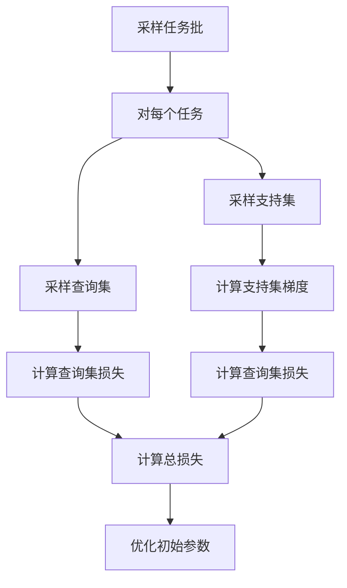
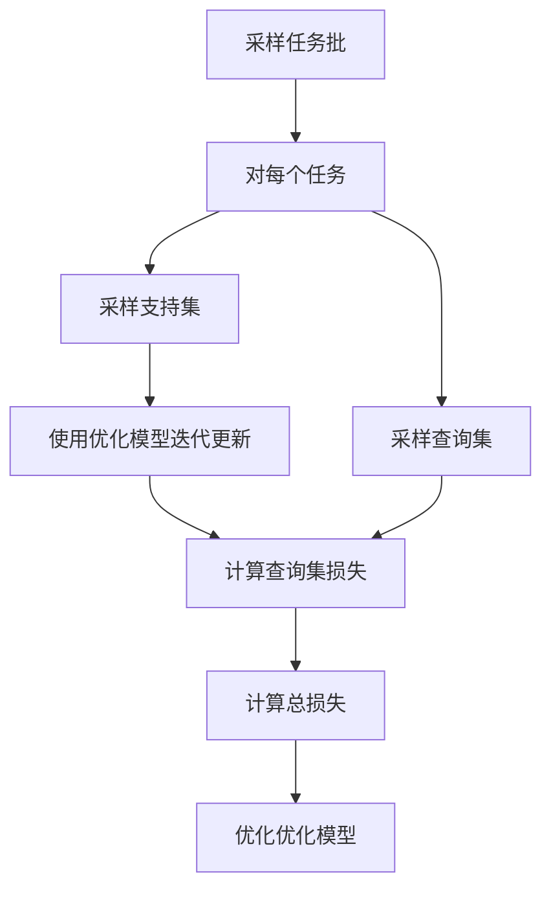

# 一切皆是映射：基于元学习的软件测试和调试

## 1.背景介绍

### 1.1 软件测试和调试的重要性

在软件开发生命周期中,测试和调试是确保软件质量和可靠性的关键环节。随着软件系统日益复杂,手工测试和调试已经无法满足需求,因此需要更智能、更自动化的解决方案。

### 1.2 人工智能在软件工程中的应用

人工智能(AI)技术在软件工程领域的应用日益广泛,包括需求分析、代码生成、测试用例设计等。其中,元学习(Meta-Learning)作为AI的一个新兴分支,为软件测试和调试带来了新的契机。

### 1.3 元学习概述

元学习是机器学习的一种形式,旨在自动学习任务之间的共性知识,从而加速新任务的学习。它模仿人类"学习如何学习"的能力,通过从过去的经验中积累知识,提高在新环境下的学习效率。

## 2.核心概念与联系

### 2.1 元学习与软件测试

在软件测试中,每个程序都是一个新的学习任务。传统的测试方法需要为每个程序手动设计测试用例,费时费力。而基于元学习的测试方法可以从历史程序中学习共性知识,自动生成新程序的高质量测试用例。

### 2.2 元学习与软试调试

调试是定位和修复程序缺陷的过程。传统调试方法依赖人工分析和经验,效率低下。基于元学习的调试方法可以从历史缺陷数据中学习缺陷模式,自动定位新程序中的潜在缺陷,加速调试过程。

### 2.3 元学习算法分类

常见的元学习算法包括:

- 基于模型的元学习: 学习可在不同任务之间共享和传递的模型参数或网络结构。
- 基于指标的元学习: 直接从数据中学习一个可在不同任务中泛化的良好的学习器。
- 基于优化的元学习: 学习一个可快速适应新任务的优化过程。

## 3.核心算法原理具体操作步骤

### 3.1 基于模型的元学习

#### 3.1.1 模型集系综(Model-Agnostic Meta-Learning, MAML)

MAML是一种基于模型的元学习算法,其核心思想是:在元训练阶段,通过多任务训练学习一个可以快速适应新任务的初始化模型参数;在元测试阶段,利用该初始化参数对新任务进行少量梯度更新,即可获得新任务的优化模型。

MAML算法步骤:

1) 采样任务批 $\mathcal{T}_i=\{T_i^{(1)}, T_i^{(2)}, ..., T_i^{(n)}\}$
2) 对每个任务$T_i^{(j)}$:
    - 采样支持集 $D_i^{(j)}=\{x_1^{(j)},y_1^{(j)},...,x_k^{(j)},y_k^{(j)}\}$
    - 采样查询集 $D_i^{(j)'}=\{x_1^{(j)'},y_1^{(j)'},...,x_l^{(j)'},y_l^{(j)'}\}$
    - 计算支持集上的梯度: $\nabla_{\theta} \sum_{x,y\in D_i^{(j)}}\mathcal{L}_\theta(x,y)$
    - 计算查询集上的损失: $\sum_{x,y\in D_i^{(j)'}}\mathcal{L}_{\theta_i^{(j)}}(x,y)$, 其中$\theta_i^{(j)}=\theta-\alpha\nabla_{\theta} \sum_{x,y\in D_i^{(j)}}\mathcal{L}_\theta(x,y)$
3) 优化$\theta$以最小化所有查询集损失的总和

#### 3.1.2 神经网络权重预测(Neural Network Weight Prediction)

该方法将神经网络权重视为一个条件计算机程序,该程序将任务训练数据作为输入,输出该任务的最优神经网络权重。在元训练阶段,通过多任务训练学习一个预测网络,使其能够根据新任务的训练数据预测出该任务的最优神经网络权重。

算法步骤:

1) 采样任务批 $\mathcal{T}_i=\{T_i^{(1)}, T_i^{(2)}, ..., T_i^{(n)}\}$
2) 对每个任务 $T_i^{(j)}$:
    - 采样支持集 $D_i^{(j)}=\{x_1^{(j)},y_1^{(j)},...,x_k^{(j)},y_k^{(j)}\}$ 
    - 训练神经网络获得最优权重 $\theta_i^{(j)*}$
3) 使用 $D_i^{(j)}$ 和 $\theta_i^{(j)*}$ 作为预测网络的输入和目标,优化预测网络参数

### 3.2 基于指标的元学习

#### 3.2.1 学习可嵌入优化器(Learned Embedding Optimization, LEO)

LEO将每个任务表示为一个低维嵌入向量,并学习一个可优化的映射将这些嵌入向量映射到相应任务的优化器参数上。在元训练阶段,LEO通过多任务训练学习该映射函数;在元测试阶段,LEO可基于新任务的嵌入向量生成其优化器参数,从而快速适应该新任务。

算法步骤:

1) 对每个任务 $T_i$:
    - 采样支持集 $D_i=\{x_1,y_1,...,x_k,y_k\}$
    - 计算任务嵌入向量 $e_i$
2) 学习一个映射函数 $f_\phi$,使 $f_\phi(e_i)$ 近似于任务 $T_i$ 的最优优化器参数
3) 在新任务 $T_{new}$ 上:
    - 计算任务嵌入 $e_{new}$  
    - 使用 $f_\phi(e_{new})$ 作为优化器参数,在 $T_{new}$ 上进行优化

### 3.3 基于优化的元学习

#### 3.3.1 优化作为模型(Optimization as Model, OAM)

OAM将优化过程本身建模为一个可学习的模型。在元训练阶段,OAM学习一个可迭代更新参数的优化模型;在元测试阶段,该优化模型可快速适应新任务,生成相应的优化参数。

算法步骤:

1) 采样任务批 $\mathcal{T}_i=\{T_i^{(1)}, T_i^{(2)}, ..., T_i^{(n)}\}$
2) 对每个任务 $T_i^{(j)}$:
    - 采样支持集 $D_i^{(j)}=\{x_1^{(j)},y_1^{(j)},...,x_k^{(j)},y_k^{(j)}\}$
    - 采样查询集 $D_i^{(j)'}=\{x_1^{(j)'},y_1^{(j)'},...,x_l^{(j)'},y_l^{(j)'}\}$
    - 使用优化模型 $f_\theta$ 对支持集进行 $m$ 步迭代,获得 $\theta_i^{(j)}$
    - 计算查询集损失 $\sum_{x,y\in D_i^{(j)'}}\mathcal{L}_{\theta_i^{(j)}}(x,y)$  
3) 优化 $f_\theta$ 以最小化所有查询集损失的总和

## 4.数学模型和公式详细讲解举例说明

### 4.1 MAML算法损失函数

MAML算法的目标是学习一个良好的初始参数 $\theta$,使得在任意新任务 $T_i$ 上,经过少量梯度更新后的模型参数 $\theta_i$ 能够取得较小的损失。

具体来说,对于任务 $T_i$,我们有支持集 $D_i$ 和查询集 $D_i'$。我们首先在支持集上计算梯度:

$$\nabla_{\theta}\sum_{x,y\in D_i}\mathcal{L}_\theta(x,y)$$

然后使用该梯度对初始参数 $\theta$ 进行一步梯度更新,得到新参数:

$$\theta_i'=\theta-\alpha\nabla_{\theta}\sum_{x,y\in D_i}\mathcal{L}_\theta(x,y)$$

其中 $\alpha$ 为学习率。我们的目标是最小化新参数 $\theta_i'$ 在查询集 $D_i'$ 上的损失:

$$\min_\theta \sum_{T_i\sim p(T)}\sum_{x,y\in D_i'}\mathcal{L}_{\theta_i'}(x,y)$$

将 $\theta_i'$ 代入,我们得到 MAML 算法的最终损失函数:

$$\min_\theta \sum_{T_i\sim p(T)}\sum_{x,y\in D_i'}\mathcal{L}_{\theta-\alpha\nabla_{\theta}\sum_{x,y\in D_i}\mathcal{L}_\theta(x,y)}(x,y)$$

通过优化该损失函数,我们可以获得一个良好的初始参数 $\theta$,使得在任意新任务上经过少量梯度更新后,模型性能都能得到提升。

### 4.2 LEO算法嵌入向量计算

在 LEO 算法中,每个任务 $T_i$ 首先被映射为一个嵌入向量 $e_i$。该嵌入向量旨在捕获任务的关键特征,使得不同但相似的任务拥有相近的嵌入向量。

嵌入向量 $e_i$ 的计算方式有多种,例如:

1) **基于数据统计量**。我们可以使用任务数据的统计量(如均值、方差等)作为嵌入向量。

2) **基于梯度嵌入**。我们可以在任务数据上训练一个模型,将模型最后一层的梯度作为嵌入向量。

3) **基于神经网络编码器**。我们可以使用一个神经网络编码器,将任务数据作为输入,输出对应的嵌入向量。

无论采用何种方式,嵌入向量 $e_i$ 都需要满足相似任务之间的向量距离较近的要求。在 LEO 算法中,我们学习一个映射函数 $f_\phi$,使 $f_\phi(e_i)$ 近似于任务 $T_i$ 的最优优化器参数。通过这种方式,LEO 能够基于新任务的嵌入向量快速生成相应的优化器参数,从而加速新任务的学习。

### 4.3 OAM算法优化模型

在 OAM 算法中,我们将优化过程本身建模为一个可学习的模型 $f_\theta$。该模型的输入包括当前模型参数 $\theta_t$ 和当前任务的支持集数据 $D$,输出是更新后的模型参数 $\theta_{t+1}$:

$$\theta_{t+1} = f_\theta(\theta_t, D)$$

在元训练阶段,我们通过多任务训练学习该优化模型 $f_\theta$,使其能够在任意新任务上快速生成良好的优化参数。具体来说,对于每个任务 $T_i$,我们有:

1) 支持集 $D_i$
2) 查询集 $D_i'$
3) 初始参数 $\theta_0$

我们使用优化模型 $f_\theta$ 对支持集 $D_i$ 进行 $m$ 步迭代,得到最终参数 $\theta_i$:

$$\theta_i = f_\theta(\cdots f_\theta(\underbrace{f_\theta(\theta_0, D_i)}_\text{1st iter}, D_i), \cdots, D_i)$$

接着,我们计算 $\theta_i$ 在查询