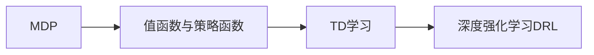
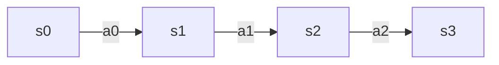

# 一切皆是映射：强化学习在金融市场预测中的应用：挑战与机遇

## 1. 背景介绍

### 1.1 强化学习概述
强化学习(Reinforcement Learning, RL)是机器学习的一个重要分支,它研究如何让智能体(Agent)通过与环境的交互来学习最优策略,从而获得最大的累积奖励。与监督学习和非监督学习不同,强化学习不需要预先准备好标注数据,而是通过探索与利用(Exploration and Exploitation)的平衡,不断试错和优化,最终学习到最优策略。

### 1.2 强化学习在金融领域的应用价值
金融市场是一个高度复杂、动态变化的环境,传统的金融模型和统计方法在处理非线性、非平稳时间序列数据时往往捉襟见肘。而强化学习以其独特的"试错-反馈-优化"机制,为解决金融问题提供了新的思路。近年来,强化学习在量化交易、资产配置、风险管理等金融领域得到广泛应用,并取得了不俗的效果。

### 1.3 强化学习在金融市场预测中面临的挑战
尽管强化学习在金融领域展现出诱人的应用前景,但将其应用于实际的金融市场预测中仍面临诸多挑战:
1. 金融市场的非平稳性和噪声干扰,导致样本外泛化能力不足;  
2. 稀疏奖励问题,即盈亏反馈存在较大的延迟性,奖励信号稀疏;
3. 探索与利用的平衡难题,对算法的采样效率和稳定性提出更高要求;  
4. 大规模状态空间和行动空间,对计算资源和训练时间提出挑战。

## 2. 核心概念与联系

### 2.1 马尔可夫决策过程(MDP)
马尔可夫决策过程是强化学习的理论基础。一个MDP由状态空间S、行动空间A、转移概率P、奖励函数R和折扣因子γ组成。在每个时间步t,智能体根据策略π选择行动at,环境根据转移概率将状态转移到st+1,并反馈奖励rt。智能体的目标是最大化累积奖励。

### 2.2 值函数与策略函数
值函数和策略函数是强化学习的核心。值函数V(s)表示状态s的长期价值,Q(s,a)表示在状态s下选择行动a的长期价值。策略函数π(a|s)表示在状态s下选择行动a的概率。两者的关系可总结为:
$$
V^\pi(s)=\sum_{a\in A}\pi(a|s)Q^\pi(s,a)
$$

### 2.3 时间差分(TD)学习
时间差分学习是强化学习的重要算法,它通过Bootstrap的思想,利用当前值函数对未来奖励的估计来更新值函数,从而实现从经验中学习。SARSA和Q-Learning是两种经典的TD算法。

### 2.4 深度强化学习(DRL) 
深度强化学习将深度学习与强化学习相结合,用深度神经网络来逼近值函数或策略函数,从而让智能体直接从高维状态中学习策略。DQN、A3C、DDPG等算法都是DRL的代表。

### 2.5 核心概念之间的联系
下图展示了强化学习的核心概念之间的联系:



## 3. 核心算法原理具体操作步骤

### 3.1 Q-Learning算法
Q-Learning是一种异策略的值迭代算法,它直接学习最优动作值函数Q*(s,a)。其更新公式为:
$$
Q(s_t,a_t) \leftarrow Q(s_t,a_t)+\alpha[r_t+\gamma \max_{a}Q(s_{t+1},a)-Q(s_t,a_t)]
$$

其中α是学习率,γ是折扣因子。Q-Learning的具体步骤如下:

1. 初始化Q(s,a)
2. 循环每一个episode:
   1. 初始化状态s
   2. 循环每一个step:
      1. 根据ε-greedy策略选择行动a
      2. 执行行动a,观察奖励r和下一状态s'
      3. 根据公式更新Q(s,a)
      4. s ← s'
3. 返回Q*

### 3.2 DQN算法
DQN算法使用深度神经网络来逼近最优动作值函数Q*(s,a),其损失函数为:
$$
L(\theta)=\mathbb{E}[(r+\gamma \max_{a'}Q(s',a';\theta^-)-Q(s,a;\theta))^2]
$$

其中θ是网络参数,θ-是目标网络参数。DQN引入了经验回放和目标网络两个机制来提高训练的稳定性。其具体步骤为:

1. 初始化Q网络和目标网络
2. 初始化经验回放池D
3. 循环每一个episode:
   1. 初始化状态s
   2. 循环每一个step:
      1. 根据ε-greedy策略选择行动a
      2. 执行行动a,观察奖励r和下一状态s'
      3. 将转移(s,a,r,s')存入D 
      4. 从D中随机采样一个batch
      5. 计算目标值y=r+γ*max(Q(s',a';θ-))
      6. 最小化损失L=(y-Q(s,a;θ))^2
      7. 每C步同步目标网络θ-=θ
      8. s ← s'
4. 返回Q*

### 3.3 DDPG算法
DDPG算法是一种基于行动者-评论家(Actor-Critic)框架的DRL算法,它适用于连续动作空间。DDPG同时学习一个行动者网络μ(s)和一个评论家网络Q(s,a),分别用于生成行动和评估行动的价值。其具体步骤为:

1. 随机初始化行动者网络μ和评论家网络Q
2. 初始化目标网络μ'和Q'
3. 初始化经验回放池D  
4. 循环每一个episode:
   1. 初始化状态s
   2. 循环每一个step:
      1. 根据μ(s)选择行动a,并添加探索噪声
      2. 执行行动a,观察奖励r和下一状态s'
      3. 将转移(s,a,r,s')存入D
      4. 从D中随机采样一个batch 
      5. 计算目标值y=r+γQ'(s',μ'(s'))
      6. 最小化评论家损失L=(y-Q(s,a))^2,更新Q
      7. 最大化行动者目标J=E[Q(s,μ(s))],更新μ
      8. 软更新目标网络:θ'←τθ+(1-τ)θ'
      9. s ← s'
5. 返回μ*和Q*

## 4. 数学模型和公式详细讲解举例说明

### 4.1 MDP的数学定义
一个MDP可以形式化地定义为一个五元组(S,A,P,R,γ),其中:

- S是有限的状态空间
- A是有限的行动空间 
- P是转移概率矩阵,P(s'|s,a)表示在状态s下选择行动a转移到状态s'的概率
- R是奖励函数,R(s,a)表示在状态s下选择行动a获得的即时奖励
- γ∈[0,1]是折扣因子,表示未来奖励的折算率

MDP满足马尔可夫性,即下一状态仅取决于当前状态和行动,与之前的历史无关:
$$
P(s_{t+1}|s_t,a_t,s_{t-1},a_{t-1},...,s_0,a_0)=P(s_{t+1}|s_t,a_t)
$$

在MDP中,智能体与环境的交互过程可以看作一个马尔可夫链:


举例说明:考虑一个简单的股票交易MDP。状态s表示持有的现金和股票,行动a表示买入、持有或卖出,奖励r表示收益。那么一次交互的转移概率可以表示为:
$$
P(s_{cash-100,stock+1}|s_{cash,stock},a_{buy})=0.6 \\
P(s_{cash,stock}|s_{cash,stock},a_{buy})=0.4
$$

即在持有现金cash和股票stock的状态下选择买入行动,有60%的概率买入成功,40%的概率维持不变。

### 4.2 值函数的贝尔曼方程
值函数满足贝尔曼方程(Bellman Equation),它描述了当前状态的值与下一状态值之间的递归关系:
$$
V^\pi(s)=\sum_{a\in A}\pi(a|s)[R(s,a)+\gamma \sum_{s'\in S}P(s'|s,a)V^\pi(s')] \\
Q^\pi(s,a)=R(s,a)+\gamma \sum_{s'\in S}P(s'|s,a)\sum_{a'\in A}\pi(a'|s')Q^\pi(s',a')
$$

这启发我们可以通过不断估计未来的累积奖励来更新当前值函数,这正是时间差分学习的核心思想。

以Q-Learning为例,我们可以将其更新公式:
$$
Q(s_t,a_t) \leftarrow Q(s_t,a_t)+\alpha[r_t+\gamma \max_{a}Q(s_{t+1},a)-Q(s_t,a_t)]
$$

视为贝尔曼最优方程的一个采样形式:
$$
Q^*(s,a)=R(s,a)+\gamma \sum_{s'\in S}P(s'|s,a)\max_{a'}Q^*(s',a')
$$

即利用下一状态的最优动作值来近似当前状态动作对的真实Q值。

### 4.3 策略梯度定理
策略梯度定理给出了策略函数参数化后的梯度表达式:
$$
\nabla_\theta J(\pi_\theta)=\mathbb{E}_{\tau \sim \pi_\theta}[\sum_{t=0}^T\nabla_\theta \log \pi_\theta(a_t|s_t)Q^{\pi_\theta}(s_t,a_t)]
$$

其中τ表示一条轨迹,它由状态-行动序列(s0,a0,s1,a1,...,sT,aT)组成。这个定理告诉我们,一个好的策略应该倾向于选择具有高Q值的行动,而抑制低Q值行动的概率。

在DDPG算法中,我们用一个行动者网络μ(s;θμ)来参数化策略函数,用一个评论家网络Q(s,a;θQ)来近似真实Q值。根据策略梯度定理,行动者网络的目标就是最大化期望的Q值:
$$
J(\theta_\mu)=\mathbb{E}_{s\sim D}[Q(s,\mu(s;\theta_\mu);\theta_Q)]
$$

因此行动者网络的参数θμ可以沿着策略梯度的方向进行更新:
$$
\nabla_{\theta_\mu}J=\mathbb{E}_{s\sim D}[\nabla_{\theta_\mu}\mu(s;\theta_\mu)\nabla_aQ(s,a;\theta_Q)|_{a=\mu(s;\theta_\mu)}]
$$

## 5. 项目实践：代码实例和详细解释说明

下面我们以一个简单的股票交易强化学习项目为例,展示如何用PyTorch实现DQN算法。

### 5.1 环境构建
首先我们构建一个简单的股票交易环境。状态由持有现金、持有股票数和当前股价组成,行动包括买入、持有、卖出三种,奖励为每日的收益率。

```python
import numpy as np
import pandas as pd

class StockTradingEnv:
    def __init__(self, data, initial_cash=1000, buy_cost=0.001, sell_cost=0.001):
        self.stock_price = data.Close
        self.initial_cash = initial_cash
        self.buy_cost = buy_cost
        self.sell_cost = sell_cost
        self.cur_step = None
        
    def reset(self):
        self.cash = self.initial_cash
        self.stock = 0
        self.cur_step = 0
        return self._get_state()
        
    def step(self, action):
        assert action in [0, 1, 2], 'Invalid action.'
        
        prev_price = self.stock_price[self.cur_step]
        self.cur_step += 1
        cur_price = self.stock_price[self.cur_step]
        
        if action == 0:  # buy