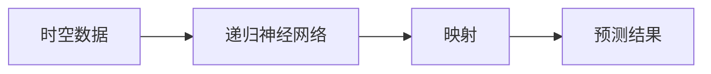

## 1.背景介绍

在我们的日常生活中，大量的数据都是时空数据。无论是气象观测、交通流量、股市数据，还是社交网络中的信息传播，都可以被视为在时空中的动态过程。对这些数据的分析，可以帮助我们理解和预测世界的运行规律，从而做出更好的决策。

对时空数据的分析，一直是数据科学领域的重要研究课题。然而，由于时空数据的复杂性，传统的分析方法往往难以给出满意的结果。这就需要我们寻找新的分析方法，以更好地处理时空数据。

递归神经网络（RNN）是一种强大的深度学习模型，它能够处理序列数据，如时间序列或文本。因此，RNN自然成为处理时空数据的理想选择。

## 2.核心概念与联系

在开始深入讨论之前，我们首先需要理解一些核心的概念：映射、时空数据、递归神经网络。

映射，是数学中的一个基本概念，指的是从一个集合到另一个集合的转换。在我们的问题中，映射可以理解为从时空数据到预测结果的转换。

时空数据，是指包含时间和空间信息的数据。例如，一个城市每个地点的每小时的气温，就是一个时空数据。

递归神经网络（RNN），是一种能够处理序列数据的深度学习模型。RNN的关键特性是它的“记忆”能力，即它能够保留过去的信息，并用这些信息来影响未来的预测。

这三个概念之间的联系，可以用下面的Mermaid流程图来表示：



## 3.核心算法原理具体操作步骤

使用递归神经网络对时空数据进行分析，主要包括以下几个步骤：

1. 数据预处理：将时空数据转换为适合RNN处理的格式。这通常涉及到数据的规范化、缺失值处理、序列化等操作。
2. 构建模型：定义RNN的结构，包括输入层、隐藏层、输出层的大小，以及连接方式等。
3. 训练模型：使用训练数据来调整RNN的参数，使模型能够更好地拟合数据。这通常涉及到反向传播、优化器选择、损失函数定义等操作。
4. 验证模型：使用验证数据来检查模型的泛化能力，即模型对未见过的数据的预测能力。
5. 预测：使用训练好的模型对新的时空数据进行预测。

## 4.数学模型和公式详细讲解举例说明

递归神经网络的核心是一个递归的数学模型。在每个时间步，RNN都会根据当前的输入和过去的状态，来计算新的状态和输出。这可以用下面的数学公式来表示：

$$
h_t = f(W_hh_{t-1} + W_xx_t + b_h)
$$
$$
y_t = W_yh_t + b_y
$$

其中，$h_t$是在时间$t$的隐藏状态，$x_t$是在时间$t$的输入，$y_t$是在时间$t$的输出。$W_h$、$W_x$和$W_y$是权重矩阵，$b_h$和$b_y$是偏置向量。$f$是激活函数，通常选择为非线性函数，如tanh或ReLU。

例如，假设我们有一个简单的时空数据，表示为$(x_1, x_2, x_3)$，我们想要预测下一个值$x_4$。我们可以将$x_1, x_2, x_3$作为输入，通过RNN得到隐藏状态$h_1, h_2, h_3$，然后使用$h_3$来预测$x_4$。

## 5.项目实践：代码实例和详细解释说明

下面是一个使用Python和Keras库来实现RNN的简单示例。我们首先导入所需的库，然后定义模型的结构，最后使用训练数据来训练模型，并进行预测。

```python
from keras.models import Sequential
from keras.layers import SimpleRNN, Dense

# 定义模型
model = Sequential()
model.add(SimpleRNN(50, return_sequences=True, input_shape=(None, 1)))
model.add(Dense(1))

# 编译模型
model.compile(loss='mean_squared_error', optimizer='adam')

# 训练模型
model.fit(train_X, train_y, epochs=20, batch_size=32)

# 预测
pred_y = model.predict(test_X)
```

在这个示例中，我们使用了一个简单的RNN结构，其中只有一个隐藏层，隐藏层的大小为50。我们使用均方误差作为损失函数，Adam作为优化器。

## 6.实际应用场景

递归神经网络在处理时空数据的应用非常广泛。例如：

- 气象预报：使用过去的气象数据，预测未来的天气情况。
- 交通流量预测：使用过去的交通流量数据，预测未来的交通状况。
- 股市预测：使用过去的股市数据，预测未来的股市走势。

## 7.工具和资源推荐

对于想要深入学习和应用递归神经网络的读者，我推荐以下工具和资源：

- Python：一种广泛使用的编程语言，特别适合进行数据分析和机器学习。
- Keras：一个基于Python的深度学习库，提供了简洁而强大的API，特别适合初学者。
- TensorFlow：一个强大的深度学习框架，提供了丰富的功能和优化，适合进行大规模的深度学习。

## 8.总结：未来发展趋势与挑战

递归神经网络是一种强大的工具，它已经在处理时空数据的许多应用中取得了显著的成果。然而，RNN也面临着一些挑战，如梯度消失问题、长期依赖问题等。这些问题的解决，需要我们进一步的研究和探索。

在未来，我相信递归神经网络将在处理时空数据的领域发挥更大的作用。随着技术的进步，我们将能够构建更复杂、更强大的RNN模型，从而解决更多的实际问题。

## 9.附录：常见问题与解答

Q: 递归神经网络和循环神经网络有什么区别？

A: 递归神经网络和循环神经网络都是处理序列数据的模型，但它们的结构和工作方式有所不同。递归神经网络是一种树状结构，它的输入是一个序列，输出是一个值。而循环神经网络是一种环状结构，它的每个时间步都有输入和输出。

Q: 递归神经网络适合处理什么类型的问题？

A: 递归神经网络特别适合处理有时间或空间序列的问题，如时间序列预测、语音识别、自然语言处理等。

Q: 递归神经网络的训练有什么挑战？

A: 递归神经网络的训练面临一些挑战，如梯度消失问题、长期依赖问题等。这些问题需要通过设计更复杂的模型结构（如LSTM、GRU）或者使用更好的优化方法（如Adam）来解决。

作者：禅与计算机程序设计艺术 / Zen and the Art of Computer Programming