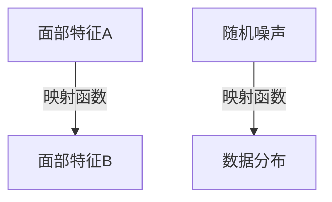

## 1.背景介绍

在人工智能的世界中，深度伪造技术和对抗性神经网络已经引起了广泛的关注。这两者之间的联系在于，它们都利用了深度学习的概念，但在实际应用中却表现出不同的特点和挑战。

深度伪造，通常被称为“Deepfake”，是一种利用深度学习技术合成或者篡改图像和视频的技术。这种技术的出现，使得我们可以在视频中看到那些从未发生过的事情，比如一个人在视频中说出他从未说过的话。

对抗性神经网络则是一种深度学习模型，它由两个子网络组成：生成器和判别器。生成器的目标是生成尽可能真实的假数据，而判别器的目标则是区分出真实数据和假数据。

## 2.核心概念与联系

在这两个概念之间，有一个共同的核心概念，那就是“映射”。在深度伪造技术中，我们通过学习一个映射函数，将一个人的面部特征映射到另一个人的面部特征上。在对抗性神经网络中，生成器也是通过学习一个映射函数，将随机噪声映射到数据分布上。



## 3.核心算法原理具体操作步骤

深度伪造技术和对抗性神经网络的核心算法原理都是基于深度学习的，但具体的操作步骤却有所不同。

### 3.1 深度伪造技术的操作步骤

1. 首先，我们需要收集两个人的面部图像数据，然后使用预处理技术将这些图像转换为适合深度学习模型的格式。
2. 然后，我们需要训练一个深度学习模型，这个模型能够学习到从一个人的面部特征到另一个人的面部特征的映射函数。
3. 最后，我们可以使用这个训练好的模型，将一个人的面部特征替换为另一个人的面部特征，从而生成深度伪造的视频。

### 3.2 对抗性神经网络的操作步骤

1. 首先，我们需要初始化生成器和判别器的参数。
2. 然后，我们在每一轮的训练中，都会让生成器生成一些假数据，然后让判别器去判断这些数据是真是假。
3. 通过不断的训练，生成器会越来越擅长于生成看起来真实的假数据，而判别器会越来越擅长于区分真实数据和假数据。

## 4.数学模型和公式详细讲解举例说明

在深度伪造技术和对抗性神经网络中，我们都需要训练深度学习模型。这个过程可以被描述为一个优化问题。

对于深度伪造技术，我们的目标是最小化重构误差，这可以通过以下公式来表示：

$$
\min_{\theta} \frac{1}{N} \sum_{i=1}^{N} ||x_i - f_\theta(x_i)||^2
$$

其中，$x_i$ 是输入的面部图像，$f_\theta$ 是我们的深度学习模型，$\theta$ 是模型的参数，$N$ 是数据的数量。

对于对抗性神经网络，我们的目标是让生成器生成的假数据尽可能地接近真实数据的分布。这可以通过以下公式来表示：

$$
\min_{G} \max_{D} V(D, G) = \mathbb{E}_{x\sim p_{data}(x)}[\log D(x)] + \mathbb{E}_{z\sim p_{z}(z)}[\log (1-D(G(z)))]
$$

其中，$D$ 是判别器，$G$ 是生成器，$p_{data}$ 是真实数据的分布，$p_{z}$ 是随机噪声的分布，$V(D, G)$ 是我们的目标函数。

## 5.项目实践：代码实例和详细解释说明

在实际的项目实践中，我们可以使用开源的深度学习框架，如TensorFlow或PyTorch，来实现深度伪造技术和对抗性神经网络。

### 5.1 深度伪造技术的代码实例

以下是一个简单的深度伪造技术的代码实例，我们首先定义了一个深度学习模型，然后使用MSE作为损失函数，优化模型的参数。

```python
import tensorflow as tf

# 定义模型
model = tf.keras.models.Sequential([
  tf.keras.layers.Conv2D(64, (3, 3), activation='relu', input_shape=(128, 128, 3)),
  tf.keras.layers.MaxPooling2D(2, 2),
  tf.keras.layers.Conv2D(64, (3, 3), activation='relu'),
  tf.keras.layers.MaxPooling2D(2,2),
  tf.keras.layers.Flatten(),
  tf.keras.layers.Dense(512, activation='relu'),
  tf.keras.layers.Dense(128*128*3, activation='sigmoid')
])

# 定义损失函数和优化器
model.compile(optimizer='adam', loss='mse')

# 训练模型
model.fit(x_train, y_train, epochs=10)
```

### 5.2 对抗性神经网络的代码实例

以下是一个简单的对抗性神经网络的代码实例，我们首先定义了生成器和判别器，然后通过交替训练生成器和判别器，优化它们的参数。

```python
import torch
import torch.nn as nn

# 定义生成器
class Generator(nn.Module):
  def __init__(self):
    super(Generator, self).__init__()
    self.main = nn.Sequential(
      nn.Linear(100, 256),
      nn.ReLU(True),
      nn.Linear(256, 512),
      nn.ReLU(True),
      nn.Linear(512, 1024),
      nn.ReLU(True),
      nn.Linear(1024, 784),
      nn.Tanh()
    )
  def forward(self, input):
    return self.main(input)

# 定义判别器
class Discriminator(nn.Module):
  def __init__(self):
    super(Discriminator, self).__init__()
    self.main = nn.Sequential(
      nn.Linear(784, 1024),
      nn.LeakyReLU(0.2, inplace=True),
      nn.Dropout(0.3),
      nn.Linear(1024, 512),
      nn.LeakyReLU(0.2, inplace=True),
      nn.Dropout(0.3),
      nn.Linear(512, 256),
      nn.LeakyReLU(0.2, inplace=True),
      nn.Dropout(0.3),
      nn.Linear(256, 1),
      nn.Sigmoid()
    )
  def forward(self, input):
    return self.main(input)
```

## 6.实际应用场景

深度伪造技术和对抗性神经网络都有广泛的实际应用场景。

深度伪造技术可以用于电影制作，比如替换演员的面部，或者制作特效。但同时，它也带来了一些问题，比如深度伪造的视频可能被用于制造假新闻或者进行网络诈骗。

对抗性神经网络则可以用于生成新的数据，比如生成新的图像、音乐或者文本。它也可以用于增强学习，通过生成新的训练样本，提高模型的泛化能力。

## 7.工具和资源推荐

如果你对深度伪造技术和对抗性神经网络感兴趣，以下是一些推荐的工具和资源：

- TensorFlow和PyTorch：这是两个非常流行的深度学习框架，它们都提供了丰富的API和文档，可以帮助你快速地实现深度学习模型。
- DeepFaceLab：这是一个开源的深度伪造工具，它提供了一整套的流程，包括数据收集、模型训练和视频生成。
- GANs in Action：这是一本关于对抗性神经网络的书，它详细地介绍了对抗性神经网络的原理和实践。

## 8.总结：未来发展趋势与挑战

深度伪造技术和对抗性神经网络都是深度学习的重要应用，它们的发展趋势和挑战也值得我们关注。

对于深度伪造技术，未来的发展趋势可能是提高生成的视频的质量，同时也需要解决由此带来的社会问题，如何防止深度伪造的视频被用于不良目的。

对于对抗性神经网络，未来的发展趋势可能是提高生成的数据的质量，同时也需要解决训练的稳定性问题，如何让生成器和判别器在训练过程中保持平衡。

## 9.附录：常见问题与解答

Q: 深度伪造技术和对抗性神经网络有什么区别？

A: 深度伪造技术和对抗性神经网络都是基于深度学习的技术，但它们的目标不同。深度伪造技术的目标是生成看起来真实的视频，而对抗性神经网络的目标是生成看起来真实的数据。

Q: 如何防止深度伪造的视频被用于不良目的？

A: 这是一个复杂的问题，需要社会各方面的共同努力。一方面，我们需要加强法律法规的制定，对滥用深度伪造技术的行为进行打击。另一方面，我们也需要研发新的技术，比如深度伪造检测技术，来识别和防止深度伪造的视频。

作者：禅与计算机程序设计艺术 / Zen and the Art of Computer Programming