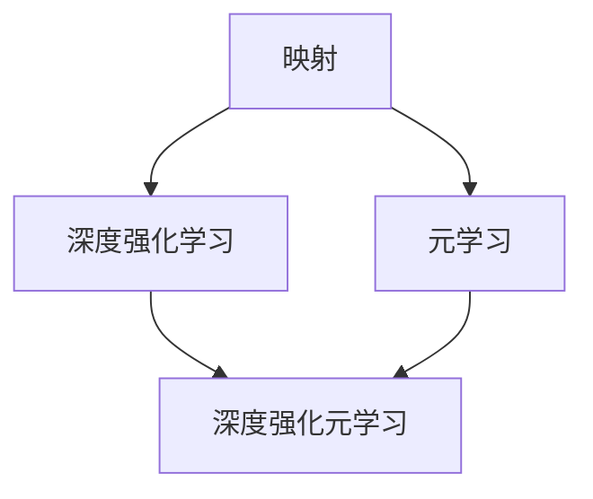

# 一切皆是映射：深度强化元学习的挑战与机遇

## 1. 背景介绍

### 1.1 人工智能的发展历程
#### 1.1.1 早期的人工智能
#### 1.1.2 机器学习的兴起  
#### 1.1.3 深度学习的突破

### 1.2 强化学习的崛起
#### 1.2.1 强化学习的基本概念
#### 1.2.2 强化学习的优势
#### 1.2.3 强化学习的应用场景

### 1.3 元学习的兴起
#### 1.3.1 元学习的定义
#### 1.3.2 元学习的优势  
#### 1.3.3 元学习的研究现状

## 2. 核心概念与联系

### 2.1 映射的概念
#### 2.1.1 数学中的映射
#### 2.1.2 计算机科学中的映射
#### 2.1.3 人工智能中的映射

### 2.2 深度强化学习
#### 2.2.1 深度学习与强化学习的结合
#### 2.2.2 深度强化学习的优势
#### 2.2.3 深度强化学习的挑战

### 2.3 元学习
#### 2.3.1 元学习的分类
#### 2.3.2 基于度量的元学习
#### 2.3.3 基于优化的元学习

### 2.4 深度强化元学习
#### 2.4.1 深度强化元学习的定义
#### 2.4.2 深度强化元学习的优势
#### 2.4.3 深度强化元学习的挑战

## 3. 核心算法原理具体操作步骤

### 3.1 深度Q网络(DQN)
#### 3.1.1 Q学习的基本原理
#### 3.1.2 DQN的网络结构
#### 3.1.3 DQN的训练过程

### 3.2 近端策略优化(PPO) 
#### 3.2.1 策略梯度的基本原理
#### 3.2.2 PPO的目标函数
#### 3.2.3 PPO的训练过程

### 3.3 模型无关的元学习(MAML)
#### 3.3.1 MAML的基本原理
#### 3.3.2 MAML的目标函数
#### 3.3.3 MAML的训练过程

### 3.4 深度强化元学习算法
#### 3.4.1 MQL的基本原理
#### 3.4.2 RL2的基本原理  
#### 3.4.3 PEARL的基本原理

## 4. 数学模型和公式详细讲解举例说明

### 4.1 马尔可