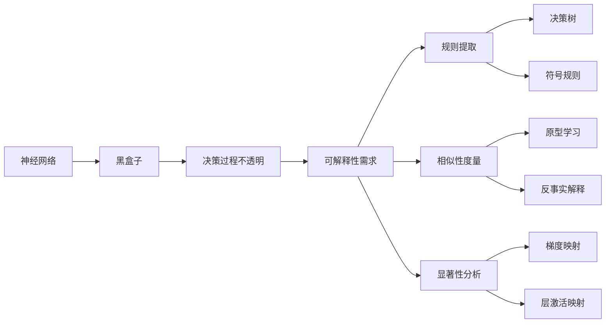

# 一切皆是映射：神经网络的可解释性问题

## 1.背景介绍
### 1.1 人工智能的发展历程
#### 1.1.1 早期的符号主义 AI
#### 1.1.2 连接主义兴起
#### 1.1.3 深度学习的崛起
### 1.2 神经网络的应用现状
#### 1.2.1 计算机视觉
#### 1.2.2 自然语言处理  
#### 1.2.3 语音识别
### 1.3 可解释性问题的提出
#### 1.3.1 黑盒子问题
#### 1.3.2 模型决策过程不透明
#### 1.3.3 可解释性的重要意义

## 2.核心概念与联系
### 2.1 可解释性的定义
#### 2.1.1 模型透明度
#### 2.1.2 决策过程可理解
#### 2.1.3 结果可解释
### 2.2 可解释性与其他概念的关系  
#### 2.2.1 可解释性与泛化能力
#### 2.2.2 可解释性与鲁棒性
#### 2.2.3 可解释性与隐私保护
### 2.3 可解释性分类
#### 2.3.1 全局可解释性
#### 2.3.2 局部可解释性
#### 2.3.3 内在可解释性与事后可解释性

## 3.核心算法原理具体操作步骤
### 3.1 基于规则的可解释性方法
#### 3.1.1 决策树
#### 3.1.2 符号规则提取
#### 3.1.3 因果规则挖掘
### 3.2 基于相似性的可解释性方法
#### 3.2.1 原型学习
#### 3.2.2 影响函数
#### 3.2.3 反事实解释
### 3.3 基于显著性的可解释性方法 
#### 3.3.1 梯度显著性映射
#### 3.3.2 层激活映射
#### 3.3.3 基于扰动的显著性

## 4.数学模型和公式详细讲解举例说明
### 4.1 线性模型的可解释性
#### 4.1.1 线性回归
#### 4.1.2 逻辑回归
#### 4.1.3 广义线性模型
### 4.2 非线性模型的可解释性挑战
#### 4.2.1 多层感知机 MLP
#### 4.2.2 卷积神经网络 CNN
#### 4.2.3 循环神经网络 RNN
### 4.3 可解释性数学建模
#### 4.3.1 因果建模
#### 4.3.2 概率图模型
#### 4.3.3 反事实推理

## 5.项目实践：代码实例和详细解释说明
### 5.1 利用LIME进行局部可解释性分析
#### 5.1.1 LIME原理
#### 5.1.2 图像分类任务
#### 5.1.3 文本情感分析任务
### 5.2 利用SHAP进行全局可解释性分析
#### 5.2.1 SHAP原理
#### 5.2.2 Shapley值计算
#### 5.2.3 特征重要性解释
### 5.3 基于因果和反事实推理的可解释性
#### 5.3.1 因果建模
#### 5.3.2 反事实推理
#### 5.3.3 个性化解释生成

## 6.实际应用场景
### 6.1 医疗诊断领域
#### 6.1.1 疾病预测与风险评估
#### 6.1.2 治疗方案解释
#### 6.1.3 辅助医生决策
### 6.2 自动驾驶领域
#### 6.2.1 场景理解与决策解释
#### 6.2.2 事故责任判定
#### 6.2.3 增强乘客信任
### 6.3 金融风控领域
#### 6.3.1 信用评分可解释性
#### 6.3.2 反欺诈异常检测
#### 6.3.3 投资决策解释

## 7.工具和资源推荐
### 7.1 可解释性工具包
#### 7.1.1 LIME
#### 7.1.2 SHAP
#### 7.1.3 AIX360
### 7.2 相关学习资源 
#### 7.2.1 教程与课程
#### 7.2.2 论文与书籍
#### 7.2.3 开源项目与代码库
### 7.3 研究热点与前沿方向
#### 7.3.1 因果机器学习
#### 7.3.2 神经符号融合
#### 7.3.3 交互式机器学习

## 8.总结：未来发展趋势与挑战
### 8.1 可解释性标准化
#### 8.1.1 可解释性评估框架
#### 8.1.2 可解释性基准测试
#### 8.1.3 行业标准制定
### 8.2 面向特定领域的可解释性
#### 8.2.1 领域知识融合
#### 8.2.2 特定任务的解释需求
#### 8.2.3 人机协同决策
### 8.3 未来研究方向与挑战
#### 8.3.1 因果推理能力
#### 8.3.2 多模态可解释性
#### 8.3.3 可解释性与性能的权衡

## 9.附录：常见问题与解答
### 9.1 可解释性会降低模型性能吗？
### 9.2 如何权衡可解释性和隐私保护？
### 9.3 可解释性在无监督学习中的应用？
### 9.4 可解释性对模型设计有何启发？
### 9.5 如何将可解释性方法应用到实际系统中？

神经网络作为一种强大的机器学习模型,在各个领域取得了广泛的应用和巨大的成功。然而,由于其内部结构和决策过程的不透明性,神经网络常常被视为一个难以解释和理解的"黑盒子"。这种不透明性引发了人们对神经网络可解释性的关注和研究。

可解释性是指让机器学习模型的决策过程对人类来说是可理解、可解释的能力。一个可解释的模型不仅能给出决策结果,还能解释其做出这一决策的原因和依据。可解释性对于增强人们对模型的信任、发现潜在错误、确保公平性等方面都有重要意义。

针对神经网络可解释性问题,研究者提出了多种解决方案。基于规则的方法试图从训练好的神经网络中提取出人类可理解的规则,如决策树、符号规则等。基于相似性的方法通过寻找与待解释样本相似的原型样本,来解释模型的决策。基于显著性的方法则利用梯度、激活等信息,分析输入特征对模型输出的贡献和影响。

可解释性的数学建模也是一个重要方向。因果模型通过建立变量间的因果关系,使得模型具有因果解释能力。概率图模型利用条件概率关系,以图的形式表示变量间的依赖关系。反事实推理则从"如果没有发生某事,结果会怎样"的角度,来解释模型行为。

在实际应用中,可解释性技术在医疗、自动驾驶、金融等领域发挥着重要作用。通过对模型决策过程的解释,可以帮助医生进行诊断和治疗、判定自动驾驶事故责任、解释信用评分结果等。一些可解释性工具包如LIME、SHAP等,为可解释性分析提供了便利。

未来,可解释性将向标准化、特定领域化等方向发展。建立可解释性评估框架和基准,制定行业标准,将成为重要任务。融合领域知识,针对特定任务设计解释方法,实现人机协同决策,也是未来的重点。同时,因果推理、多模态可解释性等也是充满挑战和机遇的研究方向。

神经网络的可解释性问题关系到人工智能的可信、可用、可控,是实现人机协同、提升人工智能应用价值的重要一环。通过技术创新和多学科交叉,不断提升神经网络的可解释性,让人工智能更好地造福人类,是我们的使命和追求。

作者：禅与计算机程序设计艺术 / Zen and the Art of Computer Programming