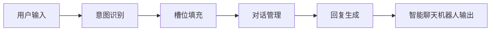

# 一切皆是映射：结合深度学习的智能聊天机器人开发

## 1.背景介绍
### 1.1 人工智能与自然语言处理的发展历程
#### 1.1.1 人工智能的起源与发展
#### 1.1.2 自然语言处理技术的演进
#### 1.1.3 深度学习在NLP中的应用

### 1.2 智能聊天机器人的兴起
#### 1.2.1 聊天机器人的发展历程
#### 1.2.2 智能聊天机器人的应用场景
#### 1.2.3 智能聊天机器人面临的挑战

### 1.3 映射思想在人工智能中的应用
#### 1.3.1 映射的数学定义
#### 1.3.2 映射思想在机器学习中的体现
#### 1.3.3 映射在自然语言处理中的应用

## 2.核心概念与联系
### 2.1 深度学习基础
#### 2.1.1 人工神经网络
#### 2.1.2 前馈神经网络
#### 2.1.3 卷积神经网络

### 2.2 自然语言处理基础
#### 2.2.1 词向量表示
#### 2.2.2 语言模型
#### 2.2.3 序列建模

### 2.3 智能聊天机器人的关键技术
#### 2.3.1 意图识别
#### 2.3.2 槽位填充
#### 2.3.3 对话管理

### 2.4 映射思想在智能聊天机器人中的应用
#### 2.4.1 输入到意图的映射
#### 2.4.2 意图到动作的映射
#### 2.4.3 动作到回复的映射



## 3.核心算法原理具体操作步骤
### 3.1 意图识别算法
#### 3.1.1 基于规则的意图识别
#### 3.1.2 基于机器学习的意图识别
#### 3.1.3 基于深度学习的意图识别

### 3.2 槽位填充算法
#### 3.2.1 条件随机场(CRF)
#### 3.2.2 递归神经网络(RNN)
#### 3.2.3 注意力机制

### 3.3 对话管理算法
#### 3.3.1 有限状态机
#### 3.3.2 基于框架的对话管理
#### 3.3.3 深度强化学习对话管理

### 3.4 回复生成算法
#### 3.4.1 基于检索的回复生成
#### 3.4.2 基于生成的回复生成
#### 3.4.3 融合检索和生成的回复生成

## 4.数学模型和公式详细讲解举例说明
### 4.1 词向量表示模型
#### 4.1.1 One-hot编码
$$X = [x_1, x_2, ..., x_n], x_i \in \mathbb{R}^{|V|}$$
其中$|V|$表示词汇表的大小。

#### 4.1.2 Word2Vec模型
$$\mathbf{v}_w = \frac{1}{|V(w)|} \sum_{c \in V(w)} \mathbf{v}_c$$

其中$\mathbf{v}_w$表示目标词$w$的词向量，$V(w)$表示目标词$w$的上下文窗口，$\mathbf{v}_c$表示上下文词$c$的词向量。

### 4.2 语言模型
#### 4.2.1 N-gram语言模型
$$P(w_1, w_2, ..., w_m) = \prod_{i=1}^m P(w_i | w_1, w_2, ..., w_{i-1}) \approx \prod_{i=1}^m P(w_i | w_{i-n+1}, ..., w_{i-1})$$

其中$w_1, w_2, ..., w_m$表示一个长度为$m$的词序列，$n$表示n-gram的阶数。

#### 4.2.2 神经网络语言模型
$$\mathbf{h}_t = \sigma(\mathbf{W}_{hx}\mathbf{x}_t + \mathbf{W}_{hh}\mathbf{h}_{t-1} + \mathbf{b}_h)$$
$$\mathbf{o}_t = \mathbf{W}_{oh}\mathbf{h}_t + \mathbf{b}_o$$
$$\hat{\mathbf{y}}_t = \text{softmax}(\mathbf{o}_t)$$

其中$\mathbf{x}_t$表示时间步$t$的输入词向量，$\mathbf{h}_t$表示时间步$t$的隐藏状态，$\mathbf{o}_t$表示时间步$t$的输出，$\hat{\mathbf{y}}_t$表示时间步$t$的预测概率分布。

### 4.3 序列标注模型
#### 4.3.1 隐马尔可夫模型(HMM)
$$P(\mathbf{y}|\mathbf{x}) = \frac{P(\mathbf{x},\mathbf{y})}{P(\mathbf{x})} = \frac{P(y_1)P(x_1|y_1)\prod_{i=2}^n P(y_i|y_{i-1})P(x_i|y_i)}{\sum_{\mathbf{y}'}P(\mathbf{x},\mathbf{y}')}$$

其中$\mathbf{x} = (x_1, x_2, ..., x_n)$表示观测序列，$\mathbf{y} = (y_1, y_2, ..., y_n)$表示隐状态序列。

#### 4.3.2 条件随机场(CRF)
$$P(\mathbf{y}|\mathbf{x}) = \frac{1}{Z(\mathbf{x})} \exp \left(\sum_{i=1}^n \sum_{k} \lambda_k f_k(y_{i-1}, y_i, \mathbf{x}, i)\right)$$

其中$Z(\mathbf{x})$是归一化因子，$f_k$是特征函数，$\lambda_k$是对应的权重。

## 5.项目实践：代码实例和详细解释说明
### 5.1 意图识别模块
```python
import tensorflow as tf

# 定义输入占位符
input_text = tf.placeholder(tf.string, [None])

# 将输入文本转换为词向量
embedding = tf.keras.layers.Embedding(vocab_size, embedding_dim)(input_text)

# 使用CNN进行特征提取
conv = tf.keras.layers.Conv1D(filters=128, kernel_size=3, activation='relu')(embedding)
pool = tf.keras.layers.GlobalMaxPool1D()(conv)

# 使用全连接层进行意图分类
intent_logits = tf.keras.layers.Dense(num_intents)(pool)
intent_probs = tf.nn.softmax(intent_logits)

# 定义损失函数和优化器
loss = tf.reduce_mean(tf.nn.sparse_softmax_cross_entropy_with_logits(labels=intent_labels, logits=intent_logits))
optimizer = tf.train.AdamOptimizer(learning_rate=0.001).minimize(loss)
```

以上代码使用TensorFlow实现了一个基于CNN的意图识别模型。首先将输入文本转换为词向量表示，然后使用一维卷积提取局部特征，接着使用全局最大池化层聚合特征，最后通过全连接层进行意图分类。模型使用交叉熵损失函数和Adam优化器进行训练。

### 5.2 槽位填充模块
```python
import tensorflow as tf

# 定义输入占位符
input_text = tf.placeholder(tf.string, [None])
seq_len = tf.placeholder(tf.int32, [None])

# 将输入文本转换为词向量
embedding = tf.keras.layers.Embedding(vocab_size, embedding_dim)(input_text)

# 使用双向LSTM提取上下文信息
fw_cell = tf.nn.rnn_cell.LSTMCell(hidden_size)
bw_cell = tf.nn.rnn_cell.LSTMCell(hidden_size)
(fw_output, bw_output), _ = tf.nn.bidirectional_dynamic_rnn(fw_cell, bw_cell, embedding, sequence_length=seq_len, dtype=tf.float32)
output = tf.concat([fw_output, bw_output], axis=-1)

# 使用CRF进行序列标注
crf_params = tf.get_variable("crf", [num_tags, num_tags], dtype=tf.float32)
slot_logits = tf.keras.layers.Dense(num_tags)(output)
slot_probs, _ = tf.contrib.crf.crf_decode(slot_logits, crf_params, seq_len)

# 定义损失函数和优化器
log_likelihood, _ = tf.contrib.crf.crf_log_likelihood(slot_logits, slot_labels, seq_len, crf_params)
loss = tf.reduce_mean(-log_likelihood)
optimizer = tf.train.AdamOptimizer(learning_rate=0.001).minimize(loss)
```

以上代码使用TensorFlow实现了一个基于BiLSTM-CRF的槽位填充模型。首先将输入文本转换为词向量表示，然后使用双向LSTM提取上下文信息，接着使用全连接层预测每个词的标签概率，最后使用CRF进行序列标注。模型使用CRF损失函数和Adam优化器进行训练。

### 5.3 对话管理模块
```python
import tensorflow as tf

# 定义输入占位符
intent_probs = tf.placeholder(tf.float32, [None, num_intents])
slot_probs = tf.placeholder(tf.float32, [None, max_seq_len, num_tags])
state = tf.placeholder(tf.float32, [None, state_dim])

# 使用注意力机制聚合意图和槽位信息
intent_attention = tf.nn.softmax(tf.keras.layers.Dense(1)(intent_probs))
slot_attention = tf.nn.softmax(tf.keras.layers.Dense(1)(tf.reshape(slot_probs, [-1, num_tags])))
slot_attention = tf.reshape(slot_attention, [-1, max_seq_len, 1])
intent_rep = tf.reduce_sum(intent_probs * intent_attention, axis=1)
slot_rep = tf.reduce_sum(slot_probs * slot_attention, axis=1)

# 将意图、槽位和状态信息拼接起来
concat_input = tf.concat([intent_rep, slot_rep, state], axis=-1)

# 使用多层感知机进行对话策略学习
hidden1 = tf.keras.layers.Dense(256, activation='relu')(concat_input)
hidden2 = tf.keras.layers.Dense(128, activation='relu')(hidden1)
action_logits = tf.keras.layers.Dense(num_actions)(hidden2)
action_probs = tf.nn.softmax(action_logits)

# 定义损失函数和优化器
loss = tf.reduce_mean(tf.nn.sparse_softmax_cross_entropy_with_logits(labels=action_labels, logits=action_logits))
optimizer = tf.train.AdamOptimizer(learning_rate=0.001).minimize(loss)
```

以上代码使用TensorFlow实现了一个基于注意力机制和多层感知机的对话管理模型。首先使用注意力机制聚合意图和槽位信息，然后将其与当前对话状态拼接起来作为模型的输入，接着使用多层感知机学习对话策略，最后根据策略选择合适的动作。模型使用交叉熵损失函数和Adam优化器进行训练。

## 6.实际应用场景
### 6.1 客服聊天机器人
智能聊天机器人可以应用于客服场景，自动解答用户的常见问题，提供产品信息和售后服务，大大减轻了人工客服的工作量。例如，电商平台的客服机器人可以帮助用户查询订单状态、处理退换货等请求。

### 6.2 个人助理
智能聊天机器人还可以作为个人助理，帮助用户管理日程、设置提醒、查询信息等。例如，苹果的Siri、谷歌的Google Assistant、微软的Cortana等都是优秀的个人助理类聊天机器人。

### 6.3 教育培训
聊天机器人在教育培训领域也有广泛应用，可以作为智能教学助手，为学生提供个性化的学习指导和答疑服务。例如，英语学习类聊天机器人可以帮助学生练习口语对话、纠正语法错误等。

## 7.工具和资源推荐
### 7.1 开源框架
- [TensorFlow](https://www.tensorflow.org/)：由Google开发的端到端开源机器学习平台，支持多种神经网络模型和训练方法。
- [PyTorch](https://pytorch.org/)：由Facebook开发的深度学习框架，具有动态计算图和良好的Python接口。
- [Keras](https://keras.io/)：基于TensorFlow、CNTK、Theano的高层神经网络API，快速构建和训练深度学习模型。

### 7.2 预训练模型
- [BERT](https://github.com/google-research/bert)：谷歌提出的预训练语言模型，可以用于各种NLP任务的fine-tuning。
- [GPT-2](https://github.com/openai/gpt-2)：OpenAI提出的生成式预训练模型，可以用于