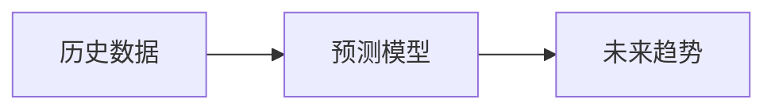

## 1.背景介绍

在当今的信息化社会，大数据已经成为我们日常生活中的一部分。我们的每一次点击，每一次搜索，甚至每一次滑动，都会产生大量的数据。这些数据，如果能够被正确地理解和利用，将会为我们的生活带来前所未有的便利。而预测分析，就是这个过程中的关键一环。通过对大数据的深度挖掘和分析，我们可以预测出未来可能发生的情况，从而做出更加精确的决策。

## 2.核心概念与联系

预测分析是一种统计学方法，它通过分析历史数据，建立模型，预测未来的趋势。预测分析的核心就是“映射”这个概念。在预测分析中，我们将历史数据映射到未来，用过去的经验来预测未来可能发生的情况。



## 3.核心算法原理具体操作步骤

预测分析的步骤大致可以分为以下几个部分：

1. 数据收集：首先，我们需要收集大量的历史数据。这些数据可以是任何形式，比如销售数据，用户行为数据，甚至是天气数据。
2. 数据清洗：收集到的数据往往是非常杂乱的，我们需要进行数据清洗，剔除无用的信息，只保留有用的数据。
3. 建立模型：然后，我们需要根据这些数据建立预测模型。这个过程通常需要使用到一些机器学习的算法，比如线性回归，决策树，神经网络等。
4. 预测：最后，我们可以使用这个模型来预测未来的趋势。

## 4.数学模型和公式详细讲解举例说明

假设我们有一个简单的线性回归模型，我们可以用以下的公式来表示这个模型：

$$ Y = aX + b $$

其中，$Y$ 是我们要预测的值，$X$ 是我们的输入数据，$a$ 和 $b$ 是我们的模型参数。我们的目标就是找到最佳的 $a$ 和 $b$ ，使得我们的预测值 $Y$ 和实际值尽可能地接近。

## 5.项目实践：代码实例和详细解释说明

以下是一个简单的预测分析的代码实例：

```python
import numpy as np
from sklearn.linear_model import LinearRegression

# 假设我们有以下的历史数据
X = np.array([1, 2, 3, 4, 5]).reshape((-1, 1))
Y = np.array([2, 4, 6, 8, 10])

# 我们使用线性回归模型进行预测
model = LinearRegression().fit(X, Y)

# 现在我们可以使用这个模型来预测未来的趋势
print(model.predict(np.array([6]).reshape((-1, 1))))
```

## 6.实际应用场景

预测分析在许多领域都有广泛的应用，比如金融，医疗，电商，广告等。比如在电商领域，我们可以通过预测分析用户的购买行为，从而提供更精确的商品推荐。在医疗领域，我们可以通过预测分析疾病的发展趋势，从而提供更及时的治疗方案。

## 7.工具和资源推荐

如果你对预测分析感兴趣，以下是一些推荐的工具和资源：

- Python：Python是一种非常强大的编程语言，它有许多用于数据分析和机器学习的库，比如numpy，pandas，scikit-learn等。
- R：R是一种专门用于统计分析的编程语言，它有许多强大的数据分析和可视化的工具。
- Kaggle：Kaggle是一个数据科学竞赛平台，你可以在这里找到许多真实的数据集和预测分析的实战项目。

## 8.总结：未来发展趋势与挑战

随着大数据和人工智能的发展，预测分析的未来前景十分广阔。然而，预测分析也面临着一些挑战，比如数据的质量和安全问题，模型的解释性问题，以及过度依赖预测的风险等。但无论如何，预测分析都将是未来数据科学的一个重要方向。

## 9.附录：常见问题与解答

Q：预测分析是否一定准确？
A：预测分析并不是一定准确的，它只是根据历史数据预测未来可能的趋势。实际的结果可能会受到许多因素的影响，因此，预测分析只能作为决策的一个参考，而不能完全依赖预测。

Q：预测分析和机器学习有什么区别？
A：预测分析是一种统计学方法，它通过分析历史数据，预测未来的趋势。而机器学习是一种计算机科学方法，它通过训练模型，使得模型能够从数据中学习。预测分析是机器学习的一个应用场景。

作者：禅与计算机程序设计艺术 / Zen and the Art of Computer Programming