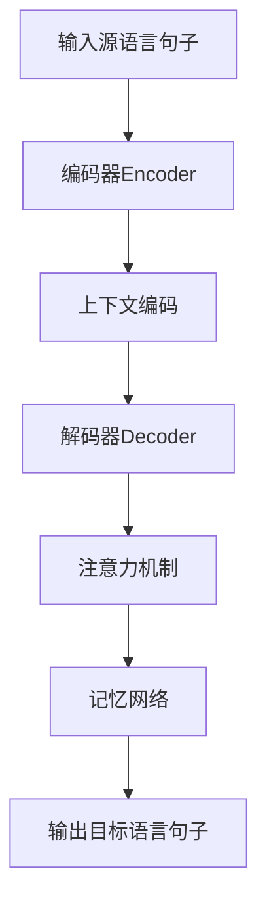

# 上下文感知:提升机器翻译准确性的关键一招

## 1. 背景介绍
### 1.1 机器翻译的发展历程
#### 1.1.1 早期的基于规则的机器翻译
#### 1.1.2 基于统计的机器翻译
#### 1.1.3 神经机器翻译的崛起

### 1.2 机器翻译面临的挑战
#### 1.2.1 语言的多样性和复杂性
#### 1.2.2 语义理解和表达的困难
#### 1.2.3 上下文信息的缺失

### 1.3 上下文感知的重要性
#### 1.3.1 上下文在人类语言理解中的作用
#### 1.3.2 上下文感知对机器翻译的意义
#### 1.3.3 上下文感知的研究现状

## 2. 核心概念与联系
### 2.1 上下文的定义和分类
#### 2.1.1 语言学中的上下文
#### 2.1.2 机器翻译中的上下文类型
#### 2.1.3 上下文的表示方法

### 2.2 上下文感知与机器翻译的关系
#### 2.2.1 上下文感知在机器翻译中的应用
#### 2.2.2 上下文感知对翻译质量的影响
#### 2.2.3 上下文感知与其他机器翻译技术的结合

### 2.3 上下文感知的关键技术
#### 2.3.1 上下文编码
#### 2.3.2 注意力机制
#### 2.3.3 记忆网络



## 3. 核心算法原理具体操作步骤
### 3.1 基于注意力机制的上下文感知
#### 3.1.1 编码器-解码器框架
#### 3.1.2 注意力机制的计算过程
#### 3.1.3 局部注意力和全局注意力

### 3.2 基于记忆网络的上下文感知
#### 3.2.1 记忆网络的基本结构
#### 3.2.2 外部记忆的读写操作
#### 3.2.3 记忆网络在机器翻译中的应用

### 3.3 上下文感知的训练和推理
#### 3.3.1 训练数据的准备
#### 3.3.2 模型的训练过程
#### 3.3.3 推理阶段的上下文感知

## 4. 数学模型和公式详细讲解举例说明
### 4.1 注意力机制的数学表示
#### 4.1.1 注意力权重的计算
$$ \alpha_{ij} = \frac{\exp(e_{ij})}{\sum_{k=1}^{T_x} \exp(e_{ik})} $$
其中,$e_{ij}$表示解码器第$i$步对编码器第$j$步的注意力分数。

#### 4.1.2 注意力向量的生成
$$ c_i = \sum_{j=1}^{T_x} \alpha_{ij} h_j $$
其中,$h_j$表示编码器第$j$步的隐藏状态。

#### 4.1.3 注意力机制在解码器中的应用
$$ s_i = f(s_{i-1}, y_{i-1}, c_i) $$
其中,$s_i$表示解码器第$i$步的隐藏状态,$y_{i-1}$表示上一步的输出,$c_i$表示第$i$步的注意力向量。

### 4.2 记忆网络的数学表示
#### 4.2.1 外部记忆的表示
$$ M = [m_1, m_2, ..., m_N] $$
其中,$m_i$表示第$i$个记忆槽的向量表示。

#### 4.2.2 记忆的读取操作
$$ r_i = \sum_{j=1}^N \alpha_{ij} m_j $$
其中,$\alpha_{ij}$表示第$i$步对第$j$个记忆槽的注意力权重。

#### 4.2.3 记忆的写入操作
$$ m_j^{(t)} = m_j^{(t-1)} + \alpha_{ij} \tilde{m}_j $$
其中,$m_j^{(t)}$表示第$t$步更新后的第$j$个记忆槽,$\tilde{m}_j$表示候选记忆向量。

### 4.3 上下文感知的损失函数
#### 4.3.1 交叉熵损失
$$ L_{CE} = -\sum_{i=1}^{T_y} \log p(y_i | y_{<i}, x) $$
其中,$y_i$表示目标语言第$i$个词,$y_{<i}$表示之前生成的词序列,$x$表示源语言句子。

#### 4.3.2 注意力损失
$$ L_{att} = \sum_{i=1}^{T_y} \sum_{j=1}^{T_x} \alpha_{ij} \log \alpha_{ij} $$
其中,$\alpha_{ij}$表示解码器第$i$步对编码器第$j$步的注意力权重。

#### 4.3.3 总损失函数
$$ L = L_{CE} + \lambda L_{att} $$
其中,$\lambda$为注意力损失的权重系数。

## 5. 项目实践：代码实例和详细解释说明
### 5.1 数据准备
```python
# 加载并预处理训练数据
def load_data(file_path):
    with open(file_path, 'r', encoding='utf-8') as f:
        lines = f.readlines()
    src_data, tgt_data = [], []
    for line in lines:
        src, tgt = line.strip().split('\t')
        src_data.append(src.split())
        tgt_data.append(tgt.split())
    return src_data, tgt_data
```

### 5.2 模型构建
```python
# 定义编码器
class Encoder(nn.Module):
    def __init__(self, vocab_size, embed_size, hidden_size):
        super(Encoder, self).__init__()
        self.embedding = nn.Embedding(vocab_size, embed_size)
        self.lstm = nn.LSTM(embed_size, hidden_size, batch_first=True)
    
    def forward(self, x):
        x = self.embedding(x)
        output, (hidden, cell) = self.lstm(x)
        return output, hidden, cell

# 定义解码器
class Decoder(nn.Module):
    def __init__(self, vocab_size, embed_size, hidden_size, attn_size):
        super(Decoder, self).__init__()
        self.embedding = nn.Embedding(vocab_size, embed_size)
        self.lstm = nn.LSTM(embed_size + hidden_size, hidden_size, batch_first=True)
        self.attn = nn.Linear(hidden_size * 2, attn_size)
        self.v = nn.Parameter(torch.rand(attn_size))
        self.fc = nn.Linear(attn_size, vocab_size)
    
    def forward(self, x, hidden, cell, encoder_outputs):
        x = self.embedding(x)
        attn_weights = F.softmax(self.attn(torch.cat((x, hidden.squeeze(0)), dim=-1)), dim=-1)
        context = torch.bmm(attn_weights.unsqueeze(1), encoder_outputs)
        x = torch.cat((x, context.squeeze(1)), dim=-1)
        output, (hidden, cell) = self.lstm(x.unsqueeze(1), (hidden, cell))
        output = self.fc(output.squeeze(1))
        return output, hidden, cell, attn_weights
```

### 5.3 模型训练
```python
# 训练模型
def train(encoder, decoder, data_loader, optimizer, criterion, device):
    encoder.train()
    decoder.train()
    total_loss = 0
    for src, tgt in data_loader:
        src, tgt = src.to(device), tgt.to(device)
        optimizer.zero_grad()
        encoder_outputs, hidden, cell = encoder(src)
        decoder_input = tgt[:, :-1]
        decoder_target = tgt[:, 1:]
        decoder_output, _, _, _ = decoder(decoder_input, hidden, cell, encoder_outputs)
        loss = criterion(decoder_output.contiguous().view(-1, decoder_output.size(-1)), decoder_target.contiguous().view(-1))
        loss.backward()
        optimizer.step()
        total_loss += loss.item()
    return total_loss / len(data_loader)
```

### 5.4 模型评估
```python
# 评估模型
def evaluate(encoder, decoder, data_loader, criterion, device):
    encoder.eval()
    decoder.eval()
    total_loss = 0
    with torch.no_grad():
        for src, tgt in data_loader:
            src, tgt = src.to(device), tgt.to(device)
            encoder_outputs, hidden, cell = encoder(src)
            decoder_input = tgt[:, :-1]
            decoder_target = tgt[:, 1:]
            decoder_output, _, _, _ = decoder(decoder_input, hidden, cell, encoder_outputs)
            loss = criterion(decoder_output.contiguous().view(-1, decoder_output.size(-1)), decoder_target.contiguous().view(-1))
            total_loss += loss.item()
    return total_loss / len(data_loader)
```

## 6. 实际应用场景
### 6.1 多语言翻译
#### 6.1.1 支持多种语言对的翻译
#### 6.1.2 低资源语言的翻译质量提升
#### 6.1.3 语言间的迁移学习

### 6.2 领域适应
#### 6.2.1 特定领域的术语和语言风格适应
#### 6.2.2 领域知识的融入
#### 6.2.3 领域数据的增强和利用

### 6.3 交互式翻译
#### 6.3.1 人机交互中的实时翻译
#### 6.3.2 上下文感知的对话翻译
#### 6.3.3 用户反馈的利用和模型更新

## 7. 工具和资源推荐
### 7.1 开源工具包
#### 7.1.1 OpenNMT
#### 7.1.2 Fairseq
#### 7.1.3 Tensor2Tensor

### 7.2 预训练模型
#### 7.2.1 BERT
#### 7.2.2 GPT
#### 7.2.3 XLM

### 7.3 数据集
#### 7.3.1 WMT
#### 7.3.2 IWSLT
#### 7.3.3 UN Parallel Corpus

## 8. 总结：未来发展趋势与挑战
### 8.1 未来发展趋势
#### 8.1.1 更大规模的预训练模型
#### 8.1.2 多模态信息的融合
#### 8.1.3 个性化和交互式翻译

### 8.2 面临的挑战
#### 8.2.1 语言的多样性和复杂性
#### 8.2.2 领域适应和知识融入
#### 8.2.3 翻译质量评估和可解释性

### 8.3 研究方向展望
#### 8.3.1 上下文感知的持续改进
#### 8.3.2 多语言和跨语言翻译
#### 8.3.3 人机协作翻译

## 9. 附录：常见问题与解答
### 9.1 上下文感知和传统的机器翻译有何区别？
上下文感知通过引入更广泛的上下文信息,如句子的前后文、话题、语域等,来提高翻译的准确性和连贯性。传统的机器翻译通常只考虑单个句子,缺乏对上下文的理解和利用。

### 9.2 上下文感知需要哪些额外的数据和资源？
上下文感知需要更多的平行语料,特别是包含上下文信息的语料。此外,还需要领域知识库、情感词典等外部资源来辅助上下文理解。

### 9.3 上下文感知会显著增加模型的计算复杂度吗？
引入上下文信息确实会增加模型的计算复杂度,但通过合理的设计和优化,如使用层次化的注意力机制、知识蒸馏等技术,可以在保证性能的同时控制计算开销。

### 9.4 如何评估上下文感知的效果？
评估上下文感知的效果需要考虑翻译的流畅性、连贯性和上下文相关性。除了传统的BLEU等自动评估指标外,还需要人工评估和分析。可以设计针对上下文的专门评测集和评估方法。

### 9.5 上下文感知是否适用于所有的语言对和领域？
上下文感知的有效性在不同语言对和领域间存在差异。对于语法结构相似、语义对应明确的语言对,上下文感知的作用可能较为有限。而对于语法差异大、语义对应复杂的语言对,以及需要领域知识的专业领域,上下文感知的优势更为明显。需要针对具体情况进行分析和实验。

作者：禅与计算机程序设计艺术 / Zen and the Art of Computer Programming