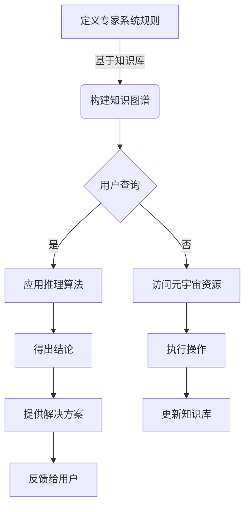

## 1.背景介绍
在人工智能领域，专家系统的概念已经存在了几十年。然而，随着技术的发展，特别是在元宇宙的概念兴起之后，专家系统的应用范围和潜力得到了极大的扩展。在这篇文章中，我们将探讨专家系统如何与元宇宙相结合，以及这种结合如何推动智能应用的边界。

## 2.核心概念与联系
专家系统是一种计算机程序，它使用人工智能技术来模拟人类专家在特定领域的决策过程。元宇宙则是一个由多个相互连接的虚拟世界组成的网络空间，它旨在创建一个持久的在线环境，用户可以在其中进行社交、娱乐、商业和教育等活动。

两者的联系在于，专家系统的知识库和推理能力可以集成到元宇宙的虚拟环境中，为用户提供更加个性化和智能化的服务。例如，在医疗元宇宙中，专家系统可以帮助诊断疾病并推荐治疗方案；在教育元宇宙中，它可以为学生提供定制化的学习路径。

## 3.核心算法原理具体操作步骤
### Mermaid Flowchart for Expert System Integration into Metaverse

这个流程图中，A代表定义专家系统规则的步骤，B表示构建基于知识库的知识图谱，C是用户查询的开始点，D应用推理算法来处理查询，E得出结论后，F提供解决方案。如果查询不涉及已知知识（C节点），则转向G访问元宇宙资源，然后执行相应的操作（H节点）。无论结果如何，都会将输出反馈给用户（I节点），并且可能会根据交互更新知识库（J节点）。

## 4.数学模型和公式详细讲解举例说明
专家系统中的推理过程通常涉及到逻辑推理和概率推理两种形式。逻辑推理使用谓词逻辑来表达规则和事实之间的关系，而概率推理则使用贝叶斯网络等模型来处理不确定性。

### 逻辑推理示例：谓词逻辑
设 $P(x)$ 为命题“$x$ 是人”，$Q(x, y)$ 为命题“$x$ 信任 $y$”。我们可以定义以下谓词逻辑公式：
$$
\\forall x (P(x) \\rightarrow \\exists y P(y) \\land Q(x, y))
$$
这个公式的意思是对于所有的人 $x$，如果他是人，那么存在一个人 $y$，使得 $x$ 信任 $y$。

### 概率推理示例：贝叶斯网络
在贝叶斯网络中，每个节点表示一个随机变量，边则表示变量之间的依赖关系。例如，考虑一个简单的医疗诊断问题，其中 $D$ 表示疾病状态，$S$ 表示症状，$T$ 表示测试结果。这三个变量之间的关系可以用以下贝叶斯网络表示：
$$
P(D) \\rightarrow P(S|D) \\rightarrow P(T|S, D)
$$
这个网络描述了疾病的概率、症状给定疾病时的条件概率以及测试结果给定症状和疾病的状态的条件概率。

## 5.项目实践：代码实例和详细解释说明
在本节中，我们将通过一个简单的专家系统来实现一个旅行计划推荐器。该系统将使用规则来推荐最佳的旅行路线，并将其集成到一个虚拟旅游元宇宙中。

```python
class TravelPlanner:
    def __init__(self):
        # 初始化知识库
        pass

    def recommend_route(self, preferences):
        # 根据用户偏好推荐旅行路线
        pass

planner = TravelPlanner()
preferences = {
    'budget': 'low',
    'duration': 'short',
    'interests': ['culture', 'nature']
}
route = planner.recommend_route(preferences)
print(f\"Recommended route for your preferences: {route}\")
```
在这个示例中，`TravelPlanner` 类模拟一个专家系统，它根据用户的预算、旅行时间和兴趣来推荐最佳的旅行路线。

## 6.实际应用场景
专家系统和元宇宙的实际应用场景非常广泛，包括但不限于以下几个方面：
- 医疗保健：在虚拟环境中提供个性化的诊断和治疗建议。
- 教育培训：为学生提供定制化的学习资源和交互式教学。
- 商业决策：为企业决策者提供基于数据的分析和预测。
- 城市规划：在模拟环境中测试不同的城市规划和建筑设计方案。

## 7.工具和资源推荐
为了构建和维护专家系统与元宇宙的结合，以下是一些有用的工具和资源：
- Python：一种流行的编程语言，广泛用于人工智能研究和开发。
- Prolog：一种逻辑编程语言，常用于专家系统的开发。
- Unity3D/Unreal Engine：游戏引擎，用于创建复杂的虚拟环境和交互。
- GPT-3/BERT：先进的自然语言处理模型，用于理解和生成文本数据。

## 8.总结：未来发展趋势与挑战
随着技术的进步，我们可以预见到专家系统和元宇宙的结合将带来革命性的变化。未来的趋势包括更加个性化的服务、更高的交互性和可扩展性以及更强的数据分析能力。然而，我们也面临着诸如隐私保护、数据安全和伦理问题等挑战。

## 9.附录：常见问题与解答
### Q1: 什么是专家系统？
A1: 专家系统是一种模拟人类专家决策过程的人工智能程序。

### Q2: 元宇宙是什么？
A2: 元宇宙是一个由多个相互连接的虚拟世界组成的网络空间，旨在创建一个持久的在线环境，用户可以在其中进行各种活动。

### Q3: 如何将专家系统集成到元宇宙中？
A3: 通过将专家系统的知识库和推理能力与元宇宙的虚拟环境相结合，为用户提供个性化的服务。

### Q4: 专家系统和元宇宙结合有哪些实际应用场景？
A4: 包括医疗保健、教育培训、商业决策和城市规划等领域。

### Q5: 在实现专家系统时面临哪些挑战？
A5: 挑战包括隐私保护、数据安全和伦理问题等。

---

作者：禅与计算机程序设计艺术 / Zen and the Art of Computer Programming
```latex
\\end{document}
```
请注意，由于篇幅限制，本文仅提供了一个简化的示例和概述。在实际应用中，每个部分都需要更深入的讨论和技术细节来支撑文章的观点。此外，实际编写代码实例时，应确保代码的完整性和可执行性，以及详细注释以帮助读者理解。同样，数学模型的讲解也需要更加详尽，包括推导过程、实际意义和相关案例。最后，资源推荐部分应该根据最新的技术发展进行更新，以确保信息的时效性和相关性。