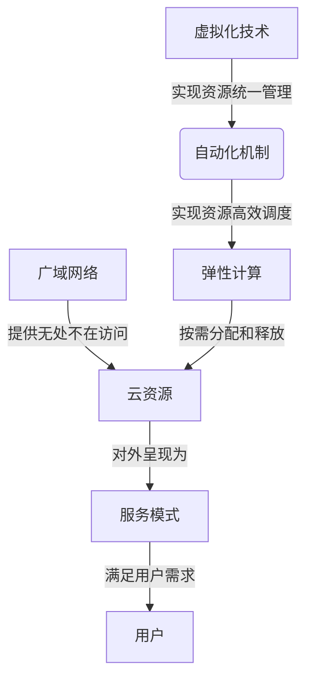

# 云计算 (Cloud Computing)

## 1. 背景介绍

### 1.1 云计算的兴起

在过去的几十年里,信息技术的发展一直是以飞快的速度向前推进。随着互联网的兴起和网络带宽的不断增长,人们对计算资源的需求也在与日俱增。传统的计算模式已经无法满足日益增长的需求,这就催生了云计算的诞生。

云计算是一种通过互联网按需获取所需资源的计算模式。用户无需购买昂贵的硬件设备,只需通过网络连接即可使用云服务商提供的各种计算资源,包括存储、处理能力、软件等。这种按需付费、弹性扩展的模式极大地降低了企业的 IT 成本,提高了资源利用率。

### 1.2 云计算的优势

相较于传统的计算模式,云计算具有以下显著优势:

1. 按需付费: 用户只需为实际使用的资源付费,避免了大量前期投资。
2. 弹性伸缩: 计算资源可根据实际需求进行动态调整,无需提前准备。
3. 广域网络接入: 用户可以从任何地点通过互联网访问云资源。
4. 资源统一管理: 云服务商可集中管理庞大的资源池,提高利用效率。

### 1.3 云计算的服务模式

云计算通常分为三种主要的服务模式:

1. 基础设施即服务 (IaaS): 提供基础的计算资源,如虚拟机、网络和存储。
2. 平台即服务 (PaaS): 提供完整的开发和部署环境,用户可在此基础上开发应用程序。
3. 软件即服务 (SaaS): 直接为用户提供可通过网络访问的应用程序。

## 2. 核心概念与联系

### 2.1 云计算的核心概念

要全面理解云计算,需要掌握以下几个核心概念:

1. 虚拟化技术: 通过虚拟化技术,可将物理资源抽象为逻辑资源,实现资源的统一管理和动态分配。
2. 自动化: 云计算系统需要自动化的资源调度和管理机制,以确保资源的高效利用。
3. 弹性计算: 根据实际需求动态分配和释放计算资源,实现按需扩展。
4. 服务模式: 云计算将 IT 资源打包为不同层次的服务,以满足不同用户需求。
5. 广域网络: 云计算依赖于高速、可靠的广域网络,确保用户可随时随地访问云资源。

### 2.2 核心概念之间的联系

上述核心概念相互关联、相互依赖,共同构建了云计算的基础架构:

1. 虚拟化技术是实现资源统一管理和弹性计算的基础。
2. 自动化机制确保了资源的高效调度,实现了弹性计算。
3. 广域网络为用户提供了无处不在的云资源访问能力。
4. 服务模式将底层资源对外呈现为不同层次的服务,满足用户多样化需求。

上图展示了云计算核心概念之间的关系。虚拟化技术和自动化机制共同实现了弹性计算,而广域网络则为用户提供了无处不在的云资源访问能力。最终,云资源通过服务模式对外呈现,满足用户的多样化需求。

## 3. 核心算法原理具体操作步骤

### 3.1 虚拟化技术

虚拟化技术是云计算的基础,它将物理资源抽象为逻辑资源,实现资源的统一管理和动态分配。虚拟化技术主要包括以下几个方面:

1. 硬件虚拟化: 通过虚拟机监控程序 (Hypervisor) 将物理硬件资源虚拟化为多个虚拟机,每个虚拟机可运行独立的操作系统和应用程序。

2. 网络虚拟化: 将物理网络资源虚拟化为多个虚拟网络,实现网络资源的灵活分配和隔离。

3. 存储虚拟化: 将物理存储资源虚拟化为逻辑存储池,实现存储资源的统一管理和动态分配。

虚拟化技术的具体操作步骤如下:

1. 在物理硬件上安装虚拟机监控程序 (Hypervisor)。
2. 通过 Hypervisor 创建虚拟机,为每个虚拟机分配 CPU、内存等硬件资源。
3. 在虚拟机上安装操作系统和应用程序。
4. 使用网络虚拟化技术创建虚拟网络,为虚拟机分配 IP 地址和网络资源。
5. 使用存储虚拟化技术创建存储池,为虚拟机分配存储空间。
6. 根据实际需求动态调整虚拟机的硬件资源、网络资源和存储资源。

### 3.2 自动化机制

为了实现资源的高效调度和弹性计算,云计算系统需要自动化的资源管理机制。自动化机制的核心算法包括:

1. 资源调度算法: 根据用户需求和资源利用情况,自动分配和释放计算资源。常用的调度算法有基于优先级的调度、基于公平性的调度等。

2. 负载均衡算法: 将用户请求合理分配到不同的计算节点,实现负载均衡。常用的算法有轮询调度、最小连接数调度等。

3. 故障恢复算法: 在发生硬件故障或软件错误时,自动将任务迁移到其他可用资源,确保服务的可用性。

4. 自动扩展算法: 根据实际负载情况,自动增加或减少计算资源,实现资源的弹性伸缩。

自动化机制的具体操作步骤如下:

1. 监控资源利用情况,包括 CPU 利用率、内存使用量、网络流量等。
2. 根据预设的策略和算法,分析资源利用情况,确定是否需要调整资源。
3. 如需增加资源,自动启动新的虚拟机或容器,并将任务调度到新资源上。
4. 如需减少资源,自动将任务迁移到其他节点,并关闭多余的虚拟机或容器。
5. 在发生故障时,自动将任务迁移到其他可用资源,确保服务的可用性。

### 3.3 弹性计算

弹性计算是云计算的核心特性之一,它允许计算资源根据实际需求进行动态调整。弹性计算的核心算法包括:

1. 资源预测算法: 根据历史数据和当前趋势,预测未来的资源需求。
2. 资源调配算法: 根据预测结果,自动调配所需的计算资源。
3. 资源监控算法: 实时监控资源利用情况,确保资源的合理分配。
4. 资源回收算法: 在资源利用率降低时,自动回收多余的计算资源。

弹性计算的具体操作步骤如下:

1. 收集历史资源利用数据,包括 CPU 利用率、内存使用量、网络流量等。
2. 使用资源预测算法分析历史数据,预测未来一段时间内的资源需求。
3. 根据预测结果,使用资源调配算法自动启动或关闭虚拟机或容器。
4. 实时监控资源利用情况,确保资源的合理分配。
5. 在资源利用率降低时,使用资源回收算法自动关闭多余的虚拟机或容器。

通过上述步骤,云计算系统可以根据实际需求动态调整计算资源,实现资源的高效利用和按需扩展。

## 4. 数学模型和公式详细讲解举例说明

在云计算系统中,数学模型和公式广泛应用于资源调度、负载均衡、容量规划等领域。下面将详细介绍几个常用的数学模型和公式。

### 4.1 资源调度模型

资源调度是云计算系统中的一个关键问题,它决定了如何将任务分配到不同的计算节点上执行。常用的资源调度模型包括:

1. 基于优先级的调度模型

假设有 $n$ 个任务 $T = \{t_1, t_2, \ldots, t_n\}$,每个任务 $t_i$ 都有一个优先级 $p_i$。我们需要将这些任务分配到 $m$ 个计算节点 $N = \{n_1, n_2, \ldots, n_m\}$ 上执行。目标是最小化所有任务的完成时间。

我们可以构建以下数学模型:

$$
\begin{aligned}
\min\quad & \max_{1 \leq i \leq n} \{C_i\} \\
\text{s.t.}\quad & \sum_{j=1}^m x_{ij} = 1, \quad \forall i \in \{1, 2, \ldots, n\} \\
& \sum_{i=1}^n p_i x_{ij} \leq C_j, \quad \forall j \in \{1, 2, \ldots, m\} \\
& x_{ij} \in \{0, 1\}, \quad \forall i \in \{1, 2, \ldots, n\}, j \in \{1, 2, \ldots, m\}
\end{aligned}
$$

其中 $C_i$ 表示任务 $t_i$ 的完成时间, $x_{ij}$ 是一个二进制变量,表示任务 $t_i$ 是否分配到节点 $n_j$ 上执行。约束条件保证每个任务只能分配到一个节点,并且每个节点的负载不超过其容量 $C_j$。

2. 基于公平性的调度模型

在某些情况下,我们希望各个任务的完成时间尽可能公平,而不是简单地最小化总体完成时间。我们可以构建以下数学模型:

$$
\begin{aligned}
\min\quad & \sum_{i=1}^n (C_i - \overline{C})^2 \\
\text{s.t.}\quad & \sum_{j=1}^m x_{ij} = 1, \quad \forall i \in \{1, 2, \ldots, n\} \\
& \sum_{i=1}^n p_i x_{ij} \leq C_j, \quad \forall j \in \{1, 2, \ldots, m\} \\
& x_{ij} \in \{0, 1\}, \quad \forall i \in \{1, 2, \ldots, n\}, j \in \{1, 2, \ldots, m\}
\end{aligned}
$$

其中 $\overline{C}$ 表示所有任务完成时间的平均值。目标函数旨在最小化每个任务完成时间与平均值之间的差异平方和,从而实现公平性。

上述模型都属于整数线性规划问题,可以使用各种求解算法(如分支定界法、切平面法等)来求解。在实际应用中,还需要考虑任务之间的依赖关系、节点的异构性等因素,从而构建更加复杂的数学模型。

### 4.2 负载均衡模型

负载均衡是云计算系统中另一个重要问题,它决定了如何将用户请求分配到不同的计算节点上处理。常用的负载均衡模型包括:

1. 基于连接数的负载均衡模型

假设有 $m$ 个计算节点 $N = \{n_1, n_2, \ldots, n_m\}$,每个节点 $n_j$ 的当前连接数为 $c_j$。我们希望将新的请求分配到连接数最小的节点上,以实现负载均衡。

我们可以构建以下数学模型:

$$
\begin{aligned}
\min\quad & \max_{1 \leq j \leq m} \{c_j + x_j\} \\
\text{s.t.}\quad & \sum_{j=1}^m x_j = 1 \\
& x_j \in \{0, 1\}, \quad \forall j \in \{1, 2, \ldots, m\}
\end{aligned}
$$

其中 $x_j$ 是一个二进制变量,表