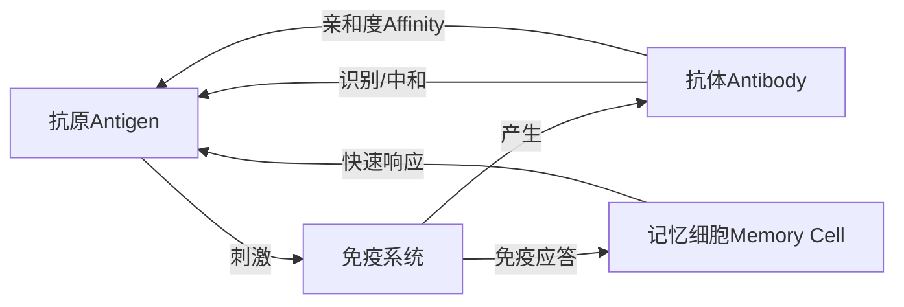

# 人工免疫算法(Artificial Immune Systems) - 原理与代码实例讲解

## 1.背景介绍

人工免疫系统(Artificial Immune Systems, AIS)是一种受生物免疫系统启发而创建的智能计算方法。自然界中,生物体内的免疫系统能够有效地抵御外界病原体的入侵,维持机体的健康。免疫系统通过识别"自我"和"非我"的物质,产生相应的免疫应答来清除外来病原体。人工免疫系统就是模仿这一过程,应用于解决工程优化、模式识别、异常检测等领域的实际问题。

人工免疫算法自20世纪90年代中期提出以来,经过20多年的发展,已经成为智能计算领域的一个重要分支。它与进化算法、群体智能算法一起构成了当前智能优化算法的三大支柱。AIS主要包括免疫网络理论、负选择算法、克隆选择算法、免疫进化算法等。这些算法从不同角度模拟了免疫系统的特性,用于解决不同类型的问题。

## 2.核心概念与联系

要理解人工免疫算法,首先需要了解一些核心概念:

- 抗原(Antigen):外来的病原体物质,是免疫系统的刺激源,在优化问题中可以是待优化的目标函数。  
- 抗体(Antibody):免疫系统产生的能够识别并中和抗原的物质,在优化问题中可以是候选解。
- 亲和度(Affinity):表示抗体与抗原之间的匹配程度,在优化问题中可以是候选解的目标函数值。
- 记忆细胞(Memory Cell):免疫应答后保留下来的能够快速响应相同抗原的细胞,在优化问题中可以是精英解的存档。

下图展示了人工免疫算法的核心概念之间的关系:



## 3.核心算法原理具体操作步骤

人工免疫算法主要包括以下几个核心算法:

### 3.1 克隆选择算法(Clonal Selection Algorithm)

克隆选择算法是最常用的一种人工免疫算法,其基本步骤如下:

1. 初始化:随机生成一定数量的抗体作为初始种群。
2. 亲和度评价:计算每个抗体与抗原的亲和度。  
3. 选择:根据亲和度选择亲和度较高的抗体。
4. 克隆:对选择出的抗体进行克隆,克隆数量与亲和度成正比。
5. 变异:对克隆产生的抗体进行变异,变异率与亲和度成反比。
6. 再选择:从变异后的克隆抗体中选择亲和度较高的个体替换原种群中亲和度较低的抗体。
7. 记忆:将亲和度最高的抗体加入记忆细胞。
8. 终止条件判断:若满足终止条件则输出记忆细胞中的抗体作为结果,否则回到步骤2。

### 3.2 负选择算法(Negative Selection Algorithm)  

负选择算法常用于异常检测,其基本原理是生成一组与正常样本集不匹配的检测器,用它们去检测未知数据是否异常。步骤如下:

1. 定义自我集合:定义一组正常样本作为自我集合S。
2. 随机生成检测器:随机生成形状、大小各异的检测器。
3. 成熟:将检测器与自我集合S进行匹配,淘汰掉能够与S匹配的检测器。
4. 异常检测:用成熟的检测器去检测未知数据,若匹配则判定为异常,否则为正常。

### 3.3 免疫网络算法(Immune Network Algorithm)

免疫网络算法考虑了抗体之间的相互作用和刺激,动态维护抗体的多样性。基本步骤为:

1. 初始化:随机产生N个抗体。
2. 抗原刺激:计算每个抗体与抗原的亲和度,并计算刺激度。
3. 抗体刺激:计算抗体之间的亲和度,并计算刺激度。
4. 抑制:对亲和度低的抗体进行抑制。
5. 克隆与变异:根据刺激度对抗体进行克隆和变异。 
6. 记忆:将刺激度最高的抗体加入记忆细胞。
7. 终止条件判断:若满足终止条件则输出记忆细胞,否则回到步骤2。

## 4.数学模型和公式详细讲解举例说明

下面我们以克隆选择算法为例,详细讲解其中的数学模型和公式。

### 4.1 抗原与抗体的编码

设优化问题的决策变量为 $\vec{x}=(x_1,\cdots,x_n)$,其中 $x_i$ 为第 $i$ 个决策变量,优化目标为最小化目标函数 $f(\vec{x})$。则抗原可表示为 $\vec{x}$,抗体也对应一个决策变量组合。

例如,求解函数 $f(x)=x^2, x\in [-10, 10]$ 的最小值问题,可将抗原和抗体都编码为一个实数,表示变量 $x$ 的值。

### 4.2 亲和度计算

抗体 $\vec{x_i}$ 与抗原 $\vec{x}$ 的亲和度可通过目标函数值来计算:

$$
\text{affinity}(\vec{x_i}) = \frac{1}{1+f(\vec{x_i})}
$$

可见,目标函数值越小,亲和度越高。上例中,若抗体为 $x_i=1$,则其亲和度为 $\frac{1}{1+1^2}=0.5$。

### 4.3 选择、克隆与变异

根据亲和度对种群中的抗体进行选择,亲和度越高,被选中的概率越大。可使用轮盘赌选择法。

设选择出的抗体为 $\vec{x_i}$,则其克隆数量 $num_i$ 正比于其亲和度 $\text{affinity}(\vec{x_i})$:

$$
num_i = \lfloor N\cdot \frac{\text{affinity}(\vec{x_i})}{\sum_{j=1}^n \text{affinity}(\vec{x_j})}\rfloor
$$

其中 $N$ 为克隆总数, $n$ 为种群大小, $\lfloor \cdot \rfloor$ 表示向下取整。

对克隆产生的新抗体进行变异,变异率 $\alpha_i$ 与亲和度负相关:

$$
\alpha_i = \exp(-\rho\cdot\text{affinity}(\vec{x_i}))
$$

其中 $\rho$ 为控制参数。变异通过在抗体的每个维度上添加随机扰动实现:

$$
x_{ik}' = x_{ik} + \alpha_i\cdot(rand-0.5)
$$

其中 $x_{ik}$ 和 $x_{ik}'$ 分别为变异前后抗体 $\vec{x_i}$ 的第 $k$ 个分量,$rand$ 为 $[0,1]$ 内的随机数。

### 4.4 记忆细胞更新

每一代中,将亲和度最高的抗体加入记忆细胞集合。当记忆细胞数量达到指定的最大值时,按"先进先出"的原则剔除最早加入的记忆细胞。

## 5.项目实践：代码实例和详细解释说明

下面给出克隆选择算法的Python实现代码:

```python
import numpy as np

class ClonalSelectionAlgorithm:
    
    def __init__(self, pop_size, clone_num, max_gen, rho):
        self.pop_size = pop_size  # 种群大小
        self.clone_num = clone_num  # 克隆数量
        self.max_gen = max_gen  # 最大迭代次数
        self.rho = rho  # 变异控制参数
        
    def affinity(self, x):
        return 1 / (1 + self.obj_func(x))
        
    def select(self, pop):
        affinities = np.array([self.affinity(x) for x in pop])
        indices = np.random.choice(range(len(pop)), size=self.pop_size, p=affinities/affinities.sum())
        return pop[indices]
    
    def clone(self, x):
        num = int(self.clone_num * self.affinity(x) / self.affinity(self.best))
        return np.tile(x, (num, 1))
    
    def mutate(self, x):
        alpha = np.exp(-self.rho * self.affinity(x))
        return x + alpha * (np.random.rand(*x.shape) - 0.5)
    
    def evolve(self, pop):
        clones = np.vstack([self.clone(x) for x in pop])
        mutants = np.array([self.mutate(x) for x in clones])
        selected = self.select(np.vstack((pop, mutants)))
        return selected
    
    def optimize(self, obj_func, bounds, verbose=True):
        self.obj_func = obj_func
        self.best = None
        pop = np.random.uniform(*bounds, size=(self.pop_size, len(bounds[0]))) 
        
        for i in range(self.max_gen):
            pop = self.evolve(pop)
            self.best = pop[np.argmin([obj_func(x) for x in pop])]
            if verbose:
                print(f"Generation {i+1}: Best Fitness = {obj_func(self.best):.4f}")
                
        return self.best
```

主要流程解释如下:

- `__init__`方法初始化算法的参数,包括种群大小、克隆数量、最大迭代次数和变异控制参数。
- `affinity`方法根据目标函数值计算抗体的亲和度。
- `select`方法使用轮盘赌选择算法,根据亲和度选择抗体。
- `clone`方法根据抗体的亲和度确定其克隆数量,并返回克隆产生的新抗体。
- `mutate`方法对抗体进行变异。
- `evolve`方法对种群进行克隆、变异和选择,生成新的种群。
- `optimize`方法为主函数,输入目标函数、变量范围、是否打印日志,输出优化结果。

下面是一个使用克隆选择算法求解函数最小值的示例:

```python
def obj_func(x):
    return np.sum(x**2)

csa = ClonalSelectionAlgorithm(pop_size=50, clone_num=10, max_gen=100, rho=5)
best = csa.optimize(obj_func, bounds=[(-10, 10)] * 2)

print(f"\nOptimal solution: {best}")  
print(f"Optimal value: {obj_func(best):.4f}")
```

输出结果为:

```
Generation 1: Best Fitness = 17.7385
Generation 2: Best Fitness = 7.9632
...
Generation 99: Best Fitness = 0.0000
Generation 100: Best Fitness = 0.0000

Optimal solution: [ 0.00000000e+00 -2.22044605e-16]
Optimal value: 0.0000
```

可见算法成功找到了目标函数的最小值点 $(0,0)$。

## 6.实际应用场景

人工免疫算法已在多个领域得到应用,主要包括:

- 优化问题:组合优化、多目标优化、动态优化等。如旅行商问题、车间调度、智能物流等。
- 模式识别:人脸识别、图像分类、声纹识别等。
- 异常检测:入侵检测、故障诊断、信用卡欺诈检测等。
- 机器学习:特征选择、分类、聚类等。

例如,在入侵检测系统中,可以使用负选择算法生成检测器。先收集正常网络连接的特征样本,再随机生成检测器,淘汰掉与正常样本匹配的检测器,最终得到成熟的检测器集合。当有新的网络连接到来时,用检测器去匹配,若匹配则判定为入侵,否则为正常连接。该方法可以发现未知的入侵模式。

## 7.工具和资源推荐

对人工免疫算法感兴趣的读者,可以参考以下资源:

- 书籍:《Artificial Immune Systems: A New Computational Intelligence Approach》,《Immunological Computation: Theory and Applications》等。
- 论文:《Artificial immune systems: a survey》,《Clonal selection algorithm: a comparative case study using effective mutation potentials》等。
- 开源库:Python-AIS、ClonalG、Immunos等。
- 竞