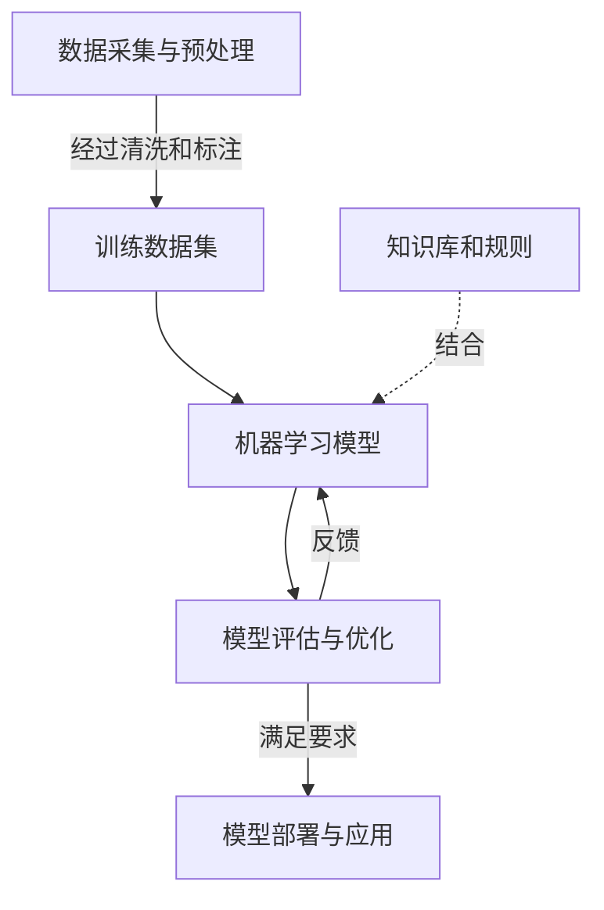

# 人工智能(AI) - 原理与代码实例讲解

## 1.背景介绍

人工智能(Artificial Intelligence, AI)是当代科技领域最具革命性和颠覆性的技术之一。它旨在使机器能够模仿人类的认知功能,如学习、推理、规划和创造力等。近年来,人工智能取得了长足的进步,在多个领域展现出超乎想象的能力,如计算机视觉、自然语言处理、决策系统等,深刻影响着我们的生活和工作方式。

### 1.1 人工智能的发展历程

人工智能的概念可以追溯到20世纪40年代,当时一些先驱者提出了"智能机器"的设想。1956年,约翰·麦卡锡在达特茅斯学院主持的研讨会上首次使用了"人工智能"一词,标志着这一领域的正式诞生。

人工智能的发展经历了几个重要阶段:

1. **早期阶段(1950s-1960s)**: 这一时期的研究主要集中在数理逻辑、博弈论和机器学习的初步探索上。

2. **知识驱动阶段(1970s-1980s)**: 研究者尝试构建基于规则和知识的专家系统,但遇到了知识获取瓶颈等挑战。

3. **统计学习阶段(1990s-2000s)**: 随着计算能力的提高和大数据的出现,基于统计学习的方法(如神经网络)开始受到重视。

4. **深度学习时代(2010s-至今)**: benefiting from大量数据、强大的硬件和新的算法,深度学习技术取得了突破性进展,推动人工智能在多个领域实现了人类水平的表现。

### 1.2 人工智能的重要性

人工智能的发展对于科技进步、经济发展和社会变革都具有深远的影响:

- **提高生产效率**: AI系统可以自动化许多复杂的任务,提高工作效率,降低人力成本。

- **优化决策过程**: AI算法能够从海量数据中发现隐藏的模式和洞见,为决策提供有价值的支持。

- **推动科技创新**: AI是许多新兴技术(如自动驾驶、机器人、智能家居等)的关键驱动力。

- **改善生活质量**: AI应用有望为医疗保健、教育、环境保护等领域带来革命性的变化。

然而,人工智能的快速发展也带来了一些潜在的风险和挑战,如就业影响、算法偏差、隐私和安全等,需要我们高度重视并采取适当的管控措施。

## 2.核心概念与联系

要全面理解人工智能,我们需要掌握几个核心概念及其相互关系。

### 2.1 机器学习

机器学习(Machine Learning)是人工智能的核心驱动力,它赋予了机器"学习"的能力。机器学习算法可以从数据中自动捕获模式,并用于做出预测或决策,而无需显式编程。

根据学习的方式,机器学习可分为三大类:

1. **监督学习(Supervised Learning)**: 利用标注好的训练数据(输入和期望输出),学习一个模型来映射新的输入到正确的输出。常见的监督学习任务包括分类和回归。

2. **无监督学习(Unsupervised Learning)**: 只给定输入数据,算法需要自行发现数据的内在结构和模式。常见的无监督学习任务包括聚类和降维。

3. **强化学习(Reinforcement Learning)**: 通过与环境的交互,智能体(agent)根据获得的奖励信号,不断优化其行为策略,以达到预期目标。常见应用包括游戏AI和机器人控制。

### 2.2 深度学习

深度学习(Deep Learning)是机器学习的一个子领域,它利用具有多层非线性变换单元的人工神经网络来模拟人脑的信息处理过程。深度学习在计算机视觉、自然语言处理等领域取得了卓越的成就,推动了人工智能的飞速发展。

常见的深度学习模型包括:

1. **卷积神经网络(Convolutional Neural Networks, CNNs)**: 在计算机视觉任务中表现出色,能够从图像中自动提取特征。

2. **循环神经网络(Recurrent Neural Networks, RNNs)**: 擅长处理序列数据,如自然语言和时间序列。

3. **生成对抗网络(Generative Adversarial Networks, GANs)**: 通过生成器和判别器的对抗训练,能够生成逼真的图像、音频和文本。

4. **transformer模型**: 利用注意力机制高效处理序列数据,在自然语言处理领域取得了突破性进展,如GPT、BERT等。

### 2.3 人工智能系统架构

构建一个完整的人工智能系统需要多个模块的协同工作,典型的架构包括:

1. **数据采集与预处理**: 从各种来源收集原始数据,并进行清洗、标注等预处理,形成可用的训练数据集。

2. **机器学习模型**: 选择合适的算法和模型架构,在训练数据集上进行模型训练。

3. **模型评估与优化**: 使用验证集或测试集评估模型的性能,并通过调整超参数、特征工程等方法对模型进行优化。

4. **模型部署与应用**: 将优化后的模型集成到实际的应用系统中,为用户提供服务。

5. **知识库和规则(可选)**: 一些人工智能系统还会结合人工设计的知识库和规则,以提高性能和可解释性。

上述各个模块通常需要循环迭代,以不断改进系统的性能。

## 3.核心算法原理具体操作步骤  

在上一节中,我们介绍了机器学习和深度学习的基本概念。现在,让我们深入探讨一些核心算法的原理和具体操作步骤。

### 3.1 线性回归

线性回归是最简单且最常用的监督学习算法之一。它试图找到一个最佳拟合的线性方程,使输入特征(X)与目标变量(y)之间的残差平方和最小化。

线性回归的具体操作步骤如下:

1. **收集数据**: 获取包含输入特征(X)和目标变量(y)的数据集。

2. **数据预处理**: 对数据进行标准化或归一化处理,以提高算法的收敛速度和数值稳定性。

3. **定义代价函数**: 线性回归的代价函数通常为残差平方和,即 $J(\theta) = \frac{1}{2m}\sum_{i=1}^m(h_\theta(x^{(i)}) - y^{(i)})^2$,其中 $h_\theta(x) = \theta_0 + \theta_1x_1 + \theta_2x_2 + ... + \theta_nx_n$ 为线性模型。

4. **选择优化算法**: 常用的优化算法包括梯度下降法、正规方程等,用于找到使代价函数最小化的最优参数 $\theta$。

5. **模型评估**: 在测试集上评估模型的性能,如均方根误差(RMSE)等指标。

6. **模型调优(可选)**: 根据评估结果,可以尝试特征缩放、正则化等技术来改进模型性能。

线性回归虽然简单,但在许多实际问题中仍有广泛的应用,如房价预测、销量预测等。它也为理解更复杂的机器学习算法奠定了基础。

### 3.2 逻辑回归

逻辑回归是一种广义线性模型,常用于二分类问题。它通过对线性回归的输出结果应用 Sigmoid 函数,将其映射到 (0,1) 区间,从而可以将输出解释为概率值。

逻辑回归的具体操作步骤如下:

1. **收集数据**: 获取包含输入特征(X)和二元类别标签(0或1)的数据集。

2. **数据预处理**: 对数据进行标准化或归一化处理,并将类别标签转换为0或1的形式。

3. **定义代价函数**: 逻辑回归的代价函数为对数似然函数的负值,即 $J(\theta) = -\frac{1}{m}\sum_{i=1}^m[y^{(i)}\log(h_\theta(x^{(i)})) + (1-y^{(i)})\log(1-h_\theta(x^{(i)}))]$,其中 $h_\theta(x) = g(\theta^Tx) = \frac{1}{1+e^{-\theta^Tx}}$ 为 Sigmoid 函数。

4. **选择优化算法**: 常用的优化算法包括梯度下降法、BFGS等,用于找到使代价函数最小化的最优参数 $\theta$。

5. **模型评估**: 在测试集上评估模型的性能,如准确率、精确率、召回率、F1分数等指标。

6. **模型调优(可选)**: 根据评估结果,可以尝试特征缩放、正则化、交叉验证等技术来改进模型性能。

逻辑回归广泛应用于医疗诊断、信用评分、垃圾邮件检测等二分类问题。通过调整决策阈值,它也可用于解决不平衡数据集的分类问题。

### 3.3 支持向量机

支持向量机(Support Vector Machines, SVM)是一种有监督的机器学习算法,常用于分类和回归问题。它的基本思想是在高维空间中构建一个最大间隔超平面,将不同类别的数据点分开。

支持向量机的具体操作步骤如下:

1. **收集数据**: 获取包含输入特征(X)和类别标签(y)的数据集。

2. **数据预处理**: 对数据进行标准化或归一化处理,并将类别标签转换为适当的形式(如+1/-1)。

3. **选择核函数**: 支持向量机通过核技巧将数据隐式映射到高维空间,以寻找更好的决策边界。常用的核函数包括线性核、多项式核、高斯核等。

4. **定义优化问题**: 支持向量机的目标是最大化间隔,同时最小化错误分类的数据点。这可以通过求解一个二次规划(Quadratic Programming)问题来实现。

5. **求解优化问题**: 使用序列最小优化(Sequential Minimal Optimization, SMO)等算法高效地求解优化问题,获得最优决策边界的参数。

6. **模型评估**: 在测试集上评估模型的性能,如准确率、精确率、召回率、F1分数等指标。

7. **模型调优(可选)**: 根据评估结果,可以尝试调整核函数、正则化参数等超参数,以及使用交叉验证等技术来改进模型性能。

支持向量机在小样本和高维数据集上表现优异,被广泛应用于文本分类、图像识别、生物信息学等领域。它还有一些变体,如核岭回归(Kernel Ridge Regression)用于回归问题。

### 3.4 决策树和随机森林

决策树(Decision Tree)是一种基于树形结构的监督学习算法,可用于分类和回归任务。它通过递归地对特征空间进行划分,构建一棵决策树,每个叶节点对应一个预测值。

决策树的具体操作步骤如下:

1. **收集数据**: 获取包含输入特征(X)和目标变量(y)的数据集。

2. **数据预处理**: 对数据进行必要的清洗和转换,如处理缺失值、编码分类特征等。

3. **选择最优特征**: 使用信息增益(信息熵减小量)或基尼不纯度等指标,选择最优特征对数据集进行分割。

4. **生成决策树**: 递归地对每个子节点重复步骤3,直到满足停止条件(如最大深度、最小样本数等)。

5. **决策树剪枝(可选)**: 为防止过拟合,可以对生成的决策树进行剪枝,移除一些不重要的分支。

6. **模型评估**: 在测试集上评估模型的性能,如准确率、均方根误差等指标。

7. **模型调优(