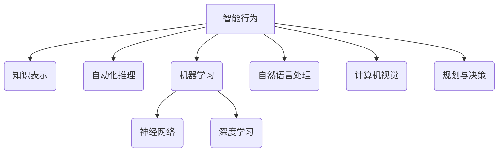

这是一篇关于人工智能原理与实践的专业技术博客文章。

# 人工智能(AI)原理与代码实战案例讲解

## 1.背景介绍

### 1.1 人工智能的定义和重要性

人工智能(Artificial Intelligence, AI)是一门研究如何使机器模拟人类智能行为的科学技术。它涉及多个领域,包括计算机科学、数学、物理学、神经科学等。人工智能的目标是开发能够执行人类认知功能的系统,如学习、推理、感知、规划和解决问题。

人工智能已经广泛应用于各个领域,如图像识别、自然语言处理、机器人技术、专家系统等,极大地提高了生产效率和生活质量。随着大数据、云计算和并行处理等技术的发展,人工智能正在经历爆发式增长,对未来社会的影响将是深远的。

### 1.2 人工智能发展历程

人工智能的概念可以追溯到20世纪40年代。1950年,图灵提出"图灵测试"作为判断机器是否拥有智能的标准。1956年,人工智能这个术语在达特茅斯会议上正式被提出。

人工智能的发展可以分为四个阶段:

1. 萌芽期(1950s-1960s):专家系统、博弈程序等初步研究。
2. 知识阶段(1970s-1980s):发展知识表示、推理等技术。
3. 统计学习时期(1990s-2000s):机器学习、神经网络等统计方法兴起。
4. 大数据时代(2010s-至今):深度学习、强化学习等算法取得突破性进展。

### 1.3 人工智能主要分支

人工智能包含以下几个主要分支:

- 机器学习(Machine Learning)
- 深度学习(Deep Learning) 
- 计算机视觉(Computer Vision)
- 自然语言处理(Natural Language Processing)
- 专家系统(Expert Systems)
- 机器人技术(Robotics)
- 规划与决策(Planning and Decision Making)

## 2.核心概念与联系  

### 2.1 人工智能核心概念

人工智能的核心概念包括:

1. **智能行为**:人工智能系统能够模仿人类的认知功能,如学习、推理、规划、解决问题等。
2. **知识表示**:用计算机可理解的形式表示和存储知识。
3. **自动化推理**:根据知识和规则自动推导出新的结论。
4. **机器学习**:使计算机从数据中自动分析获得模式。
5. **神经网络**:模拟人脑神经元网络结构进行信息处理。
6. **深度学习**:多层神经网络模型,能从大量数据中自动学习特征。
7. **自然语言处理**:使计算机理解和生成人类语言。
8. **计算机视觉**:使计算机能识别和理解数字图像或视频。
9. **规划与决策**:根据环境和目标自动规划行动方案。

### 2.2 人工智能核心概念之间的联系

这些核心概念相互关联,组成了人工智能的整体框架:

1. 智能行为是人工智能的最终目标。
2. 知识表示和自动化推理为智能行为提供知识基础。
3. 机器学习是实现智能行为的重要途径之一。
4. 神经网络和深度学习是机器学习的主要技术手段。
5. 自然语言处理和计算机视觉是人工智能理解人类世界的重要能力。
6. 规划与决策使智能系统能够根据环境做出合理行为。

## 3.核心算法原理具体操作步骤

### 3.1 机器学习算法

机器学习是人工智能的核心技术之一,主要算法包括:

#### 3.1.1 监督学习

1. **线性回归**:对连续目标值进行预测。
2. **逻辑回归**:对离散目标值(如0/1)进行分类。
3. **支持向量机(SVM)**: 基于核技巧的强大分类器。
4. **决策树**:构建决策树模型进行分类和回归。
5. **随机森林**:集成多个决策树提高准确性。
6. **梯度提升树(GBDT)**:迭代生成决策树序列。

#### 3.1.2 无监督学习

1. **K-Means聚类**:将数据划分为K个簇。 
2. **层次聚类**:构建层次化的聚类树状结构。
3. **主成分分析(PCA)**:将高维数据投影到低维空间。
4. **关联规则挖掘**:发现数据中的频繁模式。

#### 3.1.3 强化学习

1. **Q-Learning**:估计状态-行为值函数。
2. **策略梯度**:直接优化策略函数。
3. **深度Q网络(DQN)**:结合深度学习和Q学习。
4. **蒙特卡洛树搜索**:在游戏、规划等领域应用广泛。

### 3.2 深度学习算法

深度学习是机器学习的一个重要分支,主要算法包括:

#### 3.2.1 前馈神经网络

1. **多层感知器(MLP)**: 基本的前馈全连接网络。
2. **卷积神经网络(CNN)**: 在计算机视觉领域表现优异。
3. **循环神经网络(RNN)**: 擅长处理序列数据。
4. **Long-Short Term Memory(LSTM)**: 改进的RNN,解决了长期依赖问题。

#### 3.2.2 生成对抗网络(GAN)

1. **原始GAN**: 生成器和判别器相互对抗训练。
2. **条件GAN(CGAN)**: 在GAN基础上加入条件信息。
3. **循环GAN(CycleGAN)**: 实现图像到图像的风格迁移。
4. **Pix2Pix**: 将图像映射到图像的条件对抗网络。

#### 3.2.3 深度强化学习

1. **Deep Q-Network(DQN)**: 结合深度学习和Q学习。
2. **策略梯度**: 直接优化策略函数的参数。
3. **AlphaGo**: 结合深度学习、蒙特卡罗树搜索等技术。
4. **Evolution Strategies**: 通过进化优化神经网络参数。

### 3.3 自然语言处理算法

1. **N-gram语言模型**: 统计单词序列的概率分布。
2. **词嵌入(Word Embedding)**: 将词映射到低维连续向量空间。 
3. **序列到序列模型**: 如编码器-解码器框架。
4. **注意力机制(Attention)**: 对不同位置信息赋予不同权重。
5. **BERT**: 预训练的深度双向Transformer模型。
6. **GPT-3**: 大规模自回归语言模型。

### 3.4 计算机视觉算法

1. **HOG+SVM**: 基于梯度直方图和SVM的目标检测。
2. **R-CNN**: 基于区域的卷积神经网络目标检测。
3. **Faster R-CNN**: 更快的两阶段目标检测算法。
4. **YOLO**: 单阶段实时目标检测算法。
5. **FCN**: 将全卷积网络应用于语义分割。
6. **Mask R-CNN**: 实例分割算法。

## 4.数学模型和公式详细讲解举例说明

### 4.1 线性回归

线性回归是一种常用的监督学习算法,用于预测连续的目标值。给定数据集 $\{(x_1,y_1), (x_2,y_2), ..., (x_n,y_n)\}$,线性回归试图学习一个线性函数:

$$
y = w^Tx + b
$$

其中$x$是输入特征向量,$w$是权重向量,$b$是偏置项。通过最小化损失函数(如均方误差)来优化模型参数$w$和$b$:

$$
L(w,b) = \frac{1}{n}\sum_{i=1}^n(y_i - w^Tx_i - b)^2
$$

可以使用梯度下降等优化算法求解。线性回归简单高效,但只能学习线性模式。

### 4.2 逻辑回归

逻辑回归是一种用于分类任务的监督学习算法。对于二分类问题,逻辑回归模型将输入$x$映射到$(0,1)$区间,表示样本属于正类的概率:

$$
P(y=1|x) = \sigma(w^Tx + b) = \frac{1}{1 + e^{-(w^Tx + b)}}
$$

其中$\sigma(\cdot)$是Sigmoid函数。通过最大化似然函数(或等价的最小化交叉熵损失函数)来优化参数$w$和$b$:

$$
L(w,b) = -\frac{1}{n}\sum_{i=1}^n[y_i\log P(y_i=1|x_i) + (1-y_i)\log(1-P(y_i=1|x_i))]
$$

逻辑回归简单易用,是分类问题的基线模型。

### 4.3 支持向量机(SVM)

支持向量机是一种有监督的非概率模型,常用于分类和回归任务。SVM的基本思想是在特征空间中构造一个最大间隔超平面将不同类别的样本分开。

对于线性可分的二分类问题,SVM学习一个线性分类器:

$$
f(x) = w^Tx + b
$$

其中$w$是权重向量,$b$是偏置项。SVM通过以下优化问题求解$w$和$b$:

$$
\begin{aligned}
&\min_{w,b} &&\frac{1}{2}||w||^2\\
&\text{s.t.} &&y_i(w^Tx_i + b) \geq 1, \quad i=1,2,...,n
\end{aligned}
$$

这相当于最大化分类超平面与最近训练样本之间的间隔。对于非线性问题,SVM使用核技巧将数据映射到更高维空间。

### 4.4 K-Means聚类

K-Means是一种常用的无监督聚类算法,目标是将$n$个样本划分为$K$个簇。算法步骤如下:

1. 随机初始化$K$个簇中心$\{\mu_1,\mu_2,...,\mu_K\}$。
2. 对每个样本$x_i$,计算它与各个簇中心的距离,将其归入最近的簇:
   $$
   c_i = \arg\min_k ||x_i - \mu_k||^2
   $$
3. 更新每个簇的中心为该簇所有样本的均值:
   $$
   \mu_k = \frac{1}{|C_k|}\sum_{x_i\in C_k}x_i
   $$
4. 重复步骤2和3,直到簇分配不再改变。

K-Means算法简单高效,但需要预先指定簇数K,并对初始簇中心敏感。

### 4.5 主成分分析(PCA)

主成分分析是一种常用的无监督线性变换技术,目标是将高维数据投影到低维空间,同时保留数据的主要特征。

给定数据矩阵$X = [x_1,x_2,...,x_n]^T$,PCA试图找到一个正交变换矩阵$W$,使得投影后的数据具有最大方差:

$$
\max_{W^TW=I}\text{Var}(X^TW)
$$

可以证明,最优的$W$由数据协方差矩阵$\Sigma = \frac{1}{n}XX^T$的前$k$个最大特征值对应的特征向量构成。投影变换为:

$$
Z = X^TW
$$

PCA常用于数据压缩、可视化和去噪等预处理步骤。

## 5.项目实践:代码实例和详细解释说明

本节将通过一个实际案例,演示如何使用Python中的机器学习库(如Scikit-Learn、TensorFlow等)实现人工智能算法。我们将构建一个手写数字识别系统,包括数据预处理、模型训练和评估等步骤。

### 5.1 数据集介绍

我们将使用著名的MNIST手写数字数据集。该数据集包含60,000个训练样本和10,000个测试样本,每个样本是一个28x28的灰度图像,对应0-9的数字标签。

###