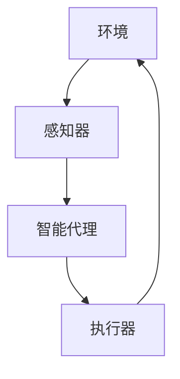
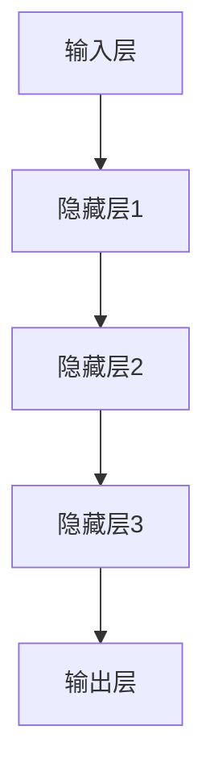

# 人工智能(Artificial Intelligence) - 原理与代码实例讲解

## 1. 背景介绍

人工智能(Artificial Intelligence, AI)是当代科技领域最具革命性和影响力的技术之一。它旨在模拟人类的认知能力,如学习、推理、规划、感知和问题解决等,并将这些能力应用于各个领域,以提高效率、优化决策并解决复杂的问题。随着计算能力的不断提高和大数据时代的到来,人工智能技术得到了前所未有的发展,在各个行业都有广泛的应用前景。

### 1.1 人工智能的发展历程

人工智能的概念可以追溯到上世纪40年代,当时一些先驱者提出了"智能机器"的设想。1956年,约翰·麦卡锡在达特茅斯学院举办的一次会议上首次使用了"人工智能"这一术语。此后,人工智能经历了几个重要的发展阶段:

- 1950s-1960s: 人工智能的孕育期,专家系统、博弈论等理论奠基
- 1970s-1980s: 知识库、机器学习等技术兴起,人工智能进入实用化阶段
- 1990s-2000s: 神经网络、深度学习等算法不断完善,人工智能应用日益广泛
- 2010s至今: 大数据、云计算等技术支持下,人工智能进入爆发式增长期

### 1.2 人工智能的重要分支

人工智能是一个庞大的领域,包含多个重要分支:

- **机器学习(Machine Learning)**: 赋予系统自主学习和建模的能力
- **深度学习(Deep Learning)**: 基于神经网络的机器学习技术
- **计算机视觉(Computer Vision)**: 赋予系统视觉感知和理解能力 
- **自然语言处理(Natural Language Processing)**: 实现人机语言交互
- **机器人技术(Robotics)**: 集成软硬件,实现智能化机器人系统
- **专家系统(Expert Systems)**: 模拟人类专家的决策和推理过程

## 2. 核心概念与联系  

要全面理解人工智能,需要掌握一些核心概念及其内在联系。

### 2.1 智能代理

在人工智能系统中,智能代理(Intelligent Agent)是一个核心概念。它是感知环境、思考并做出决策的实体,旨在实现特定目标。智能代理可以是软件程序、机器人或其他具有一定智能的系统。

如上面的流程图所示,智能代理通过感知器获取环境信息,进行内部处理和决策,然后通过执行器对环境产生影响,形成一个闭环系统。

### 2.2 机器学习

机器学习是人工智能的核心技术之一,它赋予系统自主学习和建模的能力。机器学习算法通过分析大量数据,自动捕捉数据中的模式和规律,从而构建数学模型。这些模型可用于预测、决策或任务执行。

机器学习算法可分为三大类:

- **监督学习(Supervised Learning)**: 基于标注的训练数据,学习映射关系
- **无监督学习(Unsupervised Learning)**: 从未标注数据中发现隐藏模式
- **强化学习(Reinforcement Learning)**: 通过与环境交互获取反馈,优化决策

### 2.3 深度学习

深度学习是机器学习的一个分支,它基于对生物神经网络的模拟,通过构建深层神经网络模型来解决复杂的任务。深度学习在计算机视觉、自然语言处理等领域取得了突破性进展。

上图展示了一个典型的深度神经网络结构,包含输入层、多个隐藏层和输出层。通过对大量数据的训练,网络可以自动学习特征表示和映射关系。

### 2.4 人工智能的应用

人工智能技术在各个领域都有广泛的应用前景,例如:

- 计算机视觉: 图像识别、目标检测、自动驾驶等
- 自然语言处理: 机器翻译、智能问答、语音识别等 
- 机器人技术: 工业机器人、服务机器人、无人机等
- 金融科技: 风险管理、投资决策、反欺诈等
- 医疗健康: 病症诊断、药物研发、医疗影像分析等
- 智能安防: 视频监控、人脸识别、入侵检测等

## 3. 核心算法原理具体操作步骤

在人工智能领域,有许多经典的算法和模型,它们构成了人工智能系统的核心。接下来,我们将介绍几种核心算法的原理和具体操作步骤。

### 3.1 线性回归

线性回归是监督学习中最基本的算法之一,用于建立自变量和因变量之间的线性关系模型。它的目标是找到一条最佳拟合直线,使预测值与实际值之间的误差最小化。

线性回归算法的具体步骤如下:

1. **收集数据**: 获取包含自变量(特征)和因变量(目标)的数据集
2. **数据预处理**: 对数据进行清洗、标准化等预处理操作
3. **定义代价函数**: 通常使用均方误差(MSE)作为代价函数
4. **求解模型参数**: 使用梯度下降等优化算法,找到使代价函数最小化的模型参数
5. **模型评估**: 在测试集上评估模型的预测性能
6. **模型应用**: 使用训练好的模型对新数据进行预测

### 3.2 逻辑回归

逻辑回归是一种广泛应用的分类算法,通常用于二分类问题。它基于对数几率(logit)函数,将自变量映射到0到1之间的概率值,从而实现分类。

逻辑回归算法的具体步骤如下:

1. **收集数据**: 获取包含特征和二元类别标签的数据集
2. **数据预处理**: 对数据进行清洗、标准化等预处理操作
3. **定义代价函数**: 通常使用交叉熵作为代价函数
4. **求解模型参数**: 使用梯度下降等优化算法,找到使代价函数最小化的模型参数
5. **模型评估**: 在测试集上评估模型的分类性能,常用指标有准确率、精确率、召回率等
6. **模型应用**: 使用训练好的模型对新数据进行分类预测

### 3.3 决策树

决策树是一种常用的监督学习算法,它通过构建决策树模型来进行分类或回归预测。决策树的优点是可解释性强、可视化直观。

构建决策树的典型算法有ID3、C4.5和CART等,它们的基本步骤相似:

1. **选择特征**: 根据某种准则(如信息增益、基尼指数等),选择最优特征作为根节点
2. **创建分支**: 根据特征的不同取值,创建树枝分支
3. **分配类别**: 将数据集中的实例分配到相应的分支节点
4. **递归构建**: 在每个分支节点上递归执行以上步骤,生成子树
5. **终止条件**: 当满足终止条件(如无剩余特征、实例属于同一类别等)时,将节点标记为叶节点

通过以上步骤,可以构建出一棵决策树模型,用于对新实例进行分类或回归预测。

### 3.4 支持向量机(SVM)

支持向量机是一种有监督的机器学习算法,常用于分类和回归任务。它的基本思想是在高维空间中构建一个超平面,将不同类别的数据点分隔开,同时使得离超平面最近的数据点距离最大化。

SVM算法的具体步骤如下:

1. **收集数据**: 获取包含特征和类别标签的数据集
2. **数据预处理**: 对数据进行清洗、标准化等预处理操作
3. **选择核函数**: 根据数据的分布情况选择合适的核函数(如线性核、多项式核、高斯核等)
4. **求解优化问题**: 通过求解凸二次规划问题,找到最优超平面的参数
5. **模型评估**: 在测试集上评估模型的分类或回归性能
6. **模型应用**: 使用训练好的模型对新数据进行预测

SVM的优点是泛化能力强、对噪声数据有一定鲁棒性,缺点是对大规模数据的训练速度较慢。

### 3.5 K-means聚类

K-means是一种无监督学习算法,常用于数据聚类分析。它的目标是将n个数据对象划分为k个聚类,使得同一聚类内的对象相似度较高,不同聚类之间的对象相似度较低。

K-means算法的具体步骤如下:

1. **初始化**: 随机选择k个初始质心
2. **分配聚类**: 根据每个数据对象与质心的距离,将其分配到最近的聚类
3. **更新质心**: 计算每个聚类的新质心,即聚类内所有对象的均值
4. **重复分配**: 重复执行步骤2和3,直到质心不再发生变化
5. **输出结果**: 输出最终的k个聚类及其质心

K-means算法的关键是选择合适的k值和初始质心,不同的选择会影响聚类结果。常用的方法包括肘部法则、轮廓系数法等。

## 4. 数学模型和公式详细讲解举例说明

人工智能算法中往往涉及大量的数学模型和公式,理解它们对于掌握算法原理至关重要。接下来,我们将详细讲解一些核心公式及其应用。

### 4.1 线性回归公式

在线性回归中,我们假设自变量(特征)$X$和因变量(目标)$y$之间存在线性关系,可以用下式表示:

$$y = \theta_0 + \theta_1x_1 + \theta_2x_2 + ... + \theta_nx_n$$

其中,$\theta_0$是偏置项,$\theta_1, \theta_2, ..., \theta_n$是特征对应的权重系数。目标是找到最优参数$\theta$,使预测值$\hat{y}$与实际值$y$的误差最小化。

常用的代价函数是均方误差(MSE):

$$J(\theta) = \frac{1}{2m}\sum_{i=1}^{m}(h_\theta(x^{(i)}) - y^{(i)})^2$$

其中,$m$是训练样本数量,$h_\theta(x)$是模型的预测值。我们可以使用梯度下降法等优化算法,找到使$J(\theta)$最小化的参数$\theta$。

### 4.2 逻辑回归公式

在二分类问题中,我们希望将输入$x$映射到0或1的概率值。逻辑回归使用对数几率(logit)函数实现这一映射:

$$h_\theta(x) = g(\theta^Tx) = \frac{1}{1 + e^{-\theta^Tx}}$$

其中,$\theta$是模型参数向量,$g(z)$是Sigmoid函数,它将任意实数$z$映射到(0,1)范围内。

为了训练模型,我们定义代价函数为交叉熵:

$$J(\theta) = -\frac{1}{m}\sum_{i=1}^{m}[y^{(i)}\log(h_\theta(x^{(i)})) + (1 - y^{(i)})\log(1 - h_\theta(x^{(i)}))]$$

通过梯度下降等优化算法,可以找到使$J(\theta)$最小化的参数$\theta$。

### 4.3 决策树信息增益

在构建决策树时,我们需要选择最优特征作为节点。常用的准则是信息增益(Information Gain),它衡量了使用某个特征进行分裂后,数据的无序度(熵)减少的程度。

给定一个数据集$D$,其熵定义为:

$$H(D) = -\sum_{i=1}^{c}p_ilog_2p_i$$

其中,$c$是类别数量,$p_i$是第$i$类样本所占的比例。

对于特征$A$,按照其不同取值$a$将$D$划