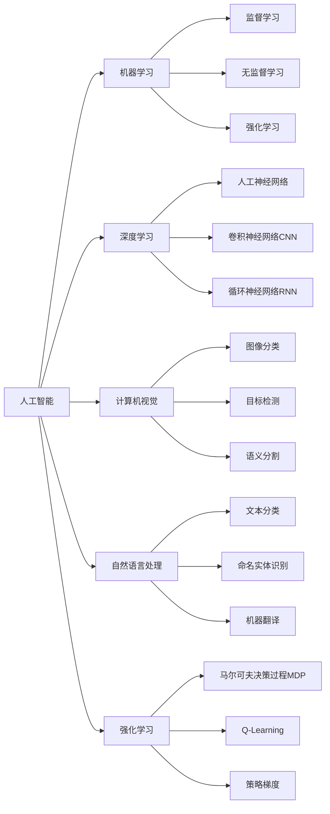

# 人工智能前沿研究热点与发展趋势原理与代码实战案例讲解

## 1. 背景介绍
### 1.1 人工智能的发展历程
#### 1.1.1 人工智能的起源与早期发展
#### 1.1.2 人工智能的"冬天"与复兴
#### 1.1.3 人工智能的新浪潮与深度学习革命
### 1.2 人工智能的应用现状
#### 1.2.1 人工智能在计算机视觉领域的应用
#### 1.2.2 人工智能在自然语言处理领域的应用 
#### 1.2.3 人工智能在机器人领域的应用
### 1.3 人工智能面临的挑战与机遇
#### 1.3.1 人工智能的伦理与安全问题
#### 1.3.2 人工智能的可解释性与可信赖性问题
#### 1.3.3 人工智能的发展机遇与未来趋势

## 2. 核心概念与联系
### 2.1 机器学习
#### 2.1.1 监督学习
#### 2.1.2 无监督学习
#### 2.1.3 强化学习
### 2.2 深度学习
#### 2.2.1 人工神经网络
#### 2.2.2 卷积神经网络（CNN）
#### 2.2.3 循环神经网络（RNN）
### 2.3 计算机视觉
#### 2.3.1 图像分类
#### 2.3.2 目标检测
#### 2.3.3 语义分割
### 2.4 自然语言处理
#### 2.4.1 文本分类
#### 2.4.2 命名实体识别
#### 2.4.3 机器翻译
### 2.5 强化学习
#### 2.5.1 马尔可夫决策过程（MDP）
#### 2.5.2 Q-Learning
#### 2.5.3 策略梯度



## 3. 核心算法原理具体操作步骤
### 3.1 反向传播算法
#### 3.1.1 前向传播
#### 3.1.2 损失函数
#### 3.1.3 反向传播
#### 3.1.4 参数更新
### 3.2 卷积神经网络
#### 3.2.1 卷积层
#### 3.2.2 池化层
#### 3.2.3 全连接层
### 3.3 循环神经网络
#### 3.3.1 简单RNN
#### 3.3.2 LSTM
#### 3.3.3 GRU
### 3.4 注意力机制
#### 3.4.1 Seq2Seq模型
#### 3.4.2 注意力机制原理
#### 3.4.3 Self-Attention
### 3.5 Transformer模型
#### 3.5.1 Transformer架构
#### 3.5.2 Multi-Head Attention
#### 3.5.3 位置编码

## 4. 数学模型和公式详细讲解举例说明  
### 4.1 线性回归
假设有一组数据点 $(x_1, y_1), (x_2, y_2), ..., (x_n, y_n)$，其中 $x_i$ 为输入特征，$y_i$ 为对应的目标值。线性回归的目标是找到一条直线 $y = wx + b$，使得这条直线尽可能地拟合这些数据点。

损失函数（平方误差）：
$$J(w,b) = \frac{1}{2m} \sum_{i=1}^{m} (f(x_i) - y_i)^2$$

其中，$f(x_i) = wx_i + b$，$m$ 为样本数量。

通过最小化损失函数，可以找到最优的 $w$ 和 $b$ 值：
$$\frac{\partial J}{\partial w} = \frac{1}{m} \sum_{i=1}^{m} (f(x_i) - y_i) x_i$$
$$\frac{\partial J}{\partial b} = \frac{1}{m} \sum_{i=1}^{m} (f(x_i) - y_i)$$

更新参数：
$$w := w - \alpha \frac{\partial J}{\partial w}$$
$$b := b - \alpha \frac{\partial J}{\partial b}$$

其中，$\alpha$ 为学习率。

### 4.2 逻辑回归
逻辑回归是一种常用的二分类算法，它利用sigmoid函数将线性回归的输出映射到 $(0,1)$ 区间，表示样本属于正类的概率。

sigmoid函数：
$$\sigma(z) = \frac{1}{1 + e^{-z}}$$

假设函数：
$$h_\theta(x) = \sigma(\theta^T x) = \frac{1}{1 + e^{-\theta^T x}}$$

损失函数（交叉熵）：
$$J(\theta) = -\frac{1}{m} \sum_{i=1}^{m} [y_i \log(h_\theta(x_i)) + (1-y_i) \log(1-h_\theta(x_i))]$$

其中，$y_i$ 为样本的真实标签（0或1），$m$ 为样本数量。

通过最小化损失函数，可以找到最优的参数 $\theta$：
$$\frac{\partial J}{\partial \theta_j} = \frac{1}{m} \sum_{i=1}^{m} (h_\theta(x_i) - y_i) x_i^{(j)}$$

更新参数：
$$\theta_j := \theta_j - \alpha \frac{\partial J}{\partial \theta_j}$$

其中，$\alpha$ 为学习率。

### 4.3 支持向量机（SVM）
支持向量机是一种常用的二分类算法，它的目标是找到一个超平面，使得不同类别的样本能够被超平面最大程度地分开。

假设超平面方程为 $w^T x + b = 0$，则分类决策函数为：
$$f(x) = \text{sign}(w^T x + b)$$

SVM的目标是最大化超平面的间隔，即：
$$\max_{w,b} \frac{2}{\|w\|} \quad \text{s.t.} \quad y_i(w^T x_i + b) \geq 1, \forall i$$

通过引入拉格朗日乘子，可以将上述问题转化为对偶问题：
$$\max_\alpha \sum_{i=1}^{m} \alpha_i - \frac{1}{2} \sum_{i,j=1}^{m} \alpha_i \alpha_j y_i y_j x_i^T x_j$$
$$\text{s.t.} \quad \sum_{i=1}^{m} \alpha_i y_i = 0, \alpha_i \geq 0, \forall i$$

求解得到最优的 $\alpha$，然后可以计算出 $w$ 和 $b$：
$$w = \sum_{i=1}^{m} \alpha_i y_i x_i$$
$$b = y_j - w^T x_j, \forall j \text{ s.t. } \alpha_j > 0$$

对于非线性可分的情况，可以引入核函数将样本映射到高维空间，使其线性可分。常用的核函数有：

- 多项式核函数：$K(x,y) = (x^T y + c)^d$
- 高斯核函数（RBF）：$K(x,y) = \exp(-\frac{\|x-y\|^2}{2\sigma^2})$
- Sigmoid核函数：$K(x,y) = \tanh(\beta x^T y + \theta)$

## 5. 项目实践：代码实例和详细解释说明
### 5.1 图像分类（CNN）
```python
import tensorflow as tf
from tensorflow import keras

# 加载MNIST数据集
(x_train, y_train), (x_test, y_test) = keras.datasets.mnist.load_data()

# 数据预处理
x_train = x_train.reshape((60000, 28, 28, 1)) / 255.0
x_test = x_test.reshape((10000, 28, 28, 1)) / 255.0
y_train = keras.utils.to_categorical(y_train)
y_test = keras.utils.to_categorical(y_test)

# 构建CNN模型
model = keras.Sequential([
    keras.layers.Conv2D(32, (3,3), activation='relu', input_shape=(28,28,1)),
    keras.layers.MaxPooling2D((2,2)),
    keras.layers.Conv2D(64, (3,3), activation='relu'),
    keras.layers.MaxPooling2D((2,2)),
    keras.layers.Conv2D(64, (3,3), activation='relu'),
    keras.layers.Flatten(),
    keras.layers.Dense(64, activation='relu'),
    keras.layers.Dense(10, activation='softmax')
])

# 编译模型
model.compile(optimizer='adam',
              loss='categorical_crossentropy',
              metrics=['accuracy'])

# 训练模型
model.fit(x_train, y_train, epochs=5, batch_size=64, validation_data=(x_test, y_test))

# 评估模型
test_loss, test_acc = model.evaluate(x_test, y_test)
print('Test accuracy:', test_acc)
```

上述代码使用Keras构建了一个简单的卷积神经网络（CNN）模型，用于对MNIST手写数字进行分类。主要步骤包括：

1. 加载MNIST数据集，并进行数据预处理（归一化、one-hot编码等）。
2. 构建CNN模型，包括卷积层、池化层、全连接层等。
3. 编译模型，指定优化器、损失函数和评估指标。
4. 训练模型，指定训练轮数、批次大小和验证数据。
5. 评估模型在测试集上的性能。

### 5.2 情感分类（RNN）
```python
import tensorflow as tf
from tensorflow import keras
import numpy as np

# 加载IMDB数据集
(x_train, y_train), (x_test, y_test) = keras.datasets.imdb.load_data(num_words=10000)

# 数据预处理
x_train = keras.preprocessing.sequence.pad_sequences(x_train, maxlen=256)
x_test = keras.preprocessing.sequence.pad_sequences(x_test, maxlen=256)

# 构建RNN模型
model = keras.Sequential([
    keras.layers.Embedding(10000, 16),
    keras.layers.LSTM(128),
    keras.layers.Dense(1, activation='sigmoid')
])

# 编译模型
model.compile(optimizer='adam',
              loss='binary_crossentropy',
              metrics=['accuracy'])

# 训练模型
model.fit(x_train, y_train, epochs=5, batch_size=64, validation_data=(x_test, y_test))

# 评估模型
test_loss, test_acc = model.evaluate(x_test, y_test)
print('Test accuracy:', test_acc)
```

上述代码使用Keras构建了一个基于LSTM的循环神经网络（RNN）模型，用于对IMDB电影评论进行情感分类（正面/负面）。主要步骤包括：

1. 加载IMDB数据集，并进行数据预处理（填充序列到固定长度）。
2. 构建RNN模型，包括词嵌入层、LSTM层和全连接层。
3. 编译模型，指定优化器、损失函数和评估指标。
4. 训练模型，指定训练轮数、批次大小和验证数据。
5. 评估模型在测试集上的性能。

### 5.3 机器翻译（Transformer）
```python
import tensorflow as tf
from tensorflow import keras
import numpy as np

# 定义Transformer模型
class Transformer(keras.Model):
    def __init__(self, num_layers, d_model, num_heads, dff, input_vocab_size, 
                 target_vocab_size, pe_input, pe_target, rate=0.1):
        super(Transformer, self).__init__()

        self.encoder = Encoder(num_layers, d_model, num_heads, dff, 
                               input_vocab_size, pe_input, rate)

        self.decoder = Decoder(num_layers, d_model, num_heads, dff, 
                               target_vocab_size, pe_target, rate)

        self.final_layer = keras.layers.Dense(target_vocab_size)
        
    def call(self, inp, tar, training, enc_padding_mask, 
             look_ahead_mask, dec_padding_mask):

        enc_output = self.encoder(inp, training, enc_padding_mask)
        
        dec_output, attention_weights = self.decoder(
            tar, enc_output, training, look_ahead_mask, dec_padding_mask)
        
        final_output = self.final_layer(dec_output)
        
        return final_output, attention_weights

# 定义Encoder
class Encoder(keras.layers.Layer):
    def __init__(self, num_layers, d_model, num_heads, dff, input_vocab_size,
                 maximum_position_encoding, rate=0.1):
        super